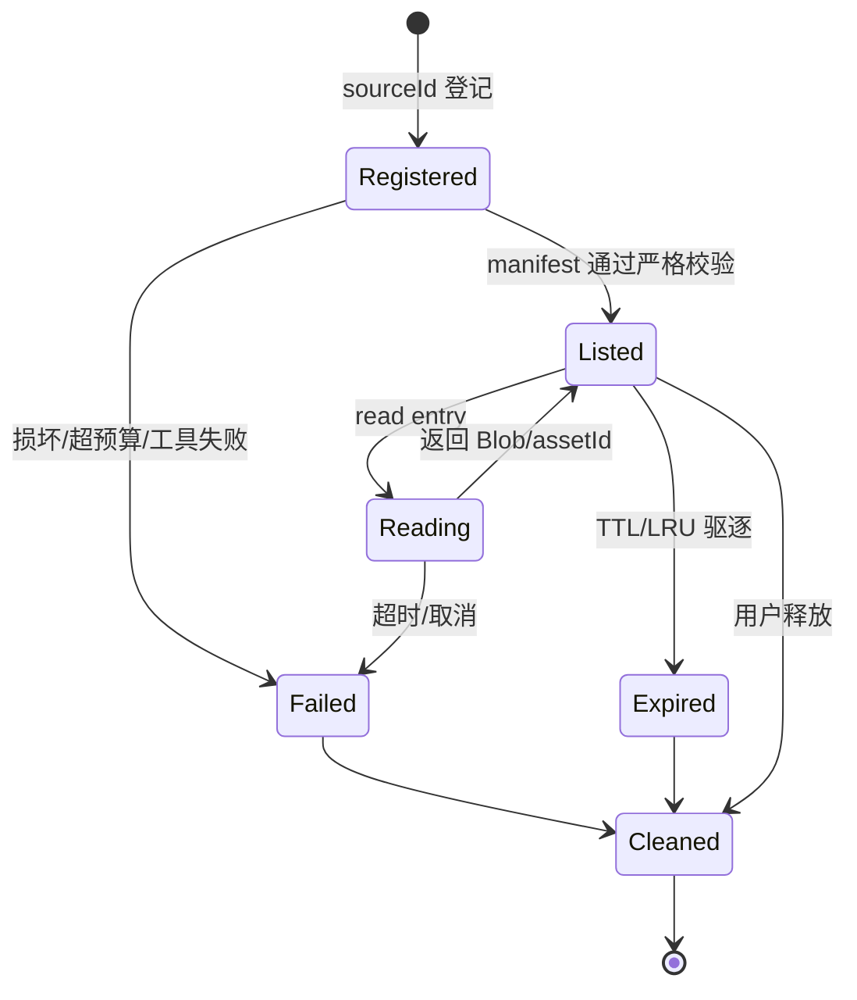
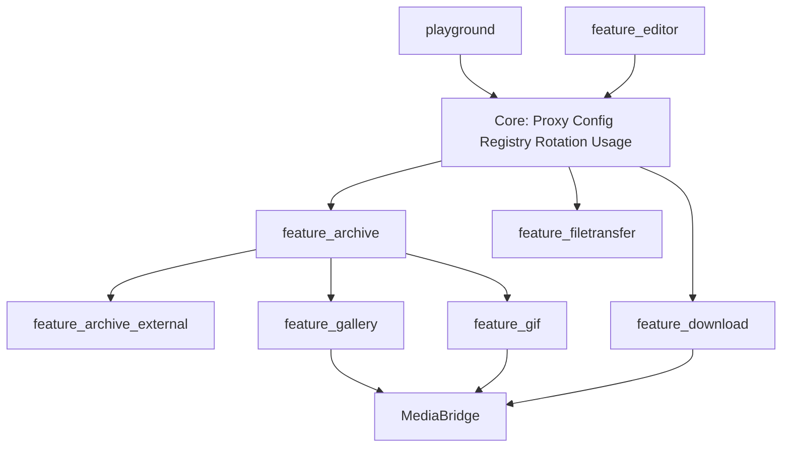

# TinyRouter 归档兼容与媒体交接实施计划

> **文档定位：** 本文件是“ZIP/7z/RAR 统一归档能力 + Gallery/GIF/Download 媒体交接”实施前的唯一执行上下文。它是计划，不代表功能已经实现；实施完成后，实际行为以源码、测试和同步后的架构文档为准。
>
> **状态：** 部分实施（2026-08-06 更新）。**P0/P1 已落地**（`internal/archive/` 合同/严格路径/预算/ZIP adapter/TempStore + 测试，见 §13e）。**P2 已落地**（`internal/archivetool/` 外部工具层 + `Config.Archive`/Settings presence-aware PATCH + `/api/archive` 挂载 + router/app 接线 + `web/static/media-bridge.js` §9.2 契约与 Download/GIF 生产端、Gallery 消费端）。**P3 部分落地**：Gallery 后端桥接（`internal/api/gallery` `archiveBridge` + `POST /api/archive/zip-replace`）+ 前端 sourceId 双路径（读取/删除/审核/编辑）——**旧 `/api/gallery/zip*`、`/edit/zip-outputs|zip-writeback|extract-zip-entry|upload-temp` 端点与前端 legacy 调用方完整保留**（FSAA/拖放/粘贴仍走 zip 会话；§7.2"迁移完成后删除"未执行；无浏览器任意路径 API 新增）；**7z/RAR 浏览器导入缺口**（picker `accept` 仅 `.zip`、`isArchiveName` 命中仍走 zip-only 上传——§8.2 未实施）。**P5 第一阶段已落地**（`internal/feature` manifest + router/app `feature.Enabled` 门控，§11 的 feature_* tags 与构建 profiles 未实施）。**P4（GIF 导出格式选择 + 帧 asset 化全量迁移）、P6（7z/RAR 原文件替换）未开始。** 实际行为以源码与 [`docs/archive-architecture.md`](docs/archive-architecture.md) 为准。
>
> **相关事实基线：** [`docs/archive-architecture.md`](docs/archive-architecture.md)（**已落地实现的权威基线**）、`docs/playground-architecture.md`、`docs/download-architecture.md`、`docs/config-registry-state-architecture.md`、`gif_implented.md`、`PROJECT_MAP.md`。

---

## 1. 目标、非目标与冻结结论

### 1.1 目标

把归档能力从 Gallery 的 ZIP 专用实现中抽成可复用的能力层，支持：

1. ZIP：保留现有浏览、单条读取、图片/视频编辑、ZIP 输出和 ZIP 原子回写能力。
2. 7z：在配置的 `7z`/`7zz` 工具可用时，支持列表、单条读取、Gallery 浏览和 GIF/媒体输出。
3. RAR：在配置的 `unrar`/`rar` 或 7-Zip 可用时，支持列表、单条读取和 Gallery 浏览；只有具备 RAR 写入能力的 `rar` 工具才显示 RAR 导出。
4. Gallery、独立 GIF 编辑器、Download 通过统一 `MediaAsset`/`MediaBridge` 交接，不再直接修改彼此的全局状态。
5. 编译时可独立裁剪 Gallery、GIF、外部归档工具、Download、FileTransfer 等附加能力；未编译的能力不加载资产、不注册路由、不初始化运行时组件。
6. 归档源、临时文件、外部进程、导出文件具备统一的路径、资源、超时、并发和生命周期约束。

### 1.2 非目标

- 不把 7z/RAR 解析器直接写进 Go 二进制；第一阶段不引入新的 CGo、压缩库或未知许可证依赖。
- 不支持加密归档、密码交互、分卷归档、嵌套归档递归浏览；界面必须显示明确的“不支持”，不能静默当作空归档。
- 第一阶段不对 RAR/7z 原文件做原地回写。它们只能读取或生成新的目标归档；ZIP 才保留原子回写。
- 不把 `DownloadConfig` 作为归档配置的归属。归档工具同时被 Gallery 与 GIF 使用，继续放入 Download 会扩大错误耦合。
- 不改变普通聊天、Auto Chat、Search、Director/Narrator、ComfyUI 协议的交互模型。
- 不把前端绝对路径、API Key、Authorization header 或原始图片 Base64 写入项目 manifest。

### 1.3 推荐冻结决策

| 决策点 | 推荐 | 原因 |
|---|---|---|
| 归档执行方式 | Go 统一适配器 + 外部 `7z`/`7zz`/`unrar`/`rar` 子进程 | 不增加 CGo/大体积库，Windows 兼容性最好 |
| 第一阶段写入 | ZIP 可写；7z/RAR 只读 | 7z/RAR 原地写回的失败恢复、格式兼容和数据丢失风险明显更高 |
| RAR 读取 | 优先 7-Zip 或 `unrar`；`rar` 只读能力按探测结果决定 | `rar.exe` 的读写能力、版本和输出格式不应假定一致 |
| RAR 导出 | 只有检测到 `rar` 写入能力才显示 | `unrar` 只能解包，不能被误当作打包器 |
| 归档配置位置 | 顶层 `Config.Archive` | 归档是 Gallery/GIF 的共享基础能力，不是 Download 的子功能 |
| 路径交接 | 内部 `assetId`/`sourceId`，不在浏览器之间传绝对临时路径 | 消除任意路径、删除任意文件和跨模块状态写入风险 |
| 外部进程 | 参数数组 + process group + context deadline；禁止 shell 拼接 | 防止命令注入、子进程逃逸和取消后残留 |
| 资源预算 | 代码默认常量，Settings 初期只暴露工具路径 | 用户误配预算会直接扩大压缩炸弹和磁盘耗尽面 |
| 兼容策略 | 先统一 API 和资产清单，再添加 build tags | 当前 Gallery/MediaEdit/Archive Go 包无 tag，直接加 tag 会造成装配断裂 |

---

## 2. 当前实现事实与缺口

### 2.1 当前归档链路

```mermaid
flowchart LR
    File[浏览器文件/目录或本机路径]
    Upload[POST /api/gallery/zip]
    Path[POST /api/gallery/zip-from-path]
    Zip[internal/gallery + archive/zip]
    Session[gallerySessionStore: 原始 []byte, LRU 128]
    Entry[GET /api/gallery/zip/{session}/*]
    Temp[extract-zip-entry / upload-temp]
    FFmpeg[internal/mediaedit + ffmpeg]
    Output[输出文件或 zip-outputs]
    Writeback[zip-writeback / ReplaceZipEntries]

    File --> Upload --> Zip --> Session --> Entry
    Path --> Zip
    Entry --> Temp --> FFmpeg --> Output
    Output --> Writeback
```

当前事实：

| 区域 | 已实现 | 证据锚点 | 缺口 |
|---|---|---|---|
| ZIP 解析 | `archive/zip`；图片扩展名过滤；自然排序；`CleanZipPath` | `internal/gallery/zip.go` | 仅做归一化，不拒绝恶意路径；无总膨胀、条目数、压缩比预算 |
| ZIP 读取 | 单条 `GetZipEntry`，100 MiB 上限 | `internal/gallery/zip.go` | 重复读取会重复解压；无总读取预算 |
| ZIP 上传 | body 500 MiB | `internal/api/gallery/zip_handlers.go::galleryListZip` | session 原始字节驻留内存 |
| ZIP 磁盘导入 | 读取上限 1 GiB | `readZipFile` | 任意绝对路径；无统一授权根 |
| Session | 128 项 LRU，review pin 防驱逐 | `internal/api/gallery/session_store.go` | 无 TTL；每项可达 500 MiB，全部 pin 时可超容量 |
| ZIP 删除/回写 | Store/Deflate 兼容删除；原子回写；替换保留元数据 | `zip_delete.go`、`zip_replace.go`、`galleryZipWriteback` | 回写路径与替换文件路径缺少统一所有权模型 |
| Gallery 前端 | 只识别 `.zip`；entry Blob 延迟获取；404 后重建 session | `gallery-state.js`、`gallery-io.js` | 不能识别 7z/RAR；状态是多个全局对象 |
| Gallery 编辑 | ZIP entry/上传文件落地到 temp，再交给 FFmpeg | `gallery-edit-batch.js`、`edit_handlers.go` | temp 成功后无统一清理；绝对路径通过 API 往返 |
| GIF 编辑器 | 本地解码/抽帧；GIF、PNG Sprite；PNG 帧经 `zip-outputs` 打包 | `web/static/gif-editor.js` | 与 Gallery 完全独立；无 7z/RAR 导出；无“打开到 Gallery” |
| Download | `yt-dlp`/`ffmpeg` 独立解析和任务队列 | `internal/download` | Download→Gallery 仍存在直接写 Gallery 状态的耦合 |
| 外部命令 | FFmpeg 有进程组取消；ffprobe 有 15 秒探测超时 | `internal/mediaedit/{binary,executor,probe}.go` | FFmpeg 无正常运行 deadline；没有归档命令 runner |

### 2.2 当前必须修复或在新边界中禁止的风险

1. `CleanZipPath` 只把路径归一化用于匹配，不能作为“安全路径校验”；新适配器必须在归一化前拒绝绝对路径、盘符、UNC、NUL、ADS、保留名和任何 `..` 段。
2. `zip-from-path`、`zip-writeback`、`gallery/file`、`zip-outputs` 当前接受绝对路径；新 API 不得继续让浏览器提交任意路径，改为服务器登记的 `sourceId`/`assetId`。
3. 7z/RAR 解包不能直接让工具把原始条目写入用户目录；所有输出必须进入私有 job workspace，再做路径和预算复核。
4. 归档炸弹的限制不能只看压缩输入大小；必须同时限制条目数、单条展开大小、总展开大小、压缩比、嵌套深度、运行时间、输出磁盘和并发数。
5. 工具输出可能受语言和版本影响；7z 使用 `-slt` 机器可解析格式，RAR 不得依赖本地化的人类输出。
6. 外部工具必须使用参数数组，禁止 `cmd /c`、`sh -c` 或字符串拼命令；超时和取消必须杀整棵进程树。
7. 临时文件必须绑定 owner/job/session，成功、失败、取消、超时都清理，并在启动时清理过期 workspace。

---

## 3. 目标模块分层与依赖方向

### 3.1 目标模块树

```text
Core
+-- Proxy / Config / Registry / Rotation / Usage / TraceCore
+-- Monitor / Settings shell
|
+-- ArchiveCore
|   +-- strict path + budget + manifest + MediaAsset contract
|   +-- ZIP adapter (Go stdlib, read/write)
|   +-- External tool adapter (optional: 7z/RAR read, 7z/RAR write capability)
|
+-- Download (optional sibling; yt-dlp/ffmpeg)
+|
+-- Media features
    +-- Gallery (optional; archive browse + review + media edit)
    +-- GIF editor (optional global page; GIF/PNG/archive output)
    +-- Editor / Text Review (optional)
    +-- FileTransfer (optional; independent temporary upload service)
```

依赖规则：

- `ArchiveCore` 不依赖 Gallery、GIF、Download 或 Playground。
- Gallery/GIF 只依赖 `ArchiveCore` 的接口和 `MediaBridge`，不能直接读写对方全局对象。
- Download 只发布 `MediaAsset`，不导入 Gallery JS 或调用 `galleryState`。
- FFmpeg 是 MediaEdit 的依赖，不是 ArchiveCore 的依赖；7z/RAR 工具解析不得复用 FFmpeg resolver。
- `playground` 只表示 Playground 静态资源/模式；不能继续作为 Gallery、Editor、GIF、Archive 的总开关。

### 3.2 推荐新增包边界

第一阶段建议只增加两个 leaf 包，避免过度抽象：

```text
internal/archive/
+-- types.go       // Format, Source, Entry, Manifest, Budget, AssetRef
+-- path.go        // StrictArchivePath, collision detection, root containment
+-- budget.go      // size/count/ratio/depth/concurrency accounting
+-- reader.go      // Reader/Writer/Pack interfaces
+-- zip_adapter.go // archive/zip adapter and ZIP replace implementation bridge
+-- tool.go        // executable resolution, capability probe, argv runner
+-- external.go    // 7z/RAR list/read/pack adapter
+-- tempstore.go   // owner/job/session-bound temporary asset store
+-- *_test.go

internal/api/archive/
+-- register.go    // status, source registration, asset import, pack endpoints
+-- handlers.go
+-- register_test.go
```

`internal/api/gallery` 只保留 Gallery 语义：把文件/归档作为 `AssetRef` 交给 `ArchiveCore`，不直接调用 `archive/zip`。GIF 导出可复用 `/api/archive/pack`，但不能依赖 Gallery handler。

---

## 4. 统一归档合同

### 4.1 Go 数据类型（计划）

```go
type Format string

const (
    FormatZIP Format = "zip"
    Format7Z  Format = "7z"
    FormatRAR Format = "rar"
)

type Source struct {
    ID       string // server-issued capability token
    Format   Format
    Name     string
    Path     string // server-side only; never returned as a client contract
    Size     int64
    Writable bool
}

type AssetRef struct {
    ID       string // server-issued asset/job token
    Name     string
    MIME     string
    Path     string // server-side only
    Size     int64
}

type SourceRef struct {
    SourceID  string
    Format    Format
    EntryPath string // strict relative archive path; empty for a plain asset
}

type Budget struct {
    MaxEntries          int
    MaxEntryBytes       int64
    MaxTotalBytes       int64
    MaxCompressedRatio  int64
    MaxInputBytes       int64
    MaxOutputBytes      int64
    MaxDuration         time.Duration
    MaxNestedDepth      int
}

// MediaAsset is the browser-facing metadata subset. It never contains a
// server filesystem path or raw secret; the ID is resolved by the server.
type MediaAsset struct {
    ID     string `json:"assetId"`
    Name   string `json:"name"`
    MIME   string `json:"mime"`
    Kind   string `json:"kind"`
    Format Format `json:"format,omitempty"`
}

type Entry struct {
    Path             string
    Size             int64
    CompressedSize   int64 // -1 when the tool cannot provide reliable metadata
    IsDir            bool
    Kind             string
}

type Manifest struct {
    Format           Format
    Entries          []Entry
    TotalEntries     int
    TotalUncompressed int64
}

type Reader interface {
    List(context.Context, Source, Budget) (Manifest, error)
    ReadEntry(context.Context, Source, string, Budget) ([]byte, string, error)
}

type Writer interface {
    ReplaceZIP(context.Context, Source, map[string]AssetRef, Budget) (AssetRef, error)
    Pack(context.Context, Format, []AssetRef, string, Budget) (AssetRef, error)
}
```

约束：

- `Entry.Path` 是严格验证后的相对路径；服务端不把原始未验证路径放入后续命令。
- `CompressedSize == -1` 不能绕过 `ReadEntry` 的实时预算；读流必须使用 `LimitReader`/磁盘配额。
- `Source.Path`、临时路径、FFmpeg 输入路径只存在服务端内存/内部存储，浏览器只拿 `sourceId`/`assetId`。
- `ReplaceZIP` 仅接受 ZIP source；7z/RAR 调用返回明确的 `unsupported writeback`。

### 4.2 严格路径合同

`StrictArchivePath` 必须：

1. 拒绝 NUL、空路径、绝对 `/`、反斜杠开头、Windows 盘符、UNC、`\\?\` 和 `\\.\` 前缀。
2. 拒绝任何 `.`/`..` 段、重复规范化后会碰撞的路径、尾随点/空格导致的 Windows 等价名。
3. 拒绝 ADS（路径段含 `:`）、Windows 保留设备名（CON、PRN、AUX、NUL、COM1 等）及不可安全创建的保留名。
4. 只在验证通过后把 `/`/`\` 统一为内部 `/`；不能先 `path.Clean` 再假定安全。
5. 目录项、符号链接、硬链接或工具报告的路径逃逸一律拒绝；不将它们作为普通图片返回。
6. 对 manifest 全部条目做 collision map；发现不同原始项折叠到同一路径时整个归档失败，不静默覆盖。

### 4.3 默认预算（需在实现评审时确认）

| 预算 | ZIP 现状 | 统一目标默认值 |
|---|---:|---:|
| 浏览器上传压缩输入 | 500 MiB | 500 MiB |
| 本机路径压缩输入 | 1 GiB | 1 GiB |
| 单条展开数据 | 100 MiB | 100 MiB |
| 归档条目数 | 无 | 20,000 |
| 总未压缩大小 | 无 | 2 GiB |
| 最大压缩比 | 无 | 100:1；无法可靠计算时由实时展开预算兜底 |
| 嵌套归档深度 | 无 | 0（不递归） |
| 单次 pack 输入文件数 | 无 | 2,000 |
| pack 总输入/输出 | 无 | 2 GiB |
| 单 session workspace | 内存 LRU | 2 GiB 或 128 session，先达到者驱逐 |
| list 超时 | 无 | 15 秒 |
| entry read 超时 | 无 | 60 秒 |
| pack/replace 超时 | 无 | 5 分钟 |
| 外部归档并发 | 无 | 2 个 job/进程 |

这些值先作为代码默认常量，不直接暴露给普通 Settings 表单；后续如需调大必须有独立高级设置和磁盘空间显示。

---

## 5. 7z/RAR 外部工具合同

### 5.1 工具发现优先级

| 能力 | 顺序 | 环境变量/候选命令 |
|---|---|---|
| 7z 读/写 | 配置 → 环境 → PATH | `Archive.SevenZipPath` → `SEVENZIP_PATH` → Windows `7z.exe`/`7zz.exe`，Unix `7z`/`7zz` |
| RAR 读取 | 配置的 RAR 工具 → 环境 → PATH → 7z fallback | `Archive.RarPath` → `RAR_PATH` → `unrar`/`rar`；可用 7z 读取 `.rar` 时标记 read capability |
| RAR 写入 | 仅配置/发现到可验证的 `rar` writer | `Archive.RarPath` → `RAR_PATH` → `rar`；`unrar` 不得标记 write capability |

配置路径不能仅 `return configuredPath`；必须 `Abs/Stat`、验证 regular executable、运行 capability probe，并返回可诊断错误。PATH 解析结果不写回 YAML。

### 5.2 命令调用规则

- 所有命令使用 `exec.CommandContext(ctx, path, args...)`，不经过 shell。
- 每个 job 设置 deadline；cancel/timeout 调用 `procutil.SetProcessGroup`/`KillProcessGroup`，Windows 使用 taskkill `/T /F`，Unix 使用进程组 SIGTERM→SIGKILL。
- 禁止把用户提供的 archive path、entry path、output path拼入一条命令字符串；每一项必须是独立 argv。
- 7z list 使用机器格式（计划为 `l -slt`）并解析 key/value；不能解析依赖本地语言的普通表格。
- 单条读取优先让工具把条目内容写到受控 stdout，再由服务端限量写入私有 temp；禁止工具直接按归档内路径解压到用户目录。
- 若工具只能写目录，目录必须是每 job 私有 workspace；完成后扫描实际路径、校验严格路径和预算，再把目标内容复制到 asset store。
- 子进程 stdout/stderr 必须有上限；stderr 只保留固定 tail，避免错误输出耗尽内存。

### 5.3 能力状态

`GET /api/archive/status` 返回：

```json
{
  "zip": {"read": true, "write": true},
  "sevenZip": {"available": true, "read": true, "write": true, "path": "", "version": "", "error": ""},
  "rar": {"available": true, "read": true, "write": false, "path": "", "version": "", "error": ""}
}
```

- `path` 只返回用户主动配置/当前进程可见的工具路径时才显示；不返回内部 temp/source 路径。
- Status probe 必须有 15 秒超时和缓存；Settings 修改工具路径后按绝对路径失效缓存。
- 缺工具、版本不兼容、加密归档、分卷归档、损坏归档都返回可区分错误码/翻译键。

---

## 6. 配置、Settings 与运行时更新

### 6.1 配置字段

在 `internal/config/types.go` 顶层增加：

```go
type ArchiveConfig struct {
    SevenZipPath string `yaml:"sevenZipPath,omitempty" json:"sevenZipPath,omitempty"`
    RarPath      string `yaml:"rarPath,omitempty" json:"rarPath,omitempty"`
    TempDir      string `yaml:"tempDir,omitempty" json:"tempDir,omitempty"`
}
```

`Config` 增加 `Archive ArchiveConfig`。第一阶段不自动把 PATH 解析结果写入配置，不在 `finalizeConfig` 因工具缺失阻塞 TinyRouter 启动；无工具时 Archive/Gallery/GIF 显示 disabled/error。

`TempDir` 只允许配置为绝对路径或相对 configDir 的路径，启动时创建 0700 workspace；若目录不可用，归档能力关闭并保留其它核心功能。

### 6.2 Settings API

`internal/api/settings/register.go`：

- GET `/api/settings` 增加 `archive` 对象。
- PATCH 接收 presence-aware 字段：

```go
Archive *struct {
    SevenZipPath *string `json:"sevenZipPath"`
    RarPath      *string `json:"rarPath"`
    TempDir      *string `json:"tempDir"`
} `json:"archive"`
```

- 每个字段逐项 `nil` 判断；空字符串表示显式清除；绝不能用整个 `ArchiveConfig` 覆盖。
- 更新后调用 `ArchiveRunner.UpdateSettings(localCfg)`，传入当前 `updateSettings` 已合并的局部 cfg，不能重新从 Registry 读取旧副本。
- 更新工具路径时可保存“未安装/不可执行”路径，但 UI 必须立即显示 status error；如果评审决定“保存即验证”，则失败返回 400 且不落盘，二者只能选一种。推荐保存路径、运行时 fail closed，以免用户无法保存未来才安装的工具。

### 6.3 前端设置入口

扩展 `web/static/download.js::openPathSettingsModal` 的 `sections`，但归档字段放到 `archive` payload，不混入 `download` payload：

- Settings 页面：`sevenZipPath`、`rarPath`、`tempDir`。
- Gallery 编辑齿轮：只显示 `ffmpegPath`；归档工具状态在 Gallery archive picker/status 区显示。
- GIF 页面：提供“归档工具”状态和输出格式选择，不在每次导出时打开全量 Settings modal。
- `web/static/i18n.js` 增加工具缺失、只读 RAR、加密/分卷/超预算、外部工具超时等键。
- `index.html` 与 `index-nopg.html` 的脚本加载必须按 feature manifest 生成/维护，不能让 GIF 关闭后仍加载 `gif.js`/`gifuct-js`。

### 6.4 运行时装配

`internal/app/app.go::buildComponents`：

1. 根据 `cfg.Archive` 创建 `ArchiveRunner`/`TempStore`。
2. 先创建并注入 ArchiveCore，再创建 Gallery、GIF 相关 handler。
3. `Shutdown` 时停止 runner、取消外部 job、清理 workspace。
4. 不因为 7z/RAR 缺失阻止 Proxy、Monitor、Settings 和 Download 启动。

`internal/api/apibase.Deps` 增加最小接口（或在 `api/archive` 独立注入），避免 Gallery handler 依赖具体 runner 类型。

---

## 7. Session、临时文件与路径交接

### 7.1 Source/Asset/Job 生命周期



- 上传的 ZIP/7z/RAR 写入私有 source workspace；不再为外部格式将整个解压内容放内存。
- 服务器只返回随机 `sourceId`/`assetId`，token 绑定 auth session、owner、创建时间、源文件大小/mtime/hash。
- `TempStore` 记录 `{id, owner, path, name, mime, size, createdAt, expiresAt, jobId}`，前端不能直接提交 `path`。
- 每个 job 使用独立目录；成功返回 assetId，失败/取消/超时 `defer cleanup`。
- 启动时清理超过 TTL 的 workspace；进程退出尽力清理，崩溃后由下次启动 scavenger 回收。
- ZIP 可先保留现有内存 session 作为 P0 兼容实现；泛化到 `ArchiveSessionStore` 时加入总字节上限、TTL 和 pinned 预算，不允许全部 pin 无上限增长。

### 7.2 新 API 语义

推荐以 `/api/archive` 作为新能力的唯一入口，并迁移所有内部调用者：

| 方法 | 接口 | 用途 |
|---|---|---|
| GET | `/api/archive/status` | 工具/格式能力 |
| POST | `/api/archive/sources` | 上传或登记经过 picker/grant 的源，返回 `sourceId` + manifest |
| GET | `/api/archive/sources/{id}/entries/{path...}` | 读取单条 entry，路径再次严格校验 |
| DELETE | `/api/archive/sources/{id}` | 释放 source/workspace |
| POST | `/api/archive/assets` | 将浏览器 blob/已登记输出转为 `assetId` |
| POST | `/api/archive/pack` | `{assetIds, format, name}`，输出新归档 asset |
| POST | `/api/archive/zip-replace` | 仅 ZIP，`{sourceId, replacements:[{entryPath,assetId}]}`，原子回写已登记源 |
| POST | `/api/archive/release/{assetId}` | 主动释放临时输出 |

现有 `/api/gallery/zip*`、`/api/gallery/edit/zip-*`、`zip-outputs` 的所有前端调用迁移完成后删除旧专用实现/别名；不要同时维护两套 session、路径校验和预算逻辑。若需要外部客户端兼容，必须在实现评审中单独批准兼容期限，而不是默默留下永久 shim。

### 7.3 目录与授权

- `sourceId` 只能由后端 `open-dir`/`paste-paths` 的已授权结果、受控 upload 或已有 asset 生成。
- 可登记的本机路径必须通过 real/canonical path containment 检查，至少落在配置目录、Download.DefaultDir、ImageSaveDir 或显式授权的 picker root 内；不能以“localhost 单用户”替代路径边界。
- 删除、ZIP 回写和 `cleanUp` 只能作用于由同一 owner/job 登记的 source/output；禁止请求体直接携带任意 `FilePath`。
- `gallery/file` 改为 `assetId`/受控 source entry；原始任意 `path` 访问必须在迁移后移除。

---

## 8. Gallery 改造步骤

### 8.1 后端

1. 将 `internal/gallery/zip.go` 的 manifest/read 逻辑迁移到 ZIP adapter，保留 ZIP 的自然排序、TIFF 转换、100 MiB entry 上限和 ZIP replace 语义。
2. `internal/api/gallery/register.go` 仅注入 ArchiveCore；删除对 `archive/zip` 的直接依赖。
3. `gallery-io` 使用 `SourceRef{sourceId, format, entryPath}`；对 ZIP/7z/RAR 使用同一 entry fetch contract。
4. `extract-zip-entry` 改为通用 `extract-entry`，输出 `assetId` 而不是绝对 tempPath；Gallery Edit 的 FFmpeg 启动请求由服务器内部解析 assetId。
5. 批量转换完成后，ZIP 通过 `zip-replace` 原子写回；7z/RAR 显示“外部归档只读”，可把结果 pack 成新的 ZIP/7z（工具有 write capability 时）但不删除源。
6. `zip-outputs` 改为 `archive/pack`，从登记的 asset/job output 读取，严格限制文件数、总大小和输出目录。
7. FFmpeg 的 GIF/WebP capability 继续由 `mediaedit.ProbeFfmpegCaps` 负责，不能与 Archive status 混成一个 resolver。

### 8.2 前端

修改文件：

- `gallery-state.js`：`isArchiveName` 支持 `.zip/.7z/.rar`；state item 增加 `archiveFormat/sourceId/entryPath`，去除只对 `zip` 有意义的全局假设。
- `gallery-io.js`：统一 `addArchive`、`getArchiveEntryBlob`、`rehydrateArchiveSource`；按 sourceId 去重并保留 source handle 的读写能力。
- `gallery-edit.js`/`gallery-edit-batch.js`：统一 sibling grouping 和 `assetId` 输入；外部归档禁用原地替换；输出 pack 走格式能力状态。
- `gallery-tree.js`/`gallery-video.js`：只消费标准 item，不感知压缩格式；GIF/WebP 的 `` 动画语义保持不变。
- `gallery-layout.js`：文件 picker、drag/drop、paste 的 accept/分类同步 `.7z/.rar`。
- `gallery-review.js`：AI Review 继续只消费 `assetId`/Blob，不直接读取 source path；总 entry/总解压预算错误可显示在节点状态。

### 8.3 Gallery 验收

- ZIP、7z、RAR 的同一组 PNG/JPEG/GIF/WebP 条目在树、缩略图、主图、视频/GIF 播放中行为一致。
- 7z/RAR 工具缺失时，Gallery 仍可加载普通文件和 ZIP；只对外部格式显示可诊断错误。
- 7z/RAR 加密、分卷、损坏、路径穿越、重复规范化路径不会产生可访问条目。
- 外部归档转换成功后只能输出新 asset/新归档；不能删除或覆盖原 RAR/7z。
- ZIP 原位替换仍使用临时文件 + atomic rename，冲突时拒绝第二个并发写回。

---

## 9. GIF 编辑器与 MediaBridge

### 9.1 GIF 导出格式

当前 `web/static/gif-editor.js`：

- 输入受 `MAX_FILE_BYTES=200 MiB` 限制；帧以完整 canvas 驻留内存。
- GIF 使用 `gif.js` worker 导出；PNG Sprite 纯前端下载。
- PNG 帧 ZIP 导出通过 `upload-temp` + `zip-outputs`，且每 50 帧组成一次 canvas PNG。

改造后：

1. 保留 GIF、PNG Sprite 的现有端侧路径和 1.5 GiB 峰值确认警告。
2. 将 `exportZip` 改为 `exportArchive(format)`；格式选项为 ZIP、7z、RAR，按 `/api/archive/status` 能力动态禁用。
3. ZIP 仍可无外部工具生成；7z 需 `sevenZip.write`；RAR 需 `rar.write`。
4. 所有帧先登记为 `assetId`，`archive/pack` 从 assetId 打包；不再向前端返回 `tempPath`，不再让前端请求携带任意绝对路径。
5. 若工具缺失，按钮显示缺失原因，不回退成错误扩展名或伪造格式。
6. 输出结果 modal 增加“下载”和“打开到 Gallery”；单个 GIF、PNG Sprite、ZIP/7z/RAR 均可作为 `MediaAsset` 交给桥接层。

### 9.2 MediaBridge 合同

在 `web/static/media-bridge.js` 建立生产级小接口，加载在 Gallery/GIF/Download 之前：

```js
window.MediaBridge = {
  register: function(asset) {}, // {assetId, name, mime, kind, format}
  openGallery: function(assetId) {},
  consume: function(assetId) {}
};
```

规则：

- `register` 只保存短期 assetId/展示元数据，不保存大 Blob 的永久副本。
- `openGallery` 切换到 Gallery 后通过 `/api/archive/assets/{id}` 或受控 asset endpoint 导入；不直接写 `galleryState.items`。
- `download.js::playVideo`、GIF editor export、Gallery edit output 都迁移到 `MediaBridge`。
- `galleryState` 仍可作为 Gallery 内部状态，但只由 Gallery 自己更新。
- 页面切换/cleanup 时桥接 token 不自动销毁，直到消费、用户释放或 TTL 到期；避免切页导致后台 asset 丢失。

### 9.3 GIF 验收

- 无 Playground tag 的普通构建仍可单独使用 GIF 页（如果启用 `feature_gif`）；无 GIF feature 时没有 GIF 导航、脚本和 vendor。
- GIF 页导出的 GIF、PNG、ZIP、可用的 7z/RAR 均可通过“打开到 Gallery”显示；桥接不直接访问 Gallery 全局变量。
- Gallery 页面切换、GIF 页 cleanup、重复点击 Open 不产生重复 item、过期 token 或泄漏 object URL。
- 7z/RAR 输出失败时源 GIF 和已有下载结果不受影响。

---

## 10. Download 与 FileTransfer 关系

### 10.1 Download

`internal/download` 继续只负责 yt-dlp/ffmpeg 下载任务。完成后：

1. 后端为输出文件建立受控 `assetId`，而不是让前端把绝对 `filePath` 写入 Gallery state。
2. `web/static/download.js::playVideo` 调 `MediaBridge.openGallery(assetId)`。
3. Gallery 只消费标准 `MediaAsset`，不导入 Download Manager 或读取 Download 内部状态。
4. Download 的 `ytDlpPath`/`ffmpegPath` 与 `Archive.SevenZipPath`/`RarPath` 分开解析、分开 status、分开 Settings 字段。

### 10.2 FileTransfer

FileTransfer 是临时外传功能，不应成为 Gallery 的归档后端：

- 保持其 `maxFiles=2000`、单文件/归档 500 MiB 和 symlink 拒绝契约。
- 如将来支持 7z/RAR 外传，复用 ArchiveCore 的 pack 接口，但保留外部上传服务的超时/回退策略。
- FileTransfer 不获得 Gallery source/session 的写回权限。

---

## 11. 编译裁剪设计

> **P5 第一阶段状态（2026-08-06）：** §11.2 步骤 1–3 的 registrar/asset-manifest 边界已落地——`internal/feature` manifest（`Register`/`Compiled`/`StaticFiles` 或空 stub）、`internal/api/router.go` 经 `feature.Enabled` 只注册已编译 feature 的路由、`internal/app/app.go::buildComponents` 只构造已启用组件（默认构建全启用，行为不变）。§11.2 步骤 4–6（index.html 脚本清单 manifest 化、`build.ps1`/`build_mac.ps1` `-Features`、`go list`/`go build` 按 profile 验证）**未实施**——前置是给包本身加 `feature_*` tag（步骤 1 完成前的 P3 迁移在途，避免中途改装配）。事实基线见 `docs/build-variants.md`「编译裁剪边界」与 `docs/archive-architecture.md` §1/§12。

### 11.1 当前问题

`playground` build tag 目前主要控制 `web/playground/static-pg` 的 embed；`internal/api/gallery`、`internal/gallery`、`internal/mediaedit`、`internal/download`、`internal/filetransfer`、`internal/textreview` 等 Go 包仍进入普通构建。`index-nopg.html` 仍加载 Download、GIF、FileTransfer，运行时 `EnablePlayground` 只是页面选择，不等于能力从二进制消失。

### 11.2 推荐 feature tags

保留 `default/tray/webview/debug` 宿主维度，另加正交功能维度：

| Tag | 包含 | 依赖 |
|---|---|---|
| `feature_download` | Download API、Manager、yt-dlp/ffmpeg UI | core |
| `feature_archive` | ArchiveCore、ZIP pack、asset/temp store | core |
| `feature_archive_external` | 7z/RAR resolver、runner、status | `feature_archive` |
| `feature_gallery` | Gallery UI/API、AI Review、MediaEdit | `feature_archive` |
| `feature_gif` | GIF editor、gif.js/gifuct-js、GIF page | `feature_archive`（PNG/归档导出） |
| `feature_editor` | Editor/Text Review | 可选 `playground` vendor |
| `feature_filetransfer` | FileTransfer API/UI | core |
| `playground` | Playground chat/image/autochat/director/search/comfy assets | core |

建议 profile：

```text
minimal   = core
media     = core + archive + gallery + gif
portable  = core + download + archive + gallery + gif + filetransfer
full      = portable + archive_external + playground + editor
```

第一阶段不要把所有 tag 直接写进现有文件；先完成 registrar/asset manifest 拆分：

1. 每个 feature 提供 `Register`、`Compiled`、`StaticFiles` 或空 stub。
2. `internal/api/router.go` 只调用 FeatureSet 中已编译的 registrar。
3. `app.buildComponents` 只初始化已启用组件；没有 Download/Gallery 时不创建 manager/handler。
4. `index.html`/`index-nopg.html` 由静态 feature manifest 分出对应导航、脚本和 vendor。
5. `build.ps1` 增加 `-Features`，`build_mac.ps1` 增加等价参数；`-All` 构建推荐 profile，而不是把 Playground 当作唯一开关。
6. 每个组合都运行 `go list`/`go build` 验证包集合和资源确实被裁剪；不把“前端隐藏”当作“编译裁剪”。

### 11.3 依赖图



---

## 12. 分阶段实施顺序

### P0：合同与安全前置（不可跳过）

- 冻结 `Format/Source/Entry/Manifest/AssetRef/Budget`。
- 实现严格路径校验、collision 检测、root containment、预算计数器、owner/job token。
- 为现有 ZIP 增加 traversal、collision、条目数/总展开/重复读取和 writeback 权限测试。
- 先收紧新路径，不在 P0 继续扩大任意 path API。

### P1：ArchiveCore + ZIP adapter

- 新增 `internal/archive` contracts 和 ZIP adapter。
- 把 Gallery ZIP list/read/replace 迁移到 adapter，所有内部调用改用 ArchiveCore。
- 引入 file-backed `TempStore`，先让 GIF `zip-outputs` 使用 assetId。
- 浏览器行为必须保持 ZIP 浏览、删除、编辑、ZIP 原位回写。

### P2：外部工具 runner 与配置

- 增加 `Config.Archive`、Settings GET/PATCH、工具 resolver/status。
- 实现 7z `-slt` list、单 entry stdout read、7z pack。
- 实现 RAR read adapter；区分 `unrar` read 与 `rar` write。
- 加入 process group、deadline、stderr tail、并发 semaphore、workspace scavenger。

### P3：统一 Archive API 与 Gallery

- 将 ZIP/7z/RAR 前端输入统一为 Archive item/sourceId。
- 新 API 替换 `/api/gallery/zip*`、`extract-zip-entry`、`zip-outputs` 等专用入口。
- 迁移 Gallery 目录/拖放/粘贴/rehydrate、主图、缩略图、视频/GIF、Edit 输入。
- 7z/RAR 明确只读；ZIP writeback 使用登记 source + asset replacement。

### P4：GIF 与 MediaBridge

- `gif-editor.js` 导出格式选择和 Archive status。
- 帧 asset 化，ZIP/7z/RAR pack；下载/open Gallery 双路径。
- Download→Gallery 和 Gallery edit output 迁移到 MediaBridge。
- 增加 object URL、token TTL、重复消费和页面切换验证。

### P5：Feature tags 与构建 profiles

- 拆 Router registrar、App component factory、静态 asset manifest。
- 添加 `feature_*` build tags、stub、脚本参数和文档矩阵。
- 逐 profile 检查 Go 包、embed 资产、API 路由、导航和 runtime 初始化。

### P6：可选的 7z/RAR 原文件替换能力

仅在 P0-P5 稳定后评审；P2/P4 已覆盖具备能力时生成新的 7z/RAR 归档，但本阶段不覆盖源归档：

- 评估 7z/RAR 原文件替换的格式兼容、失败恢复和锁语义；默认仍不实现。
- 若批准，仅允许登记的 source + 独立 output workspace，容量预留后原子 rename。
- RAR writer 只认 capability probe 成功的 `rar`。
- 任何失败都保留源和已完成 asset，不做 best-effort 删除源文件。

---

## 13. 测试与验收矩阵

### 13.1 Go 单元/集成测试

| 类别 | 必测行为 |
|---|---|
| Strict path | `../`、编码 traversal、绝对路径、反斜杠、盘符、UNC、NUL、ADS、保留名、重复规范化路径全部拒绝 |
| ZIP adapter | Store/Deflate、自然排序、100 MiB 单条、总展开预算、条目上限、ZIP64、删除/替换/原子写回 |
| External parser | 7z `-slt` key/value、RAR machine output/不支持输出、非 ASCII 名称、损坏/加密/分卷、工具退出码 |
| Resolver | 配置→环境→PATH 优先级；缺失、不可执行、错误版本、Windows `.exe`；不污染 Download resolver |
| Runner | argv 无 shell、stdout/stderr 上限、deadline、cancel 杀子进程树、并发上限、workspace cleanup |
| Temp/asset | owner 隔离、TTL、重复释放、重启 scavenging、失败/取消 defer cleanup、asset size cap |
| Settings | archive-only PATCH 不清空 download/trace；空字符串清除；Save/Load 往返；runtime update 使用局部 cfg |
| API | status/source/list/read/pack/release；过期 token、越权 token、路径越界、未知格式、能力缺失错误 |
| Writeback | 只允许登记 ZIP source + 同 owner output；并发冲突、原子 rename、失败不破坏源 |

### 13.2 前端浏览器 smoke

1. core/minimal：没有 Gallery/GIF/Download 的导航、脚本、路由和 runtime manager。
2. Gallery+ZIP：拖放、目录、剪贴板、ZIP entry、TIFF、GIF/WebP 播放、编辑、删除、回写。
3. Gallery+7z/RAR：工具存在/缺失/加密/损坏/超预算；缩略图、主图、动画和编辑只读提示。
4. GIF：GIF 输入、视频抽帧、GIF/PNG/ZIP 导出；7z/RAR 能力按钮；Open Gallery 不写 `galleryState`。
5. Download：下载完成后通过 MediaBridge 打开 Gallery；切页、重复打开、任务仍在后台时不丢状态。
6. Session：source LRU/TTL 驱逐后重新登记；多个 archive 并行导入不串 session。
7. 安全：恶意路径、超大条目、压缩炸弹、超时和取消后无残留可访问 temp。

### 13.3 构建矩阵

至少验证：

| Profile | 期望 |
|---|---|
| `minimal` | core 编译；无 archive/gallery/gif/download/filetransfer 资产和 Go 包 |
| `media` | ZIP/Gallery/GIF 编译；无 7z/RAR 外部 runner |
| `portable` | Download/Archive/Gallery/GIF/FileTransfer 编译；仍无 Playground/Editor |
| `full` | 全功能 + external archive + Playground/Editor |
| 每个 profile × `default/tray/webview/debug` | Go build 成功；debug 不带 strip；宿主行为不变 |
| Windows + macOS/Linux 交叉编译 | 外部工具调用只运行时探测；`open_other.go` 不阻塞编译；无 CGo 强制依赖 |

---

## 14. 文档同步清单

每个实现阶段必须在同一轮更新：

- `PROJECT_MAP.md`：新增 `internal/archive`、`internal/api/archive`、`MediaBridge`、feature tags、资产清单和构建 profile；把 §23 的计划项移到实际模块章节。
- `docs/playground-architecture.md`：Gallery 归档 API、Gallery 编辑、GIF 页面、MediaBridge、Download→Gallery 交接、脚本加载顺序和变更维护清单。
- `docs/download-architecture.md`：Download 输出以 assetId 发布、去除直接 Gallery state 写入；工具路径仍与 Archive 分离。
- `docs/config-registry-state-architecture.md`：`Config.Archive`、严格 partial PATCH、runtime runner 回调、TempStore 持久化/清理边界（若落盘）。
- `docs/build-variants.md`：feature tags、profiles、构建参数、每个 profile 的资产/二进制边界。
- `gif_implented.md`：GIF 归档输出、assetId、Open Gallery、工具 capability 和新增验收。
- 任何新增 handler/包必须补源码锚点和维护清单，不能只更新计划文档。

---

## 15. 实施前需要用户确认的范围

推荐直接按 P0→P5 执行。若产品必须在第一版就“写入 RAR/7z”或允许访问任意本机路径，需要在实施前明确选择，因为这两项会改变安全合同：

1. **兼容级别：** 推荐“ZIP 读写 + 7z/RAR 读取 + 7z/RAR 新归档输出（工具具备时）”，不做 RAR/7z 原地回写；原地回写列为 P6。
2. **本机路径边界：** 推荐 picker/grant + 配置根目录 containment；不保留浏览器任意绝对路径接口。
3. **外部工具分发：** 推荐不内嵌 7z/RAR/UnRAR，用户在 Settings 配置或放入 PATH；二进制许可证和发行包体积保持可控。
4. **Feature 粒度：** 推荐 `feature_archive`、`feature_archive_external`、`feature_gallery`、`feature_gif`、`feature_download`、`feature_filetransfer` 独立；不要再用单一 `playground` 控制所有附加功能。

---

## 16. 完成定义

只有以下全部成立才算完成：

- 源码中不存在 Gallery/GIF/Download 之间的直接全局状态写入或绝对临时路径交接。
- ZIP、7z、RAR 的能力、错误、资源预算和写入语义在 API/前端可观察且一致。
- 7z/RAR 缺失时核心代理、Settings、Monitor、ZIP 和普通下载不回归。
- 任意路径、命令注入、路径穿越、归档炸弹、子进程逃逸、临时文件残留和越权写回测试通过。
- feature profile 的 Go 包、embed 资产、路由、导航和 runtime component 均按选择裁剪。
- `PROJECT_MAP.md` 与所有受影响架构文档已同步，且文档中的锚点与实际源码一致。
