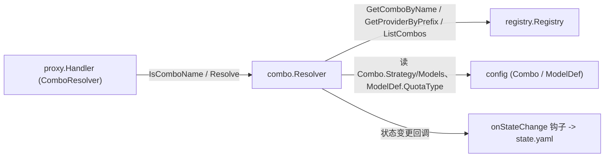
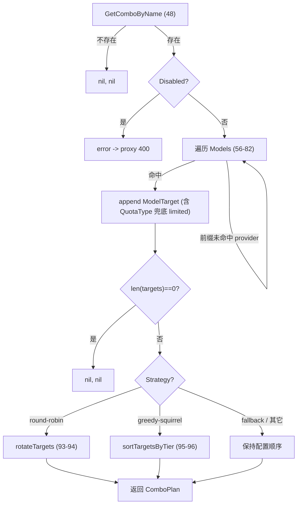

# TinyRouter Combo 组合策略架构

> **文档定位：** `internal/combo/` 包实现的 canonical 架构事实基线。后续设计、排障和代码评审应先读取本文，再按“源码锚点”核对本次变更涉及的局部代码。
>
> **最后核对：** 2026-07-13，仓库提交 `c2f89c6`（`main`）。本文描述的是当时源码的实际行为，不把规划或历史设计稿当作现状。

## 1. 范围与结论

`internal/combo/` 是 TinyRouter 的 **Combo 组合策略模块**，把“组合名（combo name）”解析为一个有序的 `ComboPlan`（`[]ModelTarget`）交由 proxy 驱动执行。它自身不做 HTTP 转发、SSE、用量记录、key 轮询或冷却记账——这些仍由 proxy / rotation 负责。combo 只是**名称 → 执行计划**的解析层。

- **谁调用它：** `internal/proxy/` 通过 `ComboResolver` 接口（proxy/interfaces.go:61-64）注入 `*combo.Resolver`，在 `handleProxy` 先以 `IsComboName` 判断请求 `model` 是否为 combo 名（forward.go:46-49），是则走 `handleCombo` 调 `Resolve` 取计划并按策略驱动（forward.go:87-122）；`internal/app/app.go` 作为组合根构造 `Resolver` 并挂 `SetStateHook` 持久化 `state.yaml`（app.go:127、168）。
- **它调用谁：** `registry.Registry`（读 combo/provider 定义、`GetComboByName` 查名、`GetProviderByPrefix` 解前缀、`ListCombos`）、`config`（Combo / ModelDef 定义）、`state`（ComboSnapshot 持久化）。combo 不写文件，状态变更经注入的 `onStateChange` 旁路回调触发。



本文的核心结论：

1. **round-robin 只把 `Targets[0]` 暴露给 proxy：** 跨 target 的旋转由 per-combo 计数器（`comboState`）驱动，返回时把当前 index 旋到切片首位（rotateTargets:103-129），proxy 只读 `plan.Targets[0]`（forward.go:108-111）；它**不是**跨 target 的 failover 循环，失败不会切下一个 target。
2. **greedy-squirrel 按配额层级排序：** `unlimited → limited → paid`，每层内保持原始顺序，未知 QuotaType 落入 `limited` 桶（sortTargetsByTier:174-191）。
3. **ModelTarget.ProviderID 存的是真实 provider ID，不是前缀：** `Resolve` 经 `GetProviderByPrefix` 解出 provider 后写入 `provider.ID`（resolver.go:66-71）。
4. **配额层级挂在 ModelDef 上，不挂在 Combo 上：** `QuotaType` 来自 `config.ModelDef`（types.go:32-34），Combo 只持有字符串 `Models`（types.go:129-136），无 `QuotaTier` 字段；缺失时 `Resolve` 兜底为 `"limited"`（resolver.go:78-80）。
5. **combo 自己持有轮转状态：** `Resolver.state map[string]*comboState`（resolver.go:31）由本包拥有并持久化；这与 rotation 把全部 per-key 状态委托给 `registry.KeyRuntimeState` 的归属边界相反（见第 3、9 节）。

## 2. 事实优先级

出现冲突时按以下优先级判断：

1. 当前源码和测试（`internal/combo/*`、`internal/proxy/interfaces.go`、`internal/proxy/forward.go`、`internal/config/types.go`、`internal/config/defaults.go`、`internal/registry/combos.go`、`internal/util/util.go`、`internal/state/state.go`、`internal/app/app.go` 的相关集成）；
2. 本文；
3. `AGENTS.md` / `PROJECT_MAP.md`（仅作模块边界与约定背景）；
4. 历史提交信息（仅作历史背景）。

AGENTS.md 不精确之处（以本文源码锚点为准）：

- **轮转状态归属：** AGENTS.md §6 把 Combo 描述为“移植自 9router combo.js”；实际 combo 的轮转状态（index/consecCount）由 `internal/combo` 自己持有（resolver.go:36-39、31），而非复用 rotation 的 registry 状态；只有 key 选择/冷却仍经过 rotation。
- **sticky 阈值：** AGENTS.md 用“stickyLimit”泛指；combo 的 round-robin 粘性阈值在源码中**硬编码为 3**（resolver.go:114 `if st.consecCount > 3`），不可通过配置调整。

## 3. Resolver 与归属边界

### 3.1 Resolver 结构体与构造（resolver.go:28-34、42-44）

```go
type Resolver struct {
    reg   *registry.Registry
    mu    sync.Mutex
    state map[string]*comboState // combo name → rotation state

    onStateChange func() // injected by main.go for state persistence
}
```

`New(reg)` 只存 registry 指针并初始化 `state` map，**不**分配运行时状态（resolver.go:42-44）。`SetStateHook`（resolver.go:132-136）注入 `onStateChange` 回调，每次轮转状态变更后由 `rotateTargets` 调用（resolver.go:119-121）。

### 3.2 ComboResolver 接口（proxy/interfaces.go:61-64）

```go
type ComboResolver interface {
    IsComboName(name string) bool
    Resolve(name string) (*combo.ComboPlan, error)
}
```

`*combo.Resolver` 结构性满足该接口，proxy 不再依赖具体类型（proxy/interfaces.go:58-64 注释）。

### 3.3 组合根接线（app.go:127、165、168）

`app.go` 在 `Init` 中：`a.comboRes = combo.New(a.reg)`（app.go:127）；持久化启用时 `state.WithComboStateProvider(a.comboRes.SnapshotComboStates, a.comboRes.RestoreComboState)`（app.go:165），并在 `comboRes.SetStateHook(a.stateManager.ScheduleWrite)`（app.go:168）把状态变更接到 `state.yaml` 写入调度。Restore 在 `Run` 早期、HTTP 服务启动前完成（app.go:200-208）。

### 3.4 归属边界：状态归 combo，而非 registry

rotation 的 per-key 状态完全由 `registry` 拥有（见 rotation-architecture.md §3.3）；而 combo 的轮转状态 `comboState{index, consecCount}` 由 `Resolver.state` map 自己持有（resolver.go:31、36-39）。combo 只在 `Resolve`/`rotateTargets` 内读自己的 map，唯一向 registry 取的是 combo/provider 定义（只读、无状态写入）。这是与 rotation 的关键对比点。

## 4. IsComboName（resolver.go:203-206）

```go
func (r *Resolver) IsComboName(name string) bool {
    _, ok := r.reg.GetComboByName(name)
    return ok
}
```

精确按 combo `Name` 字段匹配 `registry.GetComboByName`（registry/combos.go:15-25），**不做任何前缀/格式启发式判断**。proxy 在 `handleProxy` 最先调用它（forward.go:46-49），combo 名优先于 quickslot（forward.go:51）和普通 `provider/model`（forward.go:65-77）——即若 combo 名与 provider 前缀或 quickslot 名撞名，combo 胜出。

## 5. Resolve 算法（resolver.go:47-100）

按顺序：

1. **查 combo：** `r.reg.GetComboByName(comboName)`（resolver.go:48）；不存在 → 返回 `(nil, nil)`（resolver.go:49-51），proxy 在 `handleCombo` 内写 400 `combo not found or empty` 并返回（forward.go:93-94）。
2. **disabled 守卫：** `combo.Disabled` 为真 → 返回错误 `combo is disabled: ...`（resolver.go:52-54），proxy 写 400（forward.go:89-91）。
3. **遍历 Models 构建 targets（resolver.go:56-82）：**
   - `isModelDisabled(m, combo.DisabledModels)` 为真（精确相等）→ 跳过（resolver.go:58-60、193-200）；
   - `prefix, model := util.SplitModel(m)`（resolver.go:61），`prefix==""`（无 `/`）→ 跳过（resolver.go:62-64）；
   - `provider, ok := r.reg.GetProviderByPrefix(prefix)`（resolver.go:66），未命中 → `log.Printf` 警告并跳过（resolver.go:67-70）；
   - 构建 `ModelTarget{ProviderID: provider.ID, Model: model}`（resolver.go:71），遍历 `provider.Models` 按 `md.ID == model` 取 `QuotaType`（resolver.go:72-77），空则兜底 `"limited"`（resolver.go:78-80）；
   - append（resolver.go:81）。
4. **空 targets：** `len(targets)==0` → 返回 `(nil, nil)`（resolver.go:84-86）。
5. **构造计划 + 策略后处理（resolver.go:88-97）：** `Strategy: combo.Strategy`；`round-robin` → `rotateTargets`（resolver.go:93-94）；`greedy-squirrel` → `sortTargetsByTier`（resolver.go:95-96）；其余策略（含 `fallback` 与未知值）保持配置顺序原样。



## 6. 三种策略与目标排序

### 6.1 fallback（配置顺序）

`Resolve` 对 fallback 不做后处理，targets 即 `combo.Models` 的解析结果顺序。proxy 在 `handleCombo` 内 `for _, target := range plan.Targets` 顺序尝试，`forwardWithRetry` 成功即 `return`，失败继续下一个（forward.go:100-106）；全部失败写 502（forward.go:106）。这是跨 target 的 failover，但发生在 proxy 层，而非 combo 内。

### 6.2 round-robin（粘性轮转）

`rotateTargets`（resolver.go:103-129）在 `mu` 锁内：

1. 取/建 `comboState{index:0, consecCount:0}`（resolver.go:107-111）；
2. `consecCount++`；若 `consecCount > 3`（`st.index = (st.index+1) % len(targets); consecCount = 1`）（resolver.go:113-117）——**粘性阈值硬编码 3**；
3. 触发 `onStateChange`（resolver.go:119-121）；
4. 返回把 `st.index` 旋到首位的切片副本（resolver.go:123-128）。

proxy 只取 `plan.Targets[0]`（forward.go:108-111），失败写 502（forward.go:110）。**跨 target 切换是“请求计数轮转”，不构成失败回退**——某 target 的 key 全部耗尽时该请求直接 502，不会自动跳到下一个 target。

### 6.3 greedy-squirrel（配额层级排序）

`sortTargetsByTier`（resolver.go:174-191）把 targets 分三组：`unlimited` / `limited`（default 分支，含未知 QuotaType）/ `paid`，按 `unlimited → limited → paid` 顺序拼接，`append` 保持各桶内原始顺序。proxy 行为与 fallback 相同：顺序尝试、首个成功返回（forward.go:112-118），全部失败写 502（forward.go:118）。

### 6.4 三策略对比

| 策略 | combo 内后处理 | target 顺序 | proxy 驱动（forward.go） | 失败语义 |
|---|---|---|---|---|
| `fallback` | 无（保持配置顺序） | 同 `Models` | 顺序迭代 + 首个成功返回（100-106） | 跨 target failover（proxy 层） |
| `round-robin` | `rotateTargets`（93-94） | 每次把当前 index 旋到首位 | 只取 `Targets[0]`（108-111） | 不跨 target 回退，耗尽即 502 |
| `greedy-squirrel` | `sortTargetsByTier`（95-96） | unlimited→limited→paid | 顺序迭代 + 首个成功返回（112-118） | 跨 target failover（proxy 层） |

未知 strategy 字符串会落入 table 的“其它”行：`Resolve` 不后处理，`handleCombo` 的 `switch` `default` 分支写 400（forward.go:119-120）。

## 7. 模型字符串与配额层级

- **字符串格式：** `combo.Models` 元素为 `"prefix/model"`，`util.SplitModel` 在**第一个** `/` 处切分（util/util.go:6-13）。`"a/b/c"` → `("a","b/c")`（测试 resolver_test.go:222-236 验证）；无 `/` → `("", 原串)`（resolver.go:62-64 跳过）。
- **前缀解析：** `prefix` 经 `GetProviderByPrefix` 解出 provider（resolver.go:66），`ModelTarget.ProviderID` 存 `provider.ID` 而非 `prefix`（resolver.go:71）；`ModelTarget.Model` 存切分后的剩余部分。
- **配额层级来源：** `QuotaType` 来自 `config.ModelDef`（types.go:32-34），按 `provider.Models` 中 `md.ID == model` 匹配（resolver.go:72-77）。`finalizeConfig` 把空 `QuotaType` 填 `"limited"`（defaults.go:98-100）；`Resolve` 内若仍取不到也兜底 `"limited"`（resolver.go:78-80）。
- **层级判定：** `sortTargetsByTier` 的 `switch`（resolver.go:177-184）：`"unlimited"` / `"paid"` 各有专属桶，`default`（含任意未知字符串、空串）落入 `limited` 桶——**不做 QuotaType 合法性校验**。

## 8. 配置集成

### 8.1 config.Combo（types.go:129-136）

```go
type Combo struct {
    ID             string   `yaml:"id" json:"id"`
    Name           string   `yaml:"name" json:"name"`
    Strategy       string   `yaml:"strategy" json:"strategy"`
    Models         []string `yaml:"models" json:"models"`
    Disabled       bool     `yaml:"disabled,omitempty" json:"disabled,omitempty"`
    DisabledModels []string `yaml:"disabledModels,omitempty" json:"disabledModels,omitempty"`
}
```

注意 **Combo 上没有 QuotaTier 字段**——配额层级是 per-model 的（在 `provider.Models[].QuotaType`，即 `ModelDef`），combo 只在 `Models` 里写 `"prefix/model"` 字符串（types.go:133）。

`config.Combos` 是 `[]Combo`（types.go:211，对应 defaults.go 中的 `Combos`）。默认值空切片 `[]Combo{}`（defaults.go:55）。

### 8.2 config.yaml 形态

```yaml
combos:
  - id: c1
    name: mycombo
    strategy: fallback          # fallback | round-robin | greedy-squirrel
    models:
      - deepseek/deepseek-chat   # prefix/model
      - openai/gpt-4o
    disabled: false
    disabledModels:
      - openai/gpt-4o
providers:
  - id: deepseek
    prefix: deepseek
    models:
      - id: deepseek-chat
        quotaType: limited       # unlimited | limited | paid（缺省 limited）
```

## 9. 状态模型与持久化

| 结构体 | 位置 | 字段 / 用途 |
|---|---|---|
| `ModelTarget` | resolver.go:15-19 | 解析出的 `ProviderID` / `Model` / `QuotaType` |
| `ComboPlan` | resolver.go:22-25 | `Strategy` + `Targets []ModelTarget`（greedy-squirrel 内部按层排序） |
| `Resolver` | resolver.go:28-34 | `reg` / `mu` / `state map[string]*comboState` / `onStateChange`（**自持轮转状态**） |
| `comboState` | resolver.go:36-39 | `index int` / `consecCount int`（per-combo 轮转游标，仅 round-robin 用） |
| `config.Combo` | types.go:129-136 | combo 配置：`ID`/`Name`/`Strategy`/`Models`/`Disabled`/`DisabledModels` |
| `config.ModelDef` | types.go:32-34 | `ID` / `QuotaType`（配额层级挂在模型上） |
| `state.ComboSnapshot` | state/state.go:41-44 | 持久化子集：`Index` / `ConsecCount` |

**持久化：**

- `SnapshotComboStates`（resolver.go:139-151）：在 `mu` 锁内遍历 `state` map，按 **combo 名** 为 key 输出 `state.ComboSnapshot{Index, ConsecCount}`（注意 key 是 `state.yaml` 中 combos map 的 key，即 combo 名）。
- `RestoreComboState`（resolver.go:155-170）：先 `GetComboByName(id)` 复查（resolver.go:156-158），不存在报错；再 `mu` 锁内写回 `index`/`consecCount`（resolver.go:162-168）。因按名复查，**被改名的 combo 会丢失其持久化状态**（旧名找不到新名，新名新建空 state）。
- `SetStateHook`（resolver.go:132-136）在 `rotateTargets` 每次轮转后触发 `onStateChange`，由 `app.go` 接到 `stateManager.ScheduleWrite`（app.go:168）去抖动写 `state.yaml`。

**归属边界重申：** combo 的轮转状态（`comboState`）由 `Resolver.state` 自持并持久化；这与 rotation 把 per-key 状态委托给 `registry.KeyRuntimeState` 相反——combo 不依赖 registry 保存任何运行时游标。

## 10. 并发模型

- **单一 `sync.Mutex`（resolver.go:30）：** 保护 `state map[string]*comboState` 的全部读写。`SnapshotComboStates`（resolver.go:140-141）、`RestoreComboState`（resolver.go:159-160）、`rotateTargets`（resolver.go:104-105）、`SetStateHook`（resolver.go:133-134）均加同一把锁。
- **临界区短：** `rotateTargets` 仅在锁内完成“取/建 state → 计数/轮转 → 复制切片 → 触发回调”，不跨 registry 调用、不阻塞转发。
- **无 per-combo 锁：** 锁是 resolver 级单锁，所有 combo 共享；高频跨 combo 并发时彼此串行，但仅影响轮转计数更新，不在锁内做网络 IO。
- **IsComboName / Resolve 读取：** 二者经 `registry` 的 `cfgMu.RLock` 读配置（registry/combos.go:16-17），与 combo 的 `mu` 互不嵌套。

## 11. 已知约束与风险

1. **round-robin 只暴露 `Targets[0]`：** 跨 target 旋转是 per-combo 计数轮转，proxy 不跨 target 回退（forward.go:108-111），某 target key 全耗尽直接 502。
2. **sticky 阈值硬编码 3：** resolver.go:114 `if st.consecCount > 3`，无配置项，不可调。
3. **未知 strategy 静默当配置顺序处理：** `Resolve` 不后处理，`handleCombo` 的 `default` 才报 400（forward.go:119-120）；即配置写错策略名时，combo 仍会“成功”解析，直到 proxy 路由时才 400。
4. **无 QuotaType 校验：** 任意字符串落入 `limited` 桶（resolver.go:182-183），不会报错或告警。
5. **DisabledModels 仅精确匹配：** `isModelDisabled` 用 `d == model` 全等（resolver.go:193-199），不支持前缀/通配；且匹配的是完整 `"prefix/model"` 串。
6. **未知 provider 前缀静默跳过：** `GetProviderByPrefix` 未命中只 `log.Printf` 警告（resolver.go:67-70），不报错；该 model 从 targets 消失，可能使 combo 变空 → `Resolve` 返回 `(nil, nil)` → proxy 写 400（forward.go:93-94）。
7. **重复 model 产生重复 target：** 同一 `"prefix/model"` 出现多次会生成多个 `ModelTarget`（resolver.go:56-82 无去重）。
8. **combo 名优先于 provider/quickslot 碰撞：** `IsComboName` 最先判定（forward.go:46-49），撞名时 combo 胜出。
9. **RestoreComboState 丢弃改名 combo 的状态：** 按名复查（resolver.go:156-158），旧名状态不复用到新名。
10. **空 `Models` → `(nil, nil)`：** proxy 当作“非 combo”处理，写 400 `combo not found or empty`（forward.go:93-94）而非 502。
11. **disabled combo 返回 error：** proxy 写 400（forward.go:89-91），不是 404/502。

## 12. 测试与验证现状

### 12.1 测试文件与覆盖（resolver_test.go）

| 测试函数 | 覆盖内容（锚点） |
|---|---|
| `TestResolve_NotFound` | 未知 combo → `plan==nil` 且无 error（resolver_test.go:24-33） |
| `TestResolve_Fallback` | fallback 保持配置顺序，`Targets[0].ProviderID=="p1"`、`[1].ProviderID=="p2"`，ProviderID 为真实 ID（35-65） |
| `TestResolve_RoundRobin_Sticky` | 连续 3 次 `Targets[0]` 均为 p1（粘性阈值为 3）（67-85） |
| `TestResolve_RoundRobin_Rotate` | 第 4 次调用 `Targets[0]` 轮转到 p2（87-106） |
| `TestResolve_EmptyModels` | 空 `Models` → `plan==nil`（108-119） |
| `TestResolve_InvalidModelFormat` | 无 `/` 的 model → `plan==nil`（121-132） |
| `TestResolve_GreedySquirrel_TierOrdering` | unlimited→limited→paid 排序（134-175） |
| `TestResolve_GreedySquirrel_UnknownQuotaDefaultsLimited` | 空 QuotaType 兜底 limited（177-208） |
| `TestIsComboName` | 存在/不存在 combo 名判定正确（210-220） |
| `TestSplitModel` | `deepseek/deepseek-chat`、`no-slash`、`a/b/c` 切分（222-237） |

共 10 个测试函数，覆盖解析主路径、三种策略、disabled 守卫之外的空/非法输入与 QuotaType 兜底。

### 12.2 已测 vs 未测

- **已测：** fallback/round-robin/greedy-squirrel 的计划构造与排序；粘性 3 与轮转；空/无斜杠/未命中 QuotaType；`IsComboName`；`SplitModel`。
- **未充分覆盖（按源码锚点）：**
  - **disabled combo 错误路径：** resolver.go:52-54 返回 error，但无测试；proxy 写 400（forward.go:89-91）也未在 combo 包内测。
  - **DisabledModels 过滤：** isModelDisabled 分支（resolver.go:58-60、193-200）无测试。
  - **未知 provider 前缀跳过 + 警告：** resolver.go:67-70 无测试（仅日志，无断言）。
  - **SnapshotComboStates / RestoreComboState 往返：** resolver.go:139-170 无测试；改名丢状态（#9）未验证。
  - **SetStateHook 触发：** resolver.go:132-136、119-121 的回调未被任何测试验证。
  - **ListCombos 透传：** resolver.go:209-211 无测试。
  - **未知 strategy 透传：** `Resolve` 不后处理、`handleCombo` 报 400 的路径（forward.go:119-120）无测试。
  - **重复 model 去重行为：** resolver.go:56-82 不去重（#7）无测试。

### 12.3 建议验证命令

```powershell
go test ./internal/combo/...
go test ./...
go build -o tinyrouter .
```

涉及 Resolve 策略、配额排序、状态持久化的修改，应优先跑 `resolver_test.go`，并手工用浏览器构造 combo 请求验证轮转分布与重启后游标恢复。

## 13. 源码锚点

本包（internal/combo）：

- `resolver.go`：ModelTarget（15-19）、ComboPlan（22-25）、Resolver 结构体（28-34）、comboState（36-39）、New（42-44）、Resolve 算法（47-100）、rotateTargets（103-129）、SetStateHook（132-136）、SnapshotComboStates（139-151）、RestoreComboState（155-170）、sortTargetsByTier（174-191）、isModelDisabled（193-200）、IsComboName（203-206）、ListCombos（209-211）。

外部依赖：

- `internal/proxy/interfaces.go`：ComboResolver 接口（61-64）。
- `internal/proxy/forward.go`：handleProxy 先判 IsComboName（46-49）、handleCombo 按策略驱动（87-122，含 fallback 100-106、round-robin 108-111、greedy-squirrel 112-118、未知策略 400 119-120、disabled error 400 89-91）。
- `internal/config/types.go`：Combo（129-136）、ModelDef（32-34）、Combos 字段（211）。
- `internal/config/defaults.go`：Combos 默认空（55）、ModelDef 空 QuotaType 填 limited（98-100）。
- `internal/registry/combos.go`：GetComboByName（15-25）、ListCombos（7-13）。
- `internal/util/util.go`：SplitModel 首个 `/` 切分（6-13）。
- `internal/state/state.go`：ComboSnapshot（41-44）、Snapshot.Combos（17-22）、Save 原子写（79-96）。
- `internal/app/app.go`：combo 接线 New（127）、WithComboStateProvider（165）、SetStateHook（168）、Restore（200-208）。

## 14. 变更维护清单

| 变更类型 | 必查位置 |
|---|---|
| 新增/修改策略 | resolver.go Resolve（47-100）+ rotateTargets（103-129）/sortTargetsByTier（174-191）+ proxy/forward.go handleCombo（87-122） |
| 修改配额层级 | sortTargetsByTier（177-184）+ config/types.go ModelDef.QuotaType（32-34）+ defaults.go（98-100）+ resolver.go 兜底 limited（78-80） |
| 修改 combo 配置 | config/types.go Combo（129-136）+ defaults.go Combos（55）+ registry/combos.go 读写 |
| 修改状态持久化 | resolver.go SnapshotComboStates（139-151）/RestoreComboState（155-170）+ state/state.go ComboSnapshot（41-44）+ app.go 接线（165、168） |
| 修改 model 字符串格式 | util/util.go SplitModel（6-13）+ resolver.go Resolve 遍历与 SplitModel 调用（56-82） |
| 修改接口契约 | proxy/interfaces.go ComboResolver（61-64）须与 resolver.go 方法签名同步 |
