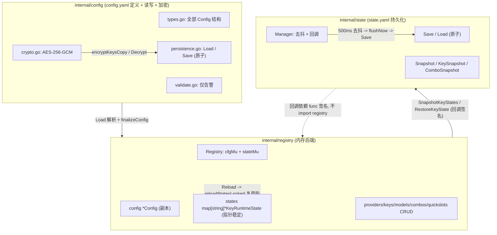
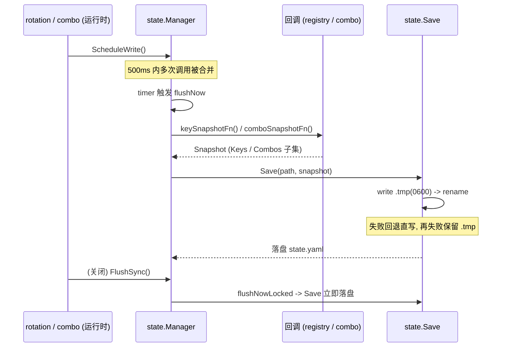
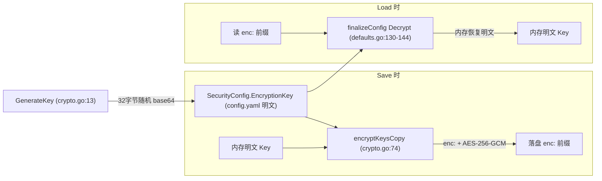

# TinyRouter Config / Registry / State 基础设施架构

> **文档定位：** `internal/config/`、`internal/registry/`、`internal/state/` 三个包共同构成的 **配置定义 + 内存注册表 + 运行时状态持久化** 基础设施的 canonical 架构事实基线。后续设计、排障和代码评审应先读取本文，再按“源码锚点”核对本次变更涉及的局部代码。
>
> **最后核对：** 2026-07-19，仓库工作区（`main`）。本轮新增：(a) `UpdateKey` 采用 partial update 语义——`Key`/`Account` 仅在 `updates.Key != ""` 时覆盖；(b) 会话 cookie 设置 `Secure: true`，`MaxAge` 与 `sessionMaxAge`（24h）对齐；(c) 移除 `deps.cfg` 字段，所有运行时配置读取统一走 `rt.reg.Config()` 快照。(d) 顶层 `Shortcuts` 字段（types.go:266-281，`ShortcutsConfig` = `map[string]ShortcutBinding`）+ `finalizeConfig` 把 nil 归一为空 map（defaults.go）+ `api/settings.go` 的 `GET /api/settings` 返回 `shortcuts`、`PATCH /api/settings` 接收并覆盖式赋值；前端系统预设与 `Shortcuts.matchEvent` 实现于 `web/static/shortcuts.js`，仅"被用户覆盖的项"持久化到 `config.yaml` 的 `shortcuts:` 段。`ModelDef.Protocols`（`[]string`，`yaml/json:"protocols,omitempty"`，记录多协议探测结果，types.go:50-55）+ `ProtocolOpenAICompat`/`ProtocolOpenAIResponses`/`ProtocolAnthropic` 合法值常量（types.go:31-37）+ `validate.go` 的 `validateModelDef`（合法值告警）；`registry.UpdateModelProtocols`（models.go:182）+ `PATCH /providers/{id}/models/protocols`（api/router.go:282）；`state.yaml` 新增 `probes` map（`ProbeRecord`/`ProbeDetail`，state.go:22-49）+ `registry` 的 `probeRecords` 与 `UpdateProbeRecord`/`GetProbeRecord`/`SnapshotProbeRecords`/`RestoreProbeRecord` + `state.Manager` 的 `WithProbeStateProvider` + `app.go:166` 注入。+ test-proto 单协议 endpoint 替换复合探测（probe_model.go 不再持久化，前端串行调用三次）；ProbeRecord 基础设施仍保留供 PATCH /providers/{id}/models/protocols 使用。本文描述的是当时源码的实际行为，不把规划或历史设计稿当作现状。

## 1. 范围与结论

`internal/config/`、`internal/registry/`、`internal/state/` 三者是 TinyRouter 的 **基础设施层**，分别承担：

- **`internal/config/`** —— 全部配置**类型定义**（`Config` 及其子结构、`Provider`/`Key`/`ModelDef`/`Combo`/`QuickSlot` 等）、`config.yaml` 的**原子读写与首次生成**、以及保护 API Key 不为明文落盘的 **AES-256-GCM 加密**（`crypto.go`）。不持有任何运行时可变状态。
- **`internal/registry/`** —— 进程内**内存后端**：存放当前 `Config` 副本，以及每个 key 的 **`KeyRuntimeState`**（冷却、退避、配额锁、NIM 计数等运行时记账）。提供 provider/key/model/combo/quickslot 的 **CRUD**，并负责 reload 时**保持既有 `KeyRuntimeState` 指针稳定**（merge 语义）。
- **`internal/state/`** —— `state.yaml` 的**去抖持久化层**：通过**回调（callback）**与 registry / combo 解耦抽取快照、写盘、并在启动时恢复。`Manager` 不 import registry，只依赖函数签名（`state.go`/`manager.go`）。

三者彼此正交，核心结论如下：

1. **三个正交的“所有者”：** config 拥有 `config.yaml` 的**定义与读写**（`persistence.go`）；registry 拥有内存态 `Config` 副本 + `states map[string]*KeyRuntimeState`（`registry.go:11-16`）；state 拥有 `state.yaml` 的**持久化与去抖编排**（`manager.go:14-30`）。combo 拥有自己的 `comboState`（`internal/combo/resolver.go:36`），经 state 的两个 combo 回调同步（app.go:165）。
2. **回调模式打破 import 循环：** `registry` import `state`、调用 `state.KeySnapshot`；但 `state` **绝不 import `registry`**——它只持有 `func()` 类型的快照/恢复回调（`manager.go:18-21`）。持久化层因此与具体数据持有者解耦，依赖方向单向（registry → state）。
3. **registry 用两把锁：`cfgMu`（外）与 `stateMu`（内）：** `Registry` 同时持有一把保护 `Config` 的 `cfgMu` 和一把保护 `states` map 的 `stateMu`（`registry.go:12-15`）。约定 `cfgMu` 为外层锁、`stateMu` 为内层锁（见 `reloadStatesLocked` 注释 `registry.go:29`）。所有 CRUD 在 `cfgMu` 下、必要时再取 `stateMu` 做 key-state 簿记。
4. **`KeyRuntimeState` 指针稳定性是 reload-merge 契约：** `Reload` 不会整体重建 `states`，而是 `reloadStatesLocked` 按 `providerID/keyID` 复用既有的 `*KeyRuntimeState` 指针，仅对新 key 分配、对消失 key 丢弃（`registry.go:36-53`）。rotation 等模块持有的指针因此跨 reload 仍然有效——**若整体替换 `states` map 则已有的冷却/锁定会被清零**。
5. **`config.yaml` 严格解析 vs `state.yaml` 宽松解析：** `config.Load` 用 `dec.KnownFields(true)` 拒绝未知字段（`persistence.go:65`）；`state.Load` 用宽松 `yaml.Unmarshal`（未知字段静默忽略，`state.go:61`）。两者对“未知字段”的容忍度相反，源于 config 是用户手写的契约、state 是程序生成的快照。

## 2. 事实优先级

出现冲突时按以下优先级判断：

1. 当前源码和测试（`internal/config/*`、`internal/registry/*`、`internal/state/*`）；
2. 本文；
3. `AGENTS.md` / `PROJECT_MAP.md`（仅作模块边界与约定背景，其中“严格解析”“加密强度”等描述以本文源码锚点为准）；
4. 历史提交信息（仅作历史背景）。

AGENTS.md 不精确之处（以本文源码锚点为准）：

- **加密强度：** AGENTS.md 称密码“AES-256-GCM 加密存储于 config.yaml”。实际确为 AES-256-GCM（`crypto.go:21-40`），但 `EncryptionKey` 本身是 **明文 base64 字符串同文件存储**（`config/types.go:153`、无 KDF、无 OS keystore，见第 17 节），其防护对象是“明文 API Key 泄露”，而非“能读取 config.yaml 的人”。
- **严格解析：** config.yaml 是严格解析（`KnownFields(true)`，`persistence.go:65`），state.yaml 是宽松解析（`state.go:61`），二者相反；AGENTS.md 仅概括“所有文件写入均用临时文件 + rename”，未区分解析严格度。

## 3. 三层架构与归属边界

### 3.1 归属边界（canonical 参考）

本文件是 `rotation-architecture.md §3.3` 与 `combo-architecture.md §3` 所引用的“状态归属边界”的 canonical 基线。三层各自的**唯一所有者**如下：

| 资产 | 所有者 | 位置 | 持久化去向 |
|---|---|---|---|
| 配置**定义**（`Config` 及子结构） | `config` 包 | `types.go` | `config.yaml`（定义 + 全局设置） |
| 内存态 `Config` 副本 + `states map` | `registry` 包 | `registry.go:11-16` | 不持久化定义；`KeyRuntimeState` 子集持久化到 `state.yaml` |
| per-key 运行时状态 `KeyRuntimeState` | `registry` 包（指针稳定） | `state.go:21-45` | 经 `SnapshotKeyStates` 抽快照 → `state.yaml`（子集） |
| per-combo 轮转状态 `comboState` | `combo` 包（自有） | `internal/combo/resolver.go:36` | 经 `SnapshotComboStates`/`RestoreComboState` → `state.yaml`（子集） |
| `state.yaml` 持久化与去抖编排 | `state` 包（`Manager`） | `manager.go` | 磁盘文件 |

**关键约束：** rotation 通过 `registry.GetKeyState(...)` 取得 `*KeyRuntimeState` 后只**可变**、不拥有（rotation-architecture.md §3.3）；combo 经由各自的 resolver 持有 `comboState`，只在状态变更后触发持久化回调。config 全包无自有并发锁（见第 19 节），调用方负责串行化配置读写。

### 3.2 所有权图



**依赖方向：** `registry → state`（registry import state，state.go:8），`state → 不 import registry`。`config` 被 registry 与 state 间接消费（`config.Config`/`config.Provider` 等作为纯数据类型）；`state` 不依赖 `config` 包的具体类型，只依赖本包内 `Snapshot`/`KeySnapshot`/`ComboSnapshot`，从而与 registry 完全解耦。

## 4. internal/config — 类型定义（types.go）

`config` 包的所有数据结构集中定义在 `types.go`，各结构含 `yaml`/`json` tag，字段语义见各结构。

| 结构体 | 位置 | 字段摘要 |
|---|---|---|
| `RotationConfig` | types.go:11-19 | `Strategy` / `StickyLimit` / `MaxRetries` / `RetryDelaySec` / `BackoffMaxSec` / `StatePersist` / `StatePath` |
| `Key` | types.go:22-29 | `ID` / `Key` / `Name` / `Priority` / `IsActive` / `Account`（omitempty） |
| `ModelDef` | types.go:32-55 | `ID` / `QuotaType`（"unlimited"|"limited"|"paid"） / `Alias`（可选别名）/ `Note`（可选备注）/ `Kind`（"text"|"image"，模型能力类型） / `ImgProtocol`（"gpt"|"xai"|"modelscope"，图片生成协议分支，仅 Image 模式使用） / `ImgSizes`（`[]string`，图片模型自定义尺寸列表如 `"1024x1024"`，omitempty，空=回退内置默认） / `NIMOver`（per-model NIM 限速覆盖，指针类型） / `Protocols`（`[]string`，`yaml/json:"protocols,omitempty"`，记录该模型经多协议探测证实支持的协议集合；合法值 `ProtocolOpenAICompat`="openai-compat" / `ProtocolOpenAIResponses`="openai-responses" / `ProtocolAnthropic`="anthropic"；空/nil 表示未探测或探测全失败） |
| `Provider` | types.go:74-96 | `ID`/`Name`/`Prefix`/`BaseURL`/`APIType`/`IsActive`/`Keys`/`Models`/`RotationStrategy`/`StickyLimit`/`InjectStreamOpts`/`NormalizeStreamChunks`/`NIMConfig`/`UseProxy` 等 |
| `ModelNIMOverride` | types.go:44-48 | per-model NIM 限速覆盖（`Enabled`、`RequestCountPerKey`、`MinIntervalMs`），为 nil 时使用标准轮转 |
| `NIMSettings` | types.go:121-126 | `RequestCountPerKey` / `MinIntervalMs` / `CooldownLadderMin` / `MaxConcurrent` |
| `Combo` | types.go:142-149 | `ID` / `Name` / `Strategy` / `Models` / `Disabled` / `DisabledModels` |
| `QuickSlot` | types.go:152-160 | `ID` / `Name` / `Models` / `Disabled` / `DisabledModels` / `Order` / `SelectedIndex`。`SelectedIndex` 无 `omitempty`——0 值也会落盘/回传，保证选中第 1 个模型（index 0）在前端 round-trip 后不丢失 |
| `SecurityConfig` | types.go:163-167 | `PasswordEnabled` / `PasswordEncrypted` / `EncryptionKey` |
| `MonitorConfig` | types.go:157-161 | `Enabled` / `AllowedCommands` / `MaxLineLength` |
| `ServerConfig` | types.go:175-180 | `ReadTimeoutSec` / `WriteTimeoutSec` / `IdleTimeoutSec` / `UpstreamTimeoutSec` |
| `ProxyConfig` | types.go:184-188 | `Enabled` / `Host` / `Port` |
| `DownloadConfig` | types.go:191-201 | `Enabled` / `DefaultDir` / `YtDlpPath` / `FfmpegPath` / `ConcurrentFragments` / `MaxConcurrent` / `Proxy` / `BrowserCookies` / `CookiesPath` |
| `ShortcutBinding` | types.go:248-257 | 一个用户覆盖的键盘绑定：`Key`（必填，如 `F6`/`Enter`/`m`/` ` — space）/ `CtrlOrCmd`（平台无关修饰，macOS 时 match `metaKey`，其它平台 match `ctrlKey`）/ `Alt` / `Shift`（均 `omitempty`）。仅记录被覆盖的项；与系统预设相等的绑定不写入磁盘 |
| `ShortcutsConfig` | types.go:263 | `map[string]ShortcutBinding`，键为 action ID（如 `global.goto-usage`、`pg.send-message`、`gallery.toggle-split`），值为 `ShortcutBinding`。空（非 nil）map = 无覆盖；`finalizeConfig` 把 nil 归一为空 map 以保证 JSON 输出 `{}` 而非 `null` |
| `Config` | types.go:266-281 | 顶层：上述所有子结构 + `Port` / `ConsoleLogMaxLines` / `UsageRingSize` / `EnablePlayground` / `Providers` / `Combos` / `QuickSlots` / `Shortcuts`（`ShortcutsConfig`，`yaml/json:"shortcuts,omitempty"`，仅存用户覆盖；未出现该段时回退前端系统预设） |

**`ModelDef` 的双重反序列化：** 为兼容旧配置，`ModelDef` 同时支持标量字符串与映射节点——`UnmarshalYAML`（types.go:38-51）遇到 `ScalarNode` 时把值赋给 `ID`、`QuotaType` 留空；`UnmarshalJSON`（types.go:54-71）对以 `"` 开头的字节流按字符串解析，否则按对象解析。

**`Provider` 方法：**

- `IsNIM()`（types.go:102-107）：`APIType=="nim"` 或 `BaseURL` 含 “nvidia”（小写）时为真——保证 misconfigured apiType 不会静默绕过 NIM 节流。
- `IsGeminiOpenAICompat()`（types.go:113-117）：`BaseURL` 含 “generativelanguage.googleapis.com” **且** 含 “/openai” 时为真，用于判定需要 thought_signature 处理的 Gemini OpenAI 兼容端点。

**协议合法值常量与探测校验：** `config` 包定义三协议合法值常量 `ProtocolOpenAICompat`="openai-compat" / `ProtocolOpenAIResponses`="openai-responses" / `ProtocolAnthropic`="anthropic"（types.go:31-37），供单协议探测（`api/probe_common.go` 的 `probeOpenAICompat`/`probeOpenAIResponses`/`probeAnthropic` 函数，`api/probe_model.go` 的 `testProviderModelProto` handler 按 `proto` 参数分发）+ 前端串行调用三次实现三协议探测，以及 `ModelDef.Protocols` 字段使用。`validate.go` 新增 `validateModelDef(p, m)`（10-42 区）+ `validProtocols` 集合（9），在 `validateProviders` 遍历 `p.Models` 时对每个模型的 `Protocols` 值做合法性告警（未知协议值仅 `os.Stderr` 告警，不阻断 Save）。

`config.go` 为本包文档注释文件（config.go:1-11），说明各文件职责，无导出符号。

## 5. internal/config — 默认值与回填（defaults.go）

### 5.1 ServerConfig 默认值

- `DefaultServerConfig()`（defaults.go:11-18）：`ReadTimeoutSec=300`、`WriteTimeoutSec=300`、`IdleTimeoutSec=120`、`UpstreamTimeoutSec=300`。
- `FinalizeServerConfig(s)`（defaults.go:22-36）：对零值字段逐一回填默认，供“部分 server 块”（如设置 PATCH）保持合理值。

### 5.2 顶层默认配置

`DefaultConfig()`（defaults.go:39-64）返回：

- `Port=20128`，`ConsoleLogMaxLines=200`，`UsageRingSize=500`；
- `Rotation`：`Strategy="fill-first"`、`StickyLimit=3`、`MaxRetries=5`、`RetryDelaySec=5`、`BackoffMaxSec=300`、`StatePersist=true`、`StatePath="state.yaml"`；
- `EnablePlayground=true`；
- `Providers`/`Combos`/`QuickSlots` 为空切片（非 nil）；
- `Server=DefaultServerConfig()`；
- `Download`：`Enabled=true`、`ConcurrentFragments=4`、`MaxConcurrent=3`。

### 5.3 finalizeConfig 回填逻辑（defaults.go:69-146）

`finalizeConfig(cfg, raw)` 在 `Load` 解析后就地回填（`raw` 为原始 YAML 字节）：

- **端口 / 日志行数 / ring 大小归零回填**（70-78）：`Port=20128`、`ConsoleLogMaxLines=200`、`UsageRingSize=500`。
- **`enablePlayground` 字节级探测**（82-84）：仅当 `raw` 中**不含**字面量 “enablePlayground” 时才默认 `true`——避免旧配置零值（false）静默隐藏 playground。
- **`state_persist` 字节级探测**（87-89）：仅当 `StatePersist==false` **且** `raw` 不含 “state_persist” 时回填 `true`，防止用户显式 `false` 被覆盖。
- **`state_path` 空值回填**（90-92）：空则置 “state.yaml”。
- **server 超时回填**（95）：调 `FinalizeServerConfig(&cfg.Server)`。
- **模型 QuotaType 默认（defaults.go:96-102）：** 空 `QuotaType` 填 “limited”。
- **`validateProviders`（defaults.go:103）：** 尾调用校验（仅告警，见第 7 节）。
- **Monitor 默认（104-109）：** `AllowedCommands` 为空时填一组白名单（含 `nvidia-smi`/`top`/`htop` 等）；`MaxLineLength` 零值填 4096。
- **Download 区段探测（110-123）：** 仅当 `raw` 中**不存在** `download:` 段时才默认 `Enabled=true`；存在则尊重用户（含显式 `false`）。`ConcurrentFragments`/`MaxConcurrent` 零值填 4/3；`DefaultDir` 空时取用户主目录下的 “Downloads”。
- **API Key 解密（130-144）：** 仅当 `Security.PasswordEnabled && EncryptionKey!=""` 时，遍历所有 provider/key，对以 “enc:” 前缀的 key 调 `Decrypt` 就地还原明文（内存态保持明文，见第 17 节）。

## 6. internal/config — 原子持久化（persistence.go）

### 6.1 Load（persistence.go:21-70）

1. **`.tmp` 恢复（22-51）：** 若存在 `path+".tmp"`，与 `path` 比较 `ModTime`——**仅当 .tmp 更新时**才视为 pending 改动并应用（`applyTmp`，28）。应用优先级：① `os.Rename(tmp→path)`；② 失败则 `os.WriteFile(path, tmpData)` 直接覆盖；③ 再失败则直接解析 `tmpData` 并返回（`.tmp` 保留供下次重试，50 之后不删除）。若 `.tmp` 比 `path` **旧**，视为过期残留直接删除（47-50）。
2. **首跑生成（54-60）：** 目标文件不存在时 `DefaultConfig()` + `Save(path, cfg)`，返回该默认配置。
3. **严格解码（63-69）：** `yaml.NewDecoder` + `KnownFields(true)`，未知字段报错；成功则 `finalizeConfig` 回填。

### 6.2 Save（persistence.go:79-107）

1. **Key 加密副本（80-83）：** 若 `PasswordEnabled && EncryptionKey!=""`，`marshalCfg = encryptKeysCopy(cfg)`（内存态不变，落盘态加密，见第 17 节）。
2. **委托 fsutil.AtomicWrite（89-104）：** `yaml.Marshal` 后调用 `fsutil.AtomicWrite(path, data, 0600)`，内部执行确定性 `.tmp` + `os.Rename` 原子写，失败回退直写（保留 `.tmp` 供下次 `Load` 恢复）。

**原子写契约：** 正常路径 `tmp → rename → path`；锁冲突下 `.tmp` 不丢、留待下次 `Load` 应用（mtime 优先）。config 与 state 的 Save 共用 `fsutil.AtomicWrite` 同一 `.tmp + rename + 直写回退` 契约，但**错误处理语义不同**（见第 20 节 #4）。

## 7. internal/config — 校验（validate.go）

`validateProviders(cfg)`（validate.go:10-42）为 **best-effort 校验，仅向 `os.Stderr` 写 warning，永不阻断 Save**：

- **provider 级：** 空 `ID`（14-17）、空 `Prefix`（18-21）、**重复 `Prefix`**（22-25）、`BaseURL` 非 `http://`/`https://`（27-29）均告警；`APIType` 仅允许 `{"openai","anthropic","nim",""}`，否则告警（30-32）。
- **combo 级：** 对每个 combo model 调 `splitModel`（validate.go:44-52，按首个 `/` 切分），若不含 “prefix/model” 格式则告警（34-40）。

注意：重复 `Prefix` 仅是**告警**（skip warning），不修不阻断——存在路由歧义风险（见第 20 节 #9）。该校验无独立单测（见第 21 节）。

**端口范围校验：** `validatePort(port int) error`（validate.go:18）检查 `port` 在 1-65535 范围内，否则返回 error；在 `finalizeConfig`（defaults.go:75）填默认端口后调用，失败时仅 `fmt.Fprintf(os.Stderr, ...)` 告警，不阻断启动（与 `validateProviders` 一致的 best-effort 风格）。

**废弃字段向后兼容：** `config.yaml` 用 `yaml.NewDecoder` + `dec.KnownFields(true)` strict 解析（persistence.go:39,65），目的是捕获字段拼写错误（如 `baseURL` 写成 `baseurl`），而非拒绝历史遗留字段。v1.8.0 删除了 `MonitorConfig.Enabled`（曾用于控制 Monitor 开关，但删除前从未被代码引用），保留 strict 会导致从 v1.7.x 升级的旧 config.yaml 含 `monitor.enabled` 时启动失败。修复策略：在 `MonitorConfig` struct 中**保留** `Enabled` 字段（types.go:200，标记 `deprecated, ignored`），让 strict 解析识别为已知字段从而通过；`finalizeConfig`（defaults.go:155-158）检测到 `cfg.Monitor.Enabled == true` 时向 stderr 输出废弃告警，引导用户删除该字段。此模式兼顾"strict 拼写检测"与"向后兼容"——未来若再有字段删除，按同模式加回 + 告警即可。回归测试见 `config_compat_test.go`。

## 8. internal/config — AES-GCM 加密（crypto.go）

- **`GenerateKey()`（crypto.go:13-19）：** 生成 32 字节随机数，base64 编码为字符串（即 AES-256 密钥材料）。
- **`Encrypt(keyBase64, plaintext)`（crypto.go:21-40）：** base64 解码密钥 → `aes.NewCipher` → `cipher.NewGCM` → 生成 12 字节随机 nonce → `gcm.Seal(nonce, nonce, plaintext, nil)`（nonce 前置）→ base64 编码输出。
- **`Decrypt(keyBase64, ciphertextBase64)`（crypto.go:42-69）：** 解码后校验长度 ≥ `NonceSize()`，切出 nonce 与密文，`gcm.Open` 还原明文；长度不足返回 “ciphertext too short”。
- **`encryptKeysCopy(cfg)`（crypto.go:74-91）：** **深拷贝** `cfg`（含 `Providers`/`Keys` 切片），对非空且未带 “enc:” 前缀的 `Key` 调 `Encrypt` 并加 “enc:” 前缀；**原 `cfg` 不修改**（内存态 key 保持明文）。

**加密密钥存储的现实：** `SecurityConfig.EncryptionKey`（types.go:153）是**明文 base64 字符串，与密码、API Key 同文件存储 config.yaml**。无 KDF、无 OS keystore（`GenerateKey` 仅随机 + base64）。因此该机制的防护目标是“防止 config.yaml 被意外读取/备份时泄露明文 API Key”，**而非**抵御任何能读取 config.yaml 的人（见第 17、20 节）。

## 9. internal/registry — Registry 与双锁模型（registry.go）

```go
type Registry struct {
    cfgMu   sync.RWMutex        // 外层锁：保护 config
    config  *config.Config
    stateMu sync.RWMutex        // 内层锁：保护 states map
    states  map[string]*KeyRuntimeState
}
```

- **`New(cfg)`（registry.go:19-26）：** 建 `states` map 并立即 `reloadStatesLocked()` 初始化。
- **`reloadStatesLocked()`（registry.go:28-54）：** **调用方已持 `cfgMu`**，只取 `stateMu`（29 注释）。按 `providerID/keyID` 重建 `newStates`：既有 key **复用原 `*KeyRuntimeState` 指针**（保留冷却/锁定/退避/NIM 计数），新 key 分配空状态（`ModelLocks`/`ModelStatus`/`ModelErrors` 三个空 map），消失 key 自然丢弃。最后整体替换 `r.states`。
- **`stateKey(providerID, keyID)`（registry.go:56-58）：** 返回 `"providerID/keyID"`（注意用 `/`，与 state.yaml 的 `::` 分隔不同）。
- **`Config()`（registry.go:61-65）：** 在 `cfgMu.RLock` 下返回 `*r.config` 的**值副本**。**这是所有运行时配置读取的唯一入口**——`deps.cfg`（`*config.Config` 指针字段）已从 `api/router.go` 中移除，`api/download.go`、`api/monitor.go`、`api/router.go` 的 `securityHeaders` 等全部改走 `rt.reg.Config()` 快照，避免 reload 后读取到 stale 指针。
- **`Reload(cfg)`（registry.go:68-73）：** 取 `cfgMu.Lock` → 替换 `config` → `reloadStatesLocked()`（指针复用）。

**双锁纪律：** `cfgMu` 为外层、`stateMu` 为内层；CRUD 在 `cfgMu` 下、做 key-state 簿记时才再取 `stateMu`（如 providers.go:61-62、keys.go:37-43）。**锁顺序不可逆**（先 `cfgMu` 后 `stateMu`），否则存在死锁风险。

## 10. internal/registry — CRUD

各 CRUD 文件统一遵循“读用 `cfgMu.RLock` 返回副本、写用 `cfgMu.Lock` 改、必要时在 `cfgMu` 下再取 `stateMu` 做 key-state 簿记”。

| 文件 | 主要方法 | 行为要点 |
|---|---|---|
| `providers.go` | `ListProviders`(11-17)、`HasProvider`(20-29)、`GetProvider`(31-41)、`GetProviderByPrefix`(44-54)、`AddProvider`(56-70)、`UpdateProvider`(72-94)、`DeleteProvider`(96-113)、`UpdateProviderStrategy`(116-127) | `AddProvider` 为每个 key 初始化 `KeyRuntimeState`（61-69）；`UpdateProvider` **仅更新标量字段**，**不触碰 Keys/Models**（注释 88-89）；`DeleteProvider` 在 `stateMu` 下清理该 provider 全部 key 的 state（103-107）。读返回副本（35-38、49-52） |
| `keys.go` | `HasKey`(12-26)、`AddKey`(28-48)、`DeleteKey`(50-71)、`UpdateKey`(73-93) | `AddKey`/`DeleteKey` 在 `cfgMu` 下再取 `stateMu` 增删 state（37-43、62-64）；`UpdateKey` 采用 partial update 语义：`Name`/`Priority`/`IsActive` 始终覆盖，`Key`/`Account` 仅在 `updates.Key != ""` 时覆盖（防止 UI 切换开关意外清空明文 API Key），不动运行时状态 |
| `models.go` | `ListModels`(6-17)、`AddModel`(20-36)、`DeleteModel`(39-56)、`UpdateModelQuotaType`(59-75)、`UpdateModelAlias`(86-113)、`UpdateModelNote`(117-135)、`UpdateModelNIMOverride`(136-151)、`UpdateModelKind`、`UpdateModelImgProtocol`、`ResolveModelAlias`(156-168)、`GetModelByAliasOrID`(173-185)、`ResolveModelAliasByID`(278-296) | `AddModel` 去重 + 别名冲突检查（27-36）；`UpdateModelQuotaType` 改模型 `QuotaType`；`UpdateModelAlias` 别名唯一性校验；`UpdateModelKind`/`UpdateModelImgProtocol` 改模型 `Kind`/`ImgProtocol`；`ResolveModelAlias` 按别名查找真实 ID；`GetModelByAliasOrID` 按别名或 ID 查找 ModelDef；`ResolveModelAliasByID` 反向查找：给定 provider Name + model ID，返回 alias（供 quota bar、console log 显示用） |
| `combos.go` | `ListCombos`(7-13)、`GetComboByName`(15-25)、`HasCombo`(28-37)、`AddCombo`(39-43)、`UpdateCombo`(45-59)、`DeleteCombo`(61-71) | 全在 `cfgMu` 下；`UpdateCombo` 改 `Name/Strategy/Models/Disabled/DisabledModels`（combo 运行时状态由 combo 包自管，不经此处） |
| `quickslots.go` | `ListQuickSlots`(7-13)、`GetQuickSlotByName`(16-26)、`GetQuickSlot`(29-39)、`HasQuickSlot`(42-51)、`AddQuickSlot`(53-57)、`UpdateQuickSlot`(59-74)、`DeleteQuickSlot`(76-86) | `UpdateQuickSlot` 改 `Name/Models/Disabled/DisabledModels/Order/SelectedIndex` |

**簿记约定：** 任何会改变 `states` map 键集的写操作（Add/Delete provider、Add/Delete key）都在持 `cfgMu` 期间取 `stateMu` 同步增删 state，保证 `config.Providers` 与 `states` 键集一致。

## 11. internal/registry — KeyRuntimeState 与运行时状态归属（state.go）

```go
type KeyRuntimeState struct {
    mu           sync.Mutex
    BackoffLevel int
    ModelLocks   map[string]time.Time
    ModelStatus  map[string]string
    ModelErrors  map[string]string
    LastUsedAt   time.Time
    ConsecCount  int
    RotatedAt    time.Time
    ModelQuotas  map[string]*QuotaInfo
    InFlight     int
    // NIM 专用
    NIMRequestCount  int
    NIMLastSendTime  time.Time
    NIMCooldownLevel int
    NIMLast429Time   time.Time
}
```

- **`QuotaInfo`（state.go:12-18）：** `ModelLimit`/`ModelRemaining`/`GlobalLimit`/`GlobalRemaining`/`LastUpdated`，由 `UpdateQuota`/`GetQuota` 维护。
- **`KeyRuntimeState`（state.go:21-45）：** per-key 运行时状态，**仅 `ModelLocks`/`ModelStatus`/`ModelErrors` 三个 map 在新建时初始化为空 map**（registry.go:45-49、providers.go:64-68、keys.go:38-42）；`ModelQuotas` 懒初始化（state.go:169）。**这是 rotation 模块所可变的结构**（rotation-architecture.md §3.3）。
- **InFlight 计数（state.go:48-60）：** `IncInFlight` 加锁自增；`DecInFlight` 加锁自减并**钳制在 0**（53-55）；`GetInFlight` 加锁读。三者各自加锁，故可独立调用，但不可对**同一** state 在外部已加锁后再次调用（非可重入，见下）。
- **`Lock`/`Unlock`（state.go:63-66）：** **直接暴露 `mu` 的加锁/解锁**，注释为“acquires/releases the state's mutex”。**该锁非可重入**（普通 `sync.Mutex`），外部已 `Lock()` 后再调用 `IncInFlight`/`DecInFlight`/`GetInFlight`/`UpdateQuota`/`GetQuota` 会死锁——测试 `TestGetKeyStateNil` 专门注释提醒（crud_test.go:247）。
- **`GetKeyState`（state.go:69-73）：** 在 `stateMu.RLock` 下返回 `*KeyRuntimeState`（存在的**活指针**）。
- **`SnapshotKeyStates`（state.go:77-88）：** `stateMu.RLock` 下遍历 `states`，调 `snapshotKeyState` 并把 key 由 `"a/b"` 经 `convertKey`（state.go:118-126）转为 `"a::b"`。
- **`snapshotKeyState`（state.go:90-116）：** 先 `ks.Lock()` 再拷贝——**刻意排除** `ModelErrors`、`InFlight`、`ModelQuotas`（只拷 `BackoffLevel`/`RotatedAt`/`ConsecCount`/`LastUsedAt`/NIM 四字段/`ModelLocks`/`ModelStatus`）。
- **`RestoreKeyState`（state.go:130-163）：** 取活指针 → `Lock` → 字段回填（不含 `ModelErrors`/`InFlight`/`ModelQuotas`）；key 不存在返回 error。
- **`UpdateQuota`/`GetQuota`（state.go:166-186）：** 加锁写/读 `ModelQuotas[model]`。
- **`ResetAllCooldowns`（state.go:191-204）：** `stateMu.RLock` 下遍历所有 state，逐一 `Lock` 后清空 `ModelLocks`/`ModelStatus`/`ModelErrors`、`BackoffLevel=0`、`NIMCooldownLevel=0`、`NIMLast429Time=零值`；**不动** `LastUsedAt`/`ConsecCount`/`RotatedAt`/`InFlight`/NIM 计数（`NIMRequestCount`/`NIMLastSendTime` 保留）。

## 12. internal/registry — Reload/merge 语义

`Reload(cfg)`（registry.go:68-73）→ `reloadStatesLocked()`（registry.go:28-54）执行 merge：

- **present key（仍存在）：** 复用原 `*KeyRuntimeState` 指针 → 冷却/锁定/退避/NIM 计数**全部保留**（40-42）。
- **new key（新增）：** 分配全新空状态（45-49）。
- **absent key（已删除）：** 自然不进入 `newStates` → 丢弃（53 整体替换）。

**merge 契约 = `KeyRuntimeState` 指针稳定性：** 只要 key 在 reload 前后都以相同 `providerID/keyID` 存在，rotation 等模块持有的指针就持续有效，且不丢失运行时记账。该契约由 `TestReload_MergesStates` 验证（reload_merge_test.go:13-83：k1 冷却保留、k2 删除后 state 消失、k3 新增为空白状态）。

## 13. internal/state — Snapshot 格式与版本（state.go）

- **`CurrentVersion=1`（state.go:11-14）：** 快照格式版本常量。
- **`Snapshot`（state.go:17-26）：** 顶层结构 `Version`/`SavedAt`/`Keys map[string]*KeySnapshot`/`Combos map[string]*ComboSnapshot`/`Probes map[string]*ProbeRecord`（`probes` 为本次新增，yaml tag `probes,omitempty`，记录每 (provider,model) 的最近多协议探测明细）。
- **`KeySnapshot`（state.go:25-38）：** 持久化子集——`BackoffLevel`/`ModelLocks`/`ModelStatus`/`RotatedAt`/`ConsecCount`/`LastUsedAt`/NIM 四字段；**不含** `ModelErrors`/`InFlight`/`ModelQuotas`（与 `snapshotKeyState` 排除项一致）。
- **`ComboSnapshot`（state.go:41-44）：** `Index`/`ConsecCount`。
- **`ProbeDetail`（state.go:29-37）：** 单协议探测结果的持久化子集——`Ok`/`Status`/`LatencyMs`/`Error`/`LastAt`。
- **`ProbeRecord`（state.go:38-49）：** 单模型跨三协议的探测聚合——`ProviderID`/`ModelID` + 三段 `ProbeDetail`（`OpenAICompat`/`OpenAIResponses`/`Anthropic`，yaml tag `openai_compat`/`openai_responses`/`anthropic`）+ `Protocols`（`[]string` 汇总）+ `LastProbeAt`。`state.yaml` 中的 `probes` map **只持久化精简明细**（不含请求/响应 body）。
- **`Load`（state.go:48-71）：** 文件不存在返回空快照（`CurrentVersion` + 空 map，不报错）；存在则**宽松** `yaml.Unmarshal`（61），缺 `Keys`/`Combos` 时补空 map（64-69）。
- **`Save`（state.go:79-96）：** `yaml.Marshal` → 委托 `fsutil.AtomicWrite(path, data, 0600)`（确定性 `.tmp` + `os.Rename` → 失败回退直写 → 再失败返回 error 但保留 `.tmp`）。与 config.Save 同契约。

**state.yaml 文件格式：** `version` / `saved_at` / `keys`（键为 `providerID::keyID`）/ `combos`（键为 combo ID）。key 用 `::` 分隔，与 registry 内部 `stateKey` 的 `/` 不同（`convertKey`/`Restore` 负责转换）。

## 14. internal/state — Manager 与去抖+回调模式（manager.go）

```go
type Manager struct {
    path   string
    logger *console.Logger

    keySnapshotFn   func() map[string]KeySnapshot
    keyRestoreFn    func(providerID, keyID string, s KeySnapshot) error
    comboSnapshotFn func() map[string]ComboSnapshot
    comboRestoreFn  func(id string, s ComboSnapshot) error

    mu      sync.Mutex
    writeMu sync.Mutex
    pending bool
    timer   *time.Timer
    closed  bool

    debounce time.Duration // 默认 500ms
}
```

- **回调选项（manager.go:36-49）：** `WithKeyStateProvider(snapshotFn, restoreFn)` 与 `WithComboStateProvider(snapshotFn, restoreFn)` 注入四处 func。app.go:164-165 把它们接到 `reg.SnapshotKeyStates`/`reg.RestoreKeyState` 与 `comboRes.SnapshotComboStates`/`comboRes.RestoreComboState`。
- **`NewManager`（manager.go:53-63）：** `debounce=500ms`；`path` 为空则成 **noop**（所有方法安全空转，见 `TestManagerNoop`）。
- **`ScheduleWrite`（manager.go:67-82）：** path 空/`closed` 直接返回；首调（非 pending）时置 `pending=true` 并启 `time.AfterFunc(debounce, flushNow)`——**窗口内多次调用被合并为一次写**。
- **`flushNow`（manager.go:85-119）：** 取 `mu` 清 `pending`，建 `Snapshot{Version, SavedAt, Keys, Combos}`，通过 `keySnapshotFn`/`comboSnapshotFn` 抽取快照，落 `writeMu` 后调 `Save`；失败仅 `logger.Warn`（**不返回 error**）。
- **`flushNowLocked`（manager.go:122-148）：** 与 `flushNow` 同逻辑但**不经 pending 守卫**，供 `FlushSync` 直接调用。
- **`FlushSync`（manager.go:152-170）：** 停 timer、清 `pending`、调 `flushNowLocked`、置 `closed=true`（幂等，可多次调用）。**用于进程关闭时立即落盘**。
- **`Restore`（manager.go:173-200）：** 对 `snapshot.Keys` 按 `::` `SplitN` 拆出 `providerID`/`keyID`（179），调 `keyRestoreFn`（缺失/失败则 `logger.Debug` 跳过）；对 `Combos` 调 `comboRestoreFn`。

**回调模式打破 import 循环：** `Manager` 只依赖 `func` 签名与 `state.KeySnapshot`/`ComboSnapshot` 类型，**不 import `registry`**（`state.go` 仅依赖标准库与 `yaml.v3`；`console` 由 `manager.go` 导入）。因此依赖方向单向：`registry → state`。`state` 永远不知道具体数据持有者是谁。

## 15. 持久化流

完整写流：运行时状态变更（rotation/combo）→ 上层触发 `Manager.ScheduleWrite()` → **500ms 去抖合并** → `flushNow` 经回调 `SnapshotKeyStates`/`SnapshotComboStates` 抽取快照 → `state.Save`（`.tmp` + rename）→ `state.yaml`。



**config.yaml vs state.yaml 分工：** 前者存**定义 + 全局设置**（providers/keys/models/combos/quickslots/security/monitor/proxy/server/download/rotation + port）；后者只存**可持久化的运行时子集**（key 的冷却/锁定/退避/NIM 计数、combo 的轮转索引）。`ModelErrors`/`InFlight`/`ModelQuotas` **两处都不持久化**（snapshotKeyState 排除 + KeySnapshot 无字段）。

**关闭路径：** 进程退出经 `FlushSync` 立即落盘并 `closed=true`，保证 debounce 窗口内的待写数据被强制写出。

## 16. Reload 流

存在**两条相互独立的恢复路径**：

1. **config 恢复（定义层）：** `config.Load(path)`（persistence.go:21-70）解析 config.yaml → `finalizeConfig` 回填 → `registry.Reload(cfg)`（registry.go:68-73）→ `reloadStatesLocked` 按指针 merge（保留/新建/丢弃）。
2. **state 恢复（运行时层）：** 启动期单独调 `state.Manager.Restore(snapshot)`（manager.go:173-200）读取 `state.yaml`，按 `providerID::keyID` 拆分后调 `keyRestoreFn`/`comboRestoreFn` 回填到 registry/combo 的 live state；**对当前 config 中不存在的 key/combo 静默跳过**（logger.Debug，restore 失败不阻断）。

两条路径解耦：config reload 不读 state.yaml，state restore 不读 config.yaml；二者通过 `providerID::keyID` / combo ID 对齐协调，缺失项跳过即可。

## 17. 加密流



- **密钥生成与存储：** `GenerateKey` 产出 32 字节随机 base64 串，存入 `SecurityConfig.EncryptionKey`（明文，与密码/key 同文件，无 KDF/keystore）。
- **Save（crypto.go:74-91 + persistence.go:81-83）：** `encryptKeysCopy` 深拷贝并对每个 key 加 `enc:` 前缀；**原内存态 key 保持明文**。
- **Load（defaults.go:130-144）：** `finalizeConfig` 在 `PasswordEnabled && EncryptionKey!=""` 时，对 `enc:` 前缀 key 调 `Decrypt` 原地还原明文。
- **双重门控：** `Security.PasswordEnabled` 同时控制管理员登录密码 **与** key-at-rest 加密（两者都依赖同一 `EncryptionKey`）。
- **共址风险：** 加密密钥 `EncryptionKey` 以明文 base64 与受它保护的明文（解密后）/密文（加密后）API Key **同文件存储**——能读到 config.yaml 的人即可解密任何 `enc:` key。该机制仅防“明文 key 被直接读取/备份泄露”，并非强访问控制（见第 20 节 #7）。
- **会话 cookie 加固：** `setSessionCookie`（`api/auth.go:164-174`）与登出 cookie（`api/auth.go:151-162`）已设置 `Secure: true`（与 `HttpOnly`、`SameSite=Strict` 配合），`MaxAge` 从 `86400*30`（30 天）改为 `int(sessionMaxAge.Seconds())`（24h），与服务端 `sessionMaxAge` 一致，防止过期 cookie 被重放。

## 18. 状态模型总览

| 结构体 | 位置 | 用途 |
|---|---|---|
| `RotationConfig` | config/types.go:11-19 | 轮询全局设置 |
| `Key` | config/types.go:22-29 | 单 API key |
| `ModelDef` | config/types.go:32-39 | 模型定义（scalar/mapping 双解）：`ID`、`QuotaType`、`Alias`、`Note`、`Kind`、`ImgProtocol`、`ImgSizes`、`NIMOver` |
| `Provider` | config/types.go:74-96 | 上游端点 + `IsNIM`/`IsGeminiOpenAICompat` |
| `NIMSettings` | config/types.go:121-126 | NIM 参数 |
| `Combo` / `QuickSlot` | config/types.go:129-147 | 组合路由 / 快捷槽 |
| `SecurityConfig` | config/types.go:150-154 | 密码 + `EncryptionKey` |
| `MonitorConfig` | config/types.go:157-161 | Monitor 设置 |
| `ServerConfig` | config/types.go:175-180 | HTTP 超时 |
| `ProxyConfig` | config/types.go:184-188 | 上游代理 |
| `DownloadConfig` | config/types.go:191-201 | 下载设置 |
| `Config` | config/types.go:204-218 | 顶层结构 |
| `Registry` | registry/registry.go:11-16 | `cfgMu`+`config`+`stateMu`+`states` |
| `QuotaInfo` | registry/state.go:12-18 | per-model 配额快照 |
| `KeyRuntimeState` | registry/state.go:21-45 | per-key 运行时状态（rotation 可变） |
| `Snapshot` | state/state.go:17-26 | 顶层持久化快照（含 `Probes map[string]*ProbeRecord`） |
| `KeySnapshot` | state/state.go:25-38 | key 持久化子集 |
| `ComboSnapshot` | state/state.go:41-44 | combo 持久化子集 |
| `ProbeDetail` | state/state.go:29-37 | 单协议探测明细：Ok/Status/LatencyMs/Error/LastAt |
| `ProbeRecord` | state/state.go:38-49 | 单模型三协议探测聚合：OpenAICompat/OpenAIResponses/Anthropic 三段 + Protocols + LastProbeAt |
| `Manager` | state/manager.go:14-30 | 去抖 + 回调 + 双锁 |
| `ManagerOption` | state/manager.go:33 | `func(*Manager)` 配置项 |

## 19. 并发模型

- **config：无自有锁。** `config` 全包不持有 `sync.Mutex`；`encryptKeysCopy`（crypto.go:74-91）通过**深拷贝**保证 Save 不修改调用方的 `cfg`。配置读写串行化由调用方（app 启动、`Reload` 路径）负责。
- **registry：两把锁 + 每 state 一把锁。**
  - `cfgMu`（外，registry.go:12）保护 `*config`；`stateMu`（内，registry.go:14）保护 `states` map。
  - 每个 `KeyRuntimeState` 自带 `mu sync.Mutex`（state.go:22），所有 per-key 字段读写经 `Lock`/`Unlock`（如 `IncInFlight` 48、`UpdateQuota` 167、`RestoreKeyState` 135、`ResetAllCooldowns` 195）。
  - **锁顺序：** 先 `cfgMu` 后 `stateMu`（`reloadStatesLocked` 注释 registry.go:29）；`stateMu` 期间不回取 `cfgMu`。
  - `SnapshotKeyStates`（state.go:77-88）取 `stateMu.RLock`，再对每个 state 调 `snapshotKeyState` 时分别 `ks.Lock()`（90-92）——即“外层读锁 + 内层逐 state 写锁”。
  - **非可重入：** `KeyRuntimeState.Lock/Unlock`（63-66）是裸 `sync.Mutex`；外部已加锁后不得再调 `Inc/Dec/GetInFlight`、`Update/GetQuota`（会死锁，crud_test.go:247）。
- **state：两把锁，且不锁 registry/state 结构。**
  - `Manager.mu`（manager.go:23）保护 `pending`/`timer`/`closed` 协调；`writeMu`（manager.go:24）保护磁盘 I/O 临界区。
  - `state` 包**只调用回调 func**，不持 registry/combo 的任何锁；快照抽取时的锁由回调实现方（registry/combo）在其内部负责。`ResetAllCooldowns` 在 `stateMu.RLock` 下再逐 state `Lock`，与 `SnapshotKeyStates` 的“先读锁再逐锁”顺序一致。

## 20. 已知约束与风险

1. **state 版本无迁移：** `CurrentVersion=1`（state.go:13），`Load` 不校验 `Version`（state.go:48-71 直接 `yaml.Unmarshal`），未来若改格式旧快照会被静默误读。
2. **debounce 合并丢弃中间态：** `ScheduleWrite` 在 500ms 窗口内只保留最后一次触发（manager.go:78-81），窗口内崩溃会丢失“最新一次”之前的所有待写（仅最后一次 timer 会落盘，但进程若在 fire 前崩则全丢）——属有意为之的取舍。
3. **flushNow 在 fire 时刻才抓拍：** 快照在 `time.AfterFunc` 回调触发时（而非 `ScheduleWrite` 调用时）经回调抽取（manager.go:101-112），故 debounce 窗口内的最新状态会被捕捉，但窗口结束后的变更需下一次 ScheduleWrite。
4. **原子 rename 的 Windows 回退语义不一致：** `config.Save` 在 rename + 直写双失败时**返回 error**（persistence.go:100），调用方会处理；`state.Save` 双失败同样**返回 error**（state.go:90），但其唯一调用方 `manager.flushNow`/`flushNowLocked` 仅 `logger.Warn`（manager.go:116/145）后丢弃——故对进程而言失败被静默记录、不向上传播，目标持续被锁时**静默丢状态**。
5. **`.tmp` 恢复基于 mtime：** Load 仅当 `.tmp.ModTime().After(path.ModTime())` 才应用（persistence.go:28）；时钟回拨/跨时区挂载可能导致较新改动被误判为过期残留而删除（47-50）。
6. **config 严格 vs state 宽松：** config.Load `KnownFields(true)` 拒绝未知字段（persistence.go:65）；state.Load 用宽松 `yaml.Unmarshal`（state.go:61）。二者对未知字段容错相反。
7. **`EncryptionKey` 共址：** 明文 base64 同文件存储，无 KDF/keystore（types.go:153、crypto.go:13-19）——只防明文 key 泄露，不防能读 config.yaml 的人（见第 17 节）。
8. **`finalizeConfig` 就地修改：** 在 `Load` 解析后直接改 `cfg`（defaults.go:69-146），包含解密 key（130-144）；若上游传的是共享对象需注意副作用（实际 Load 每次新建 `var cfg Config`，无共享问题）。
9. **重复 `Prefix` 仅告警：** `validateProviders` 发现重复前缀只 `fmt.Fprintf(os.Stderr,...)`（validate.go:22-25），不阻断、不修——存在路由歧义（首个命中者胜，见 GetProviderByPrefix）。
10. **`UpdateProvider` 不触碰 Keys/Models：** 仅更新标量字段（providers.go:72-94，注释 88-89）；key/model 需走各自 CRUD——批量整体替换 provider 会丢失 key 运行时状态指针关联（若 key ID 不变则 reload merge 仍能复用，但 UpdateProvider 本身不动 states）。
11. **`KeyRuntimeState` 指针稳定性即 merge 契约：** 若有人整体替换 `states` map（而非经 `reloadStatesLocked` 复用指针），已累积的冷却/锁定/退避会被清零（registry.go:36-53）。
12. **`InFlight`/`ModelErrors`/`ModelQuotas` 不持久化：** `snapshotKeyState`（state.go:90-116）与 `KeySnapshot`（state.go:25-38）均排除这三项；重启后 `InFlight` 归零、`ModelErrors` 丢失、`ModelQuotas` 需重新采集。

## 21. 测试与验证现状

### 21.1 config_test.go

| 测试 | 覆盖锚点 |
|---|---|
| `TestDefaultConfig` | 默认 Port/日志/ring/EnablePlayground/Rotation 全套（defaults.go:39-64） |
| `TestSaveAndLoad` | Save→Load 往返一致性（persistence.go:21-107） |
| `TestLoad_NonExistentFile` | 首跑自动生成默认配置（persistence.go:54-60） |
| `TestLoad_InvalidYAML` | 严格解析报错 “parse config”（persistence.go:66-67） |
| `TestSave_AtomicWrite` | `.tmp` 改名后清理（persistence.go:92-105） |
| `TestIsNIM` | `IsNIM` 各分支（apiType/baseURL/大小写，types.go:102-107） |
| `TestEnablePlaygroundDefault` | 未显式写时默认 true（defaults.go:82-84） |
| `TestLoad_EmptyQuotaTypeDefaulted` | 空 QuotaType 填 “limited”（defaults.go:96-102） |
| `TestLoad_ModelDefScalar` | `ModelDef` 标量字符串解析（types.go:38-51） |
| `TestSave_ReturnsNilAndLeavesTmpWhenPathLocked` | 锁定路径返回 error 且保留 `.tmp`（persistence.go:92-101） |
| `TestLoad_PendingTmpApplied` | `.tmp` 较新时应用并清理（persistence.go:22-51） |
| `TestLoad_PendingTmpFallbackDirectWrite` | rename 失败时回退直写（persistence.go:31-46） |
| `TestLoad_StaleTmpIsDiscarded` | `.tmp` 较旧则丢弃（persistence.go:47-50） |

### 21.2 crypto_test.go

`TestEncryptDecrypt_RoundTrip`（加解密往返）、`TestDecrypt_InvalidKey`（错密钥失败）、`TestDecrypt_InvalidCiphertext`（非法 base64）、`TestEncrypt_DifferentNonces`（随机 nonce 致密文不同）、`TestGenerateKey`、`TestDecrypt_EmptyKey`、`TestEncrypt_EmptyPlaintext`（空串往返）。覆盖 crypto.go:13-91 全部分支。

### 21.3 registry CRUD / merge / state 测试

| 测试文件 | 覆盖 |
|---|---|
| `crud_test.go` | `TestAddProvider`（含 key state 初始化）、`TestGetProviderReturnsCopy`（副本隔离）、`TestAddKeyAndHasKey`、`TestDeleteKey`（清 state）、`TestDeleteProvider`（清 state）、`TestUpdateProvider`（不碰 Keys/Models）、`TestUpdateKey`、`TestAddComboGetCombo`、`TestConcurrentCRUD`（20 goroutine 无 panic）、`TestGetProviderByPrefix`、`TestGetKeyStateNil`（活指针 + Inc/Dec）、`TestKeyRuntimeState_Quota`（Update/GetQuota）、`TestSnapshotAndRestoreKeyStates`（Snapshot/Restore 往返 + 缺失报错） |
| `reload_merge_test.go` | `TestReload_MergesStates`（k1 保留冷却、k2 消失、k3 新建空白，registry.go:28-54） |
| `state_test.go`（registry 包） | `TestIncInFlight`/`TestDecInFlight`/`TestDecInFlightClamp`（钳制 0）/`TestIncDecConcurrent`（100 并发对归零，state.go:48-60） |

### 21.4 state 包测试（state_test.go）

`TestLoadSaveRoundtrip`、`TestLoadMissingFile`、`TestLoadInvalidYAML`、`TestManagerNoop`（nil / 空 path 安全）、`TestManagerFlushSync`、`TestManagerScheduleWrite`（实测 500ms 去抖）、`TestRestoreRoundtrip`。覆盖 state.go:11-96 与 manager.go:36-200 全路径。

### 21.5 已测 vs 未充分覆盖

- **已测：** config 默认/往返/首跑/严格解析/`.tmp` 三类恢复；crypto 全分支；registry CRUD 副本隔离/并发/key-state 簿记/snapshot-restore/merge；state 往返/缺失/manager noop/flush/schedule/restore。
- **未充分覆盖（按源码锚点）：**
  - **`validate.go` 无独立单测：** `validateProviders`（10-42）仅告警、无任何测试验证去重/前缀校验触发。
  - **`finalizeConfig` 边角分支：** 如 “enablePlayground 探测”（82-84）、“state_persist 探测”（87-89）、“download 段探测”（114-117）、“API Key 解密”（130-144）无专门单测（测试经 `DefaultConfig`/`TestSaveAndLoad` 间接覆盖部分）。
  - **`ResetAllCooldowns` 未测：** state.go:191-204 的清零语义无单测。
  - **`convertKey` 多 `/` 场景：** 仅 `p1::k1` 简单格式测（crud_test.go:286），providerID/keyID 本身含 `/` 的边界未测。
  - **`state.Save` 失败回退语义：** 与 config 不同（返回 nil），无测试验证“锁文件下静默丢状态”。
  - **`Manager.Restore` 跳过路径：** “::” 拆分失败 / 回调返回 error 的 `logger.Debug` 跳过分支（manager.go:180-188）无断言测试。

### 21.6 建议验证命令

```powershell
go test ./internal/config/...
go test ./internal/registry/...
go test ./internal/state/...
go test ./...
go build -o tinyrouter .
```

修改配置/注册表/状态相关逻辑时，优先跑对应包的 `_test.go`，并配合 `TestReload_MergesStates`（指针稳定性）、`TestManagerScheduleWrite`（去抖）、`TestSave_ReturnsNilAndLeavesTmpWhenPathLocked`（原子写回退）做回归。

## 22. 源码锚点

**internal/config：**

- `config.go`：包文档（1-11），说明 types/defaults/persistence/validate/crypto 分工。
- `types.go`：RotationConfig(11-19)、Key(22-29)、ModelDef(32-55，含 Protocols 50)+ModelNIMOverride(44-48)+UnmarshalYAML(38-51)+UnmarshalJSON(54-71)、Protocol 合法值常量(31-37)、Provider(74-96)、IsNIM(102-107)、IsGeminiOpenAICompat(113-117)、NIMSettings(121-126)、Combo(129-136)、QuickSlot(139-147)、SecurityConfig(150-154)、MonitorConfig(157-161)、ServerConfig(175-180)、ProxyConfig(184-188)、DownloadConfig(191-201)、Config(204-218)。
- `defaults.go`：DefaultServerConfig(11-18)、FinalizeServerConfig(22-36)、DefaultConfig(39-64)、finalizeConfig(69-146：enablePlayground 探测 82-84、state_persist 探测 87-89、quota 默认 96-102、monitor 104-109、download 段探测 114-117、key 解密 130-144)。
- `persistence.go`：Load(21-70，.tmp 恢复 22-51、首跑 54-60、严格解析 65)、Save(79-107，加密副本 80-83、rename 回退 92-104)。
- `validate.go`：validateProviders(10-42)、validateModelDef(16-42，Protocols 合法值告警)、validProtocols(9-14)、splitModel(44-52)。
- `crypto.go`：GenerateKey(13-19)、Encrypt(21-40)、Decrypt(42-69)、encryptKeysCopy(74-91)。

**internal/registry：**

- `registry.go`：Registry(11-16)、New(19-26)、reloadStatesLocked(28-54)、stateKey(56-58)、Config(61-65)、Reload(68-73)。
- `providers.go`：ListProviders/HasProvider/GetProvider/GetProviderByPrefix(11-54)、AddProvider(56-70)、UpdateProvider(72-94)、DeleteProvider(96-113)、UpdateProviderStrategy(116-127)。
- `keys.go`：HasKey(12-26)、AddKey(28-48)、DeleteKey(50-71)、UpdateKey(73-93)。
- `models.go`：ListModels(6-17)、AddModel(20-36)、DeleteModel(39-56)、UpdateModelQuotaType(59-75)、UpdateModelKind、UpdateModelImgProtocol、UpdateModelProtocols(177-194，写回 ModelDef.Protocols)。
- `combos.go`：ListCombos/GetComboByName/HasCombo(7-37)、AddCombo(39-43)、UpdateCombo(45-59)、DeleteCombo(61-71)。
- `quickslots.go`：ListQuickSlots/GetQuickSlotByName/GetQuickSlot/HasQuickSlot(7-51)、AddQuickSlot(53-57)、UpdateQuickSlot(59-74)、DeleteQuickSlot(76-86)。
- `state.go`：QuotaInfo(12-18)、KeyRuntimeState(21-45)、Inc/Dec/GetInFlight(48-60)、Lock/Unlock(63-66)、GetKeyState(69-73)、SnapshotKeyStates(77-88)、snapshotKeyState(90-116)、convertKey(118-126)、RestoreKeyState(130-163)、UpdateQuota/GetQuota(166-186)、ResetAllCooldowns(191-204)、UpdateProbeRecord(80-86)、GetProbeRecord(88-93)、SnapshotProbeRecords(95-106)、RestoreProbeRecord(108-114)。

**internal/state：**

- `state.go`：CurrentVersion(11-14)、Snapshot(17-26，含 Probes map)、KeySnapshot(25-38)、ComboSnapshot(41-44)、ProbeDetail(29-37)、ProbeRecord(38-49)、Load(48-71)、Save(79-96)。
- `manager.go`：Manager(14-30)、ManagerOption(33)、WithKeyStateProvider/WithComboStateProvider(36-49)、WithProbeStateProvider(53-55，注入 probe 快照/恢复回调，flushNow 纳入 Probes 125/162)、NewManager(53-63)、ScheduleWrite(67-82)、flushNow(85-119)、flushNowLocked(122-148)、FlushSync(152-170)、Restore(173-200)、probeSnapshotFn/probeRestoreFn(22-23)。

## 23. 变更维护清单

| 变更类型 | 必查位置 |
|---|---|
| 新增配置字段 | `types.go`（结构+tag）+ `defaults.go`：`DefaultConfig` + `finalizeConfig` 回填 + `persistence.go` 严格解析（KnownFields）。`ModelDef` 现含 `Alias`/`Note`/`NIMOver`/`Kind`/`ImgProtocol`/`ImgSizes` 六个可选字段；新增图片尺寸字段还需同步 `UpdateModelImgSizes`（registry/models.go）+ `updateModelImgSizes`（api/providers_models_crud.go）+ `PATCH /providers/{id}/models/imgSizes` 路由（api/router.go）+ `/api/models` `modelInfo.ImgSizes` 回显（api/models.go） |
| 修改默认值 | `defaults.go`：`DefaultConfig`(39-64) 与 `finalizeConfig`(69-146) 两处需一致 |
| 修改持久化原子性 | `fsutil/atomic.go` AtomicWrite（统一实现）+ `persistence.go` Save(79-107) + `state.go` Save(79-96)（两者均委托 fsutil，注意错误语义不同，见第 20 节 #4） |
| 修改加密 | `crypto.go`（GenerateKey/Encrypt/Decrypt/encryptKeysCopy）+ `defaults.go` 解密分支(130-144) + `types.go` SecurityConfig(150-154) |
| 修改 `KeyRuntimeState` 字段 | `registry/state.go` KeyRuntimeState(21-45) + `state.go` KeySnapshot(25-38)（同步持久化子集）+ `snapshotKeyState`(90-116)/`RestoreKeyState`(130-163) |
| 修改 reload merge | `registry.go` reloadStatesLocked(28-54) + `reload_merge_test.go`（TestReload_MergesStates） |
| 修改去抖 | `manager.go` ScheduleWrite(67-82)/flushNow(85-119)/FlushSync(152-170) |
| 修改回调接线 | `app.go` WithKeyStateProvider/WithComboStateProvider(164-165) 与 registry/combo 的 Snapshot*/Restore* 实现 |
| 修改校验 | `validate.go` validateProviders(10-42)（仅告警，注意重复 prefix 不阻断，第 20 节 #9）+ `validatePort`(18)（端口范围 1-65535 告警，defaults.go:75 finalizeConfig 调用） |
| 新增 `ModelDef.Protocols` / 单协议探测 | `config/types.go` 新增 `Protocols` 字段(50-55)+`Protocol*` 常量(31-37)+`validate.go` `validateModelDef`(16-42)、`registry/models.go` `UpdateModelProtocols`(177-194)+`api/providers_models_crud.go` `updateModelProtocols`+`api/router.go` `PATCH /providers/{id}/models/protocols`(282)；运行态探测明细入 `state`：`state.go` `ProbeRecord`/`ProbeDetail`(29-49)+`Snapshot.Probes`(22)、`registry/state.go` `UpdateProbeRecord`/`GetProbeRecord`/`SnapshotProbeRecords`/`RestoreProbeRecord`(80-114)、`state/manager.go` `WithProbeStateProvider`(53-55)+`app.go` 注入(166)；`api/probe_model.go` `testProviderModelProto` 单协议单次探测（**不持久化**，`POST /providers/{id}/models/test-proto`）+ `probe_common.go` `normalizeProbeBaseURL`+`buildProbeURL`/`buildAnthropicURL` 归一化修复；前端 providers.js/combos.js/quickslots.js 串行调用三次实现三协议探测，O/R/A mini badges 可点击打开单协议详情 modal |
| 新增/修改快捷键（`Shortcuts`） | `config/types.go`(`ShortcutBinding`+`ShortcutsConfig`+`Config.Shortcuts`, 248-281)+`defaults.go`(`finalizeConfig` nil→空 map)+`persistence.go`（YAML `omitempty`，空 map 不渲染段）+`api/settings.go`(`getSettings` 返回 `shortcuts`、`updateSettings` 接收 `shortcuts`)；前端系统预设 + `Shortcuts.matchEvent`/`loadOverrides`/`setOverride` 实现于 `web/static/shortcuts.js`(全局单一来源)，各处硬编码 `e.key === 'F1'` 等改造为 `Shortcuts.matchEvent('<actionID>', e)` —— 涉及 `web/static/app.js`(全局 + quickslot) 与 `web/playground/static-pg/{pg-ui.js, pg-autochat.js, gallery-fullscreen.js}`(Playground 输入 + Gallery 页面 / 全屏)；UI 入口 `endpoint.js::openShortcutsModal`(含 tab/捕获/同区域冲突校验/单条与全部恢复默认)。**Gallery 全屏内 1-9（视频音量 / 自动播放速率）与媒体控制键（Arrow/Space 倒退、暂停）刻意保留硬编码不纳入自定义，避免与全局 quickslot-cycle 1-9 产生跨区域冲突。** |
