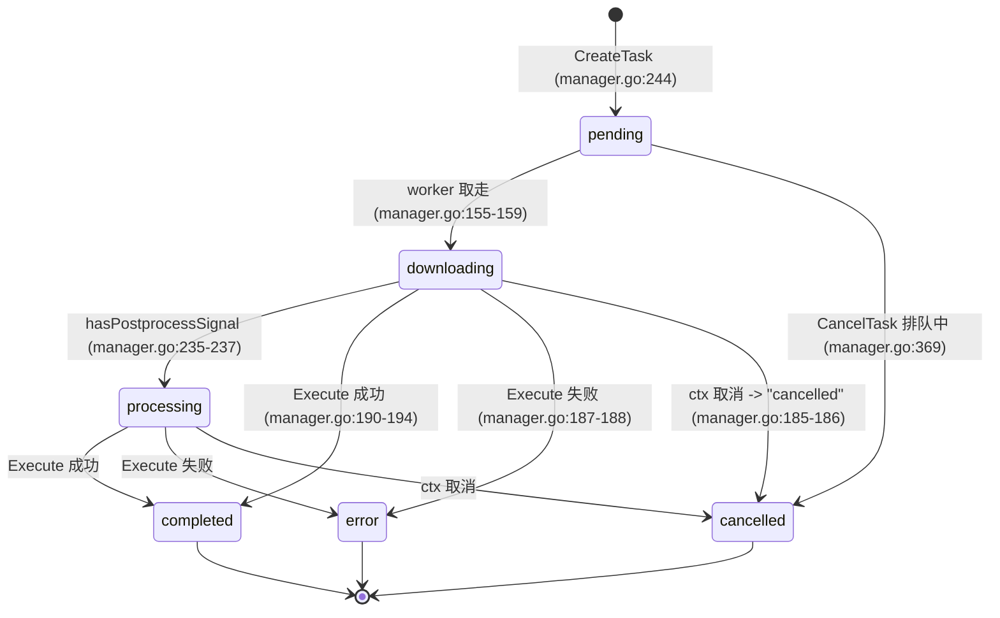
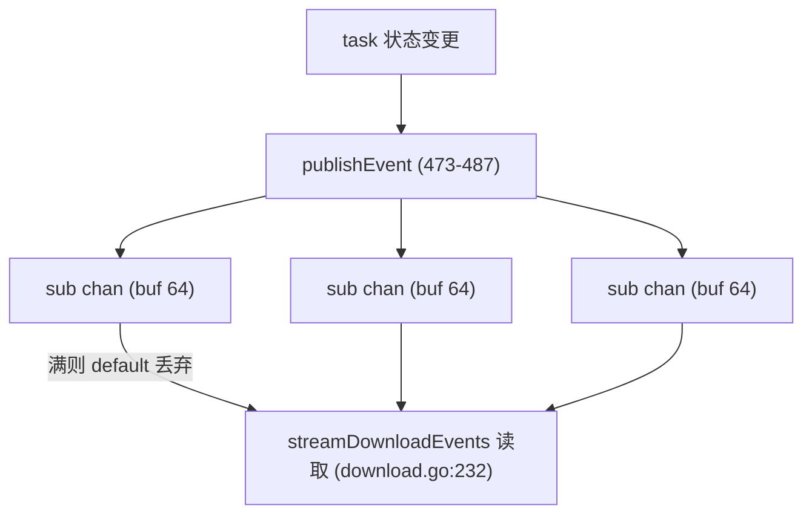

# TinyRouter Download 下载功能架构

> **文档定位：** `internal/download/` 包、`internal/api/download.go` 与前端 `web/static/download.js` 实现的 canonical 架构事实基线。后续设计、排障和代码评审应先读取本文，再按“源码锚点”核对本次变更涉及的局部代码。
>
> **最后核对：** 2026-07-22，仓库工作区（`main`）。本轮变更：下载设置弹窗的文件/目录浏览按钮从前端 File System Access API 迁移至后端 `browseSystemPath` API（`POST /api/downloads/browse`），调用 `fsutil.OpenFilePicker`/`fsutil.OpenDirectoryPicker`（Windows 原生 COM IFileOpenDialog 现代对话框，返回绝对路径）；`openDownloadDir` 迁移至 `fsutil.OpenInFileManager`；`openExternalURL` 迁移至 `fsutil.OpenInBrowser`。
>
> **本轮后续修复（2026-07-19，bug fix）**：(a) `openDownloadDir` handler（download.go:398）移除 `setCmdHideWindow(cmd)` 调用——该函数（exec_windows.go:10）设置 `HideWindow: true + CREATE_NO_WINDOW` 会隐藏 `explorer.exe` 这个 GUI 应用的窗口，导致"打开目录"按钮点击静默失效（API 返回 `{status:ok}` 但 explorer 窗口不可见）；`setCmdHideWindow` 保留用于 `openExternalURL`（`cmd /c start`，download.go:457）与 `browseSystemPath`（`powershell`，download.go:486）两处控制台程序以隐藏黑色控制台窗口。(b) 清理 `download.js` 的 `openDownloadDir` 注释中残留的"falling back to copying the path to the clipboard if that fails"——上一轮已彻底移除 clipboard 回退逻辑，注释残留与实际行为不符。(c) 修复 `dl-info-preview` 在多个 `dl-parsed-card` 时自带滚动条截断后续卡片的问题：移除其 `max-height + overflow-y: auto` 改为 `flex-shrink: 0` 自然高度；`.dl-task-list` 移除 `overflow-y: auto + height: 100%` 改为 `flex-shrink: 0`；父容器 `.dl-task-left-col` 加 `overflow-y: auto + min-height: 0` 成为唯一滚动区——实现 `dl-info-preview` 与 `dl-task-list` 共享父容器滚动条（两者总高度超出 `calc(100vh - 170px)` 时才出现滚动条），落实第 547 行所述"普通流式内容"的设计意图。
>
> **第二轮后续修复（2026-07-19，bug fix，接续用户反馈）**：(d) `.dl-playlist-header-sticky`（style.css:1259）补加 `position: sticky; top: 0; z-index: 5;`——该 class 名带 "sticky" 但 CSS 此前无 `position: sticky` 属性，导致滚动浏览展开的 `dl-playlist-entries` 列表时 card 表头不粘住顶部；现在 sticky 相对于滚动容器 `.dl-task-left-col` 生效，粘性边界为其直接父 `.dl-playlist-preview`（card 可见时 header 粘住，card 滚出时 header 跟着滚出）。(e) `.dl-info-preview` 的 `padding: 0 0 30px 0` 改为 `padding: 0`——消除最后一个 `dl-parsed-card` 与第一个 `dl-task-item` 之间的 30px 空隙（两者为兄弟节点，`dl-info-preview` 的 bottom padding 表现为两者间空隙）。(f) `openDownloadDir` 的 `/select,` 参数（download.go:380）手动给 path 加双引号改成 `/select,"path"` 格式——这是对上文 (a) 的补充修复：用户反馈"open folder 依然失败，Downloads 被打开成 Documents"，根因是 Go 的 `syscall.EscapeArg` 会把整个 `/select,path` 外层加引号包裹成 `"/select,path"`，而 explorer.exe 期望 `/select,"path"`（引号只包路径部分）；路径解析失败时 explorer 会静默 fallback 到默认的"文档"(Documents) 文件夹——这正是 Downloads 变 Documents 的原因。(a) 移除 `setCmdHideWindow` 是必要的清理（explorer 是 GUI 无需隐藏控制台）但未触及根本的路径解析问题，(f) 才是真正让按钮工作的修复。该方案对空格、中文、`&`、`!`、逗号均有效（Windows 文件名不允许含双引号，无需额外转义）。macOS/Linux 分支（`open -R` / `xdg-open`）不受 Go EscapeArg 外层引号影响，无需修改。
>
> **第三轮后续修复（2026-07-19，bug fix，接续用户反馈）**：(g) `openDownloadDir` 改用 `windows.ShellExecute` 替代 `exec.Command` 启动 explorer.exe——这是对上文 (a)+(f) 的最终修复：用户反馈 (f) 加双引号仍未解决问题（即使把下载目录设为 `Z:\` 这种简单路径，打开的依然是 Documents）。真正根因是 Go 的 `exec.Command` 在 Windows 上用 `CreateProcess` 启动进程，而 explorer.exe 是单实例 shell 应用——新进程通过 DDE 把命令行参数转发给已运行的 explorer 实例，该转发机制对 CreateProcess 直接传入的路径参数处理不可靠，导致已运行实例无法解析路径，**静默 fallback 到默认的"文档"(Documents) 文件夹**。这不是路径字符串问题（路径完全正确），而是启动方式问题。修复方案：改用 `windows.ShellExecute`（项目已依赖 `golang.org/x/sys v0.46.0`，见 go.mod:17），通过 shell 的 `ShellExecuteEx` 机制启动，正确处理 explorer.exe 的单实例 DDE 行为，可靠传递路径参数。新建 `internal/api/open_windows.go`（`//go:build windows`，用 `windows.ShellExecute` 实现 `openInExplorer(path)`，文件分支用 `/select,"path"` 选中文件、目录分支直接 `ShellExecute("open", path)`）与 `internal/api/open_other.go`（`//go:build !windows`，macOS 用 `open -R`、Linux 用 `xdg-open`，保持 `exec.Command` 因不受 DDE 单实例问题影响）。`download.go` 的 `openDownloadDir` handler 重构为单行调用 `openInExplorer(path)`，删除原来的 `var cmd *exec.Cmd; switch runtime.GOOS { ... }; cmd.Start()` 块。`setCmdHideWindow` 函数保留（`openExternalURL` 的 `cmd /c start` 与 `browseSystemPath` 的 `powershell` 仍需要隐藏控制台窗口）。(h) 新增"原地 retry"功能：用户反馈点击失败 task-item 的 retry 按钮会生成新 task-item 而不是原地重试。新增 `Manager.RetryTask(taskID)` 方法（manager.go，CancelTask 之后）——状态门控只允许 `StatusError`/`StatusCancelled` 重试，重置运行时字段（`Status=Pending`、`Error`、`Progress`、`SavedFile`、`FilePath`、`FileSize`、`StartedAt`、`CompletedAt`、`LogTail`），创建新 `context+cancel`，复用 `CreateTask` 的非阻塞入队模式，发布 `task-updated`+`queue-updated` 事件。新增 `POST /api/downloads/{id}/retry` 端点（download.go 的 `retryDownloadTask` handler + router.go 路由注册，在 `/open` 与 `DELETE` 之间）。前端 `retryDownload` 改为调用该端点，不再从 `downloadTasksMap` 读取参数调用 `POST /downloads` 创建新任务。(i) 移除 `executor.go` 的 `e.logger.Debug("yt-dlp %s", FormatYtDlpCommand(...))` 调用——该调用把 yt-dlp 命令行发到 console logger，在 console 页面显示 `[debug] yt-dlp ...` 行。该信息已由 download 页面的 View Log（executor.go 的 `stdoutTail.Append("[command] " + cmdLine)`）显示，不再需要在 console 页面重复。保留 `manager.go` 的 `m.logger.Info("download workers started ...")`（非 yt-dlp debug）。

## 1. 范围与结论

`internal/download/` 是 TinyRouter 的**下载（Download）功能模块**，把外部 `yt-dlp` + `ffmpeg` 二进制包装为进程内（in-process）的任务队列：负责构建 `yt-dlp` 命令行参数、spawn 子进程、解析 `[download]` 进度行、通过 SSE 把任务状态推给管理 UI。它**不是** LLM 代理的一部分，与 `internal/proxy/` 在职责上完全正交——前者转发 `/v1/*` OpenAI 流量，后者只处理视频/音频下载。二者共享的只有：HTTP 服务器（`internal/api/router.go`）、`internal/console.Logger`、配置加载（`internal/config`）与 `AuthMiddleware` 鉴权边界。

- **谁调用它：** `internal/app/app.go` 在 `buildComponents` 中构造 `download.Manager` 并注入 `RuntimeSettings`（app.go:134-145），随后**无条件**调用 `Start()`（app.go:151）；`internal/api/router.go` 在 `AuthMiddleware` 保护组内注册 11 条 `/api/downloads/*` 路由（router.go:291-302）；`internal/api/settings.go` 在 PATCH `/settings` 时把下载配置推送到运行中的管理器（settings.go:137-168）。
- **它调用谁：** 外部 `yt-dlp` 进程（路径按 `YtDlpPath`/`YTDLP_PATH`/`PATH` 解析，executor.go:199-211）、`ffmpeg`（仅通过 `--ffmpeg-location` 传给 yt-dlp，由 yt-dlp 内部拉起，executor.go:124-127、args.go:124-127）、配置与 `console.Logger`。


本文的核心结论：

1. **纯内存、无持久化**：所有任务状态只存在于 `Manager` 的内存 map（`tasks`/`order`，manager.go:25-26），进程退出即丢失，没有 `state.yaml` 或任何磁盘落盘（manager.go:22 注释明确“内存模式”）。
2. **`DownloadConfig.Enabled` 是惰性字段（inert）**：`app.go:151` 在每次启动都无条件调用 `Manager.Start()`，路由也无条件注册（router.go:291-302），`createDownload`/`createPlaylistDownload` 中基于 `Started()` 的 503 闸门（download.go:19、111）因此**永远不会触发**（见第 15 节 #5）。配置里的 `enabled: false` 对运行行为无任何影响。
3. **播放列表条目是相互独立的任务，没有“列表内顺序下载”**：`CreatePlaylistTask`（manager.go:298-343）只是循环为每个条目各调一次 `CreateTask`（manager.go:322-341），所有条目与单视频一同进入同一全局 `pendingCh` 竞争 `maxConcurrent` 个 worker，不存在列表内串行（与归档计划 §4.7 “按顺序下载”的设计意图已漂移，见第 11 节）。
4. **下载代理（download proxy）与全局 provider 上游代理完全隔离**：下载代理来自 `DownloadConfig.Proxy` → `RuntimeSettings.Proxy`，仅在 `BuildDownloadArgs`（args.go:115-117）与 `appendNetworkArgs`（args.go:258-273，被 `BuildVideoInfoArgs`/`BuildPlaylistInfoArgs` 复用）中注入 `--proxy`；全局 `ProxyConfig`（`config/types.go:184-188`）只服务于 `proxy.Handler` 的 upstream 转发，二者命名空间与代码路径互不相交。
5. **架构形态**：`Manager` 用单把 `RWMutex` + 缓冲 100 的 `pendingCh` + `maxConcurrent` 个 worker goroutine 实现受控并发（manager.go:24、62、97-100）；`Executor` 把 yt-dlp 当作一次性子进程执行并返回 `(filePath, log, err)`（executor.go:36-142）；失败重试由服务端 `RetryTask` 原地重试（复用 task ID、重置状态、重新入队），前端 `retryDownload` 调用 `POST /api/downloads/{id}/retry`。

## 2. 事实优先级

出现冲突时按以下优先级判断：

1. 当前源码和测试（`internal/download/*`、`internal/api/download.go`、`internal/api/router.go`、`internal/api/settings.go`、`internal/config/types.go`、`internal/config/defaults.go`、`internal/app/app.go`、`web/static/download.js`）；
2. 本文；
3. `AGENTS.md` / `PROJECT_MAP.md`（仅作模块边界与约定背景）；
4. 历史归档计划 `docs/archive/download-implementation-plan.md`（仅作历史背景，已与实现漂移，见第 11 节）。

## 3. 配置与外部工具依赖

### 3.1 DownloadConfig（config/types.go:190-201）

```go
type DownloadConfig struct {
    Enabled             bool   `yaml:"enabled"`            // 惰性字段，不影响运行（见 §1 #2）
    DefaultDir          string `yaml:"defaultDir,omitempty"`
    YtDlpPath           string `yaml:"ytDlpPath,omitempty"`
    FfmpegPath          string `yaml:"ffmpegPath,omitempty"`
    ConcurrentFragments int    `yaml:"concurrentFragments,omitempty"` // 单视频分片并行数
    MaxConcurrent       int    `yaml:"maxConcurrent,omitempty"`       // 任务级并发数
    Proxy               string `yaml:"proxy,omitempty"`               // 下载专用代理
    BrowserCookies      string `yaml:"browserCookies,omitempty"`
    CookiesPath         string `yaml:"cookiesPath,omitempty"`
}
```

该结构挂在 `Config.Download`（config/types.go:217），与全局 `Proxy`（types.go:215，provider 上游代理）并列但语义独立。

### 3.2 默认值与 finalize（config/defaults.go）

- `DefaultConfig()` 中 `Download` 默认 `Enabled=true`、`ConcurrentFragments=4`、`MaxConcurrent=3`（defaults.go:58-62）。
- `finalizeConfig` 仅在 `download:` 段**整体缺失**时把 `Enabled` 兜底为 `true`（defaults.go:114-117）；若段存在则尊重用户的 `enabled: false`（因此 `Enabled` 只是配置语义，不改变运行，见 §1 #2）。`ConcurrentFragments`/`MaxConcurrent` 为零时兜底 4 / 3（defaults.go:118-123）；`DefaultDir` 为空时取 `~/Downloads`（defaults.go:124-129）。

### 3.3 RuntimeSettings（download/args.go:13-22）

```go
type RuntimeSettings struct {
    DownloadDir         string // 默认下载目录
    BrowserCookies      string // 浏览器 cookies (如 "chrome", "firefox:profile")
    CookiesPath         string // cookies 文件路径
    Proxy               string // 代理地址（下载专用）
    FfmpegPath          string // ffmpeg 目录或文件路径
    YtDlpPath           string // yt-dlp 二进制路径
    ConcurrentFragments int    // 单视频分片并行数，默认 4
    MaxConcurrent       int    // 任务级并发数，默认 3
}
```

`app.go:135-144` 用 `cfg.Download` 各字段构造 `RuntimeSettings` 并传入 `NewManager`；`settings.go:158-167` 在 PATCH 时重新构造并调用 `Manager.UpdateSettings`。

**配置访问方式：** API 层的 `DefaultDir` 回退默认值（`download.go:42,134`）不再通过 `deps.cfg` 指针读取，而是统一走 `rt.reg.Config().Download.DefaultDir` 快照，确保 reload 后读取到最新配置而非 stale 指针。

### 3.4 外部二进制路径解析

yt-dlp 与 ffmpeg 都不由 TinyRouter 携带，解析顺序一致（explicit → 环境变量 → PATH LookPath）：

- **yt-dlp**（`resolveYtDlpPath`，executor.go:199-211）：`settings.YtDlpPath` → `os.Getenv("YTDLP_PATH")` → `exec.LookPath("yt-dlp")`。三者皆空返回 `yt-dlp not found (...) ` 错误（executor.go:208）。
- **ffmpeg**（`resolveFfmpegPath`，executor.go:217-229）：`settings.FfmpegPath` → `os.Getenv("FFMPEG_PATH")` → `exec.LookPath("ffmpeg")`。注意 ffmpeg 本身**从不直接 spawn**，`Execute` 仅校验其存在（executor.go:41-43），真正使用是通过 `BuildDownloadArgs` 注入 `--ffmpeg-location <dir>`（args.go:124-127），由 yt-dlp 内部拉起 ffmpeg 子进程。

### 3.5 Enabled 惰性发现

`createDownload`（download.go:19-22）与 `createPlaylistDownload`（download.go:111-114）都有 `if !rt.downloadMgr.Started() { writeAPIError(503) }` 闸门；但 `app.go:146-151` 的注释与代码都表明 `a.downloadMgr.Start()` 总是被调用，且路由无条件注册，因此 `Started()` 永远为 `true`，这两个 503 分支是**死代码**（详见第 15 节 #5）。

## 4. Manager 与任务队列

### 4.1 Manager 结构体（manager.go:23-41）

| 字段 | 类型 | 用途 |
|---|---|---|
| `mu` | `sync.RWMutex` | 保护 tasks/order/controls/active/settings/started 的单一大锁 |
| `tasks` | `map[string]*Task` | 全部任务（含已终态） |
| `order` | `[]string` | 按创建顺序的任务 ID 列表 |
| `executor` | `*Executor` | 实际执行 yt-dlp 的执行器 |
| `settings` | `RuntimeSettings` | 运行时设置 |
| `logger` | `*console.Logger` | 日志 |
| `controls` | `map[string]*taskControl` | 每任务的 `context` + `cancel`（manager.go:44-47） |
| `pendingCh` | `chan string` | 待执行任务 ID 队列，缓冲 100（manager.go:62） |
| `active` | `map[string]bool` | 正在执行的任务 ID 集合 |
| `eventSubs` | `map[chan Event]struct{}` | SSE 事件订阅者集合 |
| `maxConcurrent` | `int` | worker 并发数 |
| `stopCh` | `chan struct{}` | 停止信号 |
| `wg` | `sync.WaitGroup` | worker 生命周期 |
| `started` | `bool` | 是否已 Start |

> `Manager` 头部注释（manager.go:21-22）明确：“内存模式：无持久化，进程退出即丢失。”

### 4.2 Event（manager.go:16-19）

```go
type Event struct {
    Type string `json:"type"` // "task-updated" | "queue-updated"
    Task *Task  `json:"task,omitempty"`
}
```

### 4.3 构造与启动（分离设计）

- **`NewManager`（manager.go:50-68）**：仅初始化各字段、`pendingCh` 缓冲 100、`maxConcurrent` 取自 `settings.MaxConcurrent`（≤0 时回退 3，manager.go:51-54）、构造 `Executor`。**不启动 worker**。
- **`Start`（manager.go:92-104）**：置 `started=true`，启动 `m.maxConcurrent` 个 `worker()` goroutine，记录日志。
- 该“构造函数 / Start 分离”与归档计划 §4.3 “初始化即启动 worker 池”不同（见第 11 节）。`app.go:145` 调 `NewManager`、`app.go:151` 调 `Start`，二者紧邻但分离。
- **`Started`（manager.go:85-89）**：读 `started` 字段，供 API 的 503 闸门使用（事实上是死代码，见 §3.5）。
- **`Stop`（manager.go:107-120）**：关闭 `stopCh`、取消所有 `controls` 的 context、`wg.Wait()`。路由 teardown 时由 `api/router.go:144-145`（`Cleanup` 中 `rt.downloadMgr.Stop()`）调用。

### 4.4 任务生命周期状态（types.go:8-15、manager.go:497-499）

```go
const (
    StatusPending     TaskStatus = "pending"     // 等待执行
    StatusDownloading TaskStatus = "downloading" // 正在下载
    StatusProcessing  TaskStatus = "processing"  // ffmpeg 后处理中
    StatusCompleted   TaskStatus = "completed"   // 完成
    StatusError       TaskStatus = "error"       // 失败
    StatusCancelled   TaskStatus = "cancelled"   // 已取消
)

func isTerminal(s TaskStatus) bool {
    return s == StatusCompleted || s == StatusError || s == StatusCancelled
}
```

状态机（worker 实际流转，见 manager.go:139-203 + updateTaskProgress:227-240）：



注意：`processing` 是 `downloading` 的单向推进（manager.go:235-237 仅在 `status==downloading` 时切到 `processing`），不会回退；三个终态后任务仍保留在 `tasks` 中，直至 `ClearCompleted`/`RemoveTask`。

### 4.5 任务 CRUD

- **`CreateTask`（manager.go:244-293）**：生成 8 字节随机 hex ID（`generateID`，manager.go:502-509）、填默认 type/quality/container/dir、写 `tasks`+`order`+`controls`、非阻塞投递 `pendingCh`（缓冲 100，`select` 失败即标记 `StatusError` “download queue is full”，manager.go:284-290）、发布 `queue-updated`。返回 ID。
- **`CreatePlaylistTask`（manager.go:298-343）**：先 `ExecutePlaylistInfo` 查信息（manager.go:299）；若 `SelectedIndices` 非空则只保留命中的 1-based 条目（manager.go:308-320，保留原始 `size` 供前端显示 “3 / 10”）；对每个 entry 循环 `CreateTask`（manager.go:322-341），返回所有子任务 ID + 标题。无内置串行。
- **`ListTasks`（manager.go:381-391）**：按 `order` 返回快照拷贝。
- **`GetTask`（manager.go:394-402）**：返回指定任务快照 + 存在标志。
- **`CancelTask`（manager.go:358-378）**：终态任务直接返回；否则置 `cancelled` + `CompletedAt` 并 `tc.cancel()` 取消 context。
- **`RemoveTask`（manager.go:427-451）**：仅允许终态任务，否则返回错误；从三处 map/order 清理。
- **`ClearCompleted`（manager.go:405-424）**：遍历 `order`，将所有 `isTerminal` 任务从 `tasks`/`controls`/`active` 删除，保留未终态。

> 服务端有 `RetryTask`（manager.go，CancelTask 之后）：状态门控只允许 `StatusError`/`StatusCancelled` 重试，重置运行时字段（`Status=Pending`、`Error`、`Progress`、`FilePath`/`SavedFile`、`FileSize`、`StartedAt`/`CompletedAt`、`LogTail`）后创建新 context 并重新入队，task-item 保持原位置。前端 `retryDownload` 调用 `POST /api/downloads/{id}/retry` 原地重试（不再从 `downloadTasksMap` 读取参数重新 `POST /downloads` 创建新任务）。

### 4.6 事件总线（非阻塞）

- **`Subscribe`（manager.go:454-460）**：创建缓冲 64 的 `chan Event` 并登记。
- **`Unsubscribe`（manager.go:463-470）**：移除并 `close(ch)`。
- **`publishEvent`（manager.go:473-487）**：先把 `eventSubs` 拷贝到切片（避免持锁发送），再对每个订阅者做 `select { case ch <- evt: default: }`——订阅者过慢时**丢弃事件**而非阻塞 worker（manager.go:481-485）。



## 5. Executor 与 yt-dlp 调用

### 5.1 Executor 结构体（executor.go:21-24）

```go
type Executor struct {
    settings RuntimeSettings
    logger   *console.Logger
}
```

`Execute`（executor.go:36-142）是核心：路径解析 → `BuildDownloadArgs` → `exec.CommandContext` + `setupProcessGroup` → 捕获 stdout/stderr → 64KB 尾部缓冲 → 进度解析 → 后处理信号翻转 → `cmd.Cancel` 树杀 → `cmd.Wait` → 提取文件路径 → 大小校验。

### 5.2 取消与进程树杀

- `cmd.Cancel` 在 context 取消时调用 `killProcessTree(cmd.Process.Pid)`（executor.go:69-74，runCapture 同形 176-181）。
- **Windows**（kill_windows.go:17-19）：`taskkill /PID <pid> /T /F` 杀整棵树（含 ffmpeg）；`setupProcessGroup` 用 `CREATE_NEW_PROCESS_GROUP | createNoWindow`（kill_windows.go:23-27）避免弹窗。
- **Unix**（kill_unix.go:12-31）：`Getpgid` 后向进程组 `-pgid` 发 `SIGTERM`，随后启动后台 goroutine 等待 2 秒 grace period，用 `signal 0` 探活进程组是否仍存活，若仍存活则发 `SIGKILL` 强制终止（已修复"仅 SIGTERM 无 SIGKILL 兜底"的历史漂移，与归档计划 §3.10 "先 SIGTERM 再 SIGKILL" 对齐）。

### 5.3 进度解析与后处理翻转

- stdout 逐行扫描：`hasPostprocessSignal(line)` 命中则置 `processing=true`（executor.go:103-105），`parseProgressLine` 命中则把 `p.Processing=processing` 后非阻塞推入 `progressCh`（executor.go:106-114）。
- `hasPostprocessSignal`（executor.go:318-326）匹配 `Merging formats` / `[Postprocess]` / `Embedding|Adding|Fixing|Converting` / `ExtractAudio|VideoConvertor|FFmpeg`。
- `updateTaskProgress`（manager.go:227-240）据此把 `downloading` 推进到 `processing`（manager.go:235-237）。

### 5.4 尾部缓冲与文件路径提取

- 两个 `tailBuffer`（各 64KB，executor.go:77-78），`newTailBuffer(64*1024)`（executor.go:464-487）。
- `extractSavedFilePath`（executor.go:342-353）按优先级匹配：`Merging formats into "..."` → `Destination: "..."` → `[download] ... has already been downloaded`（正则 executor.go:330-334）。
- 成功后 `os.Stat(filePath)` 校验存在且 `size > 0`，否则报 “downloaded file missing or empty”（executor.go:138-140）。

### 5.5 错误分类与信息查询

- `classifyExitError`（executor.go:372-380）按 `classifyPatterns`（executor.go:357-369）大小写不敏感匹配 stderr，产出 `rate limited / authentication required / geo-blocked / video not found / disk full / permission denied / ffmpeg error / network error` 等可读错误，兜底 “yt-dlp exited with error”。
- `ExecuteInfo`（executor.go:145-156）：`BuildVideoInfoArgs` + `runCapture` + `parseVideoInfoJSON`（executor.go:393-421，取 title/thumbnail/duration/uploader/description/extractor_key/webpage_url）。
- `ExecutePlaylistInfo`（executor.go:159-170）：`BuildPlaylistInfoArgs` + `runCapture` + `parsePlaylistInfoJSON`（executor.go:423-459，entries 可能为 nil 时安全降级）。
- `runCapture`（executor.go:173-193）：捕获整段 stdout/stderr，返回 `([]byte, string, error)`。

### 5.6 Execute 返回签名

`Execute` 返回 `(string, string, error)`（executor.go:36）——**三个返回值（filePath、完整 stdout 日志、err）**，与归档计划 §3.2 的 `(string, error)` 两返回值漂移（见第 11 节）。`log` 在 `processTask` 中被写回 `task.LogTail`（manager.go:179-181）。

## 6. 参数构造

### 6.1 BuildDownloadArgs（args.go:47-132）

按固定顺序拼接（注释标明“移植自 VidBee”，新增 `--concurrent-fragments`）：

| 顺序 | 内容 | 锚点 |
|---|---|---|
| 1 | 基础 `--no-playlist --no-mtime --encoding utf-8 --newline` | args.go:51 |
| 2 | `--concurrent-fragments N`（N>1 才加） | args.go:54-56 |
| 3 | 格式选择器 `-f` + 容器（见 §6.2） | args.go:59-77 |
| 4 | 字幕/嵌入 `--sub-langs all --embed-subs --no-embed-thumbnail --embed-metadata --embed-chapters` | args.go:80-81 |
| 5 | 输出路径 `-o <dir>/%(title)s.%(ext)s` | args.go:84-89 |
| 6 | 续传/安全 `--continue --no-playlist-reverse`，Windows `--windows-filenames`，`--trim-filenames 120` | args.go:92-96 |
| 7 | 网络韧性 `--retries 30 --fragment-retries 30 --retry-sleep 2 --socket-timeout 30` | args.go:99-104 |
| 8 | cookies（`--cookies-from-browser` / `--cookies`） | args.go:107-112 |
| 9 | 下载代理 `--proxy` | args.go:115-117 |
| 10 | YouTube 安全提取器 `--extractor-args youtube:player_client=default,-web` | args.go:120-122 |
| 11 | `--ffmpeg-location <dir>`（URL 之前插入） | args.go:125-127 |
| 12 | URL（最后一个参数） | args.go:130 |

### 6.2 质量预设 → 格式选择器映射（args.go:134-186、188-220）

| 预设 | 视频格式选择器 (`resolveVideoFormatSelector`) | 音频格式选择器 (`resolveAudioFormatSelector`) |
|---|---|---|
| `best` | `bestvideo+bestaudio/best` | `bestaudio[abr<=320]/bestaudio/best` |
| `good` | `bestvideo[height<=1080]+bestaudio[abr<=256]/bestvideo+bestaudio/best` | `bestaudio[abr<=256]/bestaudio/best` |
| `normal` | `bestvideo[height<=720]+bestaudio[abr<=192]/…` | `bestaudio[abr<=192]/bestaudio/best` |
| `bad` | `bestvideo[height<=480]+bestaudio[abr<=128]/…` | `bestaudio[abr<=128]/bestaudio/best` |
| `worst` | `worstvideo+worstaudio/worst/best` | `worstaudio/bestaudio/best` |

`qualityToVideoHeight`（args.go:189-202）与 `qualityToAudioAbr`（args.go:205-220）给出高度/码率上限（0=无限制）。

### 6.3 容器格式（args.go:67-76）

| 容器 | 注入参数 |
|---|---|
| `auto` | `--merge-output-format mp4/mkv` |
| `original` | 不添加（保留 yt-dlp 原生容器） |
| 显式（mp4/mkv/webm） | `--merge-output-format <c> --remux-video <c>` |

### 6.4 信息查询与网络参数

- `BuildVideoInfoArgs`（args.go:241-246）：`-j --no-playlist --no-warnings --encoding utf-8` + `appendNetworkArgs` + URL。
- `BuildPlaylistInfoArgs`（args.go:250-255）：`-J --flat-playlist --ignore-errors --no-warnings --encoding utf-8` + `appendNetworkArgs` + URL。
- `appendNetworkArgs`（args.go:258-273）：注入下载代理、socket-timeout、cookies、YouTube 安全参数。**info 与 download 两个路径共用此函数，因此二者都走下载专用代理**。

### 6.5 死代码：isBilibiliURL（args.go:293-301）

`isBilibiliURL` 定义了匹配 `bilibili.com`/`b23.tv`/`bili.tv` 的逻辑，但全代码库**仅在单测 `TestIsBilibiliURL` 中被调用**（`download_test.go:255-269`），生产路径（`BuildDownloadArgs`/`appendNetworkArgs`）只调用 `isYouTubeURL`（args.go:120、269）。属于未被使用的死代码（见第 15 节 #8）。

## 7. 任务类型与状态模型

### 7.1 状态/类型/质量/容器常量（types.go:8-55）

- `TaskStatus`：`pending`/`downloading`/`processing`/`completed`/`error`/`cancelled`（types.go:8-15）。
- `DownloadType`：`video`/`audio`（types.go:18-23）。
- `QualityPreset`：`best`/`good`/`normal`/`bad`/`worst`（types.go:26-34）。
- `ContainerFormat`：`auto`/`mp4`/`mkv`/`webm`/`original`（types.go:37-45）。
- `Progress`（types.go:48-55）：`Percent`(0~1)、`SpeedBytes`、`Downloaded`、`TotalBytes`、`ETASeconds`、`Processing`。

### 7.2 Task（types.go:58-81）

| 字段 | JSON | 说明 |
|---|---|---|
| `ID` `URL` `Type` `Status` | `id`/`url`/`type`/`status` | 核心标识 |
| `Title` `Thumbnail` | `title`/`thumbnail` | 元数据（可选） |
| `Quality` `Container` | `quality`/`container` | 请求参数 |
| `Progress` | `progress` | 进度快照 |
| `DownloadDir` `SavedFile` `FilePath` | 同名/小驼峰 | 输出路径（FilePath=SavedFile，见 manager.go:197-200） |
| `FileSize` `Error` | `fileSize`/`error` | 结果与错误 |
| `PlaylistID/Title/Index/Size` | 小驼峰 | 列表归属信息 |
| `CreatedAt`/`StartedAt`/`CompletedAt` | 小驼峰 | 时间戳 |
| `LogTail` | `json:"-"` | **不序列化给前端**，仅服务端留存（types.go:80） |

### 7.3 输入与其他类型（types.go:83-128）

- `CreateTaskInput`（types.go:84-101）：`URL`/`Type`/`Quality`/`Container`/`DownloadDir` + 播放列表字段 + **`SelectedIndices []int`**（1-based 选择性下载，types.go:97）+ 预取元数据。
- `VideoInfo`（types.go:104-112）、`PlaylistEntry`（types.go:115-121）、`PlaylistInfo`（types.go:124-128）：信息查询返回结构。

### 7.4 RuntimeSettings（args.go:13-22）

见 §3.3。

## 8. API 层

全部 11 个端点注册在 `AuthMiddleware` 保护组（router.go:213-215、291-302），请求体受 1MB 上限约束（`http.MaxBytesReader`，router.go:201-206）。`downloadMgr` 经 `api.New` 注入（router.go:77、89）。`UpdateSettings` 的下载分支把配置推送到 `Manager.UpdateSettings`（settings.go:137-168）。

| # | 方法 & 路径 | Handler (file:line) | 行为 | 响应形状 |
|---|---|---|---|---|
| 1 | `POST /api/downloads` | `createDownload` (download.go:18) | 创建单任务；校验 URL 非空，填充默认 type/quality/container/dir；经 `Started()` 503 闸门（死代码，见 §3.5） | `201` + `Task` |
| 2 | `POST /api/downloads/info` | `getVideoInfo` (download.go:56) | `GetVideoInfo` → yt-dlp `-j` | `VideoInfo`（失败 `400`） |
| 3 | `POST /api/downloads/playlist-info` | `getPlaylistInfo` (download.go:81) | `GetPlaylistInfo` → yt-dlp `-J --flat-playlist` | `{title,entries,ids:[]}`（`ids` 恒为空，见第 15 节 #10） |
| 4 | `POST /api/downloads/playlist` | `createPlaylistDownload` (download.go:110) | `CreatePlaylistTask`；同样 503 闸门 | `201` + `{ids,title}` |
| 5 | `GET /api/downloads` | `listDownloads` (download.go:152) | `ListTasks` | `[]*Task` |
| 6 | `GET /api/downloads/{id}` | `getDownload` (download.go:160) | `GetTask`；不存在 `404` | `Task` |
| 7 | `POST /api/downloads/{id}/cancel` | `cancelDownload` (download.go:173) | `CancelTask`；不存在 `404` | `{ok:true}` |
| 8 | `DELETE /api/downloads/{id}` | `removeDownload` (download.go:185) | `RemoveTask`（仅终态）；否则 `400` | `{ok:true}` |
| 9 | `POST /api/downloads/clear-completed` | `clearCompletedDownloads` (download.go:197) | `ClearCompleted` | `{ok:true}` |
| 10 | `GET /api/downloads/stream` | `streamDownloadEvents` (download.go:205) | SSE（见下） | `text/event-stream` |
| 11 | `GET /api/downloads/{id}/log` | `getDownloadLog` (download.go:250) | 返回 `task.LogTail`（`json:"-"` 字段直接读取，不经 JSON 序列化） | `text/plain` |

### 8.1 SSE 端点（download.go:205-246）

`streamDownloadEvents`：

1. 校验 `http.Flusher`（download.go:206-210）；
2. 写 SSE 头 + `200`（download.go:212-215）；
3. **先重放** `ListTasks` 全部快照为 `task-updated` 事件（download.go:218-223）——新连接立即看到现有任务；
4. `Subscribe()` 订阅事件总线，`defer Unsubscribe`（download.go:226-227）；
5. `for` 循环 `select`：`ch` 事件 → 写 `data: <json>\n\n` + flush；`ctx.Done()` → 退出；`30s` 超时 → 写 `: keepalive` 注释行（download.go:230-244）。

前端 `connectDownloadSSE`（download.js:456-479）的 `onmessage` 收到 `task-updated` 事件后调用 `updateDownloadTask`（download.js:520-537）——该函数**同时刷新**左侧列表项（`dl-task-item-{id}`，downloadTaskEls 映射）与（若 `task.id === selectedTaskId`）右侧 `.dl-task-detail` 面板，保持 REST/SSE 双源对账一致。列表项 id 固定为 `dl-task-item-{id}`，详情面板 id 固定为 `dl-task-detail`。

### 8.2 503 闸门为死代码

`createDownload`（download.go:19）与 `createPlaylistDownload`（download.go:111）的 `if !rt.downloadMgr.Started()` 分支因 `app.go:151` 恒启动而永不可达（见 §3.5、第 15 节 #5）。

### 8.3 Settings 推送（settings.go:137-168）

PATCH `/settings` 的 `download` 段：字符串字段总是覆盖（含空串表示清除），数值字段仅在 >0 时覆盖（避免部分更新把 `concurrentFragments`/`maxConcurrent` 清零，settings.go:148-153），随后 `downloadMgr.UpdateSettings(...)` 把新 `RuntimeSettings` 推入运行中的管理器（settings.go:157-168）。

## 9. 前端模块（web/static/download.js）

原生 vanilla JS（无框架），模块级状态（`download.js:6-12`）：`downloadEventSource`（SSE 连接）、`downloadTasksMap`（id→task 协调 REST 与 SSE）、`downloadTaskEls`（id→DOM 元素）、`downloadDefaultDir`（持久化默认目录）、`selectedTaskId`（当前右侧详情面板选中的任务，download.js:24-25）。

| 函数 | 行 | 作用 |
|---|---|---|
| `renderDownload` | 28-86 | 渲染页面容器；顶部合并为单行 sticky `.download-toolbar`（Type + Quality + Container + URL + Parse + Settings + Clear (图标) 全在一行），`.download-input-card` sticky；挂载后 `loadDownloadTasks`+`connectDownloadSSE`+`loadDownloadSettings` |
| `parseDownloadUrl` / `doParse` | 88-124 | **单视频与播放列表并行**查询（`/info` + `/playlist-info`，download.js:101-103），优先 playlist 视图（download.js:108-111） |
| `renderSinglePreview` / `renderPlaylistPreview` | 126-186 | 单视频卡片 / 播放列表带复选框列表 |
| `loadDownloadSettings` | 224-234 | 拉取下载设置（路径/目录/代理）供设置弹窗预填 |
| `fasBrowsePicker` | 236-264 | File System Access Picker 辅助：yt-dlp/ffmpeg 路径走 `showOpenFilePicker`、默认目录走 `showDirectoryPicker`；API 不可用时调用方不渲染按钮，回退手动输入 |
| `openDownloadSettingsModal` | 266-357 | 弹窗编辑 yt-dlp/ffmpeg 路径、默认目录、代理（三项各带“浏览”按钮，代理字段为纯文本无 picker）；Save 走 `PATCH /settings` |
| `startDownload` / `startPlaylistDownload` | 359-424 | 单任务 `POST /downloads`；列表 `POST /downloads/playlist` 带 `selectedIndices` |
| `resolveDownloadDir` | 425-428 | 不再读 DOM，直接返回 `downloadDefaultDir \|\| ''`；下载目录统一由设置弹窗管理（主页面 `#dl-dir` 输入框已移除） |
| `loadDownloadTasks` | 430-455 | 拉取现有任务并构建左右分栏骨架（`#dl-tasks` 内含 `.dl-task-split` + `.dl-task-list` + `.dl-task-detail`） |
| `connectDownloadSSE` | 456-479 | `new EventSource('/api/downloads/stream')`，`onmessage` → `updateDownloadTask`；`onerror` **3s 自动重连**（download.js:475-478） |
| `renderDownloadTask` | 481-518 | 新增/首屏任务渲染：同时写左侧列表项（`dl-task-item-{id}`）与（若选中）右侧详情面板；默认选第一个任务 |
| `updateDownloadTask` | 520-537 | SSE 对账：同时刷新左侧列表项和（若选中）右侧详情面板，保持 `downloadTasksMap`/`downloadTaskEls` 映射 |
| `selectTask` | 539-549 | 切换 `selectedTaskId` 并高亮选中项，重渲染右侧详情 |
| `renderTaskDetail` | 551-557 | 重渲染右侧 `.dl-task-detail` 面板（thumb/title/status/进度/速度/ETA/URL/error + 操作按钮） |
| `taskListItemHtml` | 559-598 | 左侧紧凑列表项：`dl-task-item`（title 截断、百分比文本、状态圆点 `<dot>` + badge、终态 retry/remove 按钮，**无进度条**），`onclick="selectTask(...)"` |
| `taskDetailHtml` | 600-670 | 右侧详情面板：thumb、title、status badge、进度文本/速度/ETA、URL、error、View Log / Open Dir / Cancel / Retry / Remove 按钮 |
| `cancelDownload` / `retryDownload` / `removeDownload` / `clearCompletedDownloads` | 672-741 | 对应 API 调用；`retryDownload` 调用 `POST /downloads/{id}/retry` 原地重试（服务端 `RetryTask` 复用 task ID、重置状态后重新入队）；`removeDownload` 删除选中项后自动选下一个 |
| `openDownloadDir` | 743-753 | 调 `GET /api/downloads/{id}/open` 或类似后打开目录 |
| `viewLog` | 755-809 | `fetch('/api/downloads/{id}/log')` 弹出日志 modal（响应首行为完整 yt-dlp 命令行，见 §3.4 / 改动1） |

> 前端通过 `t(key)`（i18n）渲染状态文案，`DL_STATUS_KEYS`（download.js:15-22）把原始 `TaskStatus` 映射到 i18n key。重试调用 `POST /downloads/{id}/retry` 原地重试（服务端 `RetryTask` 复用 task ID），列表条目为独立任务（与 §1 #3 一致）。任务卡片已重构为**左右分栏**：左侧 `.dl-task-list` 紧凑列表（2 份），右侧 `.dl-task-detail` sticky 详情（3 份），小屏（max-width:760px）上下堆叠（style.css `.dl-task-split` flex-direction:column）。旧的 `.dl-task-card`/`.dl-task-thumb`/`.progress-bar*` 样式与 `taskCardHtml` 已删除。

## 10. 并发模型

- **单一 `RWMutex`（manager.go:24）** 保护 `tasks`/`order`/`controls`/`active`/`settings`/`started`，所有读写都经它（如 `processTask` 取任务/controls 用 `RLock`，终态化用 `Lock`，manager.go:140-143、206-221）。无更细粒度的锁。
- **Worker 池**：`Start` 启动 `maxConcurrent` 个 goroutine（默认 3），每个循环从 `pendingCh` 取 ID 调 `processTask`（manager.go:97-100、123-136）。`pendingCh` 缓冲 100，投递失败（满）即标记任务 `error`（manager.go:284-290）——**全局单队列**，播放列表条目与单视频竞争同一批 worker（无列表内串行）。
- **非阻塞事件广播**：`publishEvent`（manager.go:473-487）拷贝订阅者切片后在 `select` 中发送，慢订阅者直接 `default` 丢弃，绝不阻塞 worker。
- **每任务 context 取消 → 树杀**：`CancelTask` 调 `tc.cancel()`（manager.go:371-373），`cmd.Cancel` 触发 `killProcessTree`（executor.go:69-74）。`processTask` 进入前若 `ctx.Err()!=nil`（排队期间被取消）直接终态为 `cancelled`（manager.go:149-152）。
- **`UpdateSettings` 的并发缺口**：`UpdateSettings`（manager.go:72-82）更新 `settings` 与 `executor.settings`，并在 `MaxConcurrent>0` 时改 `m.maxConcurrent`（manager.go:79-81），但**不增删 worker goroutine**——运行中的 worker 数量在 `Start` 时固定，修改 `maxConcurrent` 只是改变未来 `pendingCh` 被消费的“理论上限”，实际并发数不变（见第 15 节 #6）。

## 11. 与归档计划的漂移（docs/archive/download-implementation-plan.md）

以下为已交付实现与归档实施计划（2026-07-12）的差异，**以源码为准**：

| 维度 | 归档计划（意图） | 实际实现 | 锚点 |
|---|---|---|---|
| Manager 启动 | 构造函数即启动 worker 池（§4.3） | 拆为 `NewManager` + 独立的 `Start`（app.go:145、151） | manager.go:50-68、92-104 |
| `Execute` 签名 | `(string, error)` 两返回（§3.2） | `(string, string, error)` 三返回（新增完整 stdout 日志） | executor.go:36 |
| 尾部缓冲 | 8KB 环形缓冲（§3.5、§3.9） | 64KB（stdout/stderr 各一个） | executor.go:77-78、464-487 |
| 日志暴露 | 计划未含 `/log` | 新增 `GET /api/downloads/{id}/log`，`LogTail`（`json:"-"`）经该端点明文返回 | download.go:250-259、types.go:80 |
| 播放列表顺序 | “列表内视频按顺序下载（不并发）”（§4.7） | 各条目独立 `CreateTask`，与单视频同入全局队列竞争，无列表内串行（行为漂移） | manager.go:322-341 |
| `SelectedIndices` | 计划中 `CreateTaskInput` 无此字段（§步骤1） | 新增 `SelectedIndices []int`（1-based 部分选择） | types.go:97、manager.go:308-320 |
| 重试 | 计划未设计重试 | 服务端 `RetryTask` 原地重试（复用 task ID、重置运行时状态、创建新 context、重新入队），前端 `retryDownload` 调 `POST /downloads/{id}/retry` | manager.go `RetryTask`、download.js `retryDownload` |
| Unix 进程树杀 | “先 SIGTERM 等待 grace 再 SIGKILL”（§3.10） | SIGTERM → 2s grace → signal 0 探活 → SIGKILL 兜底（已对齐归档计划） | kill_unix.go:12-31 |
| `Enabled` 语义 | 计划假设 `enabled` 可禁用功能（§步骤7、配置表） | 字段惰性，`app.go:151` 恒启动，503 闸门死代码 | config/types.go:192、app.go:146-151、download.go:19/111 |
| Bilibili 处理 | 计划含 `isBilibiliURL`（§2.7） | 已实现但**从未在生产路径调用**（仅单测），属死代码 | args.go:293-301、grep 证实 |
| 默认并发 | 文中提到默认 3 或 4（§2.5） | 明确 `ConcurrentFragments=4`、`MaxConcurrent=3` | config/defaults.go:58-62、118-123 |

## 12. 已知约束与风险

以下为当前实现事实，不代表都要在同一轮修复：

1. **无持久化**：所有任务状态仅存内存，进程退出即丢失，无 `state.yaml` 落盘（manager.go:22）。
2. **单全局队列、列表内无串行**：播放列表条目与单视频同进 `pendingCh` 竞争 `maxConcurrent` 个 worker，没有“列表内顺序下载”，条目执行次序由全局调度决定（manager.go:322-341）。
3. **外部工具强依赖**：yt-dlp / ffmpeg 缺失或不在 PATH 即报错（executor.go:208、226）；`Enabled` 无法作为“未就绪”开关。
4. **`Enabled` 惰性**：`config.enabled:false` 不影响运行，`app.go:151` 恒启动，`download.go:19` 与 `download.go:111` 的 503 闸门为死代码。
5. **运行时 `maxConcurrent` 仅外观**：`UpdateSettings` 改 `m.maxConcurrent`（manager.go:79-81）但不增删 worker，实际并发数在 `Start` 时固定（见第 10 节）。
6. **下载代理与全局 provider 代理隔离**：`DownloadConfig.Proxy` 只注入 yt-dlp 的 `--proxy`（args.go:115-117、258-273），不会复用 `ProxyConfig`（provider 上游代理）——若用户期望“全局代理同时作用于下载”会落空。info 与 download 均走下载专用代理。
7. **大文件取消残留**：取消时 `killProcessTree` 立即杀进程，已生成的 `.part`/临时文件不被清理（executor.go:69-74）。
8. **`isBilibiliURL` 死代码**：已实现但无生产调用方，纯粹占用测试与二进制体积（args.go:293-301）。
9. **`playlist-info` 返回空 ids**：`getPlaylistInfo` 的响应 `ids` 字段恒为 `[]string{}`（download.go:99-103），前端实际并不消费该字段（用 `entries` + checkbox），但若第三方依赖 `ids` 会误解。
10. **Manager 恒启动使 503 闸门失效**：`Started()` 永远 `true`，导致能力探测式 503 不可达（见 §3.5）。
11. **Unix SIGTERM + SIGKILL 兜底**：进程组先发 SIGTERM，2 秒 grace 后用 signal 0 探活，仍存活则发 SIGKILL（kill_unix.go:12-31）。忽略 SIGTERM 的 ffmpeg/yt-dlp 会被 SIGKILL 强制终止，残留风险已消除。
12. **队列满 >100**：`pendingCh` 缓冲 100，超额任务立即标记 `error`（“download queue is full”），不排队等待（manager.go:284-290）。

## 13. 测试与验证现状

### 13.1 测试函数（download_test.go）

| 测试函数 | 行 | 覆盖 |
|---|---|---|
| `TestResolveVideoFormatSelector` | 19-47 | best/worst 精确匹配；good/normal/bad 关键子串 + `/best` 后缀 |
| `TestResolveAudioFormatSelector` | 49-65 | 5 个预设精确匹配 |
| `TestBuildDownloadArgs` | 67-136 | 基础参数、容器、URL 末尾、YouTube/cookies/proxy/ffmpeg 注入、concurrentFragments 边界 |
| `TestParseProgressLine` | 147-189 | 百分比/总量/速度/ETA 解析、非匹配行 |
| `TestExtractSavedFilePath` | 191-211 | 三种匹配 + merge 优先于 destination 的优先级 |
| `TestClassifyExitError` | 213-234 | 8 类错误 + 兜底未知 |
| `TestIsYouTubeURL` | 236-253 | 各 YouTube 域名 + 负例 |
| `TestIsBilibiliURL` | 255-269 | Bilibili/b23.tv + 负例（唯一调用方，故死代码） |

### 13.2 已测 vs 未测

- **已测**：格式选择器生成、参数构造、进度行解析、文件路径提取正则优先级、错误分类、URL 主机判定。
- **未充分覆盖（按源码锚点）**：
  - **Manager CRUD / 生命周期 / 并发**：`CreateTask`/`CreatePlaylistTask`/`ListTasks`/`GetTask`/`CancelTask`/`RemoveTask`/`ClearCompleted` 均无单测；`isTerminal`、worker 池调度、`pendingCh` 满错误路径（manager.go:284-290）未测。
  - **Executor 真实调用**：`Execute`/`ExecuteInfo`/`ExecutePlaylistInfo`/`runCapture` 无集成测试，不触及真实 yt-dlp（无 mock 进程）。
  - **`killProcessTree` / `setupProcessGroup`**：平台相关实现（kill_windows.go、kill_unix.go）无测试。
  - **`CreatePlaylistTask` + `SelectedIndices`**：部分选择过滤逻辑（manager.go:308-320）无测试。
  - **64KB `tailBuffer`**：`Append` 溢出裁剪与 `Read` 无测试（executor.go:464-487）。
  - **`UpdateSettings`**：运行时设置更新（含 `maxConcurrent` 外观缺口）无测试（manager.go:72-82）。
  - **API handlers**：`api/download.go` 全部 handler、`streamDownloadEvents` 的快照/keepalive、`getDownloadLog` 均无单测。
  - **`processing` 状态翻转**：`updateTaskProgress` 的 `downloading→processing` 推进（manager.go:235-237）无测试。
  - **`playlist-info` 空 ids**：`getPlaylistInfo` 返回 `ids:[]`（download.go:99-103）无断言。

### 13.3 建议验证命令

```powershell
go test ./internal/download/...
go test ./...
go build -o tinyrouter .
```

涉及 yt-dlp 参数、进度解析、错误分类、任务生命周期的修改，应优先跑 `download_test.go`；并手工用浏览器验证单视频下载、播放列表选择性下载、取消、重试、日志查看与 SSE 实时进度。

## 14. 源码锚点

本包（`internal/download/`）：

- `manager.go`：Event（16-19）、Manager 结构体（23-41）、taskControl（44-47）、NewManager（50-68）、UpdateSettings（72-82）、Started（85-89）、Start（92-104）、Stop（107-120）、worker（123-136）、processTask（139-203）、finalizeTask（206-224）、updateTaskProgress（227-240）、CreateTask（244-293）、CreatePlaylistTask（298-343）、GetVideoInfo（346-348）、GetPlaylistInfo（351-353）、CancelTask（358-378）、ListTasks（381-391）、GetTask（394-402）、ClearCompleted（405-424）、RemoveTask（427-451）、Subscribe（454-460）、Unsubscribe（463-470）、publishEvent（473-487）、snapshot（490-494）、isTerminal（497-499）、generateID（502-509）、fileSizeOf（512-518）。
- `executor.go`：Executor（21-24）、NewExecutor（27-29）、Execute（36-142）、ExecuteInfo（145-156）、ExecutePlaylistInfo（159-170）、runCapture（173-193）、resolveYtDlpPath（199-211）、resolveFfmpegPath（217-229）、progressRe（233-235）、parseProgressLine（239-260）、parseSize（268-283）、parseSpeed（286-289）、parseETA（292-307）、processingPatterns（311-316）、hasPostprocessSignal（318-326）、mergeRe/destRe/alreadyRe（330-334）、extractSavedFilePath（342-353）、classifyPatterns（357-369）、classifyExitError（372-380）、wrapInfoError（383-389）、parseVideoInfoJSON（393-421）、parsePlaylistInfoJSON（423-459）、tailBuffer（464-487）。
- `args.go`：RuntimeSettings（13-22）、常量（24-32）、BuildDownloadArgs（47-132）、resolveVideoFormatSelector（144-171）、resolveAudioFormatSelector（175-186）、qualityToVideoHeight（189-202）、qualityToAudioAbr（205-220）、dedupe（223-237）、BuildVideoInfoArgs（241-246）、BuildPlaylistInfoArgs（250-255）、appendNetworkArgs（258-273）、isYouTubeURL（277-289）、isBilibiliURL（293-301）、hostOf（304-310）、resolveFfmpegDir（314-323）、FormatYtDlpCommand（336-343）、quoteArg（346-354）。
- `types.go`：TaskStatus（8-15）、DownloadType（18-23）、QualityPreset（26-34）、ContainerFormat（37-45）、Progress（48-55）、Task（58-81）、CreateTaskInput（84-101）、VideoInfo（104-112）、PlaylistEntry（115-121）、PlaylistInfo（124-128）。
- `kill_windows.go`：killProcessTree / taskkill /T /F（17-19）、setupProcessGroup（23-27）。
- `kill_unix.go`：killProcessTree / SIGTERM → 2s grace → SIGKILL 兜底（12-31）、setupProcessGroup / Setpgid（22-27）。
- `download_test.go`：8 个 `Test*` 函数（19-269）。

集成：

- `internal/api/download.go`：createDownload（18）、getVideoInfo（56）、getPlaylistInfo（81）、createPlaylistDownload（110）、listDownloads（152）、getDownload（160）、cancelDownload（173）、removeDownload（185）、clearCompletedDownloads（197）、streamDownloadEvents（205-246）、getDownloadLog（250）。
- `internal/api/router.go`：1MB body cap（201-206）、AuthMiddleware 组（213-215）、下载路由注册（291-302）、`downloadMgr` 字段（42）、`New` 注入（77、89）、Cleanup 调 `Stop`（144-145）。
- `internal/api/settings.go`：download PATCH 分支（137-168，UpdateSettings 推送 158-167）。
- `internal/config/types.go`：DownloadConfig（190-201）、Config.Download（217）、ProxyConfig 全局代理（184-188，下载代理隔离对照）。
- `internal/config/defaults.go`：DefaultConfig Download（58-62）、finalizeConfig（110-129）。
- `internal/app/app.go`：构造 downloadSettings（134-144）、`NewManager`+`Start`（145-151）。

前端：

- `web/static/download.js`：模块状态（6-12，含 `selectedTaskId` 24-25）、renderDownload（28-86，单行 sticky `.download-toolbar`）、doParse 单+列表并行（88-124）、renderSingle/PlaylistPreview（126-186）、loadDownloadSettings（224-234）、fasBrowsePicker（236-264）、openDownloadSettingsModal（266-357）、startDownload/startPlaylistDownload（359-424）、resolveDownloadDir 不再读 DOM（425-428）、loadDownloadTasks（430-455）、connectDownloadSSE 3s 重连（456-479，onmessage→updateDownloadTask）、renderDownloadTask（481-518）、updateDownloadTask（520-537）、selectTask（539-549）、renderTaskDetail（551-557）、taskListItemHtml（559-598）、taskDetailHtml（600-670）、cancel/retry/remove/clearCompleted（672-741）、openDownloadDir（743-753）、viewLog（755-809）。style.css 新增 `.download-toolbar`/`.download-input-card` sticky、`.dl-task-split`/`.dl-task-list`/`.dl-task-item`/`.dl-task-detail`/`.dl-detail-*`/`.dl-status-dot`、`.dl-settings-row`/`.dl-browse-btn`；i18n.js 新增 `browse` key（en:217 / zh:488）。

## 15. 变更维护清单

| 变更类型 | 必查位置 |
|---|---|
| 新增任务状态 | types.go:8-15（常量）+ manager.go 生命周期（processTask 139-203、updateTaskProgress 227-240）+ isTerminal（497-499） |
| 修改 yt-dlp 参数 | args.go BuildDownloadArgs（47-132）+ 格式选择器 resolveVideoFormatSelector（144-171）/ resolveAudioFormatSelector（175-186）+ 质量映射 qualityToVideoHeight/Abr（189-220） |
| 修改进度解析 | executor.go parseProgressLine（239-260）+ tailBuffer（464-487）+ hasPostprocessSignal/processingPatterns（311-326） |
| 修改错误分类 | executor.go classifyExitError（372-380）+ classifyPatterns（357-369） |
| 修改并发 | manager.go worker 池（97-100、123-136）+ NewManager maxConcurrent 回退（51-54）+ UpdateSettings（72-82） |
| 修改文件路径提取 | executor.go extractSavedFilePath（342-353）+ mergeRe/destRe/alreadyRe（330-334）+ processTask 大小校验（138-140、190-194） |
| 修改 API 端点 | api/download.go 各 handler + router.go 路由注册（291-302）+ AuthMiddleware 组（213-215）+ 1MB cap（201-206） |
| 修改外部工具解析 | executor.go resolveYtDlpPath/resolveFfmpegPath（199-229）+ config YtDlpPath/FfmpegPath（types.go:194-195）+ args.go ffmpeg-location（124-127） |
| 修改播放列表 | manager.go CreatePlaylistTask（298-343）+ SelectedIndices 过滤（308-320）+ args.go BuildPlaylistInfoArgs（250-255）+ api getPlaylistInfo（81-104） |
| 修改进程树杀 | kill_windows.go（taskkill /T /F）+ kill_unix.go（SIGTERM → 2s grace → SIGKILL 兜底）+ executor.go cmd.Cancel（69-74、176-181）+ monitor/manager_unix.go（同形 SIGTERM → SIGKILL） |
| 修改设置推送 | api/settings.go download 分支（137-168）+ manager.UpdateSettings（72-82）+ app.go 构造 RuntimeSettings（135-144） |
| 修改前端 | web/static/download.js（renderDownload/doParse/左右分栏 taskListItemHtml+taskDetailHtml+selectTask+renderTaskDetail/resolveDownloadDir 不再读 DOM/SSE updateDownloadTask/retry/settings modal，浏览按钮调用后端 `POST /api/downloads/browse`）+ web/static/style.css（`.download-toolbar` 单行 sticky、`.dl-task-split`/`.dl-task-list`/`.dl-task-item`/`.dl-task-detail`/`.dl-detail-*`/`.dl-status-dot`、删除 `.dl-task-card`/`.dl-task-thumb`/`.progress-bar*`）+ web/static/i18n.js（`browse` key） |

## 16. 已知 UI 改动（本轮，2026-07-19）

下载模块本轮交付 5 项 UI / 可见性改动，仅影响前端与日志可见性，不改变服务端任务调度与 yt-dlp 调用语义：

1. **View Log 增加完整 yt-dlp 命令行**（后端可见性）
   - `executor.go:89-90` 在 `Execute()` 构造 `args` 后、spawn 前，用 `FormatYtDlpCommand`（args.go:336-343）格式化 `yt-dlp <binaryPath> <args...>`，并在 64KB 环形缓冲 `stdoutTail` 头部插入 `[command] <命令行>` 一行。
   - `manager.go` 的 `processTask` 仍把 `stdoutTail` 写回 `task.LogTail`；`api/download.go` 的 `getDownloadLog`（download.go:250）仍以 `text/plain` 返回 `task.LogTail`。
   - 效果：`GET /api/downloads/{id}/log` 响应首行即完整命令行，便于核对 type/quality/container 是否被正确传递（前端 `viewLog`，download.js:755-809）。

2. **设置弹窗文件/目录浏览按钮（后端原生对话框）**（前后端）
   - `web/static/download.js`：`openDownloadSettingsModal` 内 yt-dlp 路径、ffmpeg 路径、默认下载目录三项的 input 旁各加“浏览”按钮，点击调用 `POST /api/downloads/browse`（`browseSystemPath` handler）。
   - `internal/api/download.go`：`browseSystemPath` 根据 `type` 字段调用 `fsutil.OpenFilePicker(filter)`（文件）或 `fsutil.OpenDirectoryPicker()`（目录），返回绝对路径。
   - `internal/fsutil/open_windows.go`：Windows 实现为原生 COM `IFileOpenDialog`（Common Item Dialog，Windows 10/11 现代对话框），目录选择加 `FOS_PICKFOLDERS` 选项。
   - `web/static/style.css`：`.dl-settings-row` / `.dl-browse-btn`。
   - `web/static/i18n.js`：`browse` 翻译 key（en:217 / zh:488）。
   - `save()` 逻辑与 `PATCH /settings` 提交不变。

3. **移除主页面外部下载目录输入框**（前端）
   - `web/static/download.js`：`renderDownload`（28-86）删除 `#dl-dir` input 及其 label；`resolveDownloadDir`（425-428）不再读 DOM，直接返回 `downloadDefaultDir || ''`。下载目录统一由设置弹窗管理。

4. **顶部合并为单行 sticky 并优化工具栏布局**（前端，2026-07-19）
   - `web/static/download.js`：`renderDownload`（28-86）重构工具栏。三个下拉选单移到最左侧并移除顶部 label 文本，之后是地址输入框，之后是 Parse 按钮（改用原 Download 按钮的 `btn-primary` 配色，并彻底删除顶部的 Download 按钮），之后是 Settings 按钮（移除 download 词样），最后是 Clear Completed 按钮（移除文字，改用打勾的垃圾桶 SVG 图标）。
   - `web/static/style.css`：为 `.download-toolbar` 设定 `flex-wrap: nowrap` 与 `overflow-x: auto` 以支持窄屏滑屏，并强制内部 `.input`, `.select`, `.btn` 统一高度为 `38px`，实现完美的高度与垂直对齐。`.download-input-card` 设为 `position: sticky; top: 0; z-index: 10` 并加底部阴影分隔；`#dl-info-preview` 改为普通流式内容。

5. **任务卡片重构为左右分栏布局**（前端）
   - `web/static/download.js`：旧 `taskCardHtml` 拆分为 `taskListItemHtml`（559-598，左侧紧凑列表项：title 截断、百分比文本、状态圆点 + badge、终态 retry/remove 按钮，**无进度条**，`onclick="selectTask(...)"`）+ `taskDetailHtml`（600-670，右侧详情面板：thumb/title/status/进度文本/速度/ETA/URL/error + 操作按钮）。新增 `selectTask`（539-549）切换选中、`renderTaskDetail`（551-557）重渲染详情。全局 `selectedTaskId`（24-25）跟踪当前选中项，默认选第一个任务；`renderDownloadTask`（481-518）/ `updateDownloadTask`（520-537）同时刷新左侧列表项与（若选中）右侧详情；`removeDownload`（707-731）删除选中项后自动选下一个。保留 `downloadTasksMap`/`downloadTaskEls` 全局映射用于 SSE 对账（列表项 id=`dl-task-item-{id}`，详情面板 id=`dl-task-detail`）。
   - `web/static/style.css`：新增 `.dl-task-split`/`.dl-task-list`/`.dl-task-item`/`.dl-task-detail`/`.dl-detail-*`/`.dl-status-dot` 等；删除旧的 `.dl-task-card`/`.dl-task-thumb`/`.progress-bar*`。小屏（max-width:760px）响应式：左右栏改为上下堆叠（`.dl-task-split` flex-direction:column）。
   - 前端交互模型变更：原“一张卡片一任务”改为“左侧列表 + 右侧详情”双栏，点击列表项切换右侧详情。

6. **播放列表解析与任务项极简化、无缝直角多栏及实时 Log 嵌入重构**（前端，2026-07-19）
   - `web/static/download.js`：
     - 解析预览：将整个表头重构为 sticky 置顶展示；第一行最右侧增加折叠和移除图标按钮，调用 `togglePlaylistEntries` 控制列表显隐及触发 `showInfoPreview(null)`；全选、反选、已选计数和下载按钮强制显示在同一行，节省大量纵向空间。
     - 下载任务项：左侧 `taskListItemHtml` 重构为单行极简样式，只保留状态灯、标题和进度，彻底移除所有 actions 按钮和圆角。
     - 右侧详情与 Log：`taskDetailHtml` 采用两栏布局（`.dl-detail-left` 与 `.dl-detail-right`），左半边显示图片自适应的 thumbnail、标题、文件路径、格式化大小、映射自质量的分辨率和网址，去掉多余文本，动作加入 Play 占位并移除了 viewLog；右半边嵌入 pre 日志容器，`renderTaskDetail` 在切换任务或 SSE 推送更新时实时拉取最新 log 并滚动探底。
   - `web/static/style.css`：
     - 去除顶部输入框 `.download-input-card` 下方的 shadow 阴影，减少上下无意义 padding 和 margin 空间。
     - 分栏与圆角：`.dl-task-split` 间隙设为 0，取消所有左侧卡片和右侧详情的圆角，全部改为直角矩形，两者通过 `border-right: none` 完美实现中缝 1px 实线无缝贴合。
     - 嵌入日志：定义 `.dl-detail-log` 的控制台黑底高对比度样式。

> 以上 6 项改动均已在前端代码落地，服务端 `Executor`/`Manager`/API 行为未变，且前端免去了弹窗看日志，直接在详情页右半边实时刷新滚动展示。
