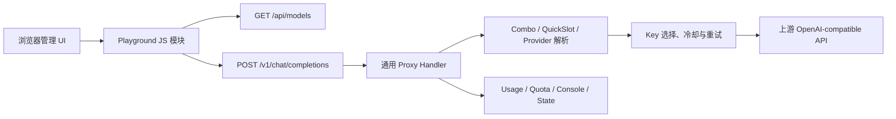
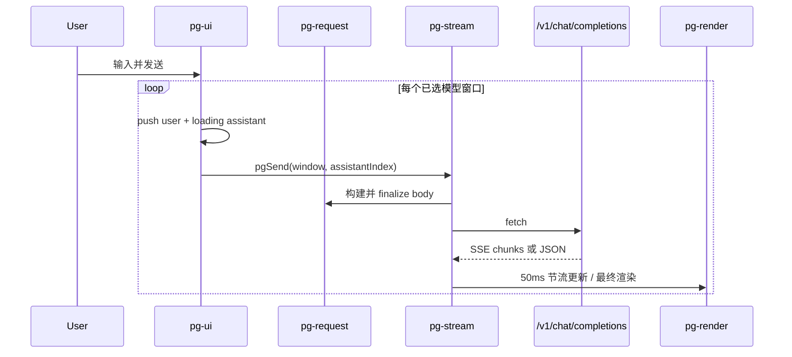
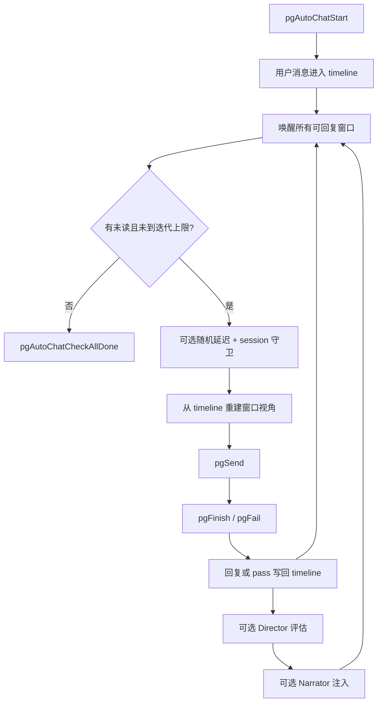

# TinyRouter Playground 架构

> **文档定位：** Playground 前后端实现的 canonical 架构事实基线。后续设计、排障和代码评审应先读取本文，再按“源码锚点”核对本次变更涉及的局部代码。
>
> **最后核对：** 2026-07-15，仓库工作区（`main`）。本次新增/核对：模型 note 现支持 hover 显示于全 app 模型选择下拉项（`web/static/app.js` 通用 `data-model-note` 委托 `showModelNotePopover`；`pg-modal.js` 模型选择 modal 项附 `data-model-note`+`has-model-note` 标记；`quickslots.js` 顶部 quickslot 下拉与 `combos.js`/`quickslots.js` 导入模态/编辑列表项附 note；`internal/api/models.go` 的 `modelInfo` 新增 `note` 字段，`pgLoadModels()` 即可读到）。上次核对基线仍为：(1) Reasoning 气泡 `.pg-thinking-body` 增高至 `60vh` 并在流式更新时自动滚至底部；(2) Mermaid 渲染串行化 + 唯一 ID + SVG 缓存，修复多图随机只显一图与完成后变空；(3) 删除 `web/static/style.css` 中整套历史遗留 `.pg-` 段，playground 样式来源单一化为 `playground.css`。基线同 `2026-07-14 提交 69df6de`（v1.6.5）：Recent Requests 面板改为仅显示 Playground 发起请求、可点击查看详情；发送按钮在选模型后即时启用。本文描述的是当时源码的实际行为，不把规划或历史设计稿当作现状。

> **2026-07-14 更新：** Playground 请求详情弹窗改为复用 Usage 页面的 `info-modal-overlay` + `renderInfoSection` 基础设施，具备 pretty/raw 切换和 copy 按钮；服务端 `recorder.go`、`forward.go`、`stream.go` 不再依赖 debug mode 门控，始终捕获请求/响应 payload 与 headers，使弹窗在 debug mode 关闭时也能显示完整信息。`app.js` 的 `topOpenModal()`/`dismissTopModal()` 扩展支持 `pg-modal-overlay`，修复 Playground 弹窗 ESC 穿透触发关闭应用的问题。图片发送改为在 `pgUserSend` 阶段将用户消息构建为多模态 content parts 并清空 `imageUrls`/`imageEnabled`，使发送后输入区缩略图消失、图片随用户气泡渲染。Reasoning 气泡改为 markdown 渲染、移除滚动条约束、随内容自然增长，reasoning 结束后自动折叠。Recent Requests 面板新增 SSE 订阅（`/api/usage/events`），请求发送即实时出现、完成后实时更新，轮询降为 10 秒后备。新增 Custom Endpoint 面板（普通模式），启用后直接 fetch 自定义 URL + Key，绕过 TinyRouter 代理栈。Image Preview 弹窗新增 Copy/Save/Reset 按钮、鼠标滚轮缩放（以图片中心为轴心，最小不低于 auto-fit）、鼠标拖拽平移、图片 auto-fit 容器；聊天气泡图片缩略图可点击打开预览；新增 `POST /api/save-image` 后端端点保存图片到 `imgs/` 目录。

> **2026-07-14 更新（Image 模式）：** Playground 新增第三种模式 Image（图片生成），模式系统从布尔 `autoChat.enabled` 改为三态 `pgState.mode`（'normal'|'autochat'|'image'）。新增 `POST /v1/images/generations` 代理端点（透明转发，复用 `handleProxy`）和 `POST /v1/tasks/{taskId}` 端点（ModelScope 异步轮询）。模型选择器支持 `kindFilter` 按文本/图片过滤。`ModelDef` 新增 `Kind` 和 `ImgProtocol` 字段。图片参数面板按协议（GPT/xAI/ModelScope）分支渲染。`pgSendImage` 处理非流式 images API 响应；`pgPollModelScopeTask` 处理 ModelScope 异步任务轮询。

> **2026-07-14 更新（Image 预览与复制）：** Image Preview 弹窗（`pg-modal.js` 的 `pgShowImageModal`/`pgInitImageZoom`）修正 auto-fit：移除 `` 上相互冲突的 `max-width/max-height/object-fit` 约束，改由 `transform: scale(fitScale)` 单独负责缩放——大图缩到正好填满、小图（如 256px）按原 `c58c08a` 意图放大铺满窗口。新增底部 footer 显示分辨率（`naturalWidth × naturalHeight`）、大小（`pgFormatBytes`，经同源 `/api/image-proxy` 取 Blob 的 `size`）、格式（Blob `type` 或 data: 的 mime）。复制按钮改为经同源 `/api/image-proxy` 拉取图片字节后用 `ClipboardItem` 写入剪贴板（解决 ModelScope 图片 CDN 无 CORS 头导致直接 `fetch(url)` 失败、回退成复制网址字符串的问题）。渲染层（`pg-render.js` 的 `pgMsgInnerHTML`）在纯图片结果下去掉空文本气泡（原先 `pgTextContent` 返回空串仍渲染了一个空 `pg-bubble`）。后端 `internal/api/image.go` 新增 `GET /api/image-proxy?url=...` 端点（服务端代拉、透传 Content-Type/Content-Length），供前端同源读取图片字节。

> **2026-07-14 更新（Image 模式编辑/缩略图/等待计数）：** 图片编辑类模型（如 ModelScope `FireRed-Image-Edit`）现可正常工作：图片模式侧栏新增"图片"面板（`pgRenderImageBlock`/`imgBlock`，原先仅在文本模式渲染），用于粘贴/管理输入图 URL；`pgBuildImageBody`（`pg-request.js`）在开启并填了输入图时按 ModelScope `/v1/images/generations` 规范写入 `image_url`（单图=字符串、多图=数组）。发送前输入栏左侧显示待发送缩略图（`pgRenderInputThumbs`）；发送后该缩略图移到提示词气泡上方（`pg-render.js` 从消息的 `msg.images` 渲染，发送时把输入图捕获到该条 user 消息并清空 `config.imageUrls`/`imageEnabled`，输入栏与侧栏随之清空），避免与气泡上方重复。等待状态（`pgMsgInnerHTML` 的 loading 分支）新增秒级计数器：全局计时器 `pgTickWaiting` 每秒按 `msg.startedAt` 重绘 loading 气泡，只要 POST 已接受、未返回错误就持续累加，所有 loading 消息结束后自动停表。

> **2026-07-15 更新（Reasoning 气泡滚动 + Mermaid 渲染稳定化）：** 修复两个前端渲染问题。(1) Reasoning 气泡 `.pg-thinking-body`：原先因 `web/static/style.css` 遗留的 `max-height:240px; overflow-y:auto` 覆盖生效（`playground.css` 未显式设置这两项），气泡超过 240px 即出现内滚动条；流式刷新每次 `pgRenderBubble` 重建 DOM 使内 `scrollTop` 归零、`pgScrollBottom` 仅滚外层 `#pg-messages-*`，导致滚动条总跳回顶部。`playground.css` 现显式设置 `max-height:60vh; overflow-y:auto`（增大高度）并改 `white-space:normal`；新增 `pgScrollBottomReasoning` 在流式更新（与 `pgFinish`）时将该气泡的 `.pg-thinking-body` 滚至底部（折叠态跳过）。(2) Mermaid 渲染不稳（完成后变空、切换 raw/parsed 时多图随机只显一图）：根因为多个 `mermaid.run` 并发 + 占位符无稳定 ID 导致 ID 冲突。`pgRenderMermaid` 现为每个占位符分配唯一 `id="pg-mmd-N"`、经 `pgMermaidQueue` 串行执行 `mermaid.run`、并以源码为 key 缓存渲染后 SVG（`PG_MERMAID_MAP`），完成态命中缓存直接克隆 SVG（避免重渲染抖动）；流式中不缓存（避免缓存半截图），仅完成态缓存供后续 raw/parsed 切换复用。`pgPostProcessCode` 与 `pgRenderBubble` 新增 `isStreaming` 入参与传递。(3) 同步清算历史债：此前从 `web/static/style.css` 中分离 `.pg-*` 段到 `playground.css` 时未删除原段，导致两个 CSS 仍在 `index.html` 同时被加载、`.pg-thinking-body` 等多处出现 style.css 与 playground.css 规则并存（style.css 后被 playground.css 仅部分覆盖）。本次把 `web/static/style.css` 中整个 Playground 段（原 529–762 行，约 234 行，含 `.pg-layout`/`.pg-bubble`/`.pg-thinking*`/`.pg-mermaid`/`.pg-side`/`.pg-input*`/`.pg-debug-*` 等全部 `.pg-` 选择器）彻底删除；`index-nopg.html`（不加载 playground.css/不渲染 `.pg-` DOM）和 `index.html`（加载 playground.css）均无依赖残余校验通过。playground 的样式现在单一来源 `playground.css`，style.css 不再含任何 `.pg-` 规则。

## 1. 范围与结论

Playground 是 TinyRouter 管理 UI 中的可选交互式 LLM 客户端，覆盖以下能力：

- 1–4 窗口的普通并行模型对话；
- OpenAI-compatible 流式和非流式聊天；
- Markdown、KaTeX、代码高亮、Mermaid、HTML 预览和来源展示；
- 多 Agent 自动群聊；
- AI 场景/角色设定生成；
- Director/Narrator 剧情推进；
- 请求、响应和原始 SSE 调试视图。

Playground **没有独立的 Go 业务 handler**。后端专属代码只负责资源编译、静态路由和入口选择；模型请求复用 TinyRouter 通用代理栈。



## 2. 事实优先级

出现冲突时按以下优先级判断：

1. 当前源码和测试；
2. 本文；
3. `web/playground/README.md`（仅作为入口）；
4. `handoff.md`、`docs/research/*`、历史提交信息（仅作历史背景）。

本文的关键结论都在第 14 节列出源码锚点。修改相关模块后，应同步更新本文的“最后核对”、接口、状态和风险章节。

## 3. 编译、嵌入与运行时门控

### 3.1 两层开关

Playground 同时受编译期开关和运行时开关控制：

| `playground` build tag | `enablePlayground` | 根页面 | Playground 静态路由 |
|---|---:|---|---|
| 无 | 任意 | `index-nopg.html` | 不注册 |
| 有 | `true` | `index.html` | 注册 |
| 有 | `false` | `index-nopg.html` | 仍注册 |

- 编译期：`web/embed_playground.go` 嵌入 `web/playground/static-pg`，`PlaygroundCompiled()` 返回 `true`。
- 无 tag：`web/embed.go` 只嵌入核心 `web/static`；`web/embed_playground_stub.go` 提供空 `PlaygroundStatic`。
- 运行期：`Config.EnablePlayground` 只影响根路径选择哪个 HTML 入口，默认值为 `true`。
- 旧 YAML 未出现 `enablePlayground` 时，加载逻辑补为 `true`。

因此，`enablePlayground=false` 是 **UI 可见性开关，不是能力或安全开关**。带 tag 的二进制仍能直接访问 Playground 资产，`/v1/chat/completions` 也始终存在。

### 3.2 构建方式

```powershell
# 默认构建：不含 Playground
go build -o tinyrouter.exe .

# 含 Playground
go build -tags playground -o tinyrouter-pg.exe .

# Windows 构建脚本
./build.ps1 -Playground
./build.ps1 -Variant tray -Playground
./build.ps1 -Variant webview -Playground -Strip
```

`build.ps1` 将 `-Playground` 转为 `playground` tag，并和 `tray`、`webview` tag 合并。`debug` 变体明确忽略 Playground。Playground 资产当前约增加 4 MiB，主要来自 vendor 库。

### 3.3 静态路由

`internal/api/router.go` 在 `PlaygroundCompiled()` 为真时挂载：

- `/playground.css`；
- `/vendor/*`；
- 显式白名单中的 `playground.js`、`pg-i18n.js` 和所有 `pg-*.js`。

新增或重命名前端模块时必须同时更新：

1. `web/playground/static-pg/` 中的文件；
2. `internal/api/router.go` 的 `pgJSFiles`；
3. `web/static/index.html` 的加载顺序。

`playground.js` 当前只有兼容说明，不承载实现。

## 4. 后端架构

### 4.1 后端职责边界

Playground 后端相关职责只有三类：

| 职责 | 实现位置 | 说明 |
|---|---|---|
| 资源编译 | `web/embed*.go` | build tag 决定是否嵌入 |
| UI 入口与静态路由 | `internal/api/router.go` | 选择 index、挂载静态文件 |
| 运行时配置 | `internal/config/*`、`internal/api/settings.go` | 保存 `enablePlayground` |

聊天、模型解析、轮转、冷却、重试、用量统计等均属于通用代理能力，不是 Playground 私有实现。

### 4.2 Playground 使用的 HTTP 接口

| 接口 | 用途 | 鉴权 | Body 上限 |
|---|---|---|---:|
| `GET /api/models` | 侧栏模型选择器 | 管理 session；未启用密码时放行 | `/api` 统一 1 MiB（GET 无 body） |
| `POST /v1/chat/completions` | 普通聊天、群聊、摘要、场景生成、导演和旁白 | 无应用层鉴权 | 32 MiB |
| `POST /v1/images/generations` | Image 模式图片生成（GPT/xAI/ModelScope） | 无应用层鉴权 | 32 MiB |
| `POST /v1/tasks/{taskId}` | ModelScope 异步任务轮询 | 无应用层鉴权 | 32 MiB |
| `GET/PATCH /api/settings` | 读取/修改 `enablePlayground` | 管理 session | 1 MiB |
| `POST /api/save-image` | Image Preview 保存图片到 `imgs/` 目录 | 管理 session | 32 MiB |
| `GET /api/image-proxy` | 同源代拉远程图片字节（供 Copy/footer 元数据，规避 CORS） | 管理 session | 32 MiB |

前端源码中的 `pgApiGet('/models')` 经宿主 `apiGet` 自动加 `/api`，实际请求是 `/api/models`。聊天相关代码直接 `fetch('/v1/chat/completions')`。

`/api/models` 返回：

```json
{
  "models": [
    { "id": "provider-prefix/model-id", "provider": "Provider Name", "type": "provider" },
    { "id": "combo-name", "provider": "fallback", "type": "combo" }
  ]
}
```

它聚合启用 Provider 的模型和 Combo；Provider 未配置模型时暴露 `prefix/*`。

### 4.3 通用代理调用链

`POST /v1/chat/completions` 的调用链为：

```text
api.Router
  -> proxy.Handler.ChatCompletions
  -> handleProxy
  -> Combo / QuickSlot / provider-prefix 解析
  -> rotation.Selector.SelectKey
  -> forwardWithRetry
  -> forwardUpstream
  -> streamResponse / non-stream response
```

后端只强制校验 JSON 和非空 `model`。`messages` 不做完整 schema 校验；其他字段原则上透传。发送上游前会：

- 将客户端模型名替换为真实上游模型名；
- 用选中的 Provider Key 重建 `Authorization: Bearer ...`；
- 流式请求设置 `Accept: text/event-stream`；
- 按 Provider 配置可注入 `stream_options.include_usage`；
- 对 Gemini OpenAI-compatible 请求按需补 `thought_signature`；
- 执行 key 轮转、冷却、重试、Combo fallback 和配额逻辑。

所有 Playground 模型请求都会进入通用 Usage、Quota、Console、运行时状态和 debug tracking 链路。

### 4.4 响应契约

流式成功响应：

- `Content-Type: text/event-stream`；
- `Cache-Control: no-cache`；
- `Connection: keep-alive`；
- `X-TinyRouter-Provider`；
- `X-TinyRouter-Key`；
- 按 chunk flush；默认不解析/改写 SSE 内容。

当 `NormalizeStreamChunks` 开启时，代理可将无 error 的 `"choices": null` 规范为 `[]`，这是“原样透传”的已知例外。

非流式响应强制为 JSON，保留上游状态码并附加 Provider/Key 响应头。TinyRouter 本地代理错误统一为：

```json
{"error":{"message":"...","type":"proxy_error"}}
```

### 4.5 鉴权与网络边界

- TinyRouter 监听 `127.0.0.1:<port>`；localhost 是主要安全边界。
- 管理密码只保护 `/api/*` 管理接口。
- Playground 静态文件和 `/v1/*` 不经过 `AuthMiddleware`。
- `/v1/*` 支持 CORS preflight，并暴露 Provider/Key 调试响应头。
- 客户端提供的 Authorization 不会原样送给上游；上游认证始终换为 TinyRouter 选中的 Key。

## 5. 前端模块拓扑

### 5.1 加载顺序

`web/static/index.html` 的顺序是运行时契约：

```text
vendor:
katex -> marked -> marked-katex-extension -> DOMPurify -> highlight.js -> mermaid

modules:
pg-i18n -> pg-core -> pg-state -> pg-markdown -> pg-request -> pg-stream
-> pg-autochat -> pg-setup -> pg-director -> pg-render -> pg-ui -> pg-modal
-> pg-lifecycle
```

全部模块使用浏览器全局函数/变量协作，没有 ES module、bundler、事件总线或响应式框架。

### 5.2 文件职责

| 文件 | 职责 |
|---|---|
| `pg-core.js` | 默认配置、localStorage key、宿主适配、限制和公共常量 |
| `pg-state.js` | 全局/窗口状态、加载保存、四窗初始化、模型目录 |
| `pg-request.js` | body、内容/图片、SSE 行和错误解析 |
| `pg-stream.js` | 流式/非流式请求、chunk 聚合、完成/失败/停止 |
| `pg-markdown.js` | Markdown、KaTeX、DOMPurify、reasoning 拆分 |
| `pg-render.js` | 消息、来源、代码/Mermaid/HTML、debug 渲染 |
| `pg-ui.js` | 输入、消息操作、窗口/侧栏/参数/图片交互 |
| `pg-modal.js` | 调试、图片预览（含 zoom/pan/copy/save/reset）、模型选择等 modal |
| `pg-autochat.js` | 共享时间线、多 Agent 调度、摘要、群聊 modal |
| `pg-setup.js` | 场景向导、ScenarioProfile、导入导出和应用 |
| `pg-director.js` | Director 判断、Narrator 生成和生命周期 |
| `pg-lifecycle.js` | `renderPlayground` / `cleanupPlayground` |
| `pg-i18n.js` | Playground 独立中英文字典 |
| `playground.css` | 全屏布局、消息、侧栏、modal、响应式样式 |

### 5.3 宿主适配契约

`pg-core.js` 读取可选的 `window.PG_HOST`：

```text
apiGet(path) -> Promise<object>
toast(message, type?)
escapeHtml(value)
copyToClipboard(text, label?)
t(key, args?)
```

未注入时回退 TinyRouter 管理 UI 的同名全局函数。此契约只覆盖模型目录和 UI 基础能力；聊天、场景和导演请求仍硬编码为 same-origin `/v1/chat/completions`，所以当前并非完全后端无关的组件。

## 6. 页面生命周期与布局

管理 UI 的 `navigateTo('playground')` 调用 `renderPlayground(container)`：

1. `pgLoad()` 从 localStorage 恢复状态；
2. `pgEnsureWindows()` 初始化到四个窗口；
3. `pgInitMarker()` 初始化 Markdown；
4. 注入 `.pg-layout`、消息 panes、输入栏和侧栏；
5. 立即渲染；
6. 异步获取模型目录后重绘。

离开 Playground 时 `cleanupPlayground()`：

- 停止自动群聊；
- 停止 Recent Requests 左侧面板的轮询（`pgStopReqLeftPolling`）；
- abort 每个窗口的在途 fetch；
- 清除 streaming 标记；
- reset Director/Narrator。

CSS 在 Playground 页面禁用主容器滚动，只允许消息区和侧栏内部滚动；宽度不超过 900px 时切为单列。

### 6.1 模式切换

Playground 侧栏顶部的"窗口设置"面板标题右侧有三个模式按钮：**普通**、**自动对话** 和 **图片**。模式状态由三态字段 `pgState.mode`（`'normal'`|`'autochat'`|`'image'`）驱动，不额外持久化（重载后默认普通模式）。

- **普通模式**（`mode = 'normal'`）：侧栏不显示 Auto Chat、Director 和 Agent Identity 面板；输入栏不显示 auto chat 停止按钮。
- **Auto Chat 模式**（`mode = 'autochat'`）：显示全部面板，行为同原实现。切换到 Auto Chat 时若窗口数 < 2 会 toast 警告并回退。
- **Image 模式**（`mode = 'image'`）：侧栏仅显示模型选择、图片参数面板（按协议分支：GPT 显示 size/quality/background/moderation，xAI 显示 aspect_ratio/resolution/n，ModelScope 显示 size/negative_prompt/steps/guidance/seed）、"图片"面板（粘贴/管理编辑输入图 URL，原先仅在文本模式渲染，现 image 模式也显示，供图生图/图片编辑附加输入图）和 Debug 面板。输入栏文案改为"生成"，发送前左侧显示待发送缩略图、发送后清空（输入图改为显示在提示词气泡上方）。模型选择器仅显示 `kind==='image'` 的模型。发送时 `pgBuildImageBody()` 按协议构建请求体；若开启了图片附加并填了输入图 URL，按 ModelScope `/v1/images/generations` 规范写入 `image_url`（单图=字符串、多图=数组）。随后调用 `pgSendImage()` 走 `/v1/images/generations`。等待响应期间，loading 气泡显示秒级计数器（`pgTickWaiting` 全局计时器每秒按 `msg.startedAt` 重绘 loading 气泡），POST 已接受且未返回错误即持续累加，全部 loading 结束后自动停表。

切换入口为 `pgSetMode(mode)`，接收字符串参数，内部调用 `pgAutoChatToggle`。`pgAutoChatToggle` 在修改状态后同时调用 `pgRenderSidebar()` 和 `pgRenderPanes()`，后者负责布局切换和左侧面板的启停。

### 6.2 Recent Requests 左侧面板

在**普通模式 + 单窗口**（`splitCount === 1`）时，布局自动切换为三列：

```text
grid-template-columns: 260px 1fr 320px
  列1: .pg-req-left    — Recent Requests 面板（固定窄宽，占满全部高度）
  列2: .pg-main         — 聊天窗口（右对齐，max-width 取消，填满列宽）
  列3: .pg-side         — 右侧栏（不变）
```

左侧面板通过 `pgRenderReqLeft(showReqLeft)` 构建，包含标题和可滚动表格。数据来自 `GET /api/usage?limit=50`（经 `pgApiGet` 适配器），每 10 秒轮询一次（`pgReqLeftTimer`）作为后备。同时通过 SSE 订阅 `/api/usage/events`，实时接收 `request-start` 和 `request-done` 事件——请求发送即立即出现 processing 条目，完成后即时更新最终状态。processing 条目的 latency 由 500ms 定时器（`pgReqLeftProcTimer`）实时刷新。

**来源过滤：** 表格只显示 Playground 自己发起的请求。前端在 `pg-stream.js` 的两处 `fetch('/v1/chat/completions')` 都附带 `X-TinyRouter-Source: playground` 请求头；后端 `recordUsage` 把该头写入 `usage.Entry.Source`（始终写入，不依赖 debug mode）。`pgRenderReqLeftContent` 过滤 `source === 'playground'`，其它客户端经 TinyRouter 的请求不会出现在此列表。

表格仅显示 4 列，**不依赖 debug mode**，始终可见：

| 列 | 数据字段 | 显示格式 |
|---|---|---|
| 状态指示 | `status` | 彩色圆点：success=绿、error=红、retry=黄、processing=蓝(脉冲) |
| 时间 | `timestamp` | `toLocaleTimeString()` |
| Latency | `latencyMs` | `(latencyMs/1000).toFixed(1) + 's'`；processing 时实时计算 |
| Tokens | `inputTokens` / `outputTokens` | `in/out`；processing 时显示 `—` |

离开普通模式或切换到多窗口时，`pgStopReqLeftPolling()` 清除定时器并清空面板内容。`cleanupPlayground()` 也会调用此函数。

**点击查看详情：** 表格每一行带 `onclick="pgShowReqDetail(i)"`，`pgShowReqDetail` 复用主 UI 的 `info-modal-overlay`（与 Usage 页面 Recent Requests 详情相同的模态），通过 `renderInfoSection` / `buildInfoField`（`info_common.js`）构建内容，每字段具备 pretty/raw 切换和 copy 按钮、模态头部有 Copy All。展示该条目的全部字段：Request Info（时间/Provider/模型/Key/状态/延迟/首 Token/Tokens/错误/上游/响应状态）、Request Body、Request Headers、Response Headers、Response Body。**不依赖 debug mode**——服务端始终捕获 payload 和 headers。当前条目缓存于模块变量 `pgReqLeftEntries`。

## 7. 状态模型与持久化

### 7.1 核心状态

```text
pgState
├─ splitCount / activeWin
├─ mode ('normal'|'autochat'|'image')
├─ models[]
├─ windows[4]
│  ├─ config / parameterEnabled / messages
│  ├─ streaming / abortCtrl
│  ├─ pendingContent / pendingReasoning / pendingSources
│  ├─ sseEvents / debugRequest / debugResponse
│  └─ replyCount / autoChatPending / lastReadTimelineId / ...
└─ autoChat
   ├─ enabled / iterations / userName / delaySeconds
   ├─ isRunning / abortFlag / session
   ├─ timeline[] / timelineId
   ├─ scenario
   └─ director
```

每个窗口有独立模型、采样参数、system prompt、消息、网络状态和群聊游标。全局状态通过直接引用共享，UI 依靠显式 render/update 调用保持同步。

### 7.2 localStorage

| Key | 内容 | 是否完整恢复 |
|---|---|---|
| `tinyrouter.playground.cfg.v2` | window 0 config | 是 |
| `tinyrouter.playground.params.v2` | window 0 参数开关 | 是 |
| `tinyrouter.playground.msg.v2` | window 0 消息 | 受容量裁剪 |
| `tinyrouter.playground.autochat.v1` | 用户名、迭代、延迟、Director 配置 | 仅配置 |
| `tinyrouter.playground.scenario.v1` | 最近 ScenarioProfile | 是 |

关键语义：

- **只有 window 0 的普通 config、参数和消息持久化。** window 1–3 在首次进入时克隆 window 0 配置，但清空消息和运行态。
- `splitCount`、`activeWin`、timeline、群聊运行状态、回复计数和读游标不持久化。
- 普通保存有 500 ms debounce。
- 消息上限：原始 JSON 1 MiB、最多 100 条、单条 content/reasoning 40k 字符、总计约 120k 字符。
- ScenarioProfile 独立持久化，但应用到各窗口后的 window 1–3 配置本身不会直接持久化；刷新后可从场景 review 再次应用。

## 8. 普通多窗口聊天

### 8.1 请求流程



普通模式把同一用户消息广播到当前分屏中所有已选择模型的窗口；未选择模型的窗口跳过。任一窗口正在生成时，不允许发起新一轮普通广播。

发送按钮可见性：`pgRenderInputBar` 在没有任何窗口选择模型时把发送按钮设为 `disabled`（forbidden 光标），Enter 走 `pgOnInputKey` 不受该属性限制。`pgOnModelChange` 选模型后调用 `pgUpdateInputBar()` 重新渲染输入栏，使按钮即时可用；模型目录加载完成回调也补一次 `pgUpdateInputBar()`。

标准 body 包含：

- `model`、`messages`、`stream`；
- 可选 `temperature`、`top_p`、`max_tokens`；
- 可选 `frequency_penalty`、`presence_penalty`、`seed`；
- 可选 `thinking: {type: "enabled", budget_tokens: ...}`。

`systemPrompt` 在消息中没有 system role 时前插。启用图片时，用户消息在 `pgUserSend` 阶段即被构建为 OpenAI 多模态 content parts（`[{type:"text",...}, {type:"image_url",...}]`），同时清空 `imageUrls` 并关闭 `imageEnabled`，使输入区缩略图消失、图片缩略图随用户消息气泡渲染。`pgFinalizeBodyForSend` 中的 image 注入逻辑仅作为后备（当 `imageEnabled` 仍为 true 且 `imageUrls` 非空时触发）。

“Custom body”会先 `JSON.parse` 用户输入，但后续仍假定 `body.messages` 存在，并继续执行 system/image finalize；它不是任意 JSON 的完全原样透传入口。

### 8.1b Custom Endpoint

侧栏 Custom Body 面板上方有 **Custom Endpoint** 面板（`pg-ui.js` 的 `pgRenderSidebar`），包含开关（`useCustomEndpoint`）、Endpoint URL 输入框（`customEndpoint`）和 API Key 输入框（`customEndpointKey`）。启用后，`pgStream` 和 `pgSendNonStream` 的 fetch 目标从 `/v1/chat/completions` 改为用户填入的 URL，`Authorization: Bearer <key>` 头由用户填入的 Key 生成，不附带 `X-TinyRouter-Source` 头。此功能**仅在普通模式生效**，auto chat / director / narrator / setup 等辅助请求仍走 `/v1/chat/completions`。Custom Endpoint 的请求不经过 TinyRouter 代理栈（key 轮转、重试、combo 解析等），由前端直接 fetch。

### 8.2 流式解析

前端只处理逐行 `data:`：

- `[DONE]` 结束；
- JSON 的 `choices[0].delta.content` 进入内容；
- `reasoning_content`、`reasoning`、`thinking`、`thought` 进入思考内容；
- `sources`、`citations`、`web_search_citation`、`web_search` 进入来源列表；
- `pgMergeChunk` 同时兼容增量 chunk 和累计全文 chunk；
- 50 ms 定时器将 pending 状态刷入消息 DOM。

它不是完整 SSE 实现：不合并多行 data，也不处理 event/id/retry 字段。

### 8.3 渲染与安全

- Markdown 使用 marked；数学公式使用 KaTeX；代码使用 highlight.js。
- Markdown HTML 经 DOMPurify 清洗。
- 来源 URL 只允许 `http:` / `https:`。
- Mermaid 以 `securityLevel: strict` 初始化。
- HTML/SVG 预览使用 sandboxed iframe，不允许脚本执行。
- Provider/Key 响应头、实际请求、原始 SSE/响应进入 debug 视图。
- Reasoning 气泡使用 `pgRenderMarkdown` 渲染（与 content 相同的 Markdown 管线），无 `max-height`/`overflow-y` 约束，随内容自然增长；reasoning 结束后自动折叠（`collapsed` CSS class），用户可手动展开/折叠。
- 图片预览弹窗（`pgShowImageModal` → `pg-modal-overlay`）支持：鼠标滚轮缩放（以图片中心为轴心，最小不低于 auto-fit 比例）、鼠标拖拽平移、Reset 按钮复位、Copy 按钮（经同源 `/api/image-proxy` 代拉图片字节后 `ClipboardItem` 写入剪贴板，复制的是图片本身而非网址）、Save 按钮（`POST /api/save-image` 保存到 `imgs/` 目录）。弹窗尺寸 90vw × 90vh；auto-fit 由 `transform: scale(fitScale)` 单独负责缩放（大图缩小到正好填满、小图放大铺满窗口）。底部 footer 显示分辨率（`naturalWidth × naturalHeight`）、大小（`pgFormatBytes`，经同源 `/api/image-proxy` 取 Blob 的 `size`）、格式（Blob `type` 或 data: 的 mime）。输入区缩略图和聊天气泡缩略图均可点击打开预览。纯图片结果（无文本）下不再渲染空文本气泡。

## 9. 自动群聊

### 9.1 核心模型

自动群聊要求至少两个窗口。`pgState.autoChat.timeline` 是唯一事实源，每条记录概念结构为：

```text
{ id, sender, senderType, winIdx, content, ts, status }
```

`senderType` 包括 `user`、`agent`、`system`、`narrator`。每个窗口用 `lastReadTimelineId` 表示自己的消费位置。

发送前按窗口重建视角：

- 自己过去的发言映射为 `assistant`；
- 用户和其他 Agent 映射为带 `[sender]:` 前缀的 `user`；
- system 和 narrator 映射为 `system`；
- 未配置角色 system prompt 时使用默认群聊 prompt，并允许精确输出 `<pass/>`。

### 9.2 事件驱动循环



循环由 fetch 完成回调和 `setTimeout` 驱动，没有阻塞式 while：

- 延迟为配置值的 0.5–1.5 倍；被 `@AgentName` 提及时缩为基础延迟的 0.3 倍。
- `session` epoch 在 start/stop 时递增，使旧 timer 回调失效。
- 正常回复增加窗口 `replyCount`，写入 timeline 并唤醒其他窗口。
- 精确 `<pass/>` 写入 pass 记录，但不增加迭代数。
- 用户运行中发言可通过 `@name` 定向唤醒；没有 mention 时广播。
- 单窗口失败最多在 3 秒后重试一次；耗尽后仍推进群聊完成逻辑。

### 9.3 终止与摘要

所有窗口达到迭代上限，或没有 streaming/pending/未读工作时进入终止检查。Director/Narrator 在途时会阻止过早结束；Director 还可获得一次 final-chance 判断。

timeline 较长时可异步滚动摘要：旧记录被压缩为 system summary，并保留最近记录。摘要是 best-effort，失败静默，不阻塞主流程。

stop/finish 会 abort 请求、清 timer 和运行态，但保留 timeline 供当前页面查看，并追加终止原因；刷新或离开页面后 timeline 不恢复。

## 10. 场景生成

### 10.1 三种管线

场景向导至少要求两个已选模型窗口，支持：

| 模式 | 调用阶段 | 定位 |
|---|---:|---|
| M1 | 5 | 方向 → 架构 → 侧写 → 人物卡 → 客户端合成，控制最多 |
| M2 | 2 | 场景和侧写 → 完整人物卡，默认平衡模式 |
| M3 | 1 | 一次生成场景和完整人物卡，速度最快 |

所有阶段都调用 `/v1/chat/completions`，固定 `stream:false`。可显式选择生成模型，否则回退第一个有模型的窗口。请求有 AbortController 和阶段超时，输出通过去围栏、平衡括号等方式宽容提取 JSON。

### 10.2 ScenarioProfile

持久化/导入导出的事实 schema：

```text
schema: "tr.playground.scenario"
version: 1
createdAt
seedInput
scenario
  ├─ coreSeed / world / tone / openingSituation / relationships
characters[]
agents[]
  ├─ agentName / systemPrompt / params / paramsRationale / paramsOverridden
director
  └─ plotOutline / suggestedEveryNReplies
```

客户端将人物 `personaAxes` 映射为 temperature、topP、maxTokens、随机 seed 和 thinkingBudget，并将场景与人物卡合成为每个 Agent 的 system prompt。

应用 Profile 时，按“当前有模型的窗口”顺序映射 Agent，确认是否覆盖已有 system prompt，设置参数开关，保存 ScenarioProfile，自动启用群聊，并将 `openingSituation` 预填到输入框。

Profile 支持 JSON 导入/导出，导入校验 schema/version；单个角色支持 regenerate/enrich 后重新合成 Agent 配置。

## 11. Director / Narrator

Director 是群聊的可选 best-effort 子系统：

1. 每收到一次 Agent 完成事件（包含 pass）累加计数；
2. 达到 `everyNReplies` 后，用场景、大纲、最近 20 条 timeline 和旁白历史发起非流式判断；
3. 只有 `decision=advance` 才启动 Narrator；
4. Narrator 根据方向和最近 10 条上下文生成旁白；
5. 旁白以 `senderType=narrator` 写入 timeline，并唤醒所有 Agent。

Director 和 Narrator 模型可以独立配置；空值回退第一个有模型窗口。Director 超时 30 秒，Narrator 超时 60 秒。网络或解析失败通常静默跳过，不影响主对话。

## 12. 已知约束与风险

以下是当前实现事实，不代表都要在同一轮修复：

1. **Lite 入口漂移。** `index-nopg.html` 已落后于 `index.html`，当前还缺少 Download 导航、`download.js`、`info_common.js`、Chart.js 等非 Playground 内容；关闭 Playground 会连带改变其他模块。
2. **多窗口持久化不对称。** 只有 window 0 是普通聊天 reload 后的事实源；window 1–3 是临时态。
3. **运行时开关不是安全边界。** 它只切换入口 HTML，不撤销已编译资源，也不关闭 `/v1/*`。
4. **配置能力与编译能力可能不一致。** Lite 构建中 `enablePlayground` 仍可为 true，Settings API 也不暴露 `PlaygroundCompiled()` 能力位。
5. **显式路由清单易漂移。** 新增 JS 时漏改 `pgJSFiles` 会产生运行时 404，目前无自动完整性测试。
6. **Custom body 有隐式结构要求。** 缺少 `messages` 会在后续发送链触发前端异常。
7. **SSE 支持是 OpenAI 常用子集。** 不支持完整 SSE 多行/命名事件语义。
8. **群聊不恢复。** timeline、在途状态和多窗消息刷新后丢失。
9. **摘要模型固定取 window 0。** window 0 无模型时不会执行滚动摘要，即使其他窗口有模型。
10. **场景生成离页清理不完整。** `cleanupPlayground()` 没有显式 abort `pgSetupState.abortCtrl`；场景生成可能在离页后继续到完成或超时。
11. **辅助模型失败多为静默。** 摘要、Director、Narrator 的失败不阻塞主流程，但可观测性较弱。
12. **静态缓存策略不一致。** 核心静态文件显式 `no-cache`，Playground 专属静态路由未设置同样 header。
13. **`fs.Sub` 失败静默。** 嵌入根路径变更时可能只表现为前端 404。

## 13. 测试与验证现状

已有覆盖：

- `enablePlayground` 默认 true；
- 显式 false 的配置保存/加载；
- 旧配置缺字段时的兼容迁移；
- 通用代理的流式、非流式、重试和响应行为。

当前缺口：

- `PlaygroundCompiled × EnablePlayground` 路由矩阵测试；
- Playground 静态资源及 JS 白名单完整性测试；
- `index.html` / `index-nopg.html` 同步约束测试；
- 前端 JS 单元测试；
- 浏览器集成或 Playground E2E；
- 自动执行 `go test -tags playground ./...` 的 CI。

修改 Playground 时的最低建议验证：

```powershell
go test ./...
go test -tags playground ./...
go build -tags playground -o tinyrouter-pg.exe .
```

涉及前端交互时还应手工或用浏览器验证：普通流式、非流式、多窗、停止/离页、群聊、场景向导和 Director/Narrator。

## 14. 源码锚点

后端与集成：

- `web/embed.go`：无 tag 的核心静态资源与能力位；
- `web/embed_playground.go`：Playground 资产嵌入；
- `web/embed_playground_stub.go`：无 tag 空 FS；
- `internal/api/router.go`：路由、鉴权边界、静态挂载和入口矩阵；
- `internal/api/models.go`：Playground 模型目录（响应 `modelInfo` 含 `kind`/`imgProtocol`/`note` 字段，按 `ModelDef.Kind`/`ImgProtocol`/`Note`；`note` 供前端 `pg-modal.js` 模型选择项 hover 显示）；
- `internal/api/settings.go`：运行时开关 API；
- `internal/config/types.go`、`internal/config/defaults.go`：配置结构和默认值；
- `internal/proxy/forward.go`、`internal/proxy/upstream.go`、`internal/proxy/stream.go`：代理契约；
- `build.ps1`：Windows 构建矩阵。

前端：

- `web/static/index.html`：完整入口和硬依赖加载顺序；
- `web/static/index-nopg.html`：Lite 入口；
- `web/static/app.js`：导航和生命周期接入；
- `web/static/api.js`：`/api` 宿主适配；
- `web/playground/static-pg/pg-core.js`：公共契约；
- `web/playground/static-pg/pg-state.js`：状态与持久化；
- `web/playground/static-pg/pg-request.js`：请求体契约（含 `pgBuildImageBody` 按协议构建 images 请求体，并写入 `image_url`（图生图/图片编辑，单图=字符串、多图=数组））；
- `web/playground/static-pg/pg-stream.js`：网络和流生命周期（含 `pgSendImage` 发送到 `/v1/images/generations`、`pgPollModelScopeTask` ModelScope 异步轮询）；
- `web/playground/static-pg/pg-autochat.js`：群聊事实源和调度；
- `web/playground/static-pg/pg-setup.js`：ScenarioProfile；
- `web/playground/static-pg/pg-director.js`：剧情推进；
- `web/playground/static-pg/pg-markdown.js`、`pg-render.js`：内容安全与渲染（`pg-render.js` 的 `pgMsgInnerHTML` 负责气泡内缩略图（含 image 模式气泡上方编辑输入图、右侧对齐）、空文本气泡剔除、loading 气泡秒级等待计数（`pgTickWaiting`/`pgEnsureWaitingTicker`））；
- `web/playground/static-pg/pg-ui.js`、`pg-modal.js`、`pg-lifecycle.js`：交互和页面生命周期（`pg-ui.js` 含 `pgRenderImageParams`/`pgGetImgProtocol` 图片参数面板与协议分支、`pgRenderImageBlock`/`pgRenderInputThumbs` 图片附加 UI 与输入栏缩略图（image 模式发送前后位移）、发送时将输入图捕获到 `msg.images` 并清空 `config.imageUrls`；`pg-modal.js` 模型选择器支持 `kindFilter` 按 kind 过滤、Image Preview 弹窗 `pgShowImageModal`/`pgInitImageZoom`/`pgCopyImage` 含 auto-fit、footer 分辨率/大小/格式、经同源 `/api/image-proxy` 复制）；
- `web/playground/static-pg/pg-ui.js` 中的 `pgRenderReqLeft`/`pgStartReqLeftPolling`/`pgRenderReqLeftContent`/`pgShowReqDetail`：普通模式左侧 Recent Requests 面板（来源过滤 + 点击详情，复用 `info-modal-overlay`）；
- `web/playground/static-pg/playground.css` 中的 `.pg-mode-toggle`、`.pg-req-left`、`.pg-req-table`：模式切换按钮和左侧面板布局。

## 15. 变更维护清单

| 变更类型 | 必查位置 |
|---|---|
| 新增/删除前端模块 | `static-pg/`、`pgJSFiles`、`index.html`、本文模块表 |
| 修改入口或运行时开关 | 两个 index、`serveUI`、Settings、路由矩阵测试 |
| 修改请求字段 | `pg-request.js`、`pg-stream.js`、proxy 透传/改写规则；改 Custom Endpoint 须同步 `pg-stream.js` 的 `pgStream`/`pgSendNonStream` fetch URL/headers 与 `pg-core.js` 的 `PG_DEFAULT_CFG` |
| 修改群聊 | timeline schema、视角映射、终止守卫、Director hooks |
| 修改场景档案 | schema/version、导入迁移、localStorage、应用映射 |
| 修改持久化 | localStorage key/version、容量限制、多窗口语义 |
| 修改渲染 | DOMPurify、URL 协议、iframe sandbox、Mermaid security；改 reasoning 渲染须同步 `pg-render.js` 的 `pgMsgInnerHTML`/`pgRenderBubble` 与 `playground.css` 的 `.pg-thinking-body` |
| 修改图片功能 | `pg-modal.js` 的 `pgShowImageModal`/`pgInitImageZoom`/`pgCopyImage`、`pg-render.js` 的 `pgMsgInnerHTML`（气泡缩略图 onclick、空文本气泡剔除、loading 秒级计数）、`playground.css` 的 `.pg-img-btn`/`.pg-image-row`；改保存或同源代理须同步 `internal/api/image.go` 的 `saveImage`/`imageProxy` 端点与 `/api/save-image`/`/api/image-proxy` 路由 |
| 修改 Image 模式或图片参数 | `pg-ui.js` 的 `pgRenderImageParams`/`pgGetImgProtocol`、`pg-request.js` 的 `pgBuildImageBody`、`pg-stream.js` 的 `pgSendImage`/`pgPollModelScopeTask`、`pg-core.js` 的 `PG_DEFAULT_CFG` 图片参数、`pg-i18n.js` 图片 i18n key、`proxy/handler.go` 的 `ImagesGenerations`/`PollTask`、`proxy/upstream.go` 的 `X-Modelscope-Async-Mode` header 转发、`api/router.go` 的 `/v1/images/generations`、`/v1/tasks/{taskId}` 和 `/api/image-proxy` 路由、`internal/api/image.go` 的 `imageProxy` 端点 |
| 修改模式切换或左侧面板 | `pgSetMode`、`pgAutoChatToggle`、`pgRenderPanes` 布局类、`pgRenderReqLeft*`、`pgShowReqDetail`、`info-modal-overlay`/`info_common.js`（详情弹窗基础设施）、`.pg-req-left-mode` CSS；改来源过滤须同步 `pg-stream.js` 的 `X-TinyRouter-Source` 头与 `recordUsage` 的 `Entry.Source` 回填；改详情弹窗须同步 `app.js` 的 `topOpenModal`/`dismissTopModal` 对 `pg-modal-overlay` 的 ESC 处理；改 Recent Requests 实时性须同步 SSE 事件处理与 `/api/usage/events` 后端 |
| 发布 Playground 变体 | 无 tag/tag 测试、资源 200、完整首页手测 |

