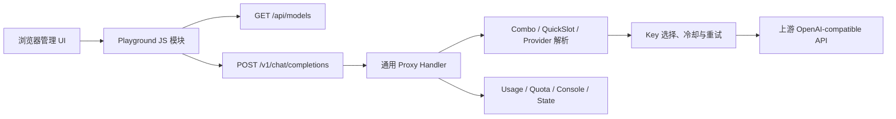
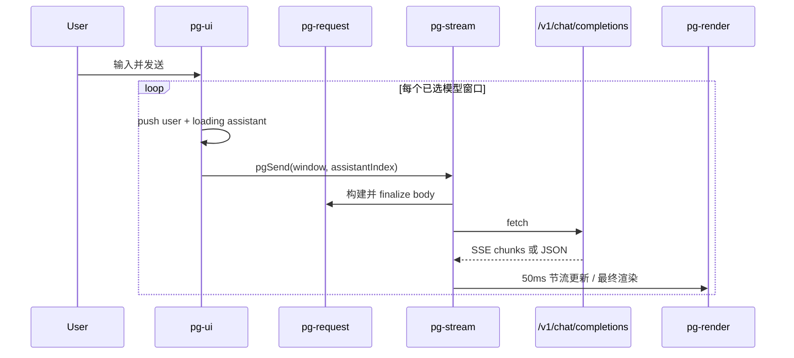
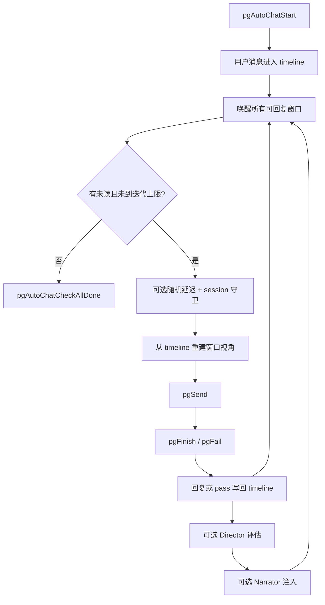

# TinyRouter Playground 架构

> **文档定位：** Playground 前后端实现的 canonical 架构事实基线。后续设计、排障和代码评审应先读取本文，再按“源码锚点”核对本次变更涉及的局部代码。
>
> **最后核对（2026-08-03）：** 文档同步审计——`PROJECT_MAP.md` §18.3 的 `web/playground/static-pg/` 文件清单已与磁盘对齐（补齐 `editor_textreview_step2..4.js`/`editor-logs.js`/`playground.js`，`playground.css` 计入资产）；本文相关章节无内容变更。
> **最后核对：** 2026-07-30，仓库工作区（`main`）。**API 子包拆分（Phase 3 完成）**：`internal/api` 的全部 21 个领域 handler 按领域拆分为独立子包，共享 `Deps` 通过 `internal/api/apibase` 传递。涉及 Playground 的子包：`models.go` → `internal/api/models/`，`anysearch.go` → `internal/api/anysearch/`，`editor.go` → `internal/api/editor/`，`review_presets.go` → `internal/api/review_presets/`，`gallery.go`/`gallery_fs.go`/`gallery_review.go`/`gallery_session.go` → `internal/api/gallery/`，`image.go` → `internal/api/image/`，`settings.go` → `internal/api/settings/`，`providers_models_crud.go` 等 4 文件 → `internal/api/providers/`。本次新增/核对：(1) Editor 页面——双栏文本编辑器，支持原生文件打开/保存、原始/预览视图切换、`window.Diff` 行级 diff 对比、查找替换、行号、Tab 缩进自动缩进，Gallery 导航按钮切换画廊/编辑�> **最后核对（2026-07-31 增补#24 Image 模式协议筛选器修复）：** Playground Image 模式协议筛选器调整——(1) **固化协议选项**：`pgImageProtocols()` 固定返回包含四个选项的列表 `['all', 'gpt', 'xai', 'modelscope']`，防止因当前模型无显式协议标记而动态遗漏 `gpt` 和 `xai`；(2) **筛选兼容空协议为 GPT**：更新 `availModels` 过滤逻辑、`pgOnModelSelectBackfill`、`pgEffectiveProtocol` 和 `pgOnProtocolFilter`，使 `imgProtocol` 为空串/未配置的模型统一视作 `'gpt'` 匹配。涉及文件：`web/playground/static-pg/pg-ui.js`、`docs/playground-architecture.md`、`PROJECT_MAP.md` §24。otocols()（仅 image 模型的 imgProtocol 值，含 All Protocols），选中协议后过滤模型列表并清除不匹配的 model，选中 model 后协议从 imgProtocol 预填。**(3) 有效协议辅助** - 新增 pgEffectiveProtocol(cfg)（UI 可见性用）与 pgImageProtocols()，pgGetImgProtocol 的 model/default 行为在请求构造中保持不变。**(4) GPT 参数** - quality 扩展为 Auto/Low/Medium/High；新增 n 1..5、response_format (url/b64_json)、output_format (png/jpeg/webp)、output_compression 0..100、user 字段，仅在设置时输出对应字段；WisArt 尺寸（auto, 1024x1024, 1200x675, 928x1664, 3000x1000）纳入内置列表与 Edit 弹窗。**(5) xAI/modelscope** 控件与 payload 保持不变。**(6) 粘贴图片流** (FileReader data:image/...;base64 -> JSON image_url) 在所有协议下保持不变。涉及文件：`web/playground/static-pg/pg-core.js`、`pg-ui.js`、`pg-request.js`、`pg-stream.js`、`pg-i18n.js`、`pg-modal.js`、`docs/playground-architecture.md`、`PROJECT_MAP.md` §24。

> **最后核对（2026-07-29 增补#18）：** Gallery AI Review 多节点顺序审核、高并发平滑错开与双端剪贴板支持——(1) **多节点选择与队列引擎**：`gallery-tree.js` 扩展 Header 为三态模式，AI Review 按钮触发 Node Selection 模式（Header 显示 `SelectAll/DeSelect | Start | Cancel`），节点支持点击选择、Shift+点击连续跨区域范围选择；点击 Start 构造顺序队列 `buildReviewQueue` 逐节点提交分析；Tree 节点支持 `☑/☐` 复选选框、`✓`/`⚠` 结果图标与符合数量统计。(2) **双轴方向键导航与过滤防冲刷**：左右方向键（`goReviewPrev`/`goReviewNext`）在当前及已审核节点匹配项间循环流转，边界自动跨节点切换；上下方向键（`goReviewPrevNode`/`goReviewNextNode`）直接跳转节点；`updateCurrentFolderItems` 增加 `reviewState.active` 护航防止 `setActive` 触发全量图片充刷；`deleteItemPrompt` 改呼 `confirmDeleteBtn` 一键批量删除已标记项。(3) **全宽视图模式切换按钮**：T 面板新增 Cancel/Reset 下方的 `100%` 全宽视图切换按钮（`Show All` / `Show Matched`），显示按下后将切换到的目标状态，仅改变 `currentFolderIndices` 缩略图视图，不影响 Tree 状态与计数。(4) **Windows 系统剪贴板 (CF_HDROP) 粘贴双端支持**：重构 `onPaste`（`gallery-io.js`），无条件优先调 `POST /api/gallery/paste-paths`，在 Chrome 标准浏览器与 WebView2 独立窗口中实现文件/文件夹 Ctrl+V 瞬间载入。(5) **高并发 Stagger 错开与请求静默重试**：后端 `runReview` 为 worker 注入 `120ms` 错开启动步长（Stagger Step），平滑剧烈突发请求，解决 WebView2 独立窗口在 20~50 高并发下的 Windows 套接字被拒绝死锁问题；`sendVisionRequest` 增加 45s 超时 Context 与 2 次静默退避重试，彻底消除 `Failed` 假死。涉及文件：`internal/api/gallery/register.go`、`web/playground/static-pg/gallery-state.js`、`gallery-tree.js`、`gallery-review.js`、`gallery-fullscreen.js`、`gallery-io.js`、`web/static/i18n.js`。
> **最后核对（2026-07-28 增补#7）：** Gallery 媒体编辑弹窗 UI 统一与目录选择按钮——将 Gallery 媒体编辑弹窗（`gallery-edit.js`）外观风格与 Settings 密码弹窗保持一致：(1) 重构 `.pg-modal`、`.pg-modal-header`、`.pg-modal-body` 与新增 `.pg-modal-footer`，采用统一定制 radius、modal-bg、glass-border 与 action button gradient/ghost 风格；(2) 源信息（`#ge-source-info`）改为优雅卡片框，解决单选框/复选框文字竖排折行 bug（`white-space: nowrap`）；(3) 选为"保存到目录..."（`#ge-dest-dir-row`）时在路径输入框左侧新增"选择目录..."按钮（`#ge-browse-dir-btn`），点击触发后端 `POST /api/downloads/browse`（`mode: directory`）；(4) 完全受 `[data-theme]` 双 Mode 及 Variant 主题系统控制。涉及文件：`web/playground/static-pg/gallery-edit.js`、`web/playground/static-pg/pg-i18n.js`、`web/playground/static-pg/playground.css`。
> **最后核对（2026-07-28 增补#8）：** Gallery 媒体编辑「Convert all images in the folder / zip」批量转换与输出/压缩包命名修复——**根因**：`gallery-edit.js` 的 `_getSiblingImages` 仅按 `zipAbsPath`/`rootDirPath`/`absPath` 三个字段匹配兄弟项，但 FSAA（Directory Picker 回退 / 拖放）产生的 `kind:'fs'` 条目仅含 `rootDirHandle`、FSAA 拖放 zip 条目仅含 `sessionId` 而无 `zipAbsPath`，三条分组键全部缺失 → 返回 `[]`，「Convert all」计数恒 0、`_startBatch` 直接 return 无法启动。**修复 (1) 兄弟匹配**：`_getSiblingImages` 改为按 `kind` 分组——`backend`→`rootDirPath`（回退 `absPath` 目录）、`fs`→`rootDirHandle` identity 相等、`zip`→`zipAbsPath` 或回退 `sessionId`，与 `gallery-fullscreen.js` `itemsInNode` 口径一致。**修复 (2) 批量输入路径**：新增 `_resolveBatchInput`，对没有 `absPath` 的条目逐条复用 `/edit/extract-zip-entry`（`{zipAbsPath|sessionId, zipPath}`）或 `/edit/upload-temp`（blob + `?name=`）解析为临时磁盘路径再喂给 ffmpeg。**修复 (3) 输出命名**：FSAA/zip 条目解析后的临时输入名（`gallery-edit-upload-XXXX.png`/`gallery-edit-XXXX.png`）此前会经 `OutputDir` 分支的 `filepath.Base(InputPath)` 泄漏进保存的文件名及 zip 内条目名——`StartRequest` 新增可选 `OutputName`（无扩展名 stem），`manager.Start` 在 `OutputDir` 非覆盖分支优先用之 + 由 `buildArgs` 追加 `ext`，不传则 fallback 到 `InputPath` stem（单文件编辑路径行为不变）。**修复 (4) 压缩包命名**：`converted_images.zip` → `<原文件夹/压缩包名>_converted.zip`；`zip-outputs` 新增可选 `zipName`，服务端经 `filepath.Base` + `.zip` 强制后缀（防目录穿越/非 zip 扩展名），客户端 `_batchOriginZipName` 按兄弟分组键推导原源名。涉及文件：`web/playground/static-pg/gallery-edit.js`、`internal/mediaedit/types.go`（`StartRequest.OutputName`）+ `manager.go`（OutputDir+OutputName 分支）、`internal/api/gallery/register.go`（`galleryEditZipOutputs` 的 `zipName`）。新增测试：`internal/mediaedit/manager_test.go`（`TestManager_TranscodeImage_OutputName`/`_Dedup`）。文档：PROJECT_MAP §10.9a、§24（媒体编辑行）、playground-architecture.md §4.2/§16。
> **最后核对（2026-07-28 增补#17）：** Gallery 媒体编辑「图片与视频」弹窗 UI 布局重构与 Trim 状态回归修复——(1) **Image Convert 弹窗布局调整**：第一行源路径与第二行文件名增加溢出横向滚动（`overflow-x: auto`）；第二行移除独立后缀（WEBP等），分辨率与大小右对齐；3/4/5/6 行左侧开关（Set Path / Set Name / Uniform / Compress）统一固定宽度（130px）左对齐，控件垂直居中；第 5 行 `img` 前缀框自适应拉长，`Digits` 选择框改为下拉菜单（2~6）居中且右边缘与上方输入框对齐；第 6 行 `Compress` 开关移至最左侧，Format 下拉框移至 Compress 右侧，Quality 滑条等移至右侧，移除 `(100=best)`；第 7 行 Scale 移至左侧并移除 `%`，尺寸估算移至滑条右侧并移除 `Output:` 前缀，Strip metadata 移至最右侧。(2) **Video Convert 弹窗布局调整**：第 1、2 行同步源路径/文件名横向滚动与元数据右对齐；Set Name 与 Transcode 容器间距统一调为 12px；Transcode 表单改造为 4 行（Codec+Container 双列、Quality+Preset 双列将 Quality Tier 简化为 Quality、Audio Codec+Audio Bitrate 双列将 Bitrate 改为 64k~320k 下拉框、Scale+OutputDims+Strip metadata 单行），实现文字与下拉框左右两侧绝对对齐。(3) **Trim 状态回归修复**：修复可视化剪辑范围确认退出后切回 Video 弹窗时 Trim 开关恢复为关闭状态的 Bug（自动勾选 `ge-vid-trim-enable` 并展开 `ge-vid-trim-body`）。涉及文件：`web/playground/static-pg/gallery-edit.js`、`web/playground/static-pg/playground.css`、`web/playground/static-pg/pg-i18n.js`。
> **最后核对（2026-07-28 增补#16）：** Gallery 媒体编辑「视频」路径三项同类修复——把上一轮[#8/#9]已为 **图片** 路径修好的"输出命名/原位替换"契约抽到单文件公共入口 `_startJob`，让 **视频转码/裁剪/字幕烧录** 单文件也一并受益（不再各自重写 client→server 命名/回写链路）：(1) **#1 原地保存未替换原视频**：`_startJob` 此前未传 `OutputName`，导致保存到目录的文件命名 fallback 到服务端 `filepath.Base(req.InputPath)`（即 `triggerMediaEditor` 产生的临时名 `gallery-edit-upload-XXXXXXXX.mp4`）；同时 overwrite 直接作用于临时输入而非原文件 —— 两段都在此统一修复。`_startJob` 前置守卫已存在（`!canReplace` → `geNoDiskPath` 拒绝 fs/plain/FSAA-dropped-zip 的 overwrite），后端单视频文件（`kind:'backend'` 有真 `absPath`）overwrite 仍由服务端直接写回原文件路径。(2) **#2 保存到目录未用原名**：`_startJob` 现统一推导 `origStem = _stripExt(_editCurrentItem.name)`，在 `outputDir && !overwrite` 分支把 `outputName: origStem` 一并送 `/edit/start`；服务端 `OutputDir + OutputName + buildArgs.ext` 分支据此输出 `<原名>.<新后缀>`，对视频与图片一致。Zero 服务端改动（复用上一轮 `StartRequest.OutputName` 字段）。(3) **#3 视频缩放改为滑块**：`_renderVideoTranscodeForm` 的 `ge-vid-scale` 从 `<input type="number">` 改为与图片表单一致的 `<input type="range" min="10" max="200" value="100">` + `ge-vid-scale-val`（百分比）+ `ge-vid-scale-dims`（按 `_editProbe.width/height` 实时算出的输出 `WxH`）；`_bindModalEvents` 新增 `vidScaleInput.oninput` 同步百分比与 dims 文字（镜像图片版 `scaleInput.oninput`）。服务端契约不变（`scalePercent` 字段由 `_startVideoTranscode` 读取 `ge-vid-scale.value`；服务端 args 构造本就 clip 10..200）。**新增**：`web/playground/static-pg/gallery-edit.js` `_startJob` 统一 `outputName` 推导与传递、视频缩放滑块 markup + binding。无 Go 改动、无新端点、无 i18n 改动（`geScalePercent`/`geOutputDims` 已存在）。文档：PROJECT_MAP §24（媒体编辑行）、本文件 §16。
> **最后核对（2026-07-28 增补#10）：** Gallery 媒体编辑「视频」路径三项同类修复——把上一轮[#8/#9]已为 **图片** 路径修好的"输出命名/原位替换"契约抽到单文件公共入口 `_startJob`，让 **视频转码/裁剪/字幕烧录** 单文件也一并受益（不再各自重写 client→server 命名/回写链路）：(1) **#1 原地保存未替换原视频**：`_startJob` 此前未传 `OutputName`，导致保存到目录的文件命名 fallback 到服务端 `filepath.Base(req.InputPath)`（即 `triggerMediaEditor` 产生的临时名 `gallery-edit-upload-XXXXXXXX.mp4`）；同时 overwrite 直接作用于临时输入而非原文件 —— 两段都在此统一修复。`_startJob` 前置守卫已存在（`!canReplace` → `geNoDiskPath` 拒绝 fs/plain/FSAA-dropped-zip 的 overwrite），后端单视频文件（`kind:'backend'` 有真 `absPath`）overwrite 仍由服务端直接写回原文件路径。(2) **#2 保存到目录未用原名**：`_startJob` 现统一推导 `origStem = _stripExt(_editCurrentItem.name)`，在 `outputDir && !overwrite` 分支把 `outputName: origStem` 一并送 `/edit/start`；服务端 `OutputDir + OutputName + buildArgs.ext` 分支据此输出 `<原名>.<新后缀>`，对视频与图片一致。Zero 服务端改动（复用上一轮 `StartRequest.OutputName` 字段）。(3) **#3 视频缩放改为滑块**：`_renderVideoTranscodeForm` 的 `ge-vid-scale` 从 `<input type="number">` 改为与图片表单一致的 `<input type="range" min="10" max="200" value="100">` + `ge-vid-scale-val`（百分比）+ `ge-vid-scale-dims`（按 `_editProbe.width/height` 实时算出的输出 `WxH`）；`_bindModalEvents` 新增 `vidScaleInput.oninput` 同步百分比与 dims 文字（镜像图片版 `scaleInput.oninput`）。服务端契约不变（`scalePercent` 字段由 `_startVideoTranscode` 读取 `ge-vid-scale.value`；服务端 args 构造本就 clip 10..200）。**新增**：`web/playground/static-pg/gallery-edit.js` `_startJob` 统一 `outputName` 推导与传递、视频缩放滑块 markup + binding。无 Go 改动、无新端点、无 i18n 改动（`geScalePercent`/`geOutputDims` 已存在）。文档：PROJECT_MAP §24（媒体编辑行）、本文件 §16。
> **最后核对（2026-07-28 增补#11）：** Gallery 媒体编辑 UX v2 四项修复——(1) **Replace Original File → Same Path** 重命名：`pg-i18n.js` `geReplaceOriginal` en/zh 改为"Same Path"/"同路径"。实际测试发现 Same Path（非覆盖）行为是同目录新建 `<原名>_converted.<ext>`（`BuildOutputPath` 的 `{base}_{desc}.{ext}` 分支），用户**可接受**（不破坏原文件）。允许 Same Path + Convert all 时开启 Sequential rename：`_refreshBatchUXVisibility` 去掉 renorm 行的 `!isOverwrite` gate；`_startBatch` 在 Same Path（overwrite）分支也送 `outputName`；`manager.go` `Start()` 新增 `OutputName != "" && !Overwrite && OutputDir == ""` 分支用 `relocateOutput(dir(InputPath), OutputName+"_"+desc+ext)` —— 结果如 `img001_converted.webp` 放在原图旁。(2) **视频 Rename 对等**：在共享 dest block（`ge-dest-rename-row` + `ge-dest-rename` 输入框）新增自定义输出文件名输入，仅"另存到目录"时显示（dest radio onchange 同步可见性）；`_startJob` 读取 `ge-dest-rename` 值覆盖 `origStem` 作为 `OutputName`，对图片/视频单文件一致生效。(3) **Trim 片段拖动跨片段限制**：`_startTrimDrag` 的 `onMove` 和 `_moveNearestHandle` 新增 prevEnd/nextStart 约束——`seg.start` 不得小于前一段 `end`、`seg.end` 不得大于后一段 `start`，保证组间不重叠不交叉（同时保留组内 0.1s 最小宽度约束）。(4) **移除 Show in Gallery 按钮**：单图/compress/non-compress/zip-writeback 四处完成结果区均删除 `ge-show-btn`/`ge-show-batch-btn` 标记与 `_addOutputToGallery` 绑定，仅保留 Open Folder 按钮；`_addOutputToGallery` 函数本身保留但不再被任何按钮调用。涉及文件：`web/playground/static-pg/gallery-edit.js`、`web/playground/static-pg/pg-i18n.js`（`geReplaceOriginal` label 改）、`internal/mediaedit/manager.go`（`OutputName` same-path 分支）。无新端点、无 Go 测试变更。文档：PROJECT_MAP §24（媒体编辑行）、本文件 §16。
> **最后核对（2026-07-28 增补#12）：** Gallery 媒体编辑「原地替换」回归修复与跨格式真覆盖——**根因**：`f6997d6`（增补#8-#11）的 `_getDestination` 误删了 `ge-dest` radio 读取，`overwrite` 恒 `false` → "Replace Original File" 实际走 Save-to-dir（且 `openMediaEditor` 预填了默认下载目录到 `ge-dest-dir`），表现就是"原地保存了一个新的"；单图 zip 回写（`_zipReplacePending`）与批量 zip 回写（`_batchDest.overwrite`）分支整体不可达。**修复**：(1) `_getDestination` 恢复读取 radio，`samePath` 时 `overwrite:true, outputDir:null`。(2) `internal/mediaedit/manager.go` `Start()` 覆盖跨格式时 outputPath 改为 `<dir>/<stem><newExt>`（ffmpeg 按输出扩展名选编码器，写 webp 内容进 `.png` 路径会静默产出 PNG），`runJob` 新增 `removeOnSuccess string` 参数，成功后删原文件 → 真正的"原文件被新格式文件取代"；同格式保持原路径 temp+rename 覆盖。(3) `_startBatch` 补 `_startJob` 同款 `canReplace` 守卫。(4) `_refreshBatchUXVisibility` renorm 行恢复 `!samePath` gate（Same Path 与 sequential rename 互斥），dest radio onchange 联动刷新。(5) 批量非压缩完成区 Open Folder 死按钮修复（`_batchJobs=[]` 在 onclick 定义后执行致闭包空转 → 改捕获 `outputPaths[0]`）。(6) `_getSiblingImages` `kind:'plain'` 补 `return []`（原返回 `undefined` 触发 TypeError）。(7) `_onCompleted` 删 zip 分支未用的死 `logHtml` 声明。(8) 删 `manager.go` `OutputName != "" && !Overwrite` 死分支（Same Path = overwrite 不可达）。(9) `pg-i18n.js` `geReplaceOriginal` en 恢复 "Replace Original File"、zh "原地替换原文件"。测试 `TestManager_TranscodeImage_Overwrite` 更新验证跨格式契约（`source.png` → `source.webp` + 原 `.png` 删除）。
> **最后核对（2026-07-28 增补#13）：** Gallery 媒体编辑「图片」弹窗重构——取消 `Replace Original File`（图片路径 `overwrite` 恒 `false`，原 `_startJob` 的 `_zipReplacePending` 单图 zip 回写对图片不再触发；视频路径暂保留 `ge-dest` radio 待后续处理）。图片弹窗改为「开关项常驻、仅控制各自输入是否可输入」布局：头部 `[设置齿轮][image|archive 图标切换] Image Convert(居中) [关闭]`，archive 切换 = 原 `Convert all images in this folder`（on→文件夹/压缩包内全部，off→单图）；源信息改两行（单图 `路径` / `文件名·分辨率·大小·后缀`；archive `文件夹|压缩包路径` / `名称·内含图片数`，由 `_updateImageSourceInfo` 在 probe 回调与 archive 切换时填充，fs 条目大小经 `getBlob()`/`handle.getFile()` best-effort 补全）；下方依次 `Set Path`(开关+目录输入+浏览按钮，复用 `ge-dest-dir`/`ge-browse-dir-btn`)、`Set Name`(开关+文件名输入，语义从仅 zip/文件夹名扩展到对单图也生效)、`Uniform`(原 Sequential rename，开关+prefix+digits)、`Compress to Zip`+`Format`、`Quality`+`Scale`、`Strip Metadata`+`Scale 输出估值`。单图与批量统一走 `_startBatch`（单图 = targets `[_editCurrentItem]` 的 batch-of-1），使 Set Name/Uniform/Compress 对单图同样生效；`_startImageTranscode` 构造 `dest={overwrite:false, outputDir:Set Path 目录, renameStem:Set Name}` 并传 targets。服务端 `mediaedit/manager.go Start()` 新增分支 `!Overwrite && OutputDir=="" && OutputName!=""` → `relocateOutput(dir(InputPath), OutputName+ext)`，使 Set Name/Uniform 在 Set Path 关闭时（保存到源目录）也生效（此前 OutputName 仅在 OutputDir 非空时被采纳）。非压缩批量结果 `_onBatchComplete` 失败时改显首个错误（红色 ✘ + 错误文本），单图失败不再仅显示计数。i18n 新增 `geImageConvert`/`geSetPath`/`geSetName`/`geUniform`/`geArchiveHint`/`geSingleHint`/`geNamePlaceholder`/`geImagesCount`；CSS 新增 `.ge-header-left`/`.ge-icon-toggle`/`.ge-title-center`/`.ge-src-info`/`.ge-src-row` 及禁用态样式。涉及文件：`web/playground/static-pg/gallery-edit.js`、`pg-i18n.js`、`playground.css`、`internal/mediaedit/manager.go`。`download.js playVideo` 的 `kind:'plain'` 视频项仍未带 `absPath`（视频路径待后续处理）。
> **最后核对（2026-07-28 增补#14）：** Gallery 图片弹窗端侧反馈修正（接增补#13）：(1) **源信息 row1 改为「所属压缩包/文件夹的路径」**：原 `_editFilePath`（单图）返回临时抽取/上传路径、`_batchOriginPath`（archive）对 FSAA zip 仅返回压缩包名——合并为 `_editContainerPath(it, includeInner)`：zip → `zipAbsPath`（后端压缩包，磁盘路径）或 `zipFileHandle.name`/`path[0]`（FSAA 压缩包无磁盘路径，浏览器安全限制，以名为兜底），单图且 `includeInner` 时附 `› inner 文件夹`（不含文件名，文件名在 row2）；backend → `rootDirPath` 或 `dir(absPath)`；fs → `rootDirHandle.name`；plain → `dir(path)`。`_updateImageSourceInfo` 单图调 `_editContainerPath(it,true)`、archive 调 `_editContainerPath(it,false)`。即单图不再显示 `C:\...\Temp\gallery-edit-XXX.webp` 临时路径，archive 不再仅显示压缩包名（后端项显示完整磁盘路径，FSAA 项无路径则以名兜底）。(2) **Set Path 默认改为始终 ON 并预填默认下载目录**（原 backend OFF / 其余 ON），`openMediaEditor` 预填 setTimeout 中 `sp.checked = true`，所有输出默认进下载目录。(3) **Uniform 仅 archive 可启用**：`_refreshBatchUXVisibility` 对 `ge-img-uniform` 开关在单图模式 `disabled`（不可开启），archive 模式可开启后由开关再 gate prefix/digits 输入；archive→single 切换时强制 `ge-img-uniform.checked=false`（避免批量改名逻辑误用到单图）；Set Name 始终可用（单图=输出文件名，archive=压缩包名），与 Uniform 不冲突。(4) **浏览按钮防重入**：`ge-browse-dir-btn` 点击即 `disabled`，`/api/browse` 返回（成功/失败）后再经 `_refreshBatchUXVisibility` 按 Set Path 状态恢复，期间重复点击被拒（避免叠加多个原生文件管理器对话框）。涉及文件：`web/playground/static-pg/gallery-edit.js`。
> **最后核对（2026-07-28 增补#15）：** Gallery 图片弹窗源信息 row1 路径拆分（接增补#14，端侧反馈）：单图 row1 = `_editContainerPath(it, true)`（所属压缩包/文件夹的**完整路径**：zip→`zipAbsPath`、backend→`rootDirPath`或`dir(absPath)`、fs→`rootDirHandle.name`、plain→`dir(path)`；zip 子目录条目附 `› inner 文件夹`，文件名在 row2）；archive row1 = `_editContainerParentPath(it)`（容器的**父目录**+尾部分隔符：zip→`dir(zipAbsPath)+sep` 如 `z:\img\`、backend 文件夹→`dir(rootDirPath)+sep`、plain→`dir(dir(path))+sep`），无磁盘路径时回退 `_editContainerPath(it,false)`。即后端来源（粘贴 CF_HDROP / 文件夹选择器）单图显示 `z:\img\Lycoris.zip`、archive 显示 `z:\img\`（row2=压缩包名+数量，row1+row2 还原完整路径）；**FSAA 拖放项无磁盘路径**（浏览器安全：`FileSystemFileHandle`/拖放 `File` 不暴露源盘路径），仅以名为兜底。涉及文件：`web/playground/static-pg/gallery-edit.js`。
> **最后核对（2026-07-28 增补#16）：** 本轮图片+视频弹窗收尾重构——**(1) 图片拖放无路径提示**：`_editContainerPath` 对 `kind:'fs'` 或 `zip` 无 `zipAbsPath` 返回 `''`（不再兜底显示文件名），`_updateImageSourceInfo` 无法解析路径时显示 `geDragNoPathHint`（"拖放导入 — 浏览器不提供磁盘路径"）；`_editContainerParentPath` 返回容器父目录+尾部分隔符（archive row1），无路径时回退 hint。**(2) 视频弹窗重构**：标题改为 `[设置齿轮] Video Convert(居中) [关闭]`（`geVideoConvert`）；移除 `Replace Original File` 单选 → `overwrite` 恒 false；源信息改为双行 `_updateVideoSourceInfo`（row1=磁盘路径或 hint，row2=文件名·分辨率·编码·时长·audio·大小）+ `_editVideoPath`；输出改为 `Set Path`+`Set Name`（`_renderSetPathRow`/`_renderSetNameRow` 共享辅助函数，与图片弹窗共用元素 ID）。**(3) 共享输出行**：`_renderSourceInfoRows`/`_renderSetPathRow`/`_renderSetNameRow` 三函数被图片和视频弹窗复用（prefix 区分 'img'/'vid' source-info 元素 ID）。**(4) 目标流程统一**：`_getDestination` 替换为 `_getDestFromSetPath`（仅读 `ge-img-setpath` toggle，`overwrite:false`）；`_startVideoTranscode`/`_startVideoTrim`/`_startVideoSubtitle` 三个入口均调用 `_getDestFromSetPath`；`_startJob` 简化（移除 overwrite 逻辑、从 Set Name toggle 读 `customRename`、`body.overwrite` 恒 `false`）。**(5) 死代码清理**：移除 `_zipReplacePending`（声明+`_onCompleted` 内 zip-writeback 分支）、`_bindModalEvents` 中 `ge-dest` 单选绑定块。**(6) 下载视频项**：`download.js playVideo` 的 `videoObj` 新增 `absPath: normalizedPath`（`kind:'plain'` 视频项获得磁盘路径，使编辑/删除可操作）。**(7) Set Path 默认**：图片和视频的 `ge-img-setpath` 均默认 ON（`openMediaEditor` 预填 setTimeout），输出进下载目录。涉及文件：`web/playground/static-pg/gallery-edit.js`、`pg-i18n.js`（`geVideoConvert`/`geDragNoPathHint`）、`web/static/download.js`。
> **最后核对（2026-07-29 增补#19）：** Gallery 模块 7 项重构——**(1) 后端拆分**：`internal/api/gallery/register.go`（原 ~1800 行）拆为 7 文件（register.go/session_store.go/fs_handlers.go/zip_handlers.go/review_engine.go/review_handlers.go/edit_handlers.go）。**(2) CleanZipPath 导出**：`internal/gallery/zip.go` 的 `cleanZipPath` 重命名为导出 `CleanZipPath`（带 doc comment），所有调用方更新；`edit_handlers.go` 中原重复的 `cleanZipPathNormalize` 已移除，改调 `gallerylib.CleanZipPath`。**(3) 状态注入**：Handler 新增 `sessions`/`reviews`/`media`/`proxy` 字段，原三个包全局变量（`gallerySessions`/`reviewTasks`/`mediaJobs`）全部移除。**(4) proxyCaller 接口**：`register.go` 定义 `proxyCaller` 接口（`ChatCompletions` 方法），`sendVisionRequest`/`galleryGeneratePrompt` 通过 `h.proxy.ChatCompletions` 调用而非直接引用 `*proxy.Handler`；`httptest.NewRequest` 替换为 `http.NewRequestWithContext`（含 45s 超时 Context）。**(5) 前端拆分**：`gallery-edit.js`（原 2108 行）拆为 3 文件（gallery-edit.js 壳 ~1362 行、gallery-edit-operations.js ~249 行、gallery-edit-batch.js ~502 行），共享全局作用域；加载顺序：gallery-edit.js → gallery-edit-operations.js → gallery-edit-batch.js。**(6) Editor 修复**：`editor.js` `edScrollIntoView` 用 mirror div 测量选择偏移替代原 crude 跳底行为；`T()` 统一替换 i18n 调用；`editor-state.js` 新增 `_findMatches`/`_findIdx` 默认字段。**(7) 可追溯性**：全部 7 个后端 Go 文件与 gallery-edit*.js/gallery-review.js/gallery.js 添加头部注释注明前后端对应关系；`gallery-review.js` 硬编码 UI 字符串迁移至 i18n（`T()` 包装）；`_geT` 统一替换：`_geT('x')` → `T('x')`，`_geT('x', args)` → `pgT('x', args)`（保留 {0} 插值）。涉及文件：`internal/api/gallery/`（7 文件）、`internal/gallery/zip.go`、`web/playground/static-pg/gallery-edit.js`/`gallery-edit-operations.js`/`gallery-edit-batch.js`/`gallery-review.js`/`editor.js`/`editor-state.js`、`web/playground/static-pg/pg-i18n.js`、`web/static/i18n.js`、`internal/api/router.go`、`web/static/index.html`。
> **最后核对（2026-07-29 增补#20）：** Gallery 媒体编辑弹窗四项整改——(1) **i18n 修复**：`pg-i18n.js` 的 `T(key, ar)`（`gallery-state.js`/`editor-state.js` 共享）此前仅委托全局 `t(key)`，而全局 `L` 字典不含任何 `ge*` 键（仅存 `window.PG_I18N`）→ `T('geXxx')` 返回键名字面量（带 "ge" 前缀）、cn 切换无效。重写 `T()` 先查 `PG_I18N[documentElement data-lang]`（回退 `en`）再回退全局 `t()`；`ge*` 键从 `PG_I18N` 解析、`pg*`/`tr*`/全局键仍走 `t()`，`ar` 可选兼容无参 `T(key)`。新增 `geConsole`（en='Console'/cn='控制台'）。清理 `gallery-edit.js` 三处死 `||` 回退（`geTranscodeTab`/`geTrimTab`/`geSubtitleTab`）与 footer `t('cancel')` 回退，统一改 `T('geCancel')`/`T('geStart')`。(2) **tooltip 主题化**：`ge-browse-dir-btn`、图片/视频 `ge-settings-btn`、`ge-archive-toggle` 由原生 `title=` 改 `data-tooltip=`（齿轮原 `title`+`data-tooltip` 双弹→仅 `data-tooltip`）；动态 `archTog.title=` 改 `setAttribute('data-tooltip',…)`（随 archive 状态切 `geArchiveHint`/`geSingleHint`），统一走 `app.js` `TooltipSystem` 玻璃风 `.tip` 浮层。(3) **VideoConvert 源信息**：`_editVideoPath(it)` 对 `kind:'plain'`/`backend` 返回目录（`replace(/[\\/][^\\/]*$/,'')` 剥离文件名，对齐图片侧 `_editContainerPath`）、`zip` 返回 `zipAbsPath`、`fs` 返回 ''；`download.js` `playVideo` 的 `name` 改用 `normalizedPath` 末段文件名（`task.title || 文件名 || task.id`）而非下载源 URL → row1=目录、row2=文件名+元数据（不再出现源网址）。(4) **右侧控制台面板**（转换时显示 ffmpeg 实际指令与实时输出）：后端 `internal/mediaedit/` `Job` 新增 `Command string`（ffmpeg 完整命令行）+ `logBuf *tailBuffer`（运行期实时缓冲引用，不序列化），`Snapshot()` 运行中优先 `logBuf.Read()`、结束回退 `LogTail`；`executor.go` `tailBuffer` 加 `sync.Mutex`（`Append`/`Read` 自同步）、提取包级 `ffmpegCommonFlags`、新增导出 `FfmpegCommandString()`、移除 `RunFfmpeg` 内局部 `mu`；`manager.go` `runJob` 调 `RunFfmpeg` 前置 `job.Command`/`job.logBuf`、结束后 `job.LogTail=stderrTail.Read()`+`logBuf=nil`；`edit_handlers.go` `galleryEditStatus` 响应新增 `logTail`/`command`（经 `Get→Snapshot` 取运行期实时值）。前端 `gallery-edit.js` 新增 `_geEnsureConsole()`（向 `#pg-modal-overlay` 追加并排隐藏的 `#ge-console-panel`，`openMediaEditor`/`_exitTrimMode` 的 `pgShowModal` 后调用）、`_geConsoleBlock(jobId,label)`（单/批量共用，按 jobId 在 `#ge-console-log` 内建块）；`_showProgressSection` 显示并清空控制台、`_hideProgressSection` 隐藏、`_updateProgress` 写 `command`+`logTail`、`_onCompleted`/`_onError` 移除内嵌 `<details>` logTail 块（控制台已显完整日志，完成后保持可见，仅 `_onCancelled` 隐藏）；`gallery-edit-batch.js` `_pollBatchJob` running 分支按 job 独立 block 写指令+日志；`playground.css` 新增 `.ge-console-panel`/`.ge-console-block*` 样式（两 520px 面板并排，窄屏 `max-width:46vw` 收缩）。涉及文件：`web/playground/static-pg/pg-i18n.js`、`gallery-edit.js`、`gallery-edit-batch.js`、`playground.css`、`web/static/download.js`、`internal/mediaedit/{types,executor,manager}.go`、`internal/api/gallery/edit_handlers.go`。
> **最后核对（2026-07-29 增补#21）：** Gallery 媒体编辑弹窗——控制台面板高度对齐 + 任务后台持续 + 重开恢复锁——(1) **控制台面板高度对齐**：右侧 `#ge-console-panel` 此前自然高度（log 块 `max-height:220px`）短于左侧 `.pg-modal`，视觉错位。新增 `_geSyncConsoleHeight()`（`ResizeObserver` `_geWatchConsoleHeight()` 观察左侧 `.pg-modal:not(.ge-console-panel)`，其尺寸变化即把 `#ge-console-panel.style.height` 设为左面板实测高度），并在 `_showProgressSection`（`requestAnimationFrame`）与 `_geResumeActive` 调用；`playground.css` 新增 `.ge-console-log{display:flex;flex-direction:column;overflow-y:auto}` 与 `.ge-console-block-single`（`flex:1` 单 job 块填满、其 `.ge-console-block-log` `max-height:none`），`_geEnsureConsole` 给 `<pre id="ge-console-log">` 加 `ge-console-log` 类、`_updateProgress` 给单 job 块加 `ge-console-block-single` 类——单 job 日志填满等高右面板，批量多块保持各自 `max-height:220px` + 容器滚动。(2) **任务后台持续 + 重开恢复锁**：后端 ffmpeg job 本就是 goroutine（关闭弹窗不取消），但前端 `cleanupMediaEditor`（离开 Gallery 页触发）会 `_stopPolling(); _editJobId=null;` 且 `pgCloseModal` 后重开 `openMediaEditor` 重建弹窗 → 丢失在途任务。新增 `_geActiveJob`（`single:{jobId,item,mediaType,probe}` / `batch:{mediaType,item,probe}`，per-job 状态在 `_batchJobs`）：`_startJob` 收到 jobId 即设、`_startBatch` 开头设；`_onCompleted`/`_onError`/`_onCancelled`/`_onBatchComplete` 清空（锁在任一终态释放）。`openMediaEditor` 改 `async`：若 `_geActiveJob` 在，先校验在途（single→`fetch /edit/status` 判 `running`；batch→`_batchDone<_batchTotal`），在途则 `_geResumeActive()` 重新 `overlay.classList.add('show')`（复用未销毁的弹窗 DOM + 控制台块）+ 恢复轮询（single `_startPolling`；batch 重启非终态 job 的 `_pollBatchJob`）并**忽略新点击的项**（锁）；终态则清空 `_geActiveJob` 回退正常加载新项。`cleanupMediaEditor` 改为 `_stopPolling()`+`_geBatchPollingEnabled=false`+断开 RO，但**保留 `_geActiveJob`**（切页不丢任务）。批量轮询加 `j.polling` 防重入守卫 + `_geBatchPollingEnabled` 闸（页离开 false 停链、`_geResumeActive` 重开重启）；`_cancelJob` 批量分支取消所有未完成 job（`POST /edit/cancel/{jobId}`）+ 清空 `_geActiveJob`/`_batchJobs`（释放锁）。效果：开始转换后关闭弹窗/切页，任务后台继续；回 Gallery 重开 edit 仍显示在途任务（切到新图/视频不更新数据），任务完成或用户 cancel 并关闭后才接受新内容。涉及文件：`web/playground/static-pg/gallery-edit.js`、`gallery-edit-operations.js`、`gallery-edit-batch.js`、`playground.css`。

> **最后核对（2026-07-26 增补#6）：** Gallery 媒体编辑器（ffmpeg 子进程）——新增 `internal/mediaedit/` leaf 包（types/binary/probe/args/executor/manager），通过 `internal/api/gallery/register.go` 的 6 个 edit handler（`/api/gallery/edit/*`）提供图片转码、视频转码/裁剪/字幕烧录能力。`gallery-edit.js` 前端模块加载于 `gallery-fullscreen.js` 之后、`gallery.js` 之前。复用 `DownloadConfig.FfmpegPath` 配置字段，经 `FFMPEG_PATH`/`FFPROBE_PATH` env fallback 解析二进制。文档：PROJECT_MAP §10.9a、playground-architecture.md §16。

> **最后核对（2026-07-26 增补#2）：** P1-P5 Editor/Clean-mode refactor：**(1)** Top-level nav simplified to 2-way Gallery↔Editor（persisted via `sessionStorage.trGalView`）；AI Text Review wizard is now Editor's **Clean** mode（3rd toolbar button alongside Edit/Diff）— `gotoGalleryToggle` 2-way，`navigateTo` `case 'textreview'` removed。**(2)** Editor state（mode + panes）persisted to `sessionStorage.trEditor`；`edSaveState()`/`edLoadState()` added in `editor-state.js`。**(3)** Step1 large-text performance：chunked preview（2000 lines/65536 chars first chunk）+ Load-more button + paste interception + Abandon button；layout reworked（centered title row + Next/Abandon right，flex body fills height）。**(4)** Step2 layout reworked（Back/centered Split/Next header，single-row controls1，4 evenly-distributed buttons in controls2，flex preview）；auto-detect runs on fresh entry（no chapters）。**(5)** Step3 Node Pool Settings modal（pg-modal with add-node form + provider/model dropdowns from `/api/models` + delete per node）+ System Prompt default-collapsed（`trState.promptCollapsed` persisted）。**(6)** Clean mode wizard constrained to left 50% pane（`.ed-review-wrap` horizontal flex + spacer）。详情见 Phases P1-P5。

> **最后核对（2026-07-26 增补#3）：** 导航栏与 Monitor 页面重构——**(1)** 移除 Console 独立页面与导航按钮，内容并入 Monitor（原 Usage）页右栏；(2) 导航按钮重排：Row1=Monitor(原Usage)/Settings/Playground，Row2=Gallery/Download；(3) 快捷键重映射：F1→Monitor, F2→Settings, F3→Playground, F4→Gallery, F5→Download，F6 移除；(4) `goto-console` shortcut 预设移除；`renderConsole` 替换为 `buildConsoleInto(container)`；(5) 移除 6H Request Trend 图表及全部趋势相关代码（`renderTrendChart`/`initTrendChart`/`updateTrendChart`/`buildTrendChartSVG`/`buildTrendData`/`attachTrendHover` 等）。涉及文件：`web/static/app.js`、`shortcuts.js`、`monitor.js`、`console.js`、`i18n.js`、`theme.js`、`style.css`、`index.html`、`index-nopg.html`。`internal/proxy/`、`internal/usage/` 无变化（用量数据为共享环形缓冲，趋势完全由前端派生）。


> **2026-07-26 更新（Gallery 批量导入修复）：** 修复"一次导入大量 zip 时前 N 个包无缩略图、仅末尾约 20-30 个正常"的 bug。根因：前端 `processCollectedEntries` 用 `Promise.all` 同时上传全部 zip，后端 `gallerySessionStore` LRU 容量仅 32，第 33 个 `put` 起驱逐最早会话，前 N-32 个包会话在缩略图拉取前已被驱逐 → 404。本次修复（`internal/api/gallery/register.go` + `web/playground/static-pg/gallery-io.js`/`gallery-tree.js`）：(1) `galleryMaxSessions` 32→128；(2) 新增 `DELETE /api/gallery/zip/{sessionId}`（`galleryDeleteZipSession`，整会话删除，204 幂等）与 `POST /api/gallery/zip/{sessionId}/touch`（`galleryTouchSession`，刷新 LRU 位置），前端 `setActive` fire-and-forget 调 touch、`clearActiveSideTree`/`removeItem`/`removeItemsByFilter` 经 `releaseZipSessions` 调 DELETE；(3) 前端 `getZipEntryBlob` 在 404 时经 `rehydrateZipSession` 按包源（`zipAbsPath`/`zipFileHandle`/`zipFile`）重建会话并迁移同包条目后重试一次（驱逐不再致命）；(4) `processCollectedEntries` 改用 `runWithConcurrency`（6 并发）取代无界 `Promise.all`，避免上传 herd；(5) 移除 `addZipBlob` 对全局 `galleryState.zipSessionId`/`zipEntriesCache` 的并发踩踏，改由 `setActive` 跟踪当前查看包的会话（AI Review 读全局即得正确包）；(6) 删除已死的 `zipEntriesCache` 状态字段。测试：`internal/api/gallery/register_test.go` 覆盖 LRU 驱逐契约、`touch`、`remove`、新增 HTTP 路由及 chi 区分会话删除 vs 条目删除。

> **最后核对（2026-07-26 增补#4）：** Editor Clean 模式容器与布局重构——根据 UI/UX 规则，将 Editor Clean 模式下 Step1~Step4 容器全量改造为无缝直角全高适应布局：(1) `.ed-review-area` 取消 50% 宽度限制改为 100% 自适应，隐藏 `.ed-review-spacer`；(2) 取消 `.tr-shell` 1100px 居中限制及 16px 20px 40px 内外边距；(3) 容器全量直角化（`border-radius: 0`），取消容器及卡片间 gap/margin，改用 1px 细线分隔；(4) Step1~Step4 完整拉伸充满父容器 height/width 100%，自适应屏幕变化；(5) Step1/Step2 布局及 i18n 重排：Open File & Load More 移至 Step1 左上角，清空文本框提示背景；Step1 标题行采用 Flex 3 列水平垂直居中布局，文本框消除四周多余留白贴满容器；Step2 Header 改为左侧 [上一步]、中间 “切分” 标题居中、右侧 [下一步] 按钮；`[✓ 保留序章]` 选框精准移动至下方「预览」与章节数量徽章右侧；切入 Step2 时自动触发 Auto Detect 并在后台直接调 `trStep2DoSplit()` 完成切分，模式与标题模板面板默认彻底隐藏，仅用户主动点击 [重新切分] 时展开；(6) 修复 `trAbandon` / `trLoadMore` / `trSettings` 等 i18n 键中英文词典缺失问题。涉及文件：`web/playground/static-pg/playground.css`、`editor_textreview.js`、`editor_textreview_step1.js`、`editor_textreview_step2.js`、`web/static/i18n.js`、`pg-i18n.js`。


> **最后核对（2026-07-26 增补#5）：** Step3 批处理参数与 UI 紧凑化——**(1)** 新增 `TextReviewNode` 字段 `IntervalSec`（节点级请求最小间隔秒数，0=不限）与 `BatchChars`（单次请求合并章节的累积字数上限，0=不合并/单章；`dequeueBatch` 算法：首章无条件取后按字数累积至 ≤BatchChars 即停）；后端 scheduler `dispatch` 重构为 `acquireAndClaim`（门控 IntervalSec 按 `lastRequest` 跳过未到期节点）+ `runBatch`（单章批次走原单章路径，多章批次经 `BatchCleaner.CleanBatch` 以 `CHAPTER_SEP` + `===CHAPTER_ID:K===` 头合并发送、流式按分隔符增量拆回各章；<10字质量门控仅多章批次）；新增 `CreateSessionRequest.RangeStart/RangeEnd` 限定清理范围（0/0=全量）。`cleaner.go` 新增 `BatchCleaner` 接口 + `proxy_call.go` `CleanBatch` 实现（含跨 chunk 拆分容错）。测试：`dequeue_batch_test`(5)、`batch_splitter_test`(增量+半分隔符)、`batch_run_test`。**(2)** Step3 UI：Settings modal 加 `intervalSec`/`batchChars` 输入；运行控制行加篇章范围输入（1-based，`all`=全量）；StartClean 后 NodePool+SystemPrompt 区自动隐藏（running 时 `display:none`），pause/stop/idle/done 恢复。**(3)** 卡片紧凑化：每章单行（`title | progress | status badge | reprocess btn`），无内嵌文本框；选中卡片→右侧 `#ed-review-content` 显示该章 content/cleaned；`trS3OnChunk` 选中时实时镜像流式到右侧内容区。前端涉及：`editor_textreview_step3.js`、`editor.js`（`.ed-review-spacer`→`.ed-review-content`）、`editor_textreview_state.js`（`rangeStart`/`rangeEnd` 字段）、`pg-i18n.js`（新键）、`playground.css`。
> **2026-07-26 更新（AI 文本审核 / Text Review）：**
> - **4 步向导页面（→ Editor Clean mode）：** 原为独立的第 3 类分页 AI Text Review（F6 3-way toggle），现已整合为 Editor 的 **Clean 模式**（Editor 工具栏第 3 按钮 Edit/Diff/Clean）。`web/playground/static-pg/editor_textreview.js`（入口 `renderTextReview`/`cleanupTextReview`）+ `editor_textreview_step1..4.js`（导入/切分/AI 清理/审校四步）+ `editor_textreview_state.js`（会话状态 + 切页快照/重订阅）+ `editor_textreview_split.js`/`editor_textreview_diff.js`（章节切分与 diff 算法，移植自 novelhelper `m1-import`）。`web/static/app.js` 导航简化为 2-way Gallery↔Editor，`gotoGalleryToggle` 降为 2-way + `sessionStorage.trGalView` 持久化。
> - **后端会话引擎：** `internal/textreview`（`session.go`/`scheduler.go`/`cleaner.go`/`proxy_call.go`/`streaming_writer.go`/`events.go`）+ 3 个测试（`dequeue_batch_test`/`batch_splitter_test`/`batch_run_test`）—— 调度器 `acquireAndClaim` 按节点 IntervalSec/Active<Target/Enabled 选节点后从范围内 pending 章 `dequeueBatch` 取批次（首章无条件取，按 BatchChars 累积）；`runBatch` 单章走原单章 Clean，多章经 `BatchCleaner.CleanBatch` 以 `CHAPTER_SEP`+`===CHAPTER_ID:K===` 头合并发送、流式按分隔符增量拆回各章；<10字质量门控仅多章批次；支持 pause/resume/stop 与单章 reprocess；502-exhausted 时按批次 ramp-down 节点并发（`NodePersister` 落盘到 `config.yaml`）；会话仅驻内存（无 `state.yaml`）。
> - **HTTP 端点：** `internal/api/textreview`（`register.go`/`sessions.go`/`nodepersister.go`）注册 `/api/text-review/*`（review-nodes / split-patterns / prompt-default CRUD + sessions / sessions/{id}/events SSE / pause / resume / stop / chapters/{idx}/reprocess），独立于 `/api` 组以绕过 1MB 上限（32 MiB），仍经 `AuthMiddleware`。
> - **配置：** `internal/config` 新增 `TextReviewConfig`（`Nodes`/`SplitPatterns`/`DefaultPromptPresetID`）+ `TextReviewNode`（`ID`/`ProviderID`/`ModelID`/`Concurrency`/`Enabled`/`IntervalSec`/`BatchChars`）+`SplitPattern` 类型；`finalizeConfig` 首启注入内置章节检测 split-pattern（nil 判断，用户清空为 `[]` 不再注入）；`internal/registry/text_review.go` 提供线程安全 CRUD。

> **2026-07-22 更新（Search 模式 UI/UX 优化）：**
> - **双窗口左右并列布局与交互：** `pgState.mode === 'search'` 时强制使用 2 窗口布局（`splitCount = 2`，`1fr 1fr`），左侧窗口显示 Search Strategy 与 Raw Search Results 视图，右侧窗口专门渲染 Synthesized 最终回复；问句留在 `#pg-input` 并呈灰色锁定态（`pg-input-search-locked`）；打字时恢复亮色编辑。
> - **Raw 内容流式增量滚动与复制/保存：** `pgSearchFlushRender` 引入 Raw 增量比对，防止右侧回答推水时反复重绘左侧 DOM，使 Raw 接收时自动滚底、接收完毕后用户可完全自由拖动左侧滚动条查阅；修正左侧复制按钮直接复制 `msg.searchRaw`；左右窗口底部均增加 Save 按钮 (`PG_ICON_SAVE`) 支持另存为 Markdown。
> - **侧边栏面板与控件裁剪：** 将侧边栏 "Search Settings" 更名为 "Apikey Settings"，Search 模式下自动剪裁隐藏右边栏 Debug 面板，以及 Window Setup 下方的窗口数量与 Reset 按钮。
> - **全屏快捷键输入隔离与跨页持久化：** (1) `app.js` 与 `gallery-fullscreen.js` 增加 `isInput` 输入状态检测，在任意输入框/文本域打字输入字母 `f` 时自动屏蔽全屏切换热键，防止打字错乱；(2) 修正 HTML5 全屏作用目标为根节点 `document.documentElement`，重构 `navigateTo` 与 `cleanupGallery` 使全屏跨页无缝保持，并统一在 `app.js` 中调用 `toggleFullscreen()` 全管家逻辑（包含 HTML5 全屏、CSS 全屏与 Native WebView2 桌面窗口全屏分支），彻底修复全屏下切换页面后按 `f` 无法退出全屏的 bug；(3) 移除 `gallery-fullscreen.js` 中对 `F1~F6` 键的强行截断，并在 `onFullscreenKey` 中放行 `global.goto-*` 全局页面导航热键，确保全屏模式下敲击 `F1~F6` 可无缝且全屏保持地快速切换页面。
> - **AI 驱动的 Raw Markdown 结构修复：** 取消前端正则暴力清洗 Raw 结果的方案；左侧默认呈现 Raw 视角，Pretty 按钮在右侧生成回答期间保持灰色置灰禁用（`msg.status !== 'complete'`），右侧回答生成完毕后解锁恢复点击。点击 Pretty 后触发 `pgRepairSearchMarkdownAI`，向大模型发起专用 System Prompt 结构修复请求（`PG_SEARCH_REPAIR_MARKDOWN_PROMPT`：严禁归纳/总结/删减/前言，只修补粘连的代码块、标题、表格与列表），修补后的 Markdown 缓存于 `msg.prettyMarkdown` 中，并送入标准 Marked 解析器渲染。
> - **确认关机/全局弹窗键盘焦点与交互增强：** `confirmModal`（含 Esc 触发的 Shut Down 确认弹窗）打开后同步加上 `show` class 并自动聚焦 Confirm（确定）按钮，添加高亮 focus 边框发光；更新 `topOpenModal` 识别正在挂载与激活的弹窗，修复单次按 `Esc` 键直接关闭弹窗；支持按 `ArrowLeft` / `ArrowRight` / `ArrowUp` / `ArrowDown` 方向键在 Confirm（确定）与 Cancel（取消）之间切换焦点；按 `Enter` 键触发当前聚焦按钮的确定/取消操作；弹窗出现时强制屏蔽 `Tab` 键向背景页面泄露焦点。

> **2026-07-14 更新：** Playground 请求详情弹窗改为复用 Usage 页面的 `info-modal-overlay` + `renderInfoSection` 基础设施，具备 pretty/raw 切换和 copy 按钮；服务端 `recorder.go`、`forward.go`、`stream.go` 不再依赖 debug mode 门控，始终捕获请求/响应 payload 与 headers，使弹窗在 debug mode 关闭时也能显示完整信息。`app.js` 的 `topOpenModal()`/`dismissTopModal()` 扩展支持 `pg-modal-overlay`，修复 Playground 弹窗 ESC 穿透触发关闭应用的问题。图片发送改为在 `pgUserSend` 阶段将用户消息构建为多模态 content parts 并清空 `imageUrls`/`imageEnabled`，使发送后输入区缩略图消失、图片随用户气泡渲染。Reasoning 气泡改为 markdown 渲染、移除滚动条约束、随内容自然增长，reasoning 结束后自动折叠。Recent Requests 面板新增 SSE 订阅（`/api/monitor/events`），请求发送即实时出现、完成后实时更新，轮询降为 10 秒后备。新增 Custom Endpoint 面板（普通模式），启用后直接 fetch 自定义 URL + Key，绕过 TinyRouter 代理栈。Image Preview 弹窗新增 Copy/Save/Reset 按钮、鼠标滚轮缩放（以图片中心为轴心，最小不低于 auto-fit）、鼠标拖拽平移、图片 auto-fit 容器；聊天气泡图片缩略图可点击打开预览；新增 `POST /api/save-image` 后端端点保存图片到 `imgs/` 目录。

> **2026-07-14 更新（Image 模式）：** Playground 新增第三种模式 Image（图片生成），模式系统从布尔 `autoChat.enabled` 改为三态 `pgState.mode`（'normal'|'autochat'|'image'）。新增 `POST /v1/images/generations` 代理端点（透明转发，复用 `handleProxy`）和 `POST /v1/tasks/{taskId}` 端点（ModelScope 异步轮询）。模型选择器支持 `kindFilter` 按文本/图片过滤。`ModelDef` 新增 `Kind` 和 `ImgProtocol` 字段。图片参数面板按协议（GPT/xAI/ModelScope）分支渲染。`pgSendImage` 处理非流式 images API 响应（根据 imgEndpoint 动态选择 /v1/images/edits 或 /v1/images/generations）；`pgPollModelScopeTask` 处理 ModelScope 异步任务轮询。

> **2026-07-14 更新（Image 预览与复制）：** Image Preview 弹窗（`pg-modal.js` 的 `pgShowImageModal`/`pgInitImageZoom`）修正 auto-fit：移除 `` 上相互冲突的 `max-width/max-height/object-fit` 约束，改由 `transform: scale(fitScale)` 单独负责缩放——大图缩到正好填满、小图（如 256px）按原 `c58c08a` 意图放大铺满窗口。新增底部 footer 显示分辨率（`naturalWidth × naturalHeight`）、大小（`pgFormatBytes`，经同源 `/api/image-proxy` 取 Blob 的 `size`）、格式（Blob `type` 或 data: 的 mime）。复制按钮改为经同源 `/api/image-proxy` 拉取图片字节后用 `ClipboardItem` 写入剪贴板（解决 ModelScope 图片 CDN 无 CORS 头导致直接 `fetch(url)` 失败、回退成复制网址字符串的问题）。渲染层（`pg-render.js` 的 `pgMsgInnerHTML`）在纯图片结果下去掉空文本气泡（原先 `pgTextContent` 返回空串仍渲染了一个空 `pg-bubble`）。后端 `internal/api/image.go` 新增 `GET /api/image-proxy?url=...` 端点（服务端代拉、透传 Content-Type/Content-Length），供前端同源读取图片字节。

> **2026-07-14 更新（Image 模式编辑/缩略图/等待计数）：** 图片编辑类模型（如 ModelScope `FireRed-Image-Edit`）现可正常工作：图片模式侧栏新增"图片"面板（`pgRenderImageBlock`/`imgBlock`，原先仅在文本模式渲染），用于粘贴/管理输入图 URL；`pgBuildImageBody`（`pg-request.js`）在开启并填了输入图时按 ModelScope `/v1/images/generations` 规范写入 `image_url`（单图=字符串、多图=数组）。发送前输入栏左侧显示待发送缩略图（`pgRenderInputThumbs`）；发送后该缩略图移到提示词气泡上方（`pg-render.js` 从消息的 `msg.images` 渲染，发送时把输入图捕获到该条 user 消息并清空 `config.imageUrls`/`imageEnabled`，输入栏与侧栏随之清空），避免与气泡上方重复。等待状态（`pgMsgInnerHTML` 的 loading 分支）新增秒级计数器：全局计时器 `pgTickWaiting` 每秒按 `msg.startedAt` 重绘 loading 气泡，只要 POST 已接受、未返回错误就持续累加，所有 loading 消息结束后自动停表。

> **2026-07-15 更新（Reasoning 气泡滚动 + Mermaid 渲染稳定化）：** 修复两个前端渲染问题。(1) Reasoning 气泡 `.pg-thinking-body`：原先因 `web/static/style.css` 遗留的 `max-height:240px; overflow-y:auto` 覆盖生效（`playground.css` 未显式设置这两项），气泡超过 240px 即出现内滚动条；流式刷新每次 `pgRenderBubble` 重建 DOM 使内 `scrollTop` 归零、`pgScrollBottom` 仅滚外层 `#pg-messages-*`，导致滚动条总跳回顶部。`playground.css` 现显式设置 `max-height:60vh; overflow-y:auto`（增大高度）并改 `white-space:normal`；新增 `pgScrollBottomReasoning` 在流式更新（与 `pgFinish`）时将该气泡的 `.pg-thinking-body` 滚至底部（折叠态跳过）。(2) Mermaid 渲染不稳（完成后变空、切换 raw/parsed 时多图随机只显一图）：根因为多个 `mermaid.run` 并发 + 占位符无稳定 ID 导致 ID 冲突。`pgRenderMermaid` 现为每个占位符分配唯一 `id="pg-mmd-N"`、经 `pgMermaidQueue` 串行执行 `mermaid.run`、并以源码为 key 缓存渲染后 SVG（`PG_MERMAID_MAP`），完成态命中缓存直接克隆 SVG（避免重渲染抖动）；流式中不缓存（避免缓存半截图），仅完成态缓存供后续 raw/parsed 切换复用。`pgPostProcessCode` 与 `pgRenderBubble` 新增 `isStreaming` 入参与传递。(3) 同步清算历史债：此前从 `web/static/style.css` 中分离 `.pg-*` 段到 `playground.css` 时未删除原段，导致两个 CSS 仍在 `index.html` 同时被加载、`.pg-thinking-body` 等多处出现 style.css 与 playground.css 规则并存（style.css 后被 playground.css 仅部分覆盖）。本次把 `web/static/style.css` 中整个 Playground 段（原 529–762 行，约 234 行，含 `.pg-layout`/`.pg-bubble`/`.pg-thinking*`/`.pg-mermaid`/`.pg-side`/`.pg-input*`/`.pg-debug-*` 等全部 `.pg-` 选择器）彻底删除；`index-nopg.html`（不加载 playground.css/不渲染 `.pg-` DOM）和 `index.html`（加载 playground.css）均无依赖残余校验通过。playground 的样式现在单一来源 `playground.css`，style.css 不再含任何 `.pg-` 规则。

> **2026-07-15 更新（图片请求超时兜底）：** 修复图片生成在用户切走 Playground 页面（切到 Console，或将 WebView2 窗口失焦/最小化）后的 UI 卡死问题。根因：Chromium 对后台 tab / 失焦页面的 `fetch()` 会施加调度限制甚至中止未完成请求，但**fetch promise 不一定被 reject**——`pgFail` 不会被调用 → `w.streaming` 保持 true → Generate 按钮卡在 Stop、`pgTickWaiting` 计时器永远跑。两处兜底统一为 300 秒（5 分钟，覆盖 4k 图片 ~4 分钟实际耗时 + 缓冲）：
> - **`pgSendImage` `imgTimer`（`pg-stream.js`）：** 发起 `fetch` 前注册 300s setTimeout，超时则 `abortCtrl.abort()` + `pgFail('Request timed out (300s)')`。`.then`/`.catch` 中 `clearTimeout` 取消（成功/正常失败时不触发）。
> - **`pgTickWaiting` 安全网（`pg-render.js`）：** 常量 `pgSafetyNetMs = 300000`，每秒检查 `status==='loading'` 的消息若 `Date.now() - m.startedAt > pgSafetyNetMs` 则直接 `pgFail`，作为 imgTimer 之外的顶层兜底防 timer 漏走。
>
> 两者协同覆盖 fetch 挂起场景；触发后 `msg.status` 变为 `'error'`，`pgTickWaiting` 自动停表、Generate 按钮恢复可用。重要约束：**Generate 后须保持在 Playground 页面**——这是 Chromium 行为，无法通过代码让后台 fetch 在那种调度限制下保活到数十秒级。代理侧已配合实施 keep-alive 刷新（见 `proxy-architecture.md` §8.7），使前台保持时图片正常显示。

> **2026-07-15 更新（图片尺寸编辑 + 自定义尺寸输入）：** Image 模式的 Size 下拉列表新增两个特性：
> - **编辑按钮**（`pg-modal.js` `pgOpenImgSizesModal`）：Size 下拉右侧的 "Edit" 按钮打开弹窗，弹窗内 textarea 每行一个分辨率；保存时通过 `pgApiPatch('/providers/{id}/models/imgSizes', {model, imgSizes})` 写入 `config.yaml` 的 `ModelDef.ImgSizes` 字段，并同步更新 `pgState.models[].imgSizes`。空列表回退内置默认列表（gpt 8 个 / modelscope 5 个）。后端 `updateModelImgSizes`（`api/providers_models_crud.go`）做去重/裁剪/200 上限清洗，`registry.UpdateModelImgSizes` 写入 provider Models。PATCH 路由挂载于 `api/router.go:251`。
> - **自定义尺寸输入**（`pg-ui.js` `pgImgParamSelectWithEdit` / `pgOnImgSizeSelect`）：Size 下拉末项 "Custom Size..."，选中后展开下方的 `pg-img-custom-row` 文本输入框；用户输入 `WxH`（如 `1234x5678`）即时写入 `w.config.imgSize` 参与请求。"Edit" 弹窗保存的列表和自定义输入互不干扰——自定义值不写入 `config.yaml`，仅在当前 `w.config.imgSize` 中随 localStorage 持久化。
> - **数据传递：** `/api/models` 的 `modelInfo`（`internal/api/models.go`）新增 `realModelId`（用于 PATCH 入参，取 `ModelDef.ID`，不受 alias 遮盖）、`providerId`（内部 provider ID，用于 PATCH URL 路径）、`imgSizes`（自定义列表）；前端 `pgState.models[]` 语义同步扩展。`pg-core.js` 新增 `pgApiPatch` 桥接。

## 1. 范围与结论

Playground 是 TinyRouter 管理 UI 中的可选交互式 LLM 客户端，覆盖以下能力：

- 1–4 窗口的普通并行模型对话；
- OpenAI-compatible 流式和非流式聊天；
- Markdown、KaTeX、代码高亮、Mermaid、HTML 预览和来源展示；
- 多 Agent 自动群聊；
- AI 场景/角色设定生成；
- Director/Narrator 剧情推进；
- 请求、响应和原始 SSE 调试视图。

Playground **没有独立的 Go 业务 handler**。后端专属代码只负责资源编译、静态路由和入口选择；模型请求复用 TinyRouter 通用代理栈。


```mermaid
flowchart LR
    Browser["浏览器管理 UI"]
    PG["Playground JS 模块"]
    Models["GET /api/models"]
    Chat["POST /v1/chat/completions"]
    Proxy["通用 Proxy Handler"]
    Route["Combo / QuickSlot / Provider 解析"]
    Select["Key 选择、冷却与重试"]
    Upstream["上游 OpenAI-compatible API"]
    Side["Usage / Quota / Console / State"]

    Browser --> PG
    PG --> Models
    PG --> Chat
    Chat --> Proxy --> Route --> Select --> Upstream
    Proxy --> Side
```

## 2. 事实优先级

出现冲突时按以下优先级判断：

1. 当前源码和测试；
2. 本文；
3. `web/playground/README.md`（仅作为入口）；
4. `handoff.md`、`docs/research/*`、历史提交信息（仅作历史背景）。

本文的关键结论都在第 14 节列出源码锚点。修改相关模块后，应同步更新本文的“最后核对”、接口、状态和风险章节。

## 3. 编译、嵌入与运行时门控

### 3.1 两层开关

Playground 同时受编译期开关和运行时开关控制：

| `playground` build tag | `enablePlayground` | 根页面 | Playground 静态路由 |
|---|---:|---|---|
| 无 | 任意 | `index-nopg.html` | 不注册 |
| 有 | `true` | `index.html` | 注册 |
| 有 | `false` | `index-nopg.html` | 仍注册 |

- 编译期：`web/embed_playground.go` 嵌入 `web/playground/static-pg`，`PlaygroundCompiled()` 返回 `true`。
- 无 tag：`web/embed.go` 只嵌入核心 `web/static`；`web/embed_playground_stub.go` 提供空 `PlaygroundStatic`。
- 运行期：`Config.EnablePlayground` 只影响根路径选择哪个 HTML 入口，默认值为 `true`。
- 旧 YAML 未出现 `enablePlayground` 时，加载逻辑补为 `true`。

因此，`enablePlayground=false` 是 **UI 可见性开关，不是能力或安全开关**。带 tag 的二进制仍能直接访问 Playground 资产，`/v1/chat/completions` 也始终存在。

### 3.2 构建方式

```powershell
# 默认构建：不含 Playground
go build -o tinyrouter.exe .

# 含 Playground
go build -tags playground -o tinyrouter-pg.exe .

# Windows 构建脚本
./build.ps1 -Playground
./build.ps1 -Variant tray -Playground
./build.ps1 -Variant webview -Playground -Strip
```

`build.ps1` 将 `-Playground` 转为 `playground` tag，并和 `tray`、`webview` tag 合并。`debug` 变体明确忽略 Playground。Playground 资产当前约增加 4 MiB，主要来自 vendor 库。

### 3.3 静态路由

`internal/api/router.go` 在 `PlaygroundCompiled()` 为真时挂载：

- `/playground.css`；
- `/vendor/*`；
- 显式白名单中的 `playground.js`、`pg-i18n.js`、所有 `pg-*.js`，以及 AI Text Review 的 `tr-*.js`（`editor_textreview_split`/`editor_textreview_diff`/`editor_textreview_state`）与 `editor_textreview*.js`（`editor_textreview.js` + `editor_textreview_step1..4.js`）——由 `internal/api/router.go` 的 `pgJSFiles` 列表显式枚举。

新增或重命名前端模块时必须同时更新：

1. `web/playground/static-pg/` 中的文件；
2. `internal/api/router.go` 的 `pgJSFiles`；
3. `web/static/index.html` 的加载顺序。

`playground.js` 当前只有兼容说明，不承载实现。

## 4. 后端架构

### 4.1 后端职责边界

Playground 后端相关职责只有三类：

| 职责 | 实现位置 | 说明 |
|---|---|---|
| 资源编译 | `web/embed*.go` | build tag 决定是否嵌入 |
| UI 入口与静态路由 | `internal/api/router.go` | 选择 index、挂载静态文件 |
| 运行时配置 | `internal/config/*`、`internal/api/settings.go` | 保存 `enablePlayground` |
| Gallery 图片查看器后端 | `internal/api/gallery/`（7 文件子包）、`internal/gallery/*` | 仅随 `-tags playground` 编译可用；zip/tiff 解析与转码，会话驻内存 LRU，Handler 字段 `h.sessions`/`h.media`（状态注入，无包全局变量） |

聊天、模型解析、轮转、冷却、重试、用量统计等均属于通用代理能力，不是 Playground 私有实现。Gallery（图片查看器分页）同理：仅在 `-tags playground` 编译时随 Playground 资产一起嵌入，无 tag 的二进制不含此功能。

### 4.2 Playground 使用的 HTTP 接口

| 接口 | 用途 | 鉴权 | Body 上限 |
|---|---|---|---:|
| `GET /api/models` | 侧栏模型选择器 | 管理 session；未启用密码时放行 | `/api` 统一 1 MiB（GET 无 body） |
| `POST /v1/chat/completions` | 普通聊天、群聊、摘要、场景生成、导演和旁白 | 无应用层鉴权 | 32 MiB |
| `POST /v1/images/generations` | Image 模式图片生成（GPT/xAI/ModelScope） | 无应用层鉴权 | 32 MiB |
| `POST /v1/images/edits` | Image 模式编辑类图片生成（仅当本地 `imgEndpoint` 为 `edits` 时走此端点，否则 `/v1/images/generations`） | 无应用层鉴权 | 32 MiB |
| `POST /v1/tasks/{taskId}` | ModelScope 异步任务轮询 | 无应用层鉴权 | 32 MiB |
| `GET/PATCH /api/settings` | 读取/修改 `enablePlayground` | 管理 session | 1 MiB |
| `POST /api/save-image` | Image Preview 保存图片到 `imgs/` 目录 | 管理 session | 32 MiB |
| `GET /api/image-proxy` | 同源代拉远程图片字节（供 Copy/footer 元数据，规避 CORS） | 管理 session | 32 MiB |
| `POST /api/anysearch/search` | Search 模式搜索代理 | 管理 session | 1 MiB |
| `POST /api/anysearch/subdomains` | Search 模式子域查询 | 管理 session | 1 MiB |
| `POST /api/anysearch/extract` | Search 模式 URL 内容提取 | 管理 session | 1 MiB |
| `POST /api/editor/open` | Editor 原生文件选择器打开文本文件 | 管理 session | 32 MiB |
| `POST /api/editor/save` | Editor 原子写保存文本文件 | 管理 session | 32 MiB |
| `GET /api/text-review/review-nodes` | AI 文本审核节点池列表 | 管理 session | 32 MiB（`/api/text-review/*` 独立组） |
| `POST /api/text-review/review-nodes` | 新增/更新节点（无 ID 创建、有 ID 更新） | 管理 session | 32 MiB |
| `DELETE /api/text-review/review-nodes/{id}` | 删除节点 | 管理 session | 32 MiB |
| `GET /api/text-review/split-patterns` | 章节切分模式列表 | 管理 session | 32 MiB |
| `POST /api/text-review/split-patterns` | 新增/更新切分模式（按 key） | 管理 session | 32 MiB |
| `DELETE /api/text-review/split-patterns/{key}` | 删除切分模式 | 管理 session | 32 MiB |
| `GET /api/text-review/prompt-default` | 内置默认清理 system prompt | 管理 session | 32 MiB |
| `POST /api/text-review/sessions` | 创建并启动审核会话（携带 `rawText`/`chapters`） | 管理 session | 32 MiB |
| `GET /api/text-review/sessions/{id}` | 会话完整快照 | 管理 session | 32 MiB |
| `GET /api/text-review/sessions/{id}/events` | SSE 实时进度流（chunk/status/node 事件） | 管理 session | 32 MiB |
| `POST /api/text-review/sessions/{id}/pause` | 暂停调度器（在途 worker 继续） | 管理 session | 32 MiB |
| `POST /api/text-review/sessions/{id}/resume` | 恢复调度器 | 管理 session | 32 MiB |
| `POST /api/text-review/sessions/{id}/stop` | 取消会话（标记 cancelled） | 管理 session | 32 MiB |
| `POST /api/text-review/sessions/{id}/chapters/{idx}/reprocess` | 单章重清理（必要时重启调度） | 管理 session | 32 MiB |
| `DELETE /api/text-review/sessions/{id}` | 取消并删除会话（防会话无界增长） | 管理 session | 32 MiB |
| `GET /api/gallery/edit/ffmpeg-status` | ffmpeg 可用性检测 | 管理 session | 无上限（`/api/gallery` 组） |
| `POST /api/gallery/edit/probe` | 媒体文件元数据探针（宽/高/编码/时长/IsImage） | 管理 session | 无上限 |
| `POST /api/gallery/edit/subtitle-upload` | 字幕文件上传（.srt/.ass/.vtt，≤16MB） | 管理 session | 16 MiB |
| `POST /api/gallery/edit/start` | 启动 ffmpeg 编辑 job（转码/裁剪/字幕烧录） | 管理 session | 无上限 |
| `GET /api/gallery/edit/status/{jobId}` | 查询 job 进度与结果（含 outputURL） | 管理 session | 无上限 |
| `POST /api/gallery/edit/cancel/{jobId}` | 取消运行中 job（kill 进程树） | 管理 session | 无上限 |
| `POST /api/gallery/edit/extract-zip-entry` | 从服务器端 zip 会话或磁盘归档解压单条图片到临时文件（批量转换用） | 管理 session | 无上限 |
| `POST /api/gallery/edit/zip-outputs` | 将多个转换结果打包为 zip（可选 `zipName`），输出目录默认 `download.defaultDir` | 管理 session | 无上限 |
| `POST /api/gallery/edit/zip-writeback` | replace-original convert-all/单图 zip：将转码后的多条临时文件以其原 zip 内路径替换回磁盘归档（`{archivePath, entries:[{zipPath, filePath}]}`），原子回写；命中条目替换、未命中字节级保留 | 管理 session | 无上限 |
| `POST /api/gallery/open-folder` | 在系统文件管理器中打开路径所在目录（跨平台 explorer/xdg-open/reveal），供编辑完成后的"打开目录"按钮用 | 管理 session | 无上限 |

前端源码中的 `pgApiGet('/models')` 经宿主 `apiGet` 自动加 `/api`，实际请求是 `/api/models`。聊天相关代码直接 `fetch('/v1/chat/completions')`。

`/api/models` 返回：

```json
{
  "models": [
    { "id": "provider-prefix/model-id", "provider": "Provider Name", "type": "provider" },
    { "id": "combo-name", "provider": "fallback", "type": "combo" }
  ]
}
```

它聚合启用 Provider 的模型和 Combo；Provider 未配置模型时暴露 `prefix/*`。

### 4.3 通用代理调用链

`POST /v1/chat/completions` 的调用链为：

```text
api.Router
  -> proxy.Handler.ChatCompletions
  -> handleProxy
  -> Combo / QuickSlot / provider-prefix 解析
  -> rotation.Selector.SelectKey
  -> forwardWithRetry
  -> forwardUpstream
  -> streamResponse / non-stream response
```

后端只强制校验 JSON 和非空 `model`。`messages` 不做完整 schema 校验；其他字段原则上透传。发送上游前会：

- 将客户端模型名替换为真实上游模型名；
- 用选中的 Provider Key 重建 `Authorization: Bearer ...`；
- 流式请求设置 `Accept: text/event-stream`；
- 按 Provider 配置可注入 `stream_options.include_usage`；
- 对 Gemini OpenAI-compatible 请求按需补 `thought_signature`；
- 执行 key 轮转、冷却、重试、Combo fallback 和配额逻辑。

所有 Playground 模型请求都会进入通用 Usage、Quota、Console、运行时状态和 debug tracking 链路。

### 4.4 响应契约

流式成功响应：

- `Content-Type: text/event-stream`；
- `Cache-Control: no-cache`；
- `Connection: keep-alive`；
- `X-TinyRouter-Provider`；
- `X-TinyRouter-Key`；
- 按 chunk flush；默认不解析/改写 SSE 内容。

当 `NormalizeStreamChunks` 开启时，代理可将无 error 的 `"choices": null` 规范为 `[]`，这是“原样透传”的已知例外。

非流式响应强制为 JSON，保留上游状态码并附加 Provider/Key 响应头。TinyRouter 本地代理错误统一为：

```json
{"error":{"message":"...","type":"proxy_error"}}
```

### 4.5 鉴权与网络边界

- TinyRouter 监听 `127.0.0.1:<port>`；localhost 是主要安全边界。
- 管理密码只保护 `/api/*` 管理接口。
- Playground 静态文件和 `/v1/*` 不经过 `AuthMiddleware`。
- `/v1/*` 支持 CORS preflight，并暴露 Provider/Key 调试响应头。
- 客户端提供的 Authorization 不会原样送给上游；上游认证始终换为 TinyRouter 选中的 Key。

## 5. 前端模块拓扑

### 5.1 加载顺序

`web/static/index.html` 的顺序是运行时契约：

```text
vendor:
katex -> marked -> marked-katex-extension -> DOMPurify -> highlight.js -> mermaid

modules:
pg-i18n -> pg-core -> pg-state -> pg-markdown -> pg-request -> pg-stream
-> pg-autochat -> pg-setup -> pg-director -> pg-search -> pg-render -> pg-ui -> pg-modal
-> pg-lifecycle
-> editor_textreview_split -> editor_textreview_diff -> editor_textreview_state
-> editor_textreview_step1 -> editor_textreview_step2 -> editor_textreview_step3 -> editor_textreview_step4
-> text-review
```

全部模块使用浏览器全局函数/变量协作，没有 ES module、bundler、事件总线或响应式框架。

### 5.2 文件职责

| 文件 | 职责 |
|---|---|
| `pg-core.js` | 默认配置、localStorage key、宿主适配、限制和公共常量 |
| `pg-state.js` | 全局/窗口状态、加载保存、四窗初始化、模型目录 |
| `pg-request.js` | body、内容/图片、SSE 行和错误解析 |
| `pg-stream.js` | 流式/非流式请求、chunk 聚合、完成/失败/停止 |
| `pg-markdown.js` | Markdown、KaTeX、DOMPurify、reasoning 拆分 |
| `pg-render.js` | 消息、来源、代码/Mermaid/HTML、debug 渲染 |
| `pg-ui.js` | 输入、消息操作、窗口/侧栏/参数/图片交互 |
| `pg-modal.js` | 调试、图片预览（含 zoom/pan/copy/save/reset）、模型选择等 modal |
| `pg-autochat.js` | 共享时间线、多 Agent 调度、摘要、群聊 modal |
| `pg-setup.js` | 场景向导、ScenarioProfile、导入导出和应用 |
| `pg-director.js` | Director 判断、Narrator 生成和生命周期 |
| `pg-search.js` | Search 模式：3 步 AI 编排（分类→搜索→综合）、搜索设置面板、结果渲染 |
| `pg-lifecycle.js` | `renderPlayground`（含 search 模式恢复后重新渲染） / `cleanupPlayground`（search 模式 early return 不 abort） |
| `pg-i18n.js` | Playground 独立中英文字典 + 共享 `T()` 回退（`gallery-state.js`/`editor-state.js` 复用） |
| `playground.css` | 全屏布局、消息、侧栏、modal、响应式样式 |
| `editor_textreview_split.js` | AI Text Review 章节切分算法（移植自 novelhelper `split.ts`，按 `SplitPattern` 正则检测章节边界） |
| `editor_textreview_diff.js` | AI Text Review 行级 diff 对比算法（原文 vs 清理后） |
| `editor_textreview_state.js` | AI Text Review 会话状态 + 切页快照/重订阅（snapshot + re-subscribe，会话驻后端内存不丢失） |
| `editor_textreview.js` | AI Text Review 入口：`renderTextReview`/`cleanupTextReview` + 4 步路由 |
| `editor_textreview_step1.js` | step1 导入：粘贴/上传长文本原文 |
| `editor_textreview_step2.js` | step2 切分：调整章节边界（用 `editor_textreview_split.js`） |
| `editor_textreview_step3.js` | step3 AI 清理：选节点池 + prompt，SSE 订阅实时进度 |
| `editor_textreview_step4.js` | step4 审校：`editor_textreview_diff.js` 行级 diff 逐章接受/拒绝/重处理 |

### 5.3 宿主适配契约

`pg-core.js` 读取可选的 `window.PG_HOST`：

```text
apiGet(path) -> Promise<object>
toast(message, type?)
escapeHtml(value)
copyToClipboard(text, label?)
t(key, args?)
```

未注入时回退 TinyRouter 管理 UI 的同名全局函数。此契约只覆盖模型目录和 UI 基础能力；聊天、场景和导演请求仍硬编码为 same-origin `/v1/chat/completions`，所以当前并非完全后端无关的组件。

## 6. 页面生命周期与布局

管理 UI 的 `navigateTo('playground')` 调用 `renderPlayground(container)`：

1. `pgLoad()` 从 localStorage 恢复状态；
2. `pgEnsureWindows()` 初始化到四个窗口；
3. `pgInitMarker()` 初始化 Markdown；
4. 注入 `.pg-layout`、消息 panes、输入栏和侧栏；
5. 立即渲染；
6. 异步获取模型目录后重绘。

离开 Playground 时 `cleanupPlayground()`：

- **Search 模式（`mode === 'search'`）：** 不 abort 请求（让搜索在后台继续运行），仅调用 `pgSaveSearchHistory()` 持久化 searchHistory + `pgSaveMode()` 保存模式，然后 early return。
- 停止自动群聊；
- 停止 Recent Requests 左侧面板的轮询（`pgStopReqLeftPolling`）；
- abort 每个窗口的在途 fetch；
- 清除 streaming 标记；
- reset Director/Narrator。

CSS 在 Playground 页面禁用主容器滚动，只允许消息区和侧栏内部滚动；宽度不超过 900px 时切为单列。

### 6.1 模式切换

Playground 侧栏顶部的"窗口设置"面板标题右侧有四个模式按钮：**普通**、**自动对话**、**图片** 和 **搜索**。模式状态由四态字段 `pgState.mode`（`'normal'`|`'autochat'`|`'image'`|`'search'`）驱动，不额外持久化（重载后默认普通模式）。

- **普通模式**（`mode = 'normal'`）：侧栏不显示 Auto Chat、Director 和 Agent Identity 面板；输入栏不显示 auto chat 停止按钮。
- **Auto Chat 模式**（`mode = 'autochat'`）：显示全部面板，行为同原实现。切换到 Auto Chat 时若窗口数 < 2 会 toast 警告并回退。
- **Image 模式**（`mode = 'image'`）：侧栏仅显示模型选择、图片参数面板（按协议分支：GPT 显示 size/quality/background/moderation，xAI 显示 aspect_ratio/resolution/n，ModelScope 显示 size/negative_prompt/steps/guidance/seed）、"图片"面板（粘贴/管理编辑输入图 URL，原先仅在文本模式渲染，现 image 模式也显示，供图生图/图片编辑附加输入图）和 Debug 面板。输入栏文案改为"生成"，发送前左侧显示待发送缩略图、发送后清空（输入图改为显示在提示词气泡上方）。模型选择器仅显示 `kind==='image'` 的模型。发送时 `pgBuildImageBody()` 按协议构建请求体；若开启了图片附加并填了输入图 URL，按 ModelScope `/v1/images/generations` 规范写入 `image_url`（单图=字符串、多图=数组）。随后调用 `pgSendImage()` 走 `/v1/images/generations`。`pgSendImage` 发起 fetch 前注册 300s `imgTimer` 兜底（见下方"图片请求超时兜底"更新）。等待响应期间，loading 气泡显示秒级计数器（`pgTickWaiting` 全局计时器每秒按 `msg.startedAt` 重绘 loading 气泡）；`pgTickWaiting` 已含 300s 安全网——loading 超 300s 未结束时 `pgFail` 强制收尾，避免 fetch 挂起致 UI 永远等待。POST 已接受且未返回错误即持续累加，全部 loading 结束后自动停表。

- **Search 模式**（`mode = 'search'`）：第四种模式，单窗口，侧栏显示模型选择 + 搜索设置面板（AnySearch API Key 输入 + Max Results 滑块） + Debug 面板。输入栏按钮文案为"Search"。发送时调用 `pgSearchSend()` 执行 3 步 AI 编排流程：分类（Categorize）→ 搜索（Search）→ 综合（Synthesize）。分类阶段将用户查询归类并提取搜索关键词；搜索阶段调用 `POST /api/anysearch/search` 代理执行 AnySearch JSON-RPC 搜索；综合阶段将搜索结果与原始查询合并，调用 LLM 生成最终回答。搜索中间结果（分类信息、原始搜索结果）在消息气泡中可折叠渲染。`pgState.search` 保存 `maxResults` 和 `apiKey` 配置。

切换入口为 `pgSetMode(mode)`，接收字符串参数，内部调用 `pgAutoChatToggle`。`pgAutoChatToggle` 在修改状态后同时调用 `pgRenderSidebar()` 和 `pgRenderPanes()`，后者负责布局切换和左侧面板的启停。

### 6.2 Recent Requests 左侧面板

在**普通模式 + 单窗口**（`splitCount === 1`）时，布局自动切换为三列：

```text
grid-template-columns: 260px 1fr 320px
  列1: .pg-req-left    — Recent Requests 面板（固定窄宽，占满全部高度）
  列2: .pg-main         — 聊天窗口（右对齐，max-width 取消，填满列宽）
  列3: .pg-side         — 右侧栏（不变）
```

左侧面板通过 `pgRenderReqLeft(showReqLeft)` 构建，包含标题和可滚动表格。数据来自 `GET /api/monitor/playground?limit=50`（经 `pgApiGet` 适配器），每 10 秒轮询一次（`pgReqLeftTimer`）作为后备。同时通过 SSE 订阅 `/api/monitor/events`，实时接收 `request-start` 和 `request-done` 事件——请求发送即立即出现 processing 条目，完成后即时更新最终状态。processing 条目的 latency 由 500ms 定时器（`pgReqLeftProcTimer`）实时刷新。

**来源过滤（物理分流 + 前端双保险）：** 后端 `recordUsage` 按 `X-TinyRouter-Source` 头分流：`source == "playground"` 的请求写入独立的 `pgUsageBuf`（经 `Handler.SetPgUsage` 注入），其余写入 `usageBuf`；`GET /api/monitor/playground` 仅返回 `pgUsageBuf` 的条目 + playground 来源的 inflight 条目。`GET /api/monitor` 过滤掉 playground 来源的 inflight。前端 `pgFetchReqLeft` 改用 `/api/monitor/playground`，`pgRenderReqLeftContent` 仍过滤 `source === 'playground'` 作双保险。Playground 请求始终捕获 payload/headers（不依赖 debug mode），Recent Requests 的请求仅在 debug mode 时捕获。

表格仅显示 4 列，**不依赖 debug mode**，始终可见：

| 列 | 数据字段 | 显示格式 |
|---|---|---|
| 状态指示 | `status` | 彩色圆点：success=绿、error=红、retry=黄、processing=蓝(脉冲) |
| 时间 | `timestamp` | `toLocaleTimeString()` |
| Latency | `latencyMs` | `(latencyMs/1000).toFixed(1) + 's'`；processing 时实时计算 |
| Tokens | `inputTokens` / `outputTokens` | `in/out`；processing 时显示 `—` |

离开普通模式或切换到多窗口时，`pgStopReqLeftPolling()` 清除定时器并清空面板内容。`cleanupPlayground()` 也会调用此函数。

**点击查看详情：** 表格每一行带 `onclick="pgShowReqDetail(i)"`，`pgShowReqDetail` 复用主 UI 的 `info-modal-overlay`（与 Usage 页面 Recent Requests 详情相同的模态），通过 `renderInfoSection` / `buildInfoField`（`info_common.js`）构建内容，每字段具备 pretty/raw 切换和 copy 按钮、模态头部有 Copy All。展示该条目的全部字段：Request Info（时间/Provider/模型/Key/状态/延迟/首 Token/Tokens/错误/上游/响应状态）、Request Body、Request Headers、Response Headers、Response Body。**不依赖 debug mode**——服务端始终捕获 payload 和 headers。当前条目缓存于模块变量 `pgReqLeftEntries`。

## 7. 状态模型与持久化

### 7.1 核心状态

```text
pgState
├─ splitCount / activeWin
├─ mode ('normal'|'autochat'|'image'|'search')
├─ models[]
├─ windows[4]
│  ├─ config / parameterEnabled / messages
│  ├─ streaming / abortCtrl
│  ├─ pendingContent / pendingReasoning / pendingSources
│  ├─ sseEvents / debugRequest / debugResponse
│  └─ replyCount / autoChatPending / lastReadTimelineId / ...
├─ autoChat
│  ├─ enabled / iterations / userName / delaySeconds
│  ├─ isRunning / abortFlag / session
│  ├─ timeline[] / timelineId
│  ├─ scenario
│  └─ director
└─ search
   ├─ maxResults
   └─ apiKey
```

每个窗口有独立模型、采样参数、system prompt、消息、网络状态和群聊游标。全局状态通过直接引用共享，UI 依靠显式 render/update 调用保持同步。

### 7.2 localStorage

| Key | 内容 | 是否完整恢复 |
|---|---|---|
| `tinyrouter.playground.cfg.v2` | window 0 config | 是 |
| `tinyrouter.playground.params.v2` | window 0 参数开关 | 是 |
| `tinyrouter.playground.msg.v2` | window 0 消息 | 受容量裁剪 |
| `tinyrouter.playground.autochat.v1` | 用户名、迭代、延迟、Director 配置 | 仅配置 |
| `tinyrouter.playground.scenario.v1` | 最近 ScenarioProfile | 是 |
| `tinyrouter.playground.search.history.v1` | searchHistory 列表（最多 50 条） | 是（不含 streaming 状态） |
| `tinyrouter.playground.search.active.v1` | activeSearchId | 是 |

关键语义：

- **只有 window 0 的普通 config、参数和消息持久化。** window 1–3 在首次进入时克隆 window 0 配置，但清空消息和运行态。
- `splitCount`、`activeWin`、timeline、群聊运行状态、回复计数和读游标不持久化。
- 普通保存有 500 ms debounce。
- 消息上限：原始 JSON 1 MiB、最多 100 条、单条 content/reasoning 40k 字符、总计约 120k 字符。
- ScenarioProfile 独立持久化，但应用到各窗口后的 window 1–3 配置本身不会直接持久化；刷新后可从场景 review 再次应用。
- **Search 模式持久化：** `searchHistory`（最多 50 条）和 `activeSearchId` 通过 `PG_SEARCH_HISTORY_KEY`/`PG_SEARCH_ACTIVE_KEY` 持久化到 localStorage。`pgSearchSend()` 创建 entry 后立即调用 `pgSaveSearchHistory()`；`pgLoad()` 中 mode 加载后立即调用 `pgLoadSearchHistory()` 恢复历史，search 模式下跳过 localStorage messages 加载改用 `pgSyncSearchMessages()` 从 searchHistory 同步消息引用。`cleanupPlayground()` 在 search 模式下 early return 不 abort 请求，仅持久化状态。渲染函数（`pgSearchFlushRender`/`pgSearchFinish`/`pgSearchFail`）检查 DOM 存在性，后台 tab 渲染时容器已被清空则静默跳过。

## 8. 普通多窗口聊天

### 8.1 请求流程


```mermaid
sequenceDiagram
    participant U as User
    participant UI as pg-ui
    participant Req as pg-request
    participant Stream as pg-stream
    participant API as /v1/chat/completions
    participant Render as pg-render

    U->>UI: 输入并发送
    loop 每个已选模型窗口
        UI->>UI: push user + loading assistant
        UI->>Stream: pgSend(window, assistantIndex)
        Stream->>Req: 构建并 finalize body
        Stream->>API: fetch
        API-->>Stream: SSE chunks 或 JSON
        Stream->>Render: 50ms 节流更新 / 最终渲染
    end
```

普通模式把同一用户消息广播到当前分屏中所有已选择模型的窗口；未选择模型的窗口跳过。任一窗口正在生成时，不允许发起新一轮普通广播。

发送按钮可见性：`pgRenderInputBar` 在没有任何窗口选择模型时把发送按钮设为 `disabled`（forbidden 光标），Enter 走 `pgOnInputKey` 不受该属性限制。`pgOnModelChange` 选模型后调用 `pgUpdateInputBar()` 重新渲染输入栏，使按钮即时可用；模型目录加载完成回调也补一次 `pgUpdateInputBar()`。

标准 body 包含：

- `model`、`messages`、`stream`；
- 可选 `temperature`、`top_p`、`max_tokens`；
- 可选 `frequency_penalty`、`presence_penalty`、`seed`；
- 可选 `thinking: {type: "enabled", budget_tokens: ...}`。

`systemPrompt` 在消息中没有 system role 时前插。启用图片时，用户消息在 `pgUserSend` 阶段即被构建为 OpenAI 多模态 content parts（`[{type:"text",...}, {type:"image_url",...}]`），同时清空 `imageUrls` 并关闭 `imageEnabled`，使输入区缩略图消失、图片缩略图随用户消息气泡渲染。`pgFinalizeBodyForSend` 中的 image 注入逻辑仅作为后备（当 `imageEnabled` 仍为 true 且 `imageUrls` 非空时触发）。

“Custom body”会先 `JSON.parse` 用户输入，但后续仍假定 `body.messages` 存在，并继续执行 system/image finalize；它不是任意 JSON 的完全原样透传入口。

### 8.1b Custom Endpoint

侧栏 Custom Body 面板上方有 **Custom Endpoint** 面板（`pg-ui.js` 的 `pgRenderSidebar`），包含开关（`useCustomEndpoint`）、Endpoint URL 输入框（`customEndpoint`）和 API Key 输入框（`customEndpointKey`）。启用后，`pgStream` 和 `pgSendNonStream` 的 fetch 目标从 `/v1/chat/completions` 改为用户填入的 URL，`Authorization: Bearer <key>` 头由用户填入的 Key 生成，不附带 `X-TinyRouter-Source` 头。此功能**仅在普通模式生效**，auto chat / director / narrator / setup 等辅助请求仍走 `/v1/chat/completions`。Custom Endpoint 的请求不经过 TinyRouter 代理栈（key 轮转、重试、combo 解析等），由前端直接 fetch。

### 8.2 流式解析

前端只处理逐行 `data:`：

- `[DONE]` 结束；
- JSON 的 `choices[0].delta.content` 进入内容；
- `reasoning_content`、`reasoning`、`thinking`、`thought` 进入思考内容；
- `sources`、`citations`、`web_search_citation`、`web_search` 进入来源列表；
- `pgMergeChunk` 同时兼容增量 chunk 和累计全文 chunk；
- 50 ms 定时器将 pending 状态刷入消息 DOM。

它不是完整 SSE 实现：不合并多行 data，也不处理 event/id/retry 字段。

### 8.3 渲染与安全

- Markdown 使用 marked；数学公式使用 KaTeX；代码使用 highlight.js。
- Markdown HTML 经 DOMPurify 清洗。
- 来源 URL 只允许 `http:` / `https:`。
- Mermaid 以 `securityLevel: strict` 初始化。
- HTML/SVG 预览使用 sandboxed iframe，不允许脚本执行。
- Provider/Key 响应头、实际请求、原始 SSE/响应进入 debug 视图。
- Reasoning 气泡使用 `pgRenderMarkdown` 渲染（与 content 相同的 Markdown 管线），无 `max-height`/`overflow-y` 约束，随内容自然增长；reasoning 结束后自动折叠（`collapsed` CSS class），用户可手动展开/折叠。
- 图片预览弹窗（`pgShowImageModal` → `pg-modal-overlay`）支持：鼠标滚轮缩放（以图片中心为轴心，最小不低于 auto-fit 比例）、鼠标拖拽平移、Reset 按钮复位、Copy 按钮（经同源 `/api/image-proxy` 代拉图片字节后 `ClipboardItem` 写入剪贴板，复制的是图片本身而非网址）、Save 按钮（`POST /api/save-image` 保存到 `imgs/` 目录）。弹窗尺寸 90vw × 90vh；auto-fit 由 `transform: scale(fitScale)` 单独负责缩放（大图缩小到正好填满、小图放大铺满窗口）。底部 footer 显示分辨率（`naturalWidth × naturalHeight`）、大小（`pgFormatBytes`，经同源 `/api/image-proxy` 取 Blob 的 `size`）、格式（Blob `type` 或 data: 的 mime）。输入区缩略图和聊天气泡缩略图均可点击打开预览。纯图片结果（无文本）下不再渲染空文本气泡。

## 9. 自动群聊

### 9.1 核心模型

自动群聊要求至少两个窗口。`pgState.autoChat.timeline` 是唯一事实源，每条记录概念结构为：

```text
{ id, sender, senderType, winIdx, content, ts, status }
```

`senderType` 包括 `user`、`agent`、`system`、`narrator`。每个窗口用 `lastReadTimelineId` 表示自己的消费位置。

发送前按窗口重建视角：

- 自己过去的发言映射为 `assistant`；
- 用户和其他 Agent 映射为带 `[sender]:` 前缀的 `user`；
- system 和 narrator 映射为 `system`；
- 未配置角色 system prompt 时使用默认群聊 prompt，并允许精确输出 `<pass/>`。

### 9.2 事件驱动循环


```mermaid
flowchart TD
    Start["pgAutoChatStart"] --> Timeline["用户消息进入 timeline"]
    Timeline --> Wake["唤醒所有可回复窗口"]
    Wake --> Unread{"有未读且未到迭代上限?"}
    Unread -->|否| Done["pgAutoChatCheckAllDone"]
    Unread -->|是| Delay["可选随机延迟 + session 守卫"]
    Delay --> Perspective["从 timeline 重建窗口视角"]
    Perspective --> Send["pgSend"]
    Send --> Finish["pgFinish / pgFail"]
    Finish --> Broadcast["回复或 pass 写回 timeline"]
    Broadcast --> Director["可选 Director 评估"]
    Broadcast --> Wake
    Director --> Narrator["可选 Narrator 注入"]
    Narrator --> Wake
```

循环由 fetch 完成回调和 `setTimeout` 驱动，没有阻塞式 while：

- 延迟为配置值的 0.5–1.5 倍；被 `@AgentName` 提及时缩为基础延迟的 0.3 倍。
- `session` epoch 在 start/stop 时递增，使旧 timer 回调失效。
- 正常回复增加窗口 `replyCount`，写入 timeline 并唤醒其他窗口。
- 精确 `<pass/>` 写入 pass 记录，但不增加迭代数。
- 用户运行中发言可通过 `@name` 定向唤醒；没有 mention 时广播。
- 单窗口失败最多在 3 秒后重试一次；耗尽后仍推进群聊完成逻辑。

### 9.3 终止与摘要

所有窗口达到迭代上限，或没有 streaming/pending/未读工作时进入终止检查。Director/Narrator 在途时会阻止过早结束；Director 还可获得一次 final-chance 判断。

timeline 较长时可异步滚动摘要：旧记录被压缩为 system summary，并保留最近记录。摘要是 best-effort，失败静默，不阻塞主流程。

stop/finish 会 abort 请求、清 timer 和运行态，但保留 timeline 供当前页面查看，并追加终止原因；刷新或离开页面后 timeline 不恢复。

## 10. 场景生成

### 10.1 三种管线

场景向导至少要求两个已选模型窗口，支持：

| 模式 | 调用阶段 | 定位 |
|---|---:|---|
| M1 | 5 | 方向 → 架构 → 侧写 → 人物卡 → 客户端合成，控制最多 |
| M2 | 2 | 场景和侧写 → 完整人物卡，默认平衡模式 |
| M3 | 1 | 一次生成场景和完整人物卡，速度最快 |

所有阶段都调用 `/v1/chat/completions`，固定 `stream:false`。可显式选择生成模型，否则回退第一个有模型的窗口。请求有 AbortController 和阶段超时，输出通过去围栏、平衡括号等方式宽容提取 JSON。

### 10.2 ScenarioProfile

持久化/导入导出的事实 schema：

```text
schema: "tr.playground.scenario"
version: 1
createdAt
seedInput
scenario
  ├─ coreSeed / world / tone / openingSituation / relationships
characters[]
agents[]
  ├─ agentName / systemPrompt / params / paramsRationale / paramsOverridden
director
  └─ plotOutline / suggestedEveryNReplies
```

客户端将人物 `personaAxes` 映射为 temperature、topP、maxTokens、随机 seed 和 thinkingBudget，并将场景与人物卡合成为每个 Agent 的 system prompt。

应用 Profile 时，按“当前有模型的窗口”顺序映射 Agent，确认是否覆盖已有 system prompt，设置参数开关，保存 ScenarioProfile，自动启用群聊，并将 `openingSituation` 预填到输入框。

Profile 支持 JSON 导入/导出，导入校验 schema/version；单个角色支持 regenerate/enrich 后重新合成 Agent 配置。

## 11. Director / Narrator

Director 是群聊的可选 best-effort 子系统：

1. 每收到一次 Agent 完成事件（包含 pass）累加计数；
2. 达到 `everyNReplies` 后，用场景、大纲、最近 20 条 timeline 和旁白历史发起非流式判断；
3. 只有 `decision=advance` 才启动 Narrator；
4. Narrator 根据方向和最近 10 条上下文生成旁白；
5. 旁白以 `senderType=narrator` 写入 timeline，并唤醒所有 Agent。

Director 和 Narrator 模型可以独立配置；空值回退第一个有模型窗口。Director 超时 30 秒，Narrator 超时 60 秒。网络或解析失败通常静默跳过，不影响主对话。

## 12. 已知约束与风险

以下是当前实现事实，不代表都要在同一轮修复：

1. **Lite 入口漂移。** `index-nopg.html` 已落后于 `index.html`，当前还缺少 Download 导航、`download.js`、`info_common.js` 等非 Playground 内容；关闭 Playground 会连带改变其他模块。
2. **多窗口持久化不对称。** 只有 window 0 是普通聊天 reload 后的事实源；window 1–3 是临时态。
3. **运行时开关不是安全边界。** 它只切换入口 HTML，不撤销已编译资源，也不关闭 `/v1/*`。
4. **配置能力与编译能力可能不一致。** Lite 构建中 `enablePlayground` 仍可为 true，Settings API 也不暴露 `PlaygroundCompiled()` 能力位。
5. **显式路由清单易漂移。** 新增 JS 时漏改 `pgJSFiles` 会产生运行时 404，目前无自动完整性测试。
6. **Custom body 有隐式结构要求。** 缺少 `messages` 会在后续发送链触发前端异常。
7. **SSE 支持是 OpenAI 常用子集。** 不支持完整 SSE 多行/命名事件语义。
8. **群聊不恢复。** timeline、在途状态和多窗消息刷新后丢失。
9. **摘要模型固定取 window 0。** window 0 无模型时不会执行滚动摘要，即使其他窗口有模型。
10. **场景生成离页清理不完整。** `cleanupPlayground()` 没有显式 abort `pgSetupState.abortCtrl`；场景生成可能在离页后继续到完成或超时。
11. **辅助模型失败多为静默。** 摘要、Director、Narrator 的失败不阻塞主流程，但可观测性较弱。
12. **静态缓存策略不一致。** 核心静态文件显式 `no-cache`，Playground 专属静态路由未设置同样 header。
13. **`fs.Sub` 失败静默。** 嵌入根路径变更时可能只表现为前端 404。

## 13. 测试与验证现状

已有覆盖：

- `enablePlayground` 默认 true；
- 显式 false 的配置保存/加载；
- 旧配置缺字段时的兼容迁移；
- 通用代理的流式、非流式、重试和响应行为。

当前缺口：

- `PlaygroundCompiled × EnablePlayground` 路由矩阵测试；
- Playground 静态资源及 JS 白名单完整性测试；
- `index.html` / `index-nopg.html` 同步约束测试；
- 前端 JS 单元测试；
- 浏览器集成或 Playground E2E；
- 自动执行 `go test -tags playground ./...` 的 CI。

修改 Playground 时的最低建议验证：

```powershell
go test ./...
go test -tags playground ./...
go build -tags playground -o tinyrouter-pg.exe .
```

涉及前端交互时还应手工或用浏览器验证：普通流式、非流式、多窗、停止/离页、群聊、场景向导和 Director/Narrator。

## 14. 源码锚点

后端与集成：

- `web/embed.go`：无 tag 的核心静态资源与能力位；
- `web/embed_playground.go`：Playground 资产嵌入；
- `web/embed_playground_stub.go`：无 tag 空 FS；
- `internal/api/router.go`：路由、鉴权边界、静态挂载和入口矩阵；
- `internal/api/models.go`：Playground 模型目录（响应 `modelInfo` 含 `kind`/`imgProtocol`/`imgSizes`/`providerId`/`realModelId`/`note` 字段，按 `ModelDef.Kind`/`ImgProtocol`/`ImgSizes`/`Note`；`note` 供前端 `pg-modal.js` 模型选择项 hover 显示；`providerId`/`realModelId` 供图片尺寸编辑发送 PATCH）；
- `internal/api/settings.go`：运行时开关 API；
- `internal/config/types.go`、`internal/config/defaults.go`：配置结构和默认值；
- `internal/proxy/forward.go`、`internal/proxy/upstream.go`、`internal/proxy/stream.go`：代理契约；
- `build.ps1`：Windows 构建矩阵。
- `internal/textreview/`：AI 文本清理会话引擎（`session.go`/`scheduler.go`/`cleaner.go`/`proxy_call.go`/`streaming_writer.go`/`events.go`，详见 §18）；
- `internal/api/textreview/`：`/api/text-review/*` HTTP handler + ramp-down 落盘 `nodepersister.go`；
- `internal/registry/text_review.go`：节点池/切分模式 CRUD；
- `internal/config/types.go` 中的 `TextReviewConfig`/`TextReviewNode`/`SplitPattern` + `defaults.go` 中的内置 split-pattern 注入。

前端：

- `web/static/index.html`：完整入口和硬依赖加载顺序；
- `web/static/index-nopg.html`：Lite 入口；
- `web/static/app.js`：导航和生命周期接入；
- `web/static/api.js`：`/api` 宿主适配；
- `web/playground/static-pg/pg-core.js`：公共契约；
- `web/playground/static-pg/pg-state.js`：状态与持久化（含 `pgLoadSearchHistory()`/`pgSaveSearchHistory()`/`pgSearchEntryToJSON()` Search 历史 localStorage 持久化、`PG_SEARCH_HISTORY_KEY`/`PG_SEARCH_ACTIVE_KEY`/`PG_SEARCH_MAX_ENTRIES` 常量）；
- `web/playground/static-pg/pg-request.js`：请求体契约（含 `pgBuildImageBody` 按协议构建 images 请求体；GPT 分支新增 n（1..5）/ response_format（url/b64_json）/ output_format（png/jpeg/webp）/ output_compression（0..100，限 jpeg/webp，保留显式 0）/ user 字段；所有协议均保留 JSON `image_url` 传递 data URL，edits 端点同样以 JSON body 发送，无 multipart 转换；单图=字符串、多图=数组）
- `web/playground/static-pg/pg-stream.js`：网络和流生命周期（含 `pgSendImage` 根据 imgEndpoint 动态选择 endpoint（edits 走 /v1/images/edits，否则 /v1/images/generations）、`pgPollModelScopeTask` ModelScope 异步轮询）；
- `web/playground/static-pg/pg-autochat.js`：群聊事实源和调度；
- `web/playground/static-pg/pg-setup.js`：ScenarioProfile；
- `web/playground/static-pg/pg-director.js`：剧情推进；
- `web/playground/static-pg/pg-markdown.js`、`pg-render.js`：内容安全与渲染（`pg-render.js` 的 `pgMsgInnerHTML` 负责气泡内缩略图（含 image 模式气泡上方编辑输入图、右侧对齐）、空文本气泡剔除、loading 气泡秒级等待计数（`pgTickWaiting`/`pgEnsureWaitingTicker`））；
- `web/playground/static-pg/pg-ui.js`、`pg-modal.js`、`pg-lifecycle.js`：交互和页面生命周期（`pg-ui.js` 含 `pgRenderImageParams`/`pgGetImgProtocol`/`pgImgParamSelectWithEdit`/`pgImgSizeOptionsFor`/`pgOnImgSizeSelect` 图片参数面板与协议分支+Size 下拉编辑按钮+自定义尺寸输入、`pgRenderImageBlock`/`pgRenderInputThumbs` 图片附加 UI 与输入栏缩略图（image 模式发送前后位移）、发送时将输入图捕获到 `msg.images` 并清空 `config.imageUrls`；`pg-modal.js` 模型选择器支持 `kindFilter` 按 kind 过滤、Image Preview 弹窗 `pgShowImageModal`/`pgInitImageZoom`/`pgCopyImage` 含 auto-fit、footer 分辨率/大小/格式、经同源 `/api/image-proxy` 复制、图片尺寸编辑弹窗 `pgOpenImgSizesModal`/`pgSaveImgSizesModal` 调用 `pgApiPatch` 持久化 `ModelDef.ImgSizes`）；
- `web/playground/static-pg/pg-ui.js` 中的 `pgRenderReqLeft`/`pgStartReqLeftPolling`/`pgRenderReqLeftContent`/`pgShowReqDetail`：普通模式左侧 Recent Requests 面板（来源过滤 + 点击详情，复用 `info-modal-overlay`）；
- `web/playground/static-pg/playground.css` 中的 `.pg-mode-toggle`、`.pg-req-left`、`.pg-req-table`：模式切换按钮和左侧面板布局。
- `web/playground/static-pg/pg-search.js`：Search 模式 3 步 AI 编排（分类→搜索→综合）、搜索设置面板、结果渲染（含 `pgSearchFlushRender()`/`pgSearchFinish()`/`pgSearchFail()` DOM 存在检查防御后台 tab 渲染、`pgSearchSend()` 创建 entry 后立即调用 `pgSaveSearchHistory()`）；
- `web/playground/static-pg/pg-state.js` 中的 `pgState.mode` 四态含 `'search'` 与 `pgState.search` 子树；
- `web/playground/static-pg/pg-ui.js` 中的 `pgSetMode` search 分支、`pgSearchSend` 调用入口、搜索设置面板渲染；
- `web/playground/static-pg/pg-render.js` 中的 search loading 状态与 searchRaw/searchClassification 折叠渲染；
- `web/playground/static-pg/pg-i18n.js` 中的 search 相关中英文键；
- `web/playground/static-pg/playground.css` 中的 `.pg-search-*` 样式类；
- `internal/anysearch/client.go`：AnySearch JSON-RPC API 客户端（`Search`/`GetSubDomains`/`Extract` 方法）；
- `internal/api/anysearch.go`：3 个 Search 模式 HTTP handler（`POST /api/anysearch/search`、`/subdomains`、`/extract`）；
- `internal/config/types.go` 中的 `AnySearchConfig` 结构体（`APIKey`/`MaxResults` 字段）+ `Config.AnySearch` 字段；
- `internal/config/defaults.go` 中的 `AnySearch.MaxResults` 默认值 5 回填。
- `web/playground/static-pg/editor_textreview.js`：AI Text Review 入口（`renderTextReview`/`cleanupTextReview` + 4 步路由）；
- `web/playground/static-pg/editor_textreview_step1..4.js`：导入/切分/AI 清理/审校四步 UI；
- `web/playground/static-pg/editor_textreview_state.js`：会话状态 + 切页快照/重订阅；
- `web/playground/static-pg/editor_textreview_split.js`/`editor_textreview_diff.js`：章节切分与 diff 算法（移植自 novelhelper `m1-import`）；
- `web/static/app.js` 中的 `gotoGalleryToggle`（3-way Gallery→Editor→TextReview）+ `navigateTo` `case 'textreview'` + cleanup guard；
- `web/static/i18n.js` 中的 `textReview` 及相关 UI 字符串。

## 15. 变更维护清单

| 变更类型 | 必查位置 |
|---|---|
| 新增/删除前端模块 | `static-pg/`、`pgJSFiles`、`index.html`、本文模块表 |
| 修改入口或运行时开关 | 两个 index、`serveUI`、Settings、路由矩阵测试 |
| 修改请求字段 | `pg-request.js`、`pg-stream.js`、proxy 透传/改写规则；改 Custom Endpoint 须同步 `pg-stream.js` 的 `pgStream`/`pgSendNonStream` fetch URL/headers 与 `pg-core.js` 的 `PG_DEFAULT_CFG` |
| 修改群聊 | timeline schema、视角映射、终止守卫、Director hooks |
| 修改场景档案 | schema/version、导入迁移、localStorage、应用映射 |
| 修改持久化 | localStorage key/version、容量限制、多窗口语义 |
| 修改渲染 | DOMPurify、URL 协议、iframe sandbox、Mermaid security；改 reasoning 渲染须同步 `pg-render.js` 的 `pgMsgInnerHTML`/`pgRenderBubble` 与 `playground.css` 的 `.pg-thinking-body` |
| 修改图片功能 | `pg-modal.js` 的 `pgShowImageModal`/`pgInitImageZoom`/`pgCopyImage`、`pg-render.js` 的 `pgMsgInnerHTML`（气泡缩略图 onclick、空文本气泡剔除、loading 秒级计数）、`playground.css` 的 `.pg-img-btn`/`.pg-image-row`；改保存或同源代理须同步 `internal/api/image.go` 的 `saveImage`/`imageProxy` 端点与 `/api/save-image`/`/api/image-proxy` 路由 |
| 修改 Image 模式或图片参数 | `pg-ui.js` 的 `pgRenderImageParams`/`pgGetImgProtocol`/`pgImgParamSelectWithEdit`/`pgImgSizeOptionsFor`/`pgOnImgSizeSelect`、`pg-request.js` 的 `pgBuildImageBody`、`pg-stream.js` 的 `pgSendImage`/`pgPollModelScopeTask`、`pg-core.js` 的 `PG_DEFAULT_CFG` 图片参数 + `pgApiPatch` 桥接、`pg-i18n.js` 图片 i18n key + `pgImgEditSizes`/`pgImgCustomSize` 系列、`proxy/handler.go` 的 `ImagesGenerations`/`PollTask` 及通用代理（`/v1/images/edits` 走同一代理链路）、`proxy/upstream.go` 的 `X-Modelscope-Async-Mode` header 转发、`api/router.go` 的 `/v1/images/generations`、`/v1/tasks/{taskId}`、`/api/image-proxy` 路由 + `PATCH /providers/{id}/models/imgSizes`、`internal/api/image.go` 的 `imageProxy` 端点 |
| 修改图片尺寸列表 | `pg-modal.js` 的 `pgOpenImgSizesModal`/`pgSaveImgSizesModal`/`pgResetImgSizesTextarea`/`pgImgBuiltinSizesFor`（弹窗编辑+保存）+ `pg-ui.js` 的 `pgImgParamSelectWithEdit`/`pgImgSizeOptionsFor`/`pgOnImgSizeSelect`（下拉渲染+自定义输入）+ `internal/api/providers_models_crud.go` 的 `updateModelImgSizes`（PATCH 端点）+ `internal/registry/models.go` 的 `UpdateModelImgSizes`（写入 `ModelDef.ImgSizes`）+ `internal/config/types.go` 的 `ModelDef.ImgSizes` 字段 + `internal/api/models.go` 的 `modelInfo.ImgSizes`/`providerId`/`realModelId` 回显 + `playground.css` 的 `.pg-img-edit-btn`/`.pg-img-custom-row` 样式 |
| 修改图片请求超时兜底 | `pg-stream.js` 的 `pgSendImage` 的 `imgTimer`（300s fetch 兜底 `pgFail`）、`pg-render.js` 的 `pgTickWaiting` 的 `pgSafetyNetMs`（300s loading 安全网）；改兜底阈值须同时调两侧并覆盖 4k 实际耗时上限；代理侧 keep-alive 见 `proxy-architecture.md` §8.7 的 `forward.go` keep-alive ticker 与 `compress.go` 绕过列表 |
| 修改模式切换或左侧面板 | `pgSetMode`、`pgAutoChatToggle`、`pgRenderPanes` 布局类、`pgRenderReqLeft*`、`pgShowReqDetail`、`info-modal-overlay`/`info_common.js`（详情弹窗基础设施）、`.pg-req-left-mode` CSS；改来源过滤须同步 `pg-stream.js` 的 `X-TinyRouter-Source` 头与 `recordUsage` 的 `Entry.Source` 回填 + `Handler.SetPgUsage` 注入 + `api/monitor/register.go` `getPlaygroundUsage`；改详情弹窗须同步 `app.js` 的 `topOpenModal`/`dismissTopModal` 对 `pg-modal-overlay` 的 ESC 处理；改 Recent Requests 实时性须同步 SSE 事件处理与 `/api/monitor/events` 后端 |
| 发布 Playground 变体 | 无 tag/tag 测试、资源 200、完整首页手测 |
| 新增/修改 Search 模式 | `pg-search.js`（3 步 AI 编排）、`pg-ui.js`（`pgSetMode` search 分支 + 搜索设置面板 + `pgSearchSend`）、`pg-state.js`（`pgState.mode` `'search'` + `pgState.search`）、`pg-render.js`（search loading 状态 + 折叠渲染）、`pg-i18n.js`（search 键）、`playground.css`（`.pg-search-*` 样式）、`internal/anysearch/client.go`（JSON-RPC 客户端）、`internal/api/anysearch.go`（3 个 handler）、`internal/api/settings.go`（`anySearch` 字段流转）、`internal/api/router.go`（路由注册 + `pgJSFiles` 含 `pg-search.js`）、`internal/config/types.go`（`AnySearchConfig`）+`defaults.go`（`MaxResults` 默认值 5） |
| 修改 Search 状态持久化 | `pg-state.js`（`pgLoadSearchHistory()`/`pgSaveSearchHistory()`/`pgSearchEntryToJSON()`、`PG_SEARCH_HISTORY_KEY`/`PG_SEARCH_ACTIVE_KEY`/`PG_SEARCH_MAX_ENTRIES`、`pgLoad()` search 分支跳过 localStorage messages）、`pg-lifecycle.js`（`cleanupPlayground()` search early return、`renderPlayground()` 恢复后重新渲染）、`pg-search.js`（`pgSearchSend()` 即时保存、`pgSearchFlushRender()`/`pgSearchFinish()`/`pgSearchFail()` DOM 存在检查） |
| 修改/新增 Editor 功能 | `editor-state.js`、`editor.js`、`playground.css`（`.ed-*`）、`internal/api/editor.go`、`internal/api/router.go`（路由 + pgJSFiles）、`web/static/app.js`（`gotoGalleryToggle`/`navigateTo`）、`web/static/auth.js`（nav-item toggle）、`web/static/i18n.js`（`editor*` 键）、`web/static/shortcuts.js`（F6 label）、`web/static/index.html`（脚本加载） |

## 16. Gallery 模块（图片查看器分页）

Gallery 是 playground 构建变体（`-tags playground`）下的图片查看器分页，绑定 F4 快捷键，UI 由 `web/playground/static-pg/gallery.js` 实现（约 827 行 vanilla JS，IIFE + `window.renderGallery`/`window.cleanupGallery` 入口）。

### 交互方式
- **拖拽**：drop 事件读 `DataTransferItem.getAsFileSystemHandle()` 拿 `FileSystemDirectoryHandle`/`FileSystemFileHandle`，立即调用 `requestPermission({mode:'readwrite'})` 前置授权（一次性系统弹窗，之后所有磁盘操作免确认），递归 BFS 遍历目录；不支持 FS Access API 时降级 `DataTransfer.files` blob。
- **粘贴**：优先调用后端 `POST /api/gallery/paste-paths` 读取 Windows 剪贴板 CF_HDROP 绝对路径（零弹窗）；若后端无路径（截图/非 Windows）则降级为 FSAA `clipboardData.items` blob。
- **“打开”**：优先调用后端 `POST /api/gallery/open-dir`（原生 COM IFileOpenDialog 目录选择器，返回绝对路径 + 递归文件列表，后续磁盘操作零弹窗）；后端不可用时降级 `showDirectoryPicker({mode:'readwrite'})` / `showOpenFilePicker({multiple:true, mode:'readwrite'})`，无 FS Access API 时降级 `<input type=file multiple webkitdirectory>`。

### 支持格式
`webp png jpg jpeg bmp tiff`（`tif` 同 tiff）。目录/单图/多图全部前端 `FsApi.BlobTracker.create(blob)` + `` 显示（浏览器原生 GPU 加速，BlobTracker 追踪防泄漏）。TIFF 因 Chromium/WebView2 原生不支持 `` 显示，走后端 `POST /api/gallery/tiff` 解码转 JPEG 后再显示。

### 后端协作
zip、tiff 及文件系统操作需后端参与：
- **POST `/api/gallery/open-dir`**：后端调用 `fsutil.OpenDirectoryPicker()`（原生 COM 对话框），返回 `{dirPath, files:[{name,path,rel,size,kind}]}`（递归列出支持的图片/视频/zip 文件）。
- **POST `/api/gallery/list-dir`**：按给定目录路径返回文件列表（用于粘贴路径展开目录）。
- **GET `/api/gallery/file?path=`**：按绝对路径提供文件二进制（替代 FSAA `handle.getFile()`）。
- **DELETE `/api/gallery/fs`**：按绝对路径删除文件/目录（`{path, recursive?}`），Go 后端 `os.Remove`/`os.RemoveAll`，零浏览器权限弹窗。
- **POST `/api/gallery/zip-from-path`**：从磁盘路径直接创建 zip 会话（避免上传往返）。
- **POST `/api/gallery/zip-writeback`**：将 zip 会话字节写回磁盘原文件（`fsutil.AtomicWrite`）。
- **POST `/api/gallery/paste-paths`**：读取 Windows 剪贴板 CF_HDROP 格式文件路径（`fsutil.GetClipboardFilePaths()`）。
- **POST `/api/gallery/zip`**：上 zip 二进制（500MB 上限覆盖 `/api` 1MB 组级限制），返回 `{sessionId, manifest:{entries:[{path,size,kind}], total}}`；zip bytes 缓存于进程内纯 LRU 会话（`galleryMaxSessions=128`，无 TTL；`internal/api/gallery/session_store.go` 的 `h.sessions` Handler 字段）。容量从早期 32 上调到 128 以覆盖一次批量导入；驱逐不再致命——前端 `rehydrateZipSession` 在 404 时按包源（`zipAbsPath`/`zipFileHandle`/`zipFile`）重建会话并迁移同包条目。
- **GET `/api/gallery/zip/{sessionId}/{entryPath:*}`**：从会话取 zip 内单张图二进制。`{entryPath:*}` 是 chi 通配匹配含 `/` 的路径；前端 `encodeURIComponent` 拼接。会话被 LRU 驱逐后返回 404，前端 `getZipEntryBlob` 触发 `rehydrateZipSession` 重传后重试一次。
- **DELETE `/api/gallery/zip/{sessionId}`**：删除整个 zip 会话（`galleryDeleteZipSession`，204 No Content，幂等）。前端 `releaseZipSessions` 在清空/移除包时 fire-and-forget 调用，使后端立即回收内存而非等 LRU 驱逐。chi 以更具体的非通配路由优先，与 `DELETE /zip/{sessionId}/*`（条目删除）共存。
- **POST `/api/gallery/zip/{sessionId}/touch`**：刷新会话 LRU 位置（`galleryTouchSession`，204；会话已驱逐则 404）。前端 `setActive` 在切到某包时 fire-and-forget 调用，使当前查看的会话不易被驱逐。
- **POST `/api/gallery/tiff`**：上 TIFF 二进制（50MB 上限），后端用 `golang.org/x/image/tiff` 解码后重编码为 JPEG 返回。解码前先解析 TIFF 头（IFD ImageWidth/ImageLength）预检尺寸（`internal/gallery/dimensions.go`，含 PNG IHDR/GIF/JPEG/WebP 头部预检），任一维度超过 `maxImageDim`（16384）即拒绝，防解压炸弹 OOM；解码后仍保留二次尺寸校验兜底（`internal/gallery/tiff.go`）。

### 全屏交互
进入全屏后**仅**键盘操作：`←` 前一张 / `→` 或 `Space` 下一张 / `Esc` / `Enter` 退出全屏 / `1`-`9` 设置 9 档间隔时间（按序映射到 1/2/3/5/10/15/30/60/120 秒）/ `a` 切换自动播放。capture 阶段绑定 keydown（`galleryState.keyHandler = onFullscreenKey`，`document.addEventListener('keydown', ..., true)`）以拦截 app.js 全局 F1-F6。

> 2026-07-19：除 1-9（间隔档位，全屏内仍硬编码不可自定义）外的所有全屏键已切到 `web/static/shortcuts.js` 注册中心。`onFullscreenKey` 与 `onGalleryKeyDown` 改用 `Shortcuts.matchEvent('gallery.<actionID>', e)`：`gallery.prev`/`gallery.next`/`gallery.prev-folder`/`gallery.next-folder`/`gallery.toggle-autoplay`/`gallery.toggle-fullscreen`/`gallery.toggle-tree`/`gallery.exit-fullscreen`/`gallery.toggle-split`/`gallery.toggle-media`/`gallery.switch-focus`。视频激活时 `ArrowLeft/Right/Up/Down/Space/1-9`（媒体控制：倒退 10 秒、上一/下一视频、音量、暂停）仍保持硬编码，**刻意不纳入自定义**以避免与全局 quickslot 1-9（弹出模型选择 modal）产生跨区域冲突；`Space`/`PageUp`/`PageDown` 仍走通用导览分支作为快捷的同义键。详见 §16.x（快捷键注册中心）与 §23“变更维护清单”。

> 2026-07-26：Gallery & Usage UI 矩形无缝化重构与交互优化：(1) 移除 Usage 和 Gallery 页面所有容器间隙 (`gap: 0`)、内边距 (`padding: 0`) 与圆角 (`border-radius: 0`)，采用 1px `--glass-border` 分割网格，Usage 页 `repeat(2, minmax(0, 1fr))` 解决分辨率/DPI 切换时 50/50 破坏并重绘趋势图（SVG 堆叠柱）；(2) 视频 hover 控制栏精简为单行，进度条在非全屏模式下贴底常驻；(3) 在 `gallery-io.js` 调用 File System Access API 发起 `requestPermission` 之前前置弹出居中提示模态框 (`showPermissionNoticeModal`)，说明读写权限用途；(4) 全屏模式下，`.gallery-bottom` 控制栏取消死板的 `height: 42px` 限制，改为 `height: auto` 动态包裹 104px 缩略图与 42px 操作栏，避免操作控件溢出屏幕下方，且仅当鼠标滑入底部热区时进度条与操作栏合体联动 Overlay 浮现。涉及 `web/static/style.css`、`web/static/monitor.js`、`web/playground/static-pg/gallery-layout.js`、`web/playground/static-pg/gallery-video.js`、`web/playground/static-pg/gallery-io.js`。

### 缩略图
前端懒生成：IntersectionObserver 触发 → `createImageBitmap(blob)` + `OffscreenCanvas(THUMB_SIZE=300)` 等比例缩放 → `convertToBlob('image/jpeg',0.8)` → `FsApi.BlobTracker.create`；失败回退原 blob。

### AI Review（图片审核）

AI Review 从硬编码"广告审核"（`is_ad` 字段）泛化为通用二值判断审核系统。用户可配置提示词或通过调用 LLM 自动生成，提示词生成模型与视觉审核模型可分别选择，预设持久化到 `config.yaml`。LLM 返回字段统一为 `match`，同时向后兼容旧 `is_ad` 字段（`ParseReviewResponse` 按顺序回退 `matchField` → `match` → `is_ad`）。

#### 后端架构

- **`internal/gallery/review.go`**：定义 `ReviewStrategy`（`all`/`head-tail`）、`ReviewStatus`（`running`/`completed`/`cancelled`/`error`）、`ReviewResult`（`Index`/`Path`/`IsMatch`/`Reason`）、`ReviewResponse`（`Match`/`Reason`）类型；`ParseReviewResponse(body, matchField)` 解析 LLM 返回的 JSON，按 `matchField` → `match` → `is_ad` 尝试读取 bool 字段；`PromptGenSystemPrompt` 常量定义提示词生成器的 system prompt，`PromptGenUserPromptTemplate` 是用户消息模板，`DefaultUserPrompt` 是审核启动时的默认 user prompt。
- **`internal/api/gallery_review.go`**：`galleryStartReview`（`POST /api/gallery/review/start`）接受 `{sessionId, provider, model, systemPrompt, userPrompt, matchField, strategy, headSize, tailSize, concurrency}` 启动审核；`galleryReviewStatus`（`GET /api/gallery/review/status/{sessionId}`）返回 `{status, total, processed, failed, results}`（results 只含 `isMatch=true` 的条目）；`galleryCancelReview`（`POST /api/gallery/review/cancel/{sessionId}`）取消审核；`galleryGeneratePrompt`（`POST /api/gallery/review/gen-prompt`）接受 `{provider, model, judgeTarget}`，调用 LLM 生成审核提示词。审核引擎使用 worker pool 并发处理图片，每张图片经 `analyzeImage` → `resizeImage`（max 1024px）→ `sendVisionRequest`（经 `httptest` 调用 `/v1/chat/completions` 代理转发）→ `ParseReviewResponse` 解析结果。
- **`internal/api/review_presets.go`**：`listReviewPresets`（`GET /api/review-presets`）、`upsertReviewPreset`（`POST /api/review-presets` 创建/更新）、`deleteReviewPreset`（`DELETE /api/review-presets/{id}`）。
- **`internal/config/types.go:265-272`**：`ReviewPreset` 结构体（`ID`/`Name`/`SystemPrompt`/`UserPrompt`）；`Config.ReviewPresets` 字段（`config/types.go:290`）。
- **`internal/config/defaults.go:168-177`**：首次启动（`ReviewPresets == nil`）注入内置"广告审核"预设。
- **`internal/registry/review_presets.go`**：`ListReviewPresets`/`AddReviewPreset`/`UpdateReviewPreset`/`DeleteReviewPreset` CRUD 方法，线程安全（`cfgMu` 保护）。
- **`internal/api/router.go:306-309`**：`/api/review-presets` 路由块；`router.go:377`：`POST /api/gallery/review/gen-prompt` 路由；`router.go:374-377`：review start/status/cancel 路由；`router.go:401`：`pgJSFiles` 含 `gallery-review.js`。

#### 前端架构

- **`web/playground/static-pg/gallery-review.js`**（757 行，独立 IIFE 模块）：提供 `window.renderReviewPanel`（渲染审核面板）、`window.startReviewPolling`（800ms 轮询审核进度）、`window.loadReviewPresets`（加载预设列表）、`window.cleanupReview`（停止轮询）四个全局钩子。面板分配置态（预设选择、提示词生成模型选择、审核目标描述、生成提示词、审核模型选择、策略/并发/首尾参数、启动按钮、保存预设）和运行态（进度条、取消按钮、结果列表、过滤模式切换、重置按钮）。
- **`web/playground/static-pg/gallery-state.js:170-194`**：`reviewState` 对象包含 `active`/`status`/`total`/`processed`/`failed`/`results`/`sessionId`/`promptModelId`/`reviewModelId`/`judgeTarget`/`systemPrompt`/`userPrompt`/`matchField`/`availablePresets`/`selectedPresetId`/`strategy`/`headSize`/`tailSize`/`concurrency`/`reviewMode`/`pollTimer`/`originalIndices`。
- **`web/playground/static-pg/gallery-tree.js:189-192`**：审核面板渲染由 `gallery-review.js` 接管，此处只暴露容器（`<div id="gallery-review-section">`）并调用 `window.renderReviewPanel`。
- **`web/playground/static-pg/gallery.js:30-40,76-77`**：初始化时恢复运行中审核的轮询、加载预设；`cleanupGallery` 时调用 `window.cleanupReview`。
- **`web/playground/static-pg/gallery-fullscreen.js:471-474`**：`toggleReviewItemMark` 在全屏 review 模式下切换当前项的删除标记并前进。
- **`web/static/style.css:1996-2021`**：`.gallery-review-*` 样式类（按钮、输入框、选择框、进度条、结果列表、标签、字段、行等）。
- **`web/static/index.html:137`**：在 `gallery-tree.js` 后插入 `<script src="/gallery-review.js">`。

#### 数据流

1. 用户选择预设或填写审核目标描述 → 可选择"提示词生成模型"调用 `POST /api/gallery/review/gen-prompt` 自动生成 system prompt
2. 用户选择"视觉审核模型"、填写/确认 system prompt、选择策略/并发数
3. 点击 Start Review → `POST /api/gallery/review/start` → 后端启动 worker pool 并发处理图片
4. 前端每 800ms 轮询 `GET /api/gallery/review/status/{sessionId}` 获取进度
5. 完成后结果列表只显示 `isMatch=true` 的条目；用户可切换过滤模式（`reviewMode`）仅显示匹配图片
6. 预设可保存（`POST /api/review-presets`）或删除（`DELETE /api/review-presets/{id}`）

### 配套改动
- `internal/api/compress.go` `skipTypes` 追加 `image/tiff`
- `internal/api/router.go` `pgJSFiles` 数组追加 `gallery.js`
- `web/static/index.html` 增加 Gallery nav-item + `<script src="/gallery.js">`
- `web/static/app.js` 加 `case 'gallery'` / F6 快捷键 / `cleanupGallery` 钩子；2026-07-19 起 F6 与 1-9 quickslot 改为经 `Shortcuts.matchEvent('global.goto-gallery' / 'global.quickslot-cycle-N', e)`；2026-07-23 起 1-9 行为从直接 cycle 改为弹出 quickslot 模型选择 modal（`openQuickSlotModalByOrder(n, true)`，1s 无操作自动关闭）
- `web/static/i18n.js` 加 `gallery` 与 14 个 gallery 专用 key（en/cn）+ 2026-07-19 新增 20 个 `shortcut*` key（en/cn，对应 Settings > Shortcut Settings 弹窗）
- `web/static/style.css` 末尾追加 `.gallery-*` 段（约 35 行）
- `go.mod` 新增直接依赖 `golang.org/x/image v0.44.0`

### 源码锚点
- `web/playground/static-pg/gallery.js`（playground 静态资源，由 embed_playground.go 注入）
- `web/playground/static-pg/gallery-review.js`（AI Review 独立面板模块）
- `internal/gallery/{gallery,zip,tiff,review}.go` + 测试
- `internal/api/gallery/`（7 文件子包：register.go/session_store.go/fs_handlers.go/zip_handlers.go/review_engine.go/review_handlers.go/edit_handlers.go）
- `internal/api/review_presets.go`（ReviewPreset HTTP CRUD）
- `internal/registry/review_presets.go`（ReviewPreset CRUD 数据层）
- `internal/api/router.go::Gallery` 路由块与 `pgJSFiles`
- `internal/api/compress.go::skipTypes`

### 变更维护清单
| 触发变更 | 涉及源码 |
|---|---|
| 修改拖拽/粘贴/打开交互 | `web/playground/static-pg/gallery-io.js`（`onOpenClick`/`onOpenDirBackend`/`onPaste`/`onDrop`/`loadBackendPaths`）、`internal/api/gallery/fs_handlers.go`（后端 Picker/列表/删除/剪贴板） |
| 修改磁盘删除/写回操作 | `web/playground/static-pg/gallery-fullscreen.js`（`deleteMarkedFromDisk`/`deleteNodeFromDisk`/`deleteCurrentVideo`）、`internal/api/gallery/fs_handlers.go`（`galleryDeleteFs`/`galleryZipWriteback`）+ `zip_handlers.go`（`galleryZipWriteback`）、`internal/fsutil/clipboard_*.go` |
| 修改 zip 解压格式或上传限制 | `internal/gallery/zip.go`、`internal/api/gallery/zip_handlers.go::galleryListZip`（500MB 上限） |
| 修改 TIFF 转码质量或格式 | `internal/gallery/tiff.go`、`internal/api/gallery/zip_handlers.go::galleryConvertTiff` |
| 修改 zip 会话 LRU 容量/过期/驱逐 | `internal/api/gallery/session_store.go`（`galleryMaxSessions`、`gallerySessionStore.put`/`get`/`touch`/`pin`/`unpin`、`galleryDeleteZipSession`/`galleryTouchSession` 处理器，现为 `h.sessions` Handler 字段） |
| 修改 zip 会话重建/批量导入并发 | `web/playground/static-pg/gallery-io.js`（`rehydrateZipSession`/`getZipEntryBlob`/`runWithConcurrency`/`addZipBlob` 的 `zipFile` 保留）、`web/playground/static-pg/gallery-tree.js`（`setActive` 的 touch、`releaseZipSessions`） |
| 修改自动播放档位 | `web/playground/static-pg/gallery.js::AUTOPLAY_INTERVALS` |
| 修改全屏快捷键集 | `web/playground/static-pg/gallery.js::onFullscreenKey` |
| 修改 Gallery i18n 文案 | `web/static/i18n.js` (`gallery*` 键) |
| Gallery 不再随 playground 编译 | `internal/api/router.go::pgJSFiles` 移除 `gallery.js`、`web/embed_playground.go`、`web/static/index.html` |
| 修改 AI Review 提示词逻辑 | `internal/gallery/review.go`（`ParseReviewResponse`/`PromptGenSystemPrompt`/`DefaultUserPrompt`）、`internal/api/gallery/review_engine.go`（`galleryGeneratePrompt`/`analyzeImage`/`sendVisionRequest`，经 `h.proxy.ChatCompletions` 调用） |
| 修改审核策略/并发 | `internal/api/gallery/review_handlers.go`（`galleryStartReview`/`runReview`/`selectReviewIndices`/`selectHeadTailIndices`）+ `review_engine.go`（`reviewTask`/`runReview` 引擎核心） |
| 修改审核前端交互 | `web/playground/static-pg/gallery-review.js`（`renderReviewPanel`/`startPolling`/`applyReviewFilter`）、`web/playground/static-pg/gallery-state.js`（`reviewState`）、`web/static/style.css`（`.gallery-review-*`） |
| 修改审核预设 CRUD | `internal/api/review_presets.go`、`internal/registry/review_presets.go`、`internal/config/types.go`（`ReviewPreset`）、`internal/config/defaults.go`（内置预设） |

### Gallery 媒体编辑器（ffmpeg）

Gallery 提供了通过 ffmpeg 子进程对图片/视频进行转码、裁剪、字幕烧录的能力，并支持「转换文件夹/压缩包内全部图片」的批量处理（`gallery-edit.js`/`gallery-edit-operations.js`/`gallery-edit-batch.js` 三文件，`gallery-edit.js` 的 `_getSiblingImages` 按条目 kind 分组定位兄弟项、`_startBatch` 逐条解析临时磁盘路径再转码、`_resolveBatchInput` 复用 extract-zip-entry/upload-temp）。后端由 `internal/mediaedit/` leaf 包实现，HTTP 端点为 `internal/api/gallery/edit_handlers.go` 的 9 个 edit handler。
#### API 端点（`/api/gallery/edit/*`）

| 端点 | 方法 | 请求体 | 响应 |
|---|---|---|---|
| `/edit/ffmpeg-status` | GET | — | `{available:bool, path:string, error:string}` |
| `/edit/probe` | POST | `{path}` | `ProbeResult`（width/height/codec/duration/hasAudio/frameRate/isImage） |
| `/edit/subtitle-upload` | POST | raw body + `?name=` query | `{subtitlePath}`（abs path，写入 `%TEMP%/tinyrouter-subs/`） |
| `/edit/start` | POST | `StartRequest`（inputPath/operation/overwrite/**params/outputDir?/outputName?**） | `{jobId}` |
| `/edit/extract-zip-entry` | POST | `{zipAbsPath? | sessionId? , zipPath}` | `{tempPath}` |
| `/edit/upload-temp` | POST | raw body + `?name=` query | `{tempPath}` |
| `/edit/zip-outputs` | POST | `{paths:[...], outputDir?, zipName?, cleanUp?:bool}` | `{zipPath, zipName, outputURL}` |
| `/edit/status/{jobId}` | GET | — | job snapshot（status/progress/outputPath/outputURL/error） |
| `/edit/cancel/{jobId}` | POST | — | 204 No Content |

#### 操作类型与 params

- **image_transcode**：`ImageTranscodeParams{format, quality, scalePercent, stripMetadata}` — JPEG/PNG/WebP/BMP/TIFF/GIF 转码
- **video_transcode**：`VideoTranscodeParams{codec, container, qualityTier, preset, scalePercent, audioCodec, audioBitrate, stripMetadata}` — H264/H265/VP9/AV1 编码，含编码-容器兼容校验
- **video_trim**：`VideoTrimParams{start, duration, reencode, codec, qualityTier}` — 无损裁剪（`-c copy`）或重编码裁剪
- **video_subtitle**：`VideoSubtitleParams{subtitlePath, mode, language, fontSize, fontName, container}` — burn（烧录进视频，H.264+AAC 重编码）或 soft（作为独立字幕轨 mux，无损 remux）

#### 约束

- **absPath-only**：所有操作基于绝对路径（非沙箱），前端通过 `POST /api/gallery/open-dir` 原生对话框获取绝对路径后传给 edit 端点；输出文件也通过 `GET /api/gallery/file?path=` 提供访问。
- **输出路径（无 OutputDir）**：非覆盖且不指定 `OutputDir` 时在原文件同目录生成 `{base}_{desc}.{ext}`（仅单文件编辑路径；批量转换必带 `OutputDir`），冲突时追加 `_2`/`_3`；覆盖模式（`overwrite:true`）同格式直接写入原文件（`runJob` temp+rename 覆盖），跨格式输出到 `<dir>/<stem><newExt>` + 成功后删原文件（`removeOnSuccess`），实现真正的原地替换。
- **批量转换 / 兄弟匹配**：「Convert all images in the folder / zip」勾选时，前端 `_getSiblingImages`（`gallery-edit.js`）按 `kind` 分组定位当前项的兄弟项：`backend`→`rootDirPath`（回退 `absPath` 目录）、`fs`→`rootDirHandle` identity 相等、`zip`→`zipAbsPath` 或回退 `sessionId`、`plain`→无兄弟。此前三条分组键对 FSAA/drag-drop 条目（`kind:'fs'` 与无 `zipAbsPath` 的 `kind:'zip'`）全部缺失 → 返回 `[]` → 计数恒 0、`_startBatch` 直接 return，已修复。
- **输出命名**：`StartRequest.OutputName`（可选，无扩展名 stem）非覆盖时优先用作输出文件名 + `buildArgs` 的 `ext`，避免把临时输入名（`gallery-edit-upload-XXXX.png` / `gallery-edit-XXXX.png`）泄漏进保存的文件或 zip 内条目名；不传则 fallback 到 `InputPath` stem（旧行为不变，单文件编辑路径行为完全一致）。`zip-outputs` 的 `zipName` 经服务端 `filepath.Base` + `.zip` 强制后缀（防目录穿越/非 zip 后缀），客户端按上述分组键推导 `<原文件夹/压缩包名>_converted.zip`。
- **批量 UX 选项**（仅在「Convert all」勾选且非 Same Path 时出现）：(a) **Rename**（`ge-img-rename` + `ge-img-rename-name`）— 仅在压缩为 ZIP 时显示，自定义压缩包名 stem（回退到原文件夹/压缩包 stem + `_converted.zip`）；(b) **Sequential rename**（`ge-img-renorm` + `ge-img-renorm-prefix` 默认 `img` + `ge-img-renorm-digits` 默认 2）— 按兄弟序顺序将每条 `OutputName` 设为 `prefix` + 左补零序号，超出位数**自动扩位**（`_padNum` 不截断），扩展名仍由服务端 `buildArgs` 追加。
- **replace-original 守卫**：`_startJob` 与 `_startBatch` 均前置守卫 `overwrite && !canReplace` → 弹 `geNoDiskPath` 拒绝；`canReplace = kind==='backend' || (kind==='zip' && zipAbsPath && zipPath)`，覆盖 fs/plain/FSAA-dropped-zip 等无可写回原文件的情况（覆写临时文件会让用户误以为成功）。
- **打开目录（open-folder）**：完成结果区不再提供"Download"（同机文件下载无意义），改用"打开目录"（`geBatchOpenFolder`）按钮 POST `/api/gallery/open-folder {path}`，复用既有 `fsutil.OpenInFileManager`（跨平台 explorer/xdg-open/reveal）。
- **zip 原位回写（writeback）**：`replace-original` 且源为后端 zip（`kind:'zip'` + `zipAbsPath`）时（单图在 `_onCompleted`、convert-all 在 `_zipWritebackBatch`），POST `/api/gallery/edit/zip-writeback {archivePath, entries:[{zipPath,filePath}]}`；`internal/gallery/zip_replace.go` `ReplaceZipEntries(data, map[string][]byte) ([]byte, Manifest, error)` 替换命中条目、未命中条目字节级保留（含 Method/Modified/Extra/comment），`galleryEditZipWriteback` 读取磁盘 → `ReplaceZipEntries` → `fsutil.AtomicWrite` 原子回写 + best-effort 清理临时输入。

#### 源码锚点

- `internal/mediaedit/types.go`：Job/ProbeResult/StartRequest/各操作 params 类型
- `internal/mediaedit/binary.go`：ResolveFfmpeg/ResolveFfprobe
- `internal/mediaedit/probe.go`：Probe(ffprobePath, path)
- `internal/mediaedit/args.go`：BuildImageTranscodeArgs/BuildVideoTranscodeArgs/BuildVideoTrimArgs/BuildVideoSubtitleArgs + BuildOutputPath
- `internal/mediaedit/executor.go`：RunFfmpeg + tailBuffer
- `internal/mediaedit/manager.go`：Manager.Start/Get/Cancel/ProbeMedia
- `internal/api/gallery/edit_handlers.go`：`h.media`（`*mediaedit.Manager`） + `resolveFfmpeg` + 11 个 edit/gallery handler（edit：ffmpeg-status / probe / subtitle-upload / start / status / cancel / extract-zip-entry / upload-temp / zip-outputs / zip-writeback；gallery：open-folder）
- `internal/gallery/zip_replace.go`：`ReplaceZipEntries(data, replacements map[string][]byte) ([]byte, Manifest, error)` — zip 条目替换/原位回写核心
- `internal/fsutil`：`OpenInFileManager(path)` — 打开目录复用（非 gallery 包内）
- `internal/api/router.go`：pgJSFiles 含 `gallery-edit.js`/`gallery-edit-operations.js`/`gallery-edit-batch.js`（加载顺序：gallery-edit.js → gallery-edit-operations.js → gallery-edit-batch.js，共享全局作用域，shell 声明共享变量，operations/batch 引用）
- `web/static/index.html`：`<script src="/gallery-edit.js">` → `<script src="/gallery-edit-operations.js">` → `<script src="/gallery-edit-batch.js">` 加载于 `gallery-fullscreen.js` 后、`gallery.js` 前

#### 变更维护清单

| 触发变更 | 涉及源码 |
|---|---|
| 新增/修改操作类型 | `internal/mediaedit/args.go`（新 Build*Args）+ `internal/mediaedit/types.go`（新 params）+ `internal/api/gallery/edit_handlers.go`（manager.go 的 `buildArgs` switch） |
| 修改质量/编码参数默认值 | `internal/mediaedit/args.go`（CRF 表/jpegQuality/clamp）+ `internal/mediaedit/args_test.go` |
| 修改 ffmpeg 二进制解析 | `internal/mediaedit/binary.go` |
| 修改 ffprobe 探针逻辑 | `internal/mediaedit/probe.go` |
| 修改 job 生命周期/超时 | `internal/mediaedit/manager.go`（Start/runJob/cleanup） |
| 修改 edit HTTP 端点 | `internal/api/gallery/edit_handlers.go`（handler 方法 + Register 方法） |
| 修改前端编辑器 UI | `web/playground/static-pg/gallery-edit.js`/`gallery-edit-operations.js`/`gallery-edit-batch.js`（三文件共享全局作用域，gallery-edit.js 为壳 + 共享变量，operations/batch 分别承载单操作 UI 与批量流程） |
| 修改加载顺序 | `internal/api/router.go`（pgJSFiles 三文件顺序）+ `web/static/index.html`（三 script 标签顺序） |
| 修改批量转换兄弟匹配 | `web/playground/static-pg/gallery-edit.js`（`_getSiblingImages` 按 kind 分组：`backend`→`rootDirPath`/`fs`→`rootDirHandle`/`zip`→`zipAbsPath`/`sessionId`）+ `/edit/extract-zip-entry`+`/edit/upload-temp`（`_resolveBatchInput` 逐条解析临时磁盘路径） |
| 修改输出文件名 / 压缩包命名 | `internal/mediaedit/types.go`（`StartRequest.OutputName`）+ `internal/mediaedit/manager.go`（OutputDir+OutputName+ext 分支）+ `internal/api/gallery/zip_handlers.go`（`galleryEditZipOutputs` 的 `zipName` 经 `filepath.Base`+`.zip` 强制）+ `web/playground/static-pg/gallery-edit.js`（`_startBatch` 传 `outputName`、`_batchOriginZipName` 推导原文件夹/压缩包名、`_batchOriginStem`/`_captureBatchCfg` 读取 rename/normalise 开关、`_refreshBatchUXVisibility` 按开关+dest 切换行可见性）+ `web/playground/static-pg/pg-i18n.js`（`geRename*`/`geRenorm*`/`geBatchOpenFolder`/`geNoDiskPath` 等） |
| 修改单文件输出名（视频/图片） | `web/playground/static-pg/gallery-edit.js` `_startJob` 现统一推导 `origStem = _stripExt(_editCurrentItem.name)` 并在 `outputDir && !overwrite` 分支送 `outputName`；`replace-original` 经 `_zipReplacePending` 走 zip-writeback；后端单文件 overwrite 仍由服务端写回真 `absPath`。服务端零改动（复用 `StartRequest.OutputName`） |
| 修改视频缩放控件 | `web/playground/static-pg/gallery-edit.js`（`_renderVideoTranscodeForm` 的 `ge-vid-scale` 改 `<input type="range">` + `ge-vid-scale-val`/`ge-vid-scale-dims`；`_bindModalEvents` 新增 `vidScaleInput.oninput` 同步百分比+ `WxH`）；服务端 `internal/mediaedit/args.go` `BuildVideoTranscodeArgs` 的 `scalePercent` 仍 clip 10..200，契约不变 |
| 修改 zip 原位回写 | `internal/gallery/zip_replace.go`（`ReplaceZipEntries`）+ `internal/api/gallery/zip_handlers.go`（`galleryEditZipWriteback` 路由+handler、`gallerylib.CleanZipPath`）+ `internal/fsutil.AtomicWrite` + `web/playground/static-pg/gallery-edit.js`（`_zipReplacePending`、`_onCompleted` 单图 zip 分支、`_zipWritebackBatch` convert-all、`_openInFileManager`） |
| 修改打开目录按钮 | `internal/api/gallery/fs_handlers.go`（`galleryOpenFolder` handler + 路由）+ `internal/fsutil.OpenInFileManager` + `web/playground/static-pg/gallery-edit.js`（每个完成结果区按钮重新绑定到 `_openInFileManager(path)`）+ `pg-i18n.js`（`geBatchOpenFolder`/`geBatchOpenError`） |
修改 Set Path / Set Name / Uniform（图片弹窗） | `web/playground/static-pg/gallery-edit.js`（`_renderImageForm` 使用共享 `_renderSourceInfoRows`/`_renderSetPathRow`/`_renderSetNameRow`；`_refreshBatchUXVisibility` 按 toggle 启用/禁用输入；Uniform 仅 archive 可启用；`_captureBatchCfg` 读取 Set Name/Uniform；`_batchOriginZipName` 读取 Set Name）+ `pg-i18n.js`（`geSetPath`/`geSetName`/`geUniform`/`geArchiveHint`/`geSingleHint`/`geNamePlaceholder`/`geImagesCount`）+ `playground.css`（`.ge-header-left`/`.ge-icon-toggle`/`.ge-title-center`/`.ge-src-info`/`.ge-src-row`）+ `internal/mediaedit/manager.go`（`Start()` 新增 `!Overwrite && OutputDir=="" && OutputName!=""` → `relocateOutput` 分支） |
修改源信息路径（图片弹窗） | `web/playground/static-pg/gallery-edit.js`（`_editContainerPath` 返回容器完整路径或 `''`；`_editContainerParentPath` 返回父目录+分隔符；`_updateImageSourceInfo` 无路径时显示 `geDragNoPathHint`；`_isArchiveMode`/`_batchOriginLabel`/`_formatSize`）+ `pg-i18n.js`（`geDragNoPathHint`） |
修改视频弹窗 | `web/playground/static-pg/gallery-edit.js`（标题改 `Video Convert` 居中 + 设置齿轮；移除 `ge-dest` 单选 → `overwrite` 恒 false；`_updateVideoSourceInfo` 双行源信息 + `_editVideoPath`；`_getDestination` 替换为 `_getDestFromSetPath` 仅读 Set Path toggle；`_startJob` 简化移除 overwrite 逻辑，从 Set Name toggle 读 `customRename`；移除 `_zipReplacePending` 声明+`_onCompleted` zip-writeback 分支+`ge-dest` 单选绑定死代码）+ `pg-i18n.js`（`geVideoConvert`） |
修改下载视频项 | `web/static/download.js`（`playVideo` 的 `videoObj` 新增 `absPath: normalizedPath`，使 `kind:'plain'` 视频项获得磁盘路径，编辑/删除可操作） |
修改 trim 片段拖动约束 | `web/playground/static-pg/gallery-edit.js`（`_startTrimDrag.onMove` + `_moveNearestHandle` 新增 prevEnd/nextStart 跨片段约束） |

## 17. Editor 模块（双栏文本编辑器）

Editor 是 playground 构建变体（`-tags playground`）下的双栏文本编辑器，与 Gallery 共享同一个导航按钮（第 1 次点击 → Gallery，第 2 次 → Editor，循环 toggle）。UI 由 `web/playground/static-pg/editor.js` + `editor-state.js` 实现（vanilla JS，`window.renderEditor`/`window.cleanupEditor` 入口）。

### 核心功能
- **双栏编辑**：左右两个独立编辑面板，每面板有独立的文件名、脏标记、打开/保存、原始/预览视图切换、自动换行切换。
- **原始/预览视图**：`raw` 模式显示带行号的 textarea（等宽字体、Tab=2空格、Enter 自动缩进）；`parsed` 模式基于文件扩展名渲染——`.md` 用 `marked` + `DOMPurify`（复用 playground 的 `pgRenderMarkdown`/`pgHighlight`），代码扩展名用 `highlight.js`，其余用 `<pre>` 纯文本。
- **Diff 对比**：`mode: 'diff'` 切换为双栏对齐的对比视图，基于 vendored `diff` 库（`window.Diff.diffLines`/`diffChars`）。支持 `Before→After`（左→右或右→左）方向选择。行类型：`context`/`del`/`add`/`mod`（mod 行有字符级高亮）。头部统计：删除/新增/修改行数 + 字符保留率。自动滚动到首个差异行。纯查看，无接受/拒绝/编辑按钮。
- **查找替换**：Ctrl+F 切换查找栏（大小写敏感、正则、匹配计数 `current/total`、前一/后一、替换、全部替换）。Ctrl+H 快速切换到替换模式。Esc 关闭。F3/Enter 下一匹配；Shift+F3/Shift+Enter 上一匹配。
- **跳转到行**：Ctrl+G 弹出 prompt 跳转到指定行。
- **文件 IO**：`POST /api/editor/open` 后端原生文件选择器（失败回退 `FsApi.pickFiles`）；`POST /api/editor/save` 后端原子写（无 path 时回退浏览器下载）。Ctrl+S 保存当前面板；Ctrl+Shift+S 全部保存。
- **脏追踪**：`content !== original` 时显示黄色脏点 `.ed-dirty-dot`，启用保存按钮。
- **无持久化**：状态在内存中保持（同 `galleryState`），页面切换不丢失。

### 导航 toggle 逻辑
- Gallery 导航按钮和 F4 快捷键共享 `gotoGalleryToggle()`：Gallery → Editor → Gallery 循环。Gallery 页面时按钮显示 t('gallery')，Editor 页面时按钮显示 t('editor')。高亮始终在 Gallery 按钮上。
- 注册于 `web/static/app.js`（`navigateTo` switch、`currentPage` guard、`main-no-scroll`）、`web/static/auth.js`（nav-item click 事件绑定额外判断 `gotoGalleryToggle()`）、`web/static/shortcuts.js`（F4 label 改为 "Toggle Gallery / Editor"）。

### HTTP 接口
| 接口 | 用途 | 鉴权 | Body 上限 |
|---|---|---|---:|
| `POST /api/editor/open` | 原生文件选择器打开文本文件，返回 `{path,name,size,content}` 或 `{cancelled:true}` 或 `{unsupported:true}` | 管理 session | 32 MiB |
| `POST /api/editor/save` | 原子写保存 `{path,content}`，返回 `{ok:true,path}` | 管理 session | 32 MiB |

原生文件选择器复用 `internal/fsutil/open_windows.go` 的 COM `IFileOpenDialog`；取消路径此前可正常返回 `{cancelled:true}`，确认路径因 `IFileDialog::GetResult` 的 vtable 索引错误触发访问违例并闪退，2026-07-25 已修正（索引 26→20）。

### 依赖
- `diff.min.js`（vendored 至 `vendor/diff.min.js`，暴露 `window.Diff`）
- 复用 playground 已有 vendor：`marked.min.js`、`highlight.min.js`、`katex.min.js`、`marked-katex-extension`、`purify.min.js`

### 源码锚点
- `web/playground/static-pg/editor-state.js`：状态对象 + 常量 + 辅助函数
- `web/playground/static-pg/editor.js`：`renderEditor`/`cleanupEditor` + `editorAlignedDiff` + 全部编辑、diff、查找替换逻辑
- `web/playground/static-pg/playground.css`：Editor/Diff 样式（`.ed-*` 前缀）
- `internal/api/editor.go`：后端 handlers `editorOpen`/`editorSave`（由另一 worker 创建）
- `internal/api/router.go`：`/api/editor/*` 路由注册 + `pgJSFiles` 含 `editor-state.js`、`editor.js`
- `web/static/app.js`：`gotoGalleryToggle()`、`navigateTo` switch 新增 `case 'editor'`、cleanup guard、active toggle、main-no-scroll
- `web/static/auth.js`：Gallery nav-item click 改调 `gotoGalleryToggle()`
- `web/static/i18n.js`：`editor` 及所有 Editor UI 字符串
- `web/static/shortcuts.js`：`global.goto-gallery` label 更新
- `web/static/index.html`：`diff.min.js` + `editor-state.js` + `editor.js` 脚本

## 18. AI Text Review 模块（4 步文本清理向导）

AI Text Review 是 playground 构建变体（`-tags playground`）下的长文本 AI 清理分页，与 Gallery/Editor 共享同一导航按钮的 3-way toggle（Gallery → Editor → TextReview → Gallery，复用 F6 `global.goto-gallery`）。UI 由 `web/playground/static-pg/editor_textreview.js` + `editor_textreview_step1..4.js` + `editor_textreview_state.js` + `editor_textreview_split.js`/`editor_textreview_diff.js` 实现（vanilla JS，`window.renderTextReview`/`window.cleanupTextReview` 入口，移植自 novelhelper `frontend/src/pages/m1-import`）。

### 4 步向导

1. **导入（step1）**：粘贴/上传长文本原文。
2. **切分（step2）**：按 `SplitPattern` 正则（默认内置"第X章/回/卷/节"等，移植自 `split.ts`）检测章节边界；`editor_textreview_split.js` 提供切分算法，用户可调整。
3. **AI 清理（step3）**：选处理节点池 + system prompt，发起会话；后端逐章流式清理，前端 SSE 订阅实时显示每章增量。
4. **审校（step4）**：`editor_textreview_diff.js` 行级 diff 对比原文/清理后，逐章接受/拒绝/重处理。

### 后端会话引擎

`internal/textreview` 在进程内驱动会话（不持久化，重启清零）：

```mermaid
flowchart LR
    UI["前端 4 步向导"]
    API["api/textreview handler"]
    Eng["textreview.Engine 调度器"]
    Node["节点池 worker"]
    Proxy["共享 proxy 栈 /v1/chat/completions"]
    SSE["SSE 事件流"]
    Cfg["config.yaml ramp-down 落盘"]

    UI -->|POST /sessions| API
    API --> Eng
    Eng --> Node
    Node --> Proxy
    Proxy -->|流式 chunk| Node
    Node -->|onChunk 增量| SSE
    SSE -->|GET /sessions/{id}/events| UI
    Node -.->|502 exhausted| Cfg
```

- **调度：** `Engine.dispatch` 取下一 pending 章节 → 找 `Active<Target && Enabled` 节点 → spawn worker；`runWorker` 调 `Cleaner.Clean` 流式清理并按 `CleanResult` 分类（`OK`/`Exhausted`/`Passed4xx`）。per-chapter `maxRetries=3`。
- **并发 ramp-down：** 节点返回 502（"all keys exhausted"/"no available keys"）时，调度器递减该节点 `Target` 并经 `NodePersister` 落盘到 `config.yaml`；`Target` 到 0 则禁用节点。与普通代理重试的关键差异——key 池整体耗尽时**降低并发**而非重试。
- **故障分类：** `Exhausted`（502 全 key 耗尽 → ramp-down）vs `Passed4xx`（请求格式 4xx 透传 → 标记章节失败，不锁 key、不 ramp-down）vs mid-stream 错误（流中断 → 标记失败，可重试）。
- **切页存活：** 会话驻进程内存，前端切页时 `cleanupTextReview` 仅退订 SSE；返回时 `editor_textreview_state.js` 取会话快照 + 重新订阅 `/sessions/{id}/events` 恢复进度（snapshot + re-subscribe，会话不丢失）。
- **pause/resume/stop/reprocess：** `Pause` 置 paused 标志（在途 worker 继续，调度器停止取新章）；`Stop` 取消 ctx 并标记 cancelled；`ReprocessChapter` 单章回 pending 并按需重启调度。

### HTTP 接口

见 §4.2 表中 `/api/text-review/*` 行（独立路由组，32 MiB body，`AuthMiddleware` 鉴权）。

### 配置

`internal/config.TextReviewConfig`（`Nodes`/`SplitPatterns`/`DefaultPromptPresetID`）持久化于 `config.yaml`；`finalizeConfig` 首启注入内置 split-pattern（nil 判断，用户清空为 `[]` 不再注入）；`internal/registry/text_review.go` 提供线程安全 CRUD；`internal/api/textreview/nodepersister.go` 在 ramp-down 时写回。

### 源码锚点

- `web/playground/static-pg/editor_textreview.js`：`renderTextReview`/`cleanupTextReview` 入口 + 4 步路由
- `web/playground/static-pg/editor_textreview_step1..4.js`：导入/切分/AI 清理/审校四步 UI
- `web/playground/static-pg/editor_textreview_state.js`：会话状态 + 切页快照/重订阅
- `web/playground/static-pg/editor_textreview_split.js`：章节切分算法（移植自 novelhelper `split.ts`）
- `web/playground/static-pg/editor_textreview_diff.js`：行级 diff 对比算法
- `internal/textreview/{session,scheduler,cleaner,proxy_call,streaming_writer,events}.go`：会话引擎
- `internal/api/textreview/{register,sessions,nodepersister}.go`：HTTP handler + ramp-down 落盘
- `internal/registry/text_review.go`：节点池/切分模式 CRUD
- `internal/config/types.go`（`TextReviewConfig`/`TextReviewNode`/`SplitPattern`）+ `defaults.go`（内置 split-pattern 注入）
- `internal/api/router.go`：`/api/text-review/*` 路由组 + `pgJSFiles` 含 `tr-*`/`text-review*`
- `web/static/app.js`：`gotoGalleryToggle` 3-way + `navigateTo` `case 'textreview'` + cleanup guard
- `web/static/i18n.js`：`textReview` 及相关 UI 字符串
- `web/static/index.html`：`tr-*.js` + `editor_textreview*.js` 脚本加载

### 变更维护清单

| 触发变更 | 涉及源码 |
|---|---|
| 修改切分算法/默认模式 | `editor_textreview_split.js`、`internal/config/defaults.go`（内置 split-pattern）、`internal/config/types.go`（`SplitPattern`） |
| 修改 diff 算法 | `editor_textreview_diff.js` |
| 修改调度/ramp-down/重试 | `internal/textreview/scheduler.go`（`dispatch`/`runWorker`/`maxRetries`）、`nodepersister.go`（落盘）、`internal/config/types.go`（`TextReviewNode.Concurrency`/`Enabled`） |
| 修改会话端点/SSE | `internal/api/textreview/sessions.go`、`internal/textreview/events.go`、`internal/api/router.go`（路由组） |
| 修改节点池/切分模式 CRUD | `internal/registry/text_review.go`、`internal/api/textreview/register.go`、`internal/config/types.go` |
| 修改 4 步向导交互 | `editor_textreview.js`、`editor_textreview_step1..4.js`、`editor_textreview_state.js`、`playground.css`（`.tr-s3`/`.tr-s4`）、`web/static/i18n.js` |
| 修改导航（Gallery↔Editor 2-way） | `web/static/app.js`（`gotoGalleryToggle` 2-way + `sessionStorage.trGalView` 持久化）、`web/static/auth.js`、`web/static/shortcuts.js`（F6 label）、`web/playground/static-pg/editor.js`（Clean mode）、`web/playground/static-pg/editor-state.js`（`edSaveState`/`edLoadState`） |
