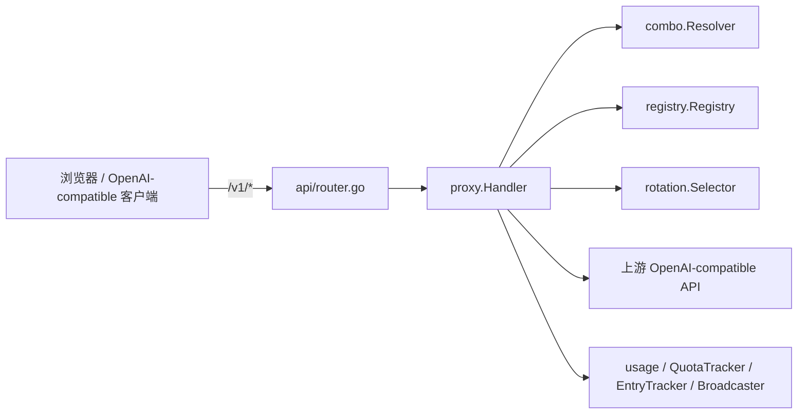
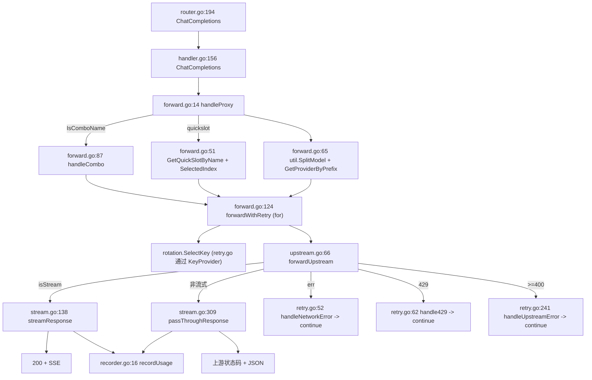

# TinyRouter Proxy 代理核心架构

> **文档定位：** `internal/proxy/` 包实现的 canonical 架构事实基线。后续设计、排障和代码评审应先读取本文，再按“源码锚点”核对本次变更涉及的局部代码。
>
> **最后核对：** 2026-07-13，仓库提交 `c2f89c6`（`main`）。本文描述的是当时源码的实际行为，不把规划或历史设计稿当作现状。

## 1. 范围与结论

`internal/proxy/` 是 TinyRouter 的**代理核心包**，承载所有 `/v1/*`（OpenAI-compatible）请求的处理：模型解析、Key 选择、上游转发、SSE 流式透传、重试/故障转移、用量记录、在途跟踪与事件广播。它自身不含任何管理接口、配置加载或 UI 逻辑。

- **谁调用它：** `internal/api/router.go` 在顶层挂载三个路由（`/v1/chat/completions`、`/v1/completions`、`/v1/models`，见 router.go:194-196），把请求派发到 `proxy.Handler`；`internal/app/app.go` 作为组合根构造 `Handler` 并注入依赖（`app/app.go:129`）；`internal/api/sse_events.go` 消费 `Handler` 暴露的 `Broadcaster` / `EntryTracker`，把用量/在途/请求事件以 SSE 推送给管理 UI。
- **它调用谁：** `rotation.Selector`（Key 选择、冷却、退避、锁定）、`combo.Resolver`（combo 解析）、`registry.Registry`（provider/quickslot/key 运行时状态）、`usage.RingBuffer` 与 `usage.QuotaTracker`（用量）、`config`（配置与 provider 判定）、`util`（模型名拆分、token 提取、日志截断）。



本文的核心结论：

1. `proxy` 包通过 6 个能力接口（而非具体类型）接收依赖，使代理核心对 `rotation`/`combo`/`registry`/`usage`/`config` 仅做结构性依赖（interfaces.go）。
2. 请求生命周期在 `handleProxy` → `forwardWithRetry`（for 循环）→ `forwardUpstream` → `streamResponse`/`passThroughResponse` 中闭环；combo 在 `handleCombo` 中逐目标递归进入 `forwardWithRetry`（forward.go:14、forward.go:87、forward.go:124、upstream.go:66、stream.go:138、stream.go:309）。
3. SSE 默认原样透传（逐 32KB 块读取 + flush），仅在 `NormalizeStreamChunks` 开启时把 `"choices":null` 规范为 `[]`；流式与非流式的 token 提取均为 last-chunk-wins（stream.go:181-293、stream.go:309-341）。
4. 重试/故障转移是一台纯“切 Key”的状态机（除 SenseNova TPM 同 Key 等待重试外），决策分布在 3 个错误处理器中（handleNetworkError/handle429/handleUpstreamError，retry.go:52-305）。
5. Gemini OpenAI-compatible 的 `thought_signature` 采用“流式捕获、发出请求时回填”的非对称缓存（signature_cache.go:25-104、forward.go:308-349、stream.go:444-490）。

## 2. 事实优先级

出现冲突时按以下优先级判断：

1. 当前源码和测试（`internal/proxy/*`、`internal/api/router.go`、`internal/api/sse_events.go`、`internal/app/app.go` 的相关集成）；
2. 本文；
3. `AGENTS.md` / `PROJECT_MAP.md`（仅作模块边界与约定背景）；
4. 历史提交信息（仅作历史背景）。

本文的关键结论都在第 14、17 节列出源码锚点。修改 `internal/proxy` 或相关集成后，应同步更新本文的“最后核对”行、`router.go` 路由挂载、重试策略、body 改写、SSE 改写、Gemini 签名、用量/在途、combo 策略等章节（见第 18 节变更维护清单）。

## 3. 路由挂载与鉴权边界

`internal/api/router.go` 在 `Routes` 中通过 chi 挂载代理路由：

- 三个 `/v1/*` 路由（router.go:194-196）：
  - `r.Post("/v1/chat/completions", proxyHandler.ChatCompletions)`；
  - `r.Post("/v1/completions", proxyHandler.Completions)`；
  - `r.Get("/v1/models", proxyHandler.ListModels)`。

- **鉴权边界：** `/v1/*` 路由写在 `Routes` 函数顶层（router.go:194-196），而 `AuthMiddleware` 只包裹 `/api` 路由组（router.go:213-215）。因此 `/v1/*` 完全在 `AuthMiddleware` 之外，任意 API Key 或无 Key 均可访问（与 AGENTS.md “纯本地，无对外鉴权”一致）。
- **CORS preflight（仅 `/v1/*`）：** router.go:181-191 处理 `OPTIONS /v1/*`，设置 `Access-Control-Allow-Origin` 为请求方 `Origin`、`Allow-Methods: GET, POST, OPTIONS`、`Allow-Headers: Content-Type, Authorization`、`Expose-Headers: X-TinyRouter-Provider, X-TinyRouter-Key`，并以 204 响应。管理 `/api/*` 无 CORS（同源管理 UI），外部页面不能跨域读取配置或密钥。
- **securityHeaders 跳过 `/v1/`：** `securityHeaders` 中间件（router.go:151-164）对 `/v1/` 前缀路径跳过设置 CSP / `X-Content-Type-Options` / `X-Frame-Options` / `X-XSS-Protection`，使上游响应头透传（router.go:154）。
- **上游 HTTP 代理：** `proxy.Handler.SetProxy`（handler.go:102-142）设置走代理的 `*url.URL`；`provider.UseProxy` 为 true 时，`forwardUpstream` 选择代理 client（upstream.go:84-93）。代理 URL 始终以 `http://host:port` 重建，端口范围 `[1,65535]`，非法则禁用代理并返回错误（handler.go:129-141）。

## 4. Handler 与依赖注入

### 4.1 Handler 结构体

`Handler` 聚合全部依赖与运行时状态（handler.go:15-36）：

| 字段 | 类型 | 用途 |
|---|---|---|
| `reg` | `ModelResolver` | provider / quickslot 解析、key 运行时状态、模型列表 |
| `selector` | `KeyProvider` | key 选择 + 冷却 / 退避 / 锁定 |
| `comboRes` | `ComboResolver` | combo 解析 |
| `usage` | `UsageRecorder` | 用量记录 |
| `quotaTracker` | `QuotaTracker` | quota 展示 |
| `logger` | `Logger` | 日志输出 |
| `client` / `streamClient` | `*http.Client` | 直连：非流式 300s 超时 / 流式无超时 |
| `proxyClient` / `proxyStream` | `*http.Client` | 经代理：非流式 300s 超时 / 流式无超时 |
| `mgmtClient` / `mgmtProxyClient` | `*http.Client` | 管理探测（模型导入/连通性/测试），15s 超时，后者经代理 |
| `proxyURL` | `atomic.Value` | 当前代理 `*url.URL`，nil 表示不走代理 |
| `UsageUpdates` / `InflightUpdates` / `RequestUpdates` | `*Broadcaster` | 三类事件广播 |
| `Inflight` | `*InflightTracker` | 在途流式字节 / 速度 |
| `EntryTracker` | `*EntryTracker` | 处理中用量条目（按 request ID） |
| `sigCache` | `SignatureCacheProvider` | Gemini thought_signature 缓存 |
| `debugModeProvider` | `func() bool` | 调试模式开关 |

### 4.2 构造函数

`New`（handler.go:43-80）从能力接口而非具体类型构造 `Handler`。调用方（组合根）通常传入 `*registry.Registry`、`*rotation.Selector`、`*combo.Resolver`、`*usage.RingBuffer`、`*usage.QuotaTracker`、`*console.Logger`，它们都结构性满足这些接口。默认上游超时 300s（`upstreamTimeoutSec<=0` 时回退，handler.go:44-47）。构造函数内创建 `UsageUpdates`(32)、`InflightUpdates`(32)、`RequestUpdates`(64) 三个 `Broadcaster`、`InflightTracker`、`EntryTracker` 与 `SignatureCache`（handler.go:55-60），并构造 6 个 `*http.Client`（直连 / 代理 / 管理各一对；流式 client 不设 `Timeout`，由请求 `r.Context()` 控制连接生命周期，handler.go:61-78）。

### 4.3 六个能力接口

`interfaces.go` 定义代理核心对外的结构性依赖接口：

| 接口 | 行 | 实现类型 | 关键方法 |
|---|---|---|---|
| `Logger` | interfaces.go:16-21 | `*console.Logger` | `Info/Error/Warn/Debug` |
| `KeyProvider` | interfaces.go:27-38 | `*rotation.Selector` | `SelectKey`、`WaitNIMInterval`、`ClearError`、`OnNIMRequestSuccess`、`Settings`、`OnKeyFailure`、`MarkNIM429`、`MarkDailyQuotaLocked`、`MarkRateLimited`、`MarkBalanceLocked` |
| `ModelResolver` | interfaces.go:48-56 | `*registry.Registry` | `GetQuickSlotByName`、`GetProviderByPrefix`、`GetProvider`、`GetKeyState`、`ListProviders`、`ListCombos`、`ListQuickSlots` |
| `ComboResolver` | interfaces.go:61-64 | `*combo.Resolver` | `IsComboName`、`Resolve` |
| `UsageRecorder` | interfaces.go:68-70 | `usage.UsageStore`（含 `*usage.RingBuffer`） | `Add` |
| `QuotaTracker` | interfaces.go:75-77 | `*usage.QuotaTracker` | `Update`、`RemoveKey` |

### 4.4 HTTP 客户端与运行时开关

- **4 类用途、6 个 client 字段：** 直连非流式（`client`）、直连流式（`streamClient`）、代理非流式（`proxyClient`）、代理流式（`proxyStream`）、管理直连（`mgmtClient`）、管理代理（`mgmtProxyClient`）。流式 client 无 `Timeout`，由请求 context 控制；非流式 300s；管理 15s（handler.go:61-78）。
- **`ManagementClient`**（handler.go:85-92）：按 `provider.UseProxy` 返回 `mgmtProxyClient` 或 `mgmtClient`，供模型导入 / 连通性 / 模型测试等探测使用。
- **`SetProxy`**（handler.go:102-142）：更新 / 禁用上游代理 URL。
- **`SetUpstreamTimeout`**（handler.go:147-154）：更新非流式 client 的 `Timeout`（流式保持无界）。
- **`SetDebugModeProvider` / `debugMode`**（handler.go:164-173）：注入并从 `func() bool` 读取调试模式开关。

## 5. 请求生命周期

`POST /v1/chat/completions` 从路由到响应的完整调用链：



关键阶段：

1. **入口与解析：** `ChatCompletions`（handler.go:156-158）调用 `handleProxy(w, r, "/v1/chat/completions")`。`handleProxy`（forward.go:14-85）先用 `http.MaxBytesReader` 限制请求体 32 MiB（forward.go:17），读全部 body 并 `json.Unmarshal`（forward.go:18-28），强制校验非空 `model`（forward.go:30-34）；其余字段原则上透传。
2. **模型解析分支：**
   - 命中 combo 名 → `handleCombo`（forward.go:46-49）。
   - 命中 quickslot → 取 `qs.Models[qs.SelectedIndex]`（越界回退 0，forward.go:51-63）。
   - 否则 `util.SplitModel` 拆 `provider/model`，再 `GetProviderByPrefix` 解析为真实 provider ID（forward.go:65-77）。
3. **`forwardWithRetry` 循环（forward.go:124-269）：** 每次迭代 `SelectKey`（forward.go:135），标记 key in-flight（forward.go:142-145），写 request-start 事件（forward.go:179-202），调用 `forwardUpstream`（forward.go:205）。根据返回分流：
   - 网络错误 → `handleNetworkError` → `continue`（forward.go:207-217）；
   - 429 → `handle429` → `continue`（forward.go:219-227）；
   - `>=400` → `handleUpstreamError` → `continue`（forward.go:229-237）；
   - 2xx → `ClearError`、更新 quota、NIM 成功计数，然后按 `isStream` 进入 `streamResponse` 或 `passThroughResponse` 并返回 `true`（forward.go:239-268）。
4. **流式 vs 非流式：** 流式走 `streamResponse`（stream.go:138-307）逐块转发并 flush；非流式走 `passThroughResponse`（stream.go:309-341）整段读取后写出。
5. **重试循环：** 循环在 `forwardWithRetry` 顶层的 `for {}`（forward.go:134）中持续，直到成功返回或所有 key 耗尽（`excludeKeyIDs` 覆盖全部可用 key 后 `SelectKey` 报错，forward.go:135-139）。

## 6. 模型解析

### 6.1 Combo（handleCombo，forward.go:87-122）

`handleCombo` 先 `comboRes.Resolve`（forward.go:88）拿到 `plan.Targets`，再按 `plan.Strategy` 分支：

- **fallback：** 遍历 `plan.Targets`，对每个目标调用 `forwardWithRetry`；任一成功即 `return`，全部失败回 502（forward.go:100-106）。
- **round-robin：** **固定使用 `plan.Targets[0]`**，仅调用一次 `forwardWithRetry`（forward.go:107-111）。注意：轮转由 `rotation` 内部 key 选择完成，combo 层不轮转目标。
- **greedy-squirrel：** 与 fallback 同形，遍历 `plan.Targets` 逐个 `forwardWithRetry`（forward.go:112-118）。
- 未知策略 → 400（forward.go:119-120）。

`forwardWithRetry` 的 `logLabel` 传入 `"[combo:name] "` 前缀用于日志区分（forward.go:98）。

### 6.2 QuickSlot

`handleProxy` 中通过 `reg.GetQuickSlotByName(modelStr)` 命中 quickslot（forward.go:51），取其 `Models[SelectedIndex]`（越界或空回退 0，空则 400，forward.go:52-62）。`SelectedIndex` 为持久化的当前选中下标。

### 6.3 Provider / Model

- `util.SplitModel(modelStr)` 把 `provider/model` 拆为 `providerID, upstreamModel`（forward.go:65）。
- `reg.GetProviderByPrefix(providerID)` 按前缀解析为真实 provider（forward.go:72-77），随后 `providerID` 被替换为 `provider.ID`，供 `forwardWithRetry` 使用。
## 7. 上游转发与 body 改写

### 7.1 forwardUpstream（upstream.go:66-100）

`forwardUpstream` 完成实际 HTTP POST：

- `BuildUpstreamURL(sel.Provider.BaseURL, path)` 构造完整上游 URL（upstream.go:67）。
- 设置固定头：`Content-Type: application/json`（upstream.go:74）、`Authorization: Bearer <sel.Key.Key>`（upstream.go:75）。
- 透传客户端 `User-Agent`（若非空，upstream.go:77-79）。
- 流式请求额外设置 `Accept: text/event-stream`（upstream.go:80-82）。
- **client 选择：** `sel.Provider.UseProxy` 且代理 URL 非空 → 代理 client；否则直连 client（upstream.go:84-93）。流式用 `proxyStream`/`streamClient`，非流式用 `proxyClient`/`client`（upstream.go:94-100）。

### 7.2 URL 构造（normalizeBaseURL / BuildUpstreamURL）

- `normalizeBaseURL`（upstream.go:16-25）：去除 `/chat/completions`、`/completions`、`/models` 等已知后缀，使 URL 止于 API root。
- `BuildUpstreamURL`（upstream.go:37-55）支持三种 base 形式：
  1. **Raw 模式：** base 以 `*` 结尾 → 去掉 `*` 并 trim 右 `/` 后原样返回，不做归一化或后缀拼接（upstream.go:40-43）。
  2. **Host root（无路径）：** `isHostRoot` 为真（`u.Path==""` 或 `"/"`）→ 注入 `/v1` 后追加完整 `endpointPath`（upstream.go:49-51、upstream.go:58-64）。
  3. **Path-bearing：** 去掉 endpointPath 的 `/v1` 前缀，把剩余 suffix 直接拼到归一化 base（upstream.go:46、upstream.go:53-54）。

### 7.3 Body 改写（在 forwardWithRetry 内，forward.go:124-173）

在每次 `forwardUpstream` 之前、选定 key 之后改写 `parsed` map 并重新 `json.Marshal`：

- **`stream_options` 注入：** 仅当 `isStream && cfgProvider.InjectStreamOpts` 且 body 无 `stream_options` 时注入 `{"include_usage":true}`（forward.go:128-132）。
- **model 替换：** `parsed["model"] = upstreamModel`，用真实上游模型名替换客户端模型名（forward.go:164）。
- **thought_signature 回填：** 仅当 `cfgProvider.IsGeminiOpenAICompat()` 时调用 `backfillThoughtSignatures(parsed, h.sigCache)`（forward.go:165-167），见第 10 节。

上述改写作用于当前重试迭代的 body；每次循环都基于原始 `parsed`（combo 传入的同一 map）重新执行，因此重试之间不会互相污染。

## 8. SSE 流式透传

### 8.1 streamResponse（stream.go:138-307）

成功且 `isStream` 时调用。流程：

- **SSE 头与调试头：** `Content-Type: text/event-stream`、`Cache-Control: no-cache`、`Connection: keep-alive`，并写入 `X-TinyRouter-Provider` / `X-TinyRouter-Key`（stream.go:157-163）。
- **`WriteHeader(200)`：** 流式响应**始终**返回 200，上游错误已在重试阶段拦截（stream.go:164）。
- **清除写死线：** 用 `http.NewResponseController(w).SetWriteDeadline(time.Time{})` 避免长 SSE 流被服务器 `WriteTimeout` 中断；下游 context 仍能在客户端断开时取消（stream.go:170-172）。
- **逐块读取 + flush：** 32 KiB 缓冲读取（stream.go:174），每读一块即 `flusher.Flush()`（stream.go:240）。
- **在途跟踪：** 进入时 `Inflight.Register`（stream.go:144），首个 chunk 后 `SetFirstChunk`（stream.go:243），累计 content 字符 `AddBytes`（stream.go:247），每 >1.5s 触发 `InflightUpdates.Signal()`（stream.go:249-252）。

### 8.2 SSELineBuffer 与两种模式

- `SSELineBuffer`（stream.go:15-40）按换行符切分 SSE 行，跨块缓冲剩余部分，`Remaining()` 返回未换行尾部。
- **normalize 模式（`cfgProvider.NormalizeStreamChunks`）：** 对每行先 `normalizeSSEChunk` 再写出，并提取 token / signature（stream.go:185-211）。
- **raw 模式：** 整块 `w.Write(buf[:n])` 原样写出，再对 `SSELineBuffer.Feed` 的行做 token / signature 提取（stream.go:212-238）。

### 8.3 normalizeSSEChunk（stream.go:73-109）

仅改写以 `data:` 开头、`"choices"` 显式为 `null` 且不含 `error` 字段的行，把 `"choices":null` 改为 `"choices":[]`（部分 provider 的 usage-only 前导 chunk 需要；stream.go:73-109）。其他行（空白分隔、注释、`[DONE]`、error chunk、合法数组）原样返回；JSON 解析失败回退原行。

### 8.4 尾部处理与双写 guard（stream.go:256-290）

读到 EOF（`err != nil`）时，对 `sb.Remaining()` 统一提取 token / signature：

- **normalize 模式：** 在循环中从未原样写出整块，需在此把 remaining 规范化后写出（stream.go:258-266）。
- **raw 模式：** remaining 已在循环中通过 `w.Write(buf[:n])` 发出，**不应重复写出**，仅提取 token 计入 usage（stream.go:267-270）。
- 调试模式下仍 `parseAndBroadcastChunk`（stream.go:285-289）。

### 8.5 Token / thought_signature 提取与 [DONE]

- **token 提取：** `util.ExtractTokens([]byte(payload))` 从 `data:` payload 提取 `input_tokens`/`output_tokens`（stream.go:196-199、224-227、276-279）。多 chunk 累计时采用 **last-chunk-wins**（后续 chunk 覆盖 `inputTokens`/`outputTokens`）。
- **thought_signature 提取：** `extractThoughtSignature([]byte(payload))` 从 `delta.tool_calls[].extra_content.google.thought_signature` 提取首个匹配的 `tool_call id` 与签名并 `sigCache.Put`（stream.go:200-202、228-230、280-282；函数定义 stream.go:444-490）。
- **[DONE]：** token / signature 提取时跳过 `[DONE]`（stream.go:195、221、275）。
- **调试模式：** `parseAndBroadcastChunk` 解析 `request-chunk` 事件并经 `RequestUpdates.Broadcast`（stream.go:206-210、233-237、349-368）。

### 8.6 passThroughResponse（stream.go:309-341）

非流式成功响应：设置 `Content-Type: application/json` 与 `X-TinyRouter-*` 头，用 `w.WriteHeader(resp.StatusCode)` **原样透传上游状态码**（stream.go:312-317），整段读取上限 64 MiB（`io.LimitReader(resp.Body, 64<<20)`，stream.go:319），写出后 `util.ExtractTokens` 提取用量并 `recordUsage`（stream.go:324-340）。客户端断开时 `status="client_disconnected"`（stream.go:333-337）。

## 9. 重试与故障转移状态机

### 9.1 retryState（retry.go:14-21）

```go
type retryState struct {
    excludeKeyIDs  []string // 累积排除的 key ID
    temp429Retries int      // 429 临时退避计数
    tpmWaitRetries int       // SenseNova TPM 同 key 等待重试计数
    consecutive5xx int       // 连续 5xx 计数（控制 5xx 退避）
    maxRetries     int      // 最大重试次数
    requestLogged  bool      // 是否已记录首条 REQUEST 日志
}
```

`maxRetries` 取自 `selector.Settings().MaxRetries`，`<=0` 时默认 **5**（retry.go:33-39）。

### 9.2 三个错误处理器

- **handleNetworkError（retry.go:52-59）：** 记录错误，`OnKeyFailure(...,0,...)`，`excludeKeyIDs` 追加当前 key，`recordUsage("error")`，重置 `temp429Retries`/`tpmWaitRetries`，**继续下一 key**。
- **handle429（retry.go:62-235）：** 区分多类 429：
  - **NIM 429：** `MarkNIM429` + 冷却阶梯 + 排除当前 key + 切 key（retry.go:72-80）。
  - **配额头（adapter）：** 解析 `ParseHeaders` 更新 quota；`ModelExhausted` → `MarkDailyQuotaLocked` 并排除（retry.go:82-110）。
  - **有 quota 未耗尽：** 渐进退避序列 `BackoffSequence(temp429Retries)`，最多 `maxBackoffRetries=10` 次，超时后排除并 `OnKeyFailure`（retry.go:113-135）。
  - **SenseNova 429：** `classifySenseNova429` 分 `rpm` / `tpm`：
    - `rpm`：冷却当前 key 60s，`excludeSameAccountKeys`（同 account 其他 key 一并排除），立即切 account（retry.go:145-152、retry.go:332-342）。
    - `tpm`：**不切 key**（大请求在任意 account 都会立即 429），等待 15s 后重试同一 key 一次；仍 429 则冷却 60s + 排除（retry.go:153-174）。
  - **兜底 ClassifyError：** `ActionDailyQuota`→锁每日配额；`ActionCooldown`→按 `CooldownSec` 冷却；`ActionTransient`→`DefaultTransientCooldownSec` 冷却；`ActionBackoff`→落入通用退避（retry.go:178-204）。`IsDailyQuota429` 再兜底一次（retry.go:206-213）。
  - **通用退避：** `temp429Retries < maxRetries` 时 `BackoffSequence` 退避后 `continue`；耗尽则排除 + `OnKeyFailure` + 切 key（retry.go:215-235）。
- **handleUpstreamError（retry.go:241-305）：** 处理 5xx 与 4xx（非 429）。
  - **余额耗尽（ModelScope 402）：** `IsBalanceExhausted` → `MarkBalanceLocked` + `quotaTracker.RemoveKey` + 排除当前 key（retry.go:255-263）。
  - **ClassifyError：** `ActionBackoff`→`OnKeyFailure`；`ActionCooldown`/`ActionDailyQuota`/`ActionTransient` 分别冷却/锁（retry.go:265-275）。
  - **5xx 短退避：** `consecutive5xx++`，退避 `500ms + 500ms*n`，上限 5s（retry.go:287-292）；`<500` 重置 `consecutive5xx`（retry.go:281-284）。退避期间可因 context 取消而退出（retry.go:294-303）。

### 9.3 决策小结

| 场景 | 动作 |
|---|---|
| 网络错误 | 排除当前 key，切下一 key（retry.go:52-59） |
| NIM 429 | 冷却阶梯，切下一 key（retry.go:72-80） |
| 429 每日/账户配额锁 | `MarkDailyQuotaLocked`/`MarkRateLimited`，切下一 key（retry.go:103-110、181-213） |
| 429 通用退避用尽 | `OnKeyFailure`，切下一 key（retry.go:215-235） |
| SenseNova rpm | 冷却 60s + 排除同 account，切 account（retry.go:145-152、332-342） |
| SenseNova tpm | **同一 key 等待 15s 重试一次**（最长阻塞一个 goroutine），失败再冷却切 key（retry.go:153-174） |
| 402 余额耗尽 | `MarkBalanceLocked` + 移除 quota，切下一 key（retry.go:255-263） |
| 5xx | `ClassifyError` 动作 + 短退避，切下一 key（retry.go:241-305） |
| combo 目标全部失败 | 上一层 `handleCombo` 切**下一 combo 目标**（forward.go:100-118） |

`excludeSameAccountKeys`（retry.go:332-342）把当前 key 及同 `Account` 的其他 key 一并加入 `excludeKeyIDs`。

## 10. Gemini thought_signature 缓存与回填

Google Gemini OpenAI-compatible 端点在 tool-call 往返时要求 `tool_calls` 携带首响应返回的 `thought_signature`，否则拒绝。代理采用“流式捕获、发出请求时回填”的非对称缓存。

- **SignatureCache（signature_cache.go:25-104）：** 内存缓存，key 为 `tool_call id`，value 为 `sigEntry{signature, putAt}`（signature_cache.go:16-19）。`TTL = 10m`、`maxEntries = 10000`（signature_cache.go:32-35）。**惰性驱逐**：`Put` 时删除过期项，达容量则删除 `putAt` 最早项（signature_cache.go:52-79）；`Get` 不刷新 `putAt`，读取不会“续命”条目（signature_cache.go:83-94）。`SignatureCacheProvider` 接口（signature_cache.go:11-14）使测试可注入 mock。
- **流式提取：** `extractThoughtSignature`（stream.go:444-490）在 `streamResponse` 每收到 `data:` payload 时从 `delta.tool_calls[].extra_content.google.thought_signature` 提取首个匹配并 `sigCache.Put`（stream.go:200-202、228-230、280-282）。**签名仅从流式响应捕获。**
- **回填（backfillThoughtSignatures，forward.go:308-349）：** 遍历请求的 `messages`，对 `role==assistant` 且 `tool_calls` 中缺少 `thought_signature` 的项，按 `tool_call id` 从 `sigCache.Get` 回填到 `extra_content.google.thought_signature`（forward.go:342-346）。已存在签名不覆盖，cache miss 静默跳过（best-effort）。
- **触发条件：** 仅在 `cfgProvider.IsGeminiOpenAICompat()` 为真时回填（forward.go:165-167）。该判定要求 BaseURL 同时包含 `generativelanguage.googleapis.com` 与 `/openai`（config/types.go:109-117）。
- **非对称性：** 签名只从流式响应捕获，回填进**发出**的请求 body（上游非流式、combo、quickslot 等路径只要经 `forwardWithRetry` 且命中 Gemini 条件即回填）。
- **往返测试：** `stream_signature_e2e_test.go`（`TestStreamSignature_RoundTrip`）覆盖捕获→回填闭环。相关提交 `c2f89c6`。

## 11. 用量记录与请求事件

### 11.1 recordUsage（recorder.go:16-66）

`recordUsage` 在成功（流式/非流式）与所有错误处理器中被调用，写入一条 `usage.Entry`：

- 字段： `ID`、`Timestamp`、`Provider`、`Model`、`KeyID`、`KeyName`、`Status`、`LatencyMs`、`TTFTMs`、`InputTokens`、`OutputTokens`、`Error`，以及调试态的 `ReqPayload`/`RespPayload`/`RespHeaders`/`RespStatus`/`ReqHeaders`/`UpstreamURL`（recorder.go:17-53）。
- **调试捕获：** 仅 `debugMode()` 时记录；响应体超过 `512 KiB` 截断，非法 JSON 包装为 `{"raw":...}`（recorder.go:31-52）。
- **广播链路：** `h.usage.Add(entry)`（recorder.go:54）→ `RequestUpdates.Broadcast(RequestEvent{Type:"request-done", ...})`（recorder.go:57-64）→ `h.UsageUpdates.Signal()`（recorder.go:65）。
- **调用点：** 成功流式（stream.go:306）、成功非流式（stream.go:340）、网络错误（retry.go:56）、429（retry.go:78、108、120、133、152、160、173、186、193、200、211、220、234）、上游错误（retry.go:250、259、278）。

### 11.2 generateRequestID（request_events.go:24-31）

格式 `r<base62(nanos)>-<6位 hex 后缀>`（request_events.go:24-31）。`requestIDCounter` 在 `generateRequestID` 中被 `atomic.AddInt64` 自增，但结果被丢弃（`_ =`），**该计数器仅被自增、从未被读取，属于死代码**（request_events.go:26）。

### 11.3 RequestEvent（request_events.go:71-78）

经 `RequestUpdates` 广播的事件载荷：`Type`（`request-start` / `request-done` / `request-chunk`）、`ID`、`Status`、`Section`、`Delta`、`Entry`（`json.RawMessage`）。

## 12. 在途跟踪与事件广播

### 12.1 EntryTracker（entry_tracker.go:13-82）

按 request ID 跟踪“处理中（processing）”用量条目（`map[string]usage.Entry` + `sync.RWMutex`）。`Register`/`Get`/`Remove`/`All`/`Exists`（entry_tracker.go:25-72），`MarshalEntryJSON` 做 JSON 序列化（entry_tracker.go:76-82）。`streamResponse` 进入前 `EntryTracker.Register(processingEntry)` 并 `broadcastRequestStart`，结束/失败后 `EntryTracker.Remove`（forward.go:179-202、209、221、231、261、272-282）。

### 12.2 InflightTracker（inflight.go:11-88）

按 `int64` ID 跟踪在途流式请求的实时输出：

- `inflightEntry`（inflight.go:11-16）：`ProviderID`、`KeyID`、`FirstChunkAt`、`Bytes`（content 字符数，非原始 SSE 字节，便于 token 估算）。
- `InflightTracker`（inflight.go:20-24）：`entries map[int64]*inflightEntry` + `nextID`。
- `Register`/`SetFirstChunk`/`AddBytes`/`Unregister`（inflight.go:32-64）。
- `LiveSpeedForKeys`（inflight.go:70-88）：按 `providerID/keyID` 估算 tok/s = `contentChars/4 / elapsedSeconds`（1 token≈4 chars），并发同 key 速度**累加**；`elapsed < 2s` 的请求跳过以避免早期不稳值。

### 12.3 Broadcaster（broadcaster.go:9-80）

`Broadcaster`（broadcaster.go:9-14）把事件扇出给所有订阅者，解决 Go channel 单投递导致多 SSE 监听者互相抢事件的问题：

- `NewBroadcaster(bufSize)`：每订阅者通道缓冲 `bufSize`（<1 回退 1，broadcaster.go:18-26）。
- `Subscribe`：注册订阅者并返回只读 channel + 幂等 `unsubscribe`（broadcaster.go:32-52）。
- `Signal`：向每个订阅者非阻塞投递 `struct{}{}`，缓冲区满则跳过该订阅者（broadcaster.go:57-66）。
- `Broadcast(event)`：向每个订阅者非阻塞投递带类型事件，缓冲满则跳过（broadcaster.go:71-80）。

### 12.4 SSE 事件扇出（api/sse_events.go:16-79）

`GET /api/usage/events`（router.go:266）由 `streamUsageEvents` 处理（api/sse_events.go:16-79）：

1. 写 SSE 头与 `{"type":"connected"}`（api/sse_events.go:23-29）。
2. **重放**：把 `proxyHandler.EntryTracker.All()` 作为 `request-start` 事件回放，使新连接立即看到在途请求（api/sse_events.go:33-42）。
3. `Subscribe` 三个 `Broadcaster`（UsageUpdates / InflightUpdates / RequestUpdates），进入 `select` 循环（api/sse_events.go:44-78）：
   - `ch`（UsageUpdates）→ `usage-updated`；
   - `infCh`（InflightUpdates）→ `key-inflight`；
   - `reqCh`（RequestUpdates）→ 序列化 `proxy.RequestEvent` 为 `request-*` 事件；
   - `ctx.Done()` → 退出；
   - `30s` 超时 → `: keepalive` 注释行（api/sse_events.go:74-76）。

`broadcastRequestStart`（forward.go:272-282）在每次 `forwardWithRetry` 迭代发出 `request-start` 事件，经 `RequestUpdates.Broadcast`。
## 13. 响应契约

- **流式成功头**（stream.go:157-163）：`Content-Type: text/event-stream`、`Cache-Control: no-cache`、`Connection: keep-alive`、`X-TinyRouter-Provider`、`X-TinyRouter-Key`；状态码恒为 200（stream.go:164）。
- **非流式成功头**（stream.go:312-316）：`Content-Type: application/json` + `X-TinyRouter-*`；**状态码原样透传上游**（stream.go:317）。
- **本地代理错误**：`writeError`（forward.go:284-293）写 `Content-Type: application/json` + 状态码 + `{"error":{"message":...,"type":"proxy_error"}}`。
- **502 全 key 耗尽**：`handleProxy` 在 `forwardWithRetry` 返回 `false` 时写 `writeError(w, 502, "all keys exhausted")`；combo 全目标失败写 `all keys exhausted for combo: <name>`（forward.go:82-84、106、110、118）。
- **上游状态透传语义**：非流式 verbatim（stream.go:317）；流式恒 200（错误已在重试阶段拦截或回 502）。

## 14. 状态模型（结构体总览）

| 结构体 | 位置 | 字段 / 用途 |
|---|---|---|
| `Handler` | handler.go:15-36 | 聚合 6 能力接口 + 6 个 client + 3 个 Broadcaster + Inflight/EntryTracker/sigCache/debugModeProvider |
| `retryState` | retry.go:14-21 | 单轮 `forwardWithRetry` 的跨迭代可变状态（excludeKeyIDs / 重试计数 / consecutive5xx） |
| `SSELineBuffer` | stream.go:15-17（方法 19-40） | 跨块缓冲并按换行符切 SSE 行 |
| `chunkDelta` | stream.go:371-374 | 单 chunk 解析结果（`section`/`delta`） |
| `inflightEntry` | inflight.go:11-16 | 单条在途流式请求：ProviderID/KeyID/FirstChunkAt/Bytes |
| `InflightTracker` | inflight.go:20-24 | 在途流式字节 / 实时速度跟踪 |
| `Broadcaster` | broadcaster.go:9-14 | 事件扇出器（subs / nextID / bufSize） |
| `EntryTracker` | entry_tracker.go:13-16 | 处理中用量条目（按 request ID） |
| `RequestEvent` | request_events.go:71-78 | 经 RequestUpdates 广播的事件载荷 |
| `sigEntry` | signature_cache.go:16-19 | 单条签名缓存项（signature / putAt） |
| `SignatureCache` | signature_cache.go:25-30 | Gemini 签名缓存（entries / maxEntries / ttl） |
| `SignatureCacheProvider` | signature_cache.go:11-14 | 签名缓存读写接口 |

## 15. 已知约束与风险

以下为当前实现事实，不代表都要在同一轮修复：

1. **未鉴权的 `/v1/*`：** `/v1/chat/completions`、`/v1/completions`、`/v1/models` 在 `AuthMiddleware` 之外（router.go:194-196、213-215），任意客户端（含跨域）可达。
2. **流式 body 改写无连接级隔离：** `backfillThoughtSignatures` / `stream_options` 注入直接改写共享的 `parsed` map（虽每次循环重做，但同一迭代内生效），combo 多目标共享同一 `bodyBytes`/`parsed` 引用（forward.go:128-167）。
3. **64 MiB 非流式缓冲：** `passThroughResponse` 整段读取上限 64 MiB，超大上游响应会占内存（stream.go:319）。
4. **normalize-false 双写 guard 微妙：** raw 模式的尾部 `Remaining` 已在循环中写出，必须避免重复写出（stream.go:256-290），逻辑依赖“循环中已 `w.Write(buf[:n])`”的隐式约定。
5. **last-chunk-wins token：** `inputTokens`/`outputTokens` 被后续 chunk 覆盖，usage 仅反映最后一次提取结果（stream.go:196-199、224-227、276-279）。
6. **同 key 时间门控重试阻塞 goroutine：** SenseNova TPM 的 15s 等待（retry.go:156-167）与 429 退避（retry.go:121-126、221-226）在 `forwardWithRetry` 的 `for` 循环内 `time.After` 阻塞，期间该请求 goroutine 被占用。
7. **requestIDCounter 死代码：** `generateRequestID` 自增 `requestIDCounter` 但结果丢弃，计数器永不被读取（request_events.go:26）。
8. **excludeKeyIDs 从不裁剪：** `retryState.excludeKeyIDs` 只 append（retry.go:55、74、105、129、…），无容量上限或裁剪，长重试链会无限增长。
9. **Gemini 回填 BaseURL 条件严格：** 需 BaseURL 同时含 `generativelanguage.googleapis.com` 与 `/openai`，否则不回填（config/types.go:113-116）。
10. **签名 TTL 固定 10m：** `defaultSigTTL = 10 * time.Minute` 不可配，长 tool-call 间隔可能丢失签名（signature_cache.go:33）。
11. **CORS 反射任意 Origin：** `Access-Control-Allow-Origin` 原样回显请求方 `Origin`（router.go:182-185），配合 `/v1/*` 未鉴权，任意网页可跨域调用本机代理。
12. **BuildUpstreamURL raw 模式语义特殊：** base 以 `*` 结尾时整段作端点、跳过归一化（upstream.go:40-43），配置错误易静默写错 URL。
13. **passThroughResponse 忽略 Content-Encoding：** 直接 `io.ReadAll` + 原样写出，未对上游 gzip/br 等做解压（stream.go:309-341）。
14. **recordUsage 错误状态粗粒度：** `status` 仅 `error`/`success`/`client_disconnected` 三档，HTTP 状态通过 `RespStatus` 字段附带，不再细分细粒度错误类型（recorder.go:16-66）。

## 16. 测试与验证现状

### 16.1 测试文件与覆盖

| 测试文件 | 覆盖内容 |
|---|---|
| `handler_test.go` | `forwardUpstream` 成功/网络错误/UA 透传/流式 Accept 头；`BuildUpstreamURL`；`maskURL`；`normalizeBaseURL`；`forwardWithRetry` 网络错误；`SelectKey` 集成；`handleProxy` 无效/缺失/非法 JSON/坏格式 model；`ChatCompletions` 成功；`maxRetries` 默认/自定义；`recordUsage`；重试耗尽；`writeError`；`stream_options` 注入；`ListModels`；`parseAndUpdateQuota`；流式请求；combo fallback；成功往返；调试模式与捕获；`ManagementClient` 直连/经代理；`SetProxy`；`UseProxy` 启用/禁用 |
| `retry_test.go` | `handle429` 每日配额/限流/瞬态/NIM 冷却/经 body 文本锁定/已有排除/ModelScope 耗尽/最大重试耗尽；`handleUpstreamError` 401/500/403/402/404/无 body；`handleNetworkError`；`logRequest`；`BackoffSequence`；`classifySenseNova429` 未知/rpm/tpm/短 body；`excludeSameAccountKeys` 空/有 account |
| `stream_test.go` | `SSELineBuffer` 正常/跨块/数据跨块/剩余/空；SSE `data:` 带/不带空格；`ExtractTokens` 多 chunk/无 usage/total_tokens 回退；`normalizeSSEChunk` choices-null/error 透传/`[DONE]`/合法数组/空行/末 usage 保留 |
| `stream_e2e_test.go` | `streamResponse` 非 normalize 无重复 / normalize 路径 / token 提取 / 客户端取消 |
| `stream_signature_e2e_test.go` | `TestStreamSignature_RoundTrip`：Gemini 签名捕获→回填闭环 |
| `signature_cache_test.go` | `SignatureCache` PutGet / TTL / LRU 驱逐 |
| `signature_backfill_test.go` | `backfillThoughtSignatures` 缺字段/已存在/cache miss；`IsGeminiOpenAICompat` |
| `signature_extract_test.go` | `extractThoughtSignature` 从 delta tool call/多 tool call 取首/无签名/畸形/非 tool call |
| `inflight_test.go` | `InflightTracker` 注册与速度/并发累加/注销排除/无首 chunk 跳过/elapsed 不足阈值跳过/并发安全 |

### 16.2 已测 vs 未测

- **已测：** 上游转发成功/网络错误、URL 构造、重试耗尽、429/5xx/402 各类错误分支、SenseNova rpm/tpm、combo fallback、SSE 行缓冲与 normalize、token/签名提取、签名缓存 LRU/TTL、回填、在途速度、recordUsage、调试捕获、SetProxy、UseProxy。
- **未充分覆盖：**
  - **greedy-squirrel / round-robin combo：** 仅 `fallback` 路径经 `TestComboResponse_Fallback` 测试；`round-robin`（Targets[0]，forward.go:108）与 `greedy-squirrel`（forward.go:112-118）无专门单测。
  - **Completions 入口：** `Completions`（handler.go:160）仅作转发，无针对 `/v1/completions` 的专用测试。
  - **passThroughResponse：** 仅经往返/e2e 间接覆盖，SSE 行级测试集中于 `stream_test.go`，非流式写出逻辑缺少独立单测。
  - **broadcastRequestStart / EntryTracker 重放：** `broadcastRequestStart`（forward.go:272-282）经 handler 测试间接覆盖；`EntryTracker.All` 重放（api/sse_events.go:34-42）无单测。
  - **Broadcaster 满缓冲丢弃：** `Broadcast`/`Signal` 的 buffer-drop 行为无直接单测（broadcaster.go:57-80）。
  - **maxBackoffRetries 边界：** `maxBackoffRetries=10`（retry.go:114）的边界未被专门测试。

### 16.3 建议验证命令

```powershell
go test ./internal/proxy/...
go test ./...
go build -o tinyrouter .
```

涉及重试策略 / SSE 改写 / Gemini 签名 / 在途速度 / combo 策略的修改，应优先跑 `handler_test.go`、`retry_test.go`、`stream*_test.go`、`signature*_test.go`、`inflight_test.go`，并手工用浏览器验证流式、非流式、combo fallback、debug 视图与实时速度显示。

## 17. 源码锚点

后端与集成：

- `internal/proxy/handler.go`：Handler 结构体（15-36）、构造函数 New（43-80）、ChatCompletions/Completions（156-162）、SetProxy（102-142）、SetUpstreamTimeout（147-154）、SetDebugModeProvider（164-173）。
- `internal/proxy/interfaces.go`：6 个能力接口 Logger/KeyProvider/ModelResolver/ComboResolver/UsageRecorder/QuotaTracker（16-77）。
- `internal/proxy/forward.go`：handleProxy（14-85）、handleCombo（87-122）、forwardWithRetry（124-269）、broadcastRequestStart（272-282）、writeError（284-293）、backfillThoughtSignatures（308-349）、hasThoughtSignature（351-362）。
- `internal/proxy/upstream.go`：normalizeBaseURL（16-25）、BuildUpstreamURL（37-55）、forwardUpstream（66-100）。
- `internal/proxy/stream.go`：SSELineBuffer（15-40）、SSEDataPayloads（49-63）、normalizeSSEChunk（73-109）、streamResponse（138-307）、passThroughResponse（309-341）、parseAndBroadcastChunk（349-368）、chunkDelta/parseSSEChunkDelta（371-418）、extractThoughtSignature（444-490）。
- `internal/proxy/retry.go`：retryState（14-21）、maxRetries（33-39）、logRequest（42-49）、handleNetworkError（52-59）、handle429（62-235）、handleUpstreamError（241-305）、classifySenseNova429（318-327）、excludeSameAccountKeys（332-342）。
- `internal/proxy/recorder.go`：recordUsage（16-66）、parseAndUpdateQuota（68-90）。
- `internal/proxy/request_events.go`：generateRequestID（24-31）、RequestEvent（71-78）、requestIDCounter（14）。
- `internal/proxy/entry_tracker.go`：EntryTracker（13-82）、MarshalEntryJSON（76-82）。
- `internal/proxy/inflight.go`：inflightEntry/InflightTracker（11-88）。
- `internal/proxy/broadcaster.go`：Broadcaster（9-80）。
- `internal/proxy/signature_cache.go`：SignatureCacheProvider（11-14）、sigEntry/SignatureCache（16-104）。
- `internal/proxy/models.go`：ListModels（8-65）。
- `internal/api/router.go`：securityHeaders 跳过 /v1/（151-164）、CORS preflight（181-191）、三路由挂载（194-196）、usage/events 路由（266）。
- `internal/api/sse_events.go`：streamUsageEvents（16-79）。
- `internal/app/app.go`：组合根构造 Handler（129）、SetProxy（130）、SetDebugModeProvider（173）、SetUpstreamTimeout 注入（216）。

外部依赖：

- `internal/rotation`：`Selector` 实现 KeyProvider（SelectKey/WaitNIMInterval/ClearError/OnNIMRequestSuccess/Settings/OnKeyFailure/MarkNIM429/MarkDailyQuotaLocked/MarkRateLimited/MarkBalanceLocked）；`GetAdapter`/`ParseHeaders`/`BackoffSequence`/`ClassifyError`/`IsDailyQuota429`/`IsBalanceExhausted`/`DefaultTransientCooldownSec`。
- `internal/combo`：`Resolver` 实现 ComboResolver（`IsComboName`/`Resolve`）；`ComboPlan.Targets` 携带 `ProviderID`/`Model`。
- `internal/registry`：`Registry` 实现 ModelResolver；`KeyRuntimeState` 承载 per-key 运行时状态（InFlight/Quota）。
- `internal/usage`：`RingBuffer` 实现 UsageRecorder.Add；`Entry` 为用量记录结构；`QuotaTracker` 实现 QuotaTracker（Update/RemoveKey）。
- `internal/config`：`Provider`/`QuickSlot`/`Combo`/`RotationConfig`；`Provider.IsNIM`/`IsGeminiOpenAICompat` 决定特殊转发/回填分支。
- `internal/util`：`SplitModel`（拆 provider/model）、`ExtractTokens`（提 token）、`TruncStr`（日志截断）。

## 18. 变更维护清单

| 变更类型 | 必查位置 |
|---|---|
| 新增/修改 `/v1/*` 路由 | api/router.go 挂载（194-196）+ CORS preflight（181-191）+ 鉴权边界（auth 组外，213-215）+ securityHeaders 跳过（151-164） |
| 修改重试策略 | retry.go 三个错误处理器（52-305）+ rotation.ClassifyError / Selector + retryState（14-21） |
| 修改 body 改写 | forward.go:124-173（stream_options / model / backfill）+ upstream.go（头与 URL） |
| 修改 SSE 改写 | stream.go:138-307 + normalizeSSEChunk（73-109）+ SSELineBuffer（15-40）+ passThroughResponse（309-341） |
| 修改 Gemini 签名 | signature_cache.go（11-104）+ forward.go backfill（308-349）+ stream.go extract（444-490）+ config IsGeminiOpenAICompat（109-117） |
| 修改用量/在途 | recorder.go（16-90）+ entry_tracker.go（13-82）+ inflight.go（11-88）+ broadcaster.go（9-80）+ api/sse_events.go（16-79） |
| 新增 combo 策略 | combo/resolver + handleCombo 分支（forward.go:87-122） |