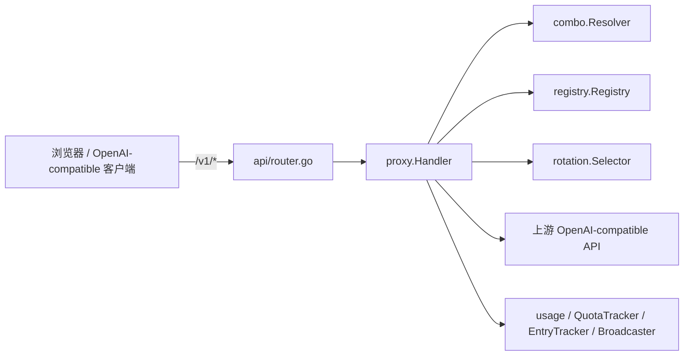

# TinyRouter Proxy 代理核心架构

> **文档定位：** `internal/proxy/` 包实现的 canonical 架构事实基线。后续设计、排障和代码评审应先读取本文，再按“源码锚点”核对本次变更涉及的局部代码。
>
> **最后核对：** 2026-07-21，仓库工作区（`main`）。本次新增/核对：(a) URL 拼接统一并修复——`proxy.BuildUpstreamURL` 成为唯一 endpoint URL 拼接函数，新增启发式 A（自动检测路径中是否含版本段 `/v1`/`/v1beta`/`/v2` 等，有则不注入 `/v1` 前缀，无则注入）；`api/probe_common.go` 删除 `normalizeProbeBaseURL`/`buildProbeURL`/`buildAnthropicURL` 三个私有函数，改用 `proxy.BuildUpstreamURL`。`normalizeBaseURL` 扩展为最长优先剥除完整 endpoint 后缀（含 `/v1/chat/completions`、`/v1/responses`、`/v1/messages` 等）。`buildAnthropicUpstreamRequest` 与 `buildResponsesUpstreamRequest` 的 URL 部分变更为一行调用 `BuildUpstreamURL`。本文描述的是当时源码的实际行为，不把规划或历史设计稿当作现状。

> **2026-07-21 更新（实时 TTFT / Token 进度广播）：** (1) `EntryTracker` 新增 `SetTTFT(id, ttftMs)` 和 `UpdateTokens(id, input, output)` 方法，支持在流式过程中更新在途条目的 TTFTMs 与 InputTokens/OutputTokens 字段（值类型 map 写回）；(2) `forwardWithRetry` 在创建 `processingEntry` 时设置 `InputTokens = len(bodyBytes) / 4`（粗估，约 4 字节≈1 token），使 `request-start` 事件立即携带 input token 估算值；(3) 流式请求成功时（`isStream` 分支，`streamResponse` 调用前），调用 `EntryTracker.SetTTFT` + `broadcastTTFT` 广播 `request-ttft` 事件（`Entry: {"ttftMs": <int>}`），前端据此刻切换 Latency 从"实时已耗时"到 TTFT 固定值；(4) `streamResponse` 流式循环中新增 `contentCharsTotal` 累积器，每 1.5s（与 `InflightUpdates.Signal` 同频）广播 `request-tokens` 事件（`Entry: {"inputTokens": <int>, "outputTokens": <int>}`），output 优先用上游真实 `outputTokens`，无则用 `contentCharsTotal / 4` 粗估，input 用已提取的真实值（可能为 0，前端保留估算值不覆盖）；(5) `UpdateTokens` 传 `-1` 跳过 input 更新，保留 `request-start` 时设的粗估；(6) 前端 `usage.js` 新增 `request-ttft` / `request-tokens` SSE 事件处理 + 三态筛选 Tag（成功/失败/进行中，复用 `btn-filter` CSS 类）。详见 §11、§12。

> **2026-07-18 更新（Anthropic 协议路由 + 软策略 + Responses 路由 + 多协议探测）：** 本轮在 Anthropic 入口基础上进一步：(1) **软策略修正**——proxy 不再因 `provider.APIType` 拒绝请求，客户端用什么协议入口（`/v1/chat/completions` / `/v1/messages` / `/v1/responses`）请求就按该协议转发；已删除 `forward.go` 旧的两处入口协议严格匹配 400 块，同一聚合 provider 可同时被三入口访问；(2) 新增 **OpenAI Responses 入口** `POST /v1/responses`（router.go:207，`proxyHandler.Responses`，`handleProxy(..., EntryFormatOpenAIResponses)`），与 OpenAI Chat / Anthropic Messages **三入口并列、同端口、按路径区分**；`forwardUpstream` 改为按 `entryFormat` 三分支（upstream.go:76-91），Responses 分支 URL 不注入 `/v1` 前缀、鉴权头 `Authorization: Bearer`；(3) **Anthropic usage 提取**——stream.go 新增 `parseAnthropicSSEUsage` 读 `message_start`/`message_delta` 的 input/output tokens 并复用 `recordUsage`，OpenAI `util.ExtractTokens` 加 guard 避免 anthropic `output_tokens` 干扰；(4) **三协议复合探测**——`api/probe_model.go`+`probe_common.go` 对单模型并发探测 OpenAI-compat / OpenAI-Responses / Anthropic 三协议，把成功集合写回 `ModelDef.Protocols`（变化时落 config.yaml）并写 `state.yaml` 的 `probes` map。详见本文第 §1、§3、§3.1、§3.2、§4、§7、§8.8、§13.1、§17、§18 各节。

> **2026-07-14 更新：** `recorder.go`、`forward.go`、`stream.go` 不再以 `debugMode()` 门控 payload/headers 捕获——始终捕获 `ReqPayload`、`RespPayload`、`ReqHeaders`、`RespHeaders`、`UpstreamURL`、`RespStatus` 及 SSE 累积体。`debugMode()` 仅保留对 `parseAndBroadcastChunk`（实时 SSE chunk 广播）的门控。

> **2026-07-14 更新（Image 模式）：** 代理核心新增两个 `/v1/*` 端点：`POST /v1/images/generations`（`ImagesGenerations`，透明转发，复用 `handleProxy`）与 `POST /v1/tasks/{taskId}`（`PollTask`，ModelScope 异步任务轮询），路由总数由 3 个升至 5 个。`normalizeBaseURL` 的 suffix 剥离列表新增 `"/images/generations"`；`forwardUpstream` 新增 `X-Modelscope-Async-Mode` 请求头透传。两端点同样位于 `AuthMiddleware` 之外、CORS preflight 覆盖范围内。

> **2026-07-19 更新（非流式 keep-alive 延迟刷新）：** `forwardWithRetry`（`forward.go`）对**非流式**请求的 keep-alive 刷新机制从**立即 flush** 改为**延迟 flush**：在 20s 宽限期（`keepAliveDelay`）后才提交 HTTP 200 头并写入首字节 `"\n"`，随后启动后台 ticker goroutine 每 5s 写 `" " + Flush` 一次。快速失败（429、5xx、网络错误在 20s 内解决）现在能正确返回 502 而非 200。`keepAliveStopped` channel 确保 goroutine 退出后 `passThroughResponse` 再写 body。`passThroughResponse` 新增 `headersFlushed bool` 参数，为 true 时跳过 `WriteHeader`（头已由 keep-alive 提交）。详见 §8.7。
>
> **2026-07-15 更新（压缩中间件绕过）：** `internal/api/compress.go` 的 `Compress` 中间件对 `POST /v1/images/generations` 与 `POST /v1/images/edits` 直接放行（不包装 `compressWriter`），使上述 keep-alive 字节以原始明文送达浏览器，避免 brotli/gzip 编码后浏览器解压器无法从碎片化小包还原输出字节。该两端点不再返回 `Content-Encoding: br/gzip`，仅返回 `Transfer-Encoding: chunked` + `Content-Type: application/json`。
>
> **2026-07-15 更新（`recorder.go` 大响应截断）：** `recordUsage` 在写入 `RespPayload` 前，若响应体大于 512 KiB 且解析为合法 JSON，会把 `data[].b64_json` 大于 200 字节的内容替换为 `[truncated: N bytes]` 占位符，再行截断。避免图片响应（~2-5 MB base64 PNG）无意义占满 512 KiB 调试面板缓冲且无可读性。

## 1. 范围与结论

`internal/proxy/` 是 TinyRouter 的**代理核心包**，承载所有 `/v1/*`（OpenAI-compatible）请求的处理：模型解析、Key 选择、上游转发、SSE 流式透传、重试/故障转移、用量记录、在途跟踪与事件广播。它自身不含任何管理接口、配置加载或 UI 逻辑。

- **谁调用它：** `internal/api/router.go` 在顶层挂载七个 `/v1/*` 路由（`/v1/chat/completions`、`/v1/completions`、`/v1/models`、`/v1/images/generations`、`/v1/messages`、`/v1/responses`、`/v1/tasks/{taskId}`，见 router.go:196-209），把请求派发到 `proxy.Handler`；`internal/app/app.go` 作为组合根构造 `Handler` 并注入依赖（`app/app.go:129`）；`internal/api/sse_events.go` 消费 `Handler` 暴露的 `Broadcaster` / `EntryTracker`，把用量/在途/请求事件以 SSE 推送给管理 UI。三个协议入口——`/v1/chat/completions`（OpenAI Chat，仅注册 POST，见 §3）、`/v1/messages`（Anthropic Messages，仅注册 POST，见 §3.1）、`/v1/responses`（OpenAI Responses，仅注册 POST，见 §3.2）——并列、同端口、按路径区分。
- **它调用谁：** `rotation.Selector`（Key 选择、冷却、退避、锁定）、`combo.Resolver`（combo 解析）、`registry.Registry`（provider/quickslot/key 运行时状态）、`usage.RingBuffer` 与 `usage.QuotaTracker`（用量）、`config`（配置与 provider 判定）、`util`（模型名拆分、token 提取、日志截断）。



本文的核心结论：

1. `proxy` 包通过 6 个能力接口（而非具体类型）接收依赖，使代理核心对 `rotation`/`combo`/`registry`/`usage`/`config` 仅做结构性依赖（interfaces.go）。
2. 请求生命周期在 `handleProxy` → `forwardWithRetry`（for 循环）→ `forwardUpstream` → `streamResponse`/`passThroughResponse` 中闭环；combo 在 `handleCombo` 中逐目标递归进入 `forwardWithRetry`（forward.go:14、forward.go:93、forward.go:130、upstream.go:66、stream.go:138、stream.go:309）。
3. SSE 默认原样透传（逐 32KB 块读取 + flush），仅在 `NormalizeStreamChunks` 开启时把 `"choices":null` 规范为 `[]`；流式与非流式的 token 提取均为 last-chunk-wins（stream.go:181-293、stream.go:309-341）。
4. 重试/故障转移是一台纯“切 Key”的状态机（除 SenseNova TPM 同 Key 等待重试外），决策分布在 3 个错误处理器中（handleNetworkError/handle429/handleUpstreamError，retry.go:52-305）。
5. Gemini OpenAI-compatible 的 `thought_signature` 采用“流式捕获、发出请求时回填”的非对称缓存（signature_cache.go:25-104、forward.go:314-355、stream.go:444-490）。

## 2. 事实优先级

出现冲突时按以下优先级判断：

1. 当前源码和测试（`internal/proxy/*`、`internal/api/router.go`、`internal/api/sse_events.go`、`internal/app/app.go` 的相关集成）；
2. 本文；
3. `AGENTS.md` / `PROJECT_MAP.md`（仅作模块边界与约定背景）；
4. 历史提交信息（仅作历史背景）。

本文的关键结论都在第 14、17 节列出源码锚点。修改 `internal/proxy` 或相关集成后，应同步更新本文的“最后核对”行、`router.go` 路由挂载、重试策略、body 改写、SSE 改写、Gemini 签名、用量/在途、combo 策略等章节（见第 18 节变更维护清单）。

## 3. 路由挂载与鉴权边界

`internal/api/router.go` 在 `Routes` 中通过 chi 挂载代理路由：

- 七个 `/v1/*` 路由（router.go:196-209）：
  - `r.Post("/v1/chat/completions", proxyHandler.ChatCompletions)`；
  - `r.Post("/v1/completions", proxyHandler.Completions)`；
  - `r.Get("/v1/models", proxyHandler.ListModels)`；
  - `r.Post("/v1/images/generations", proxyHandler.ImagesGenerations)`；
  - `r.Post("/v1/messages", proxyHandler.Messages)`（**Anthropic 协议入口**，见 §3.1）；
  - `r.Post("/v1/responses", proxyHandler.Responses)`（**OpenAI Responses 协议入口**，见 §3.2）；
  - `r.Post("/v1/tasks/{taskId}", proxyHandler.PollTask)`。

- **鉴权边界：** `/v1/*` 路由写在 `Routes` 函数顶层（router.go:196-204），而 `AuthMiddleware` 只包裹 `/api` 路由组（router.go:212-214）。因此 `/v1/*` 完全在 `AuthMiddleware` 之外，任意 API Key 或无 Key 均可访问（与 AGENTS.md “纯本地，无对外鉴权”一致）。
- **CORS preflight（仅 `/v1/*`）：** router.go:194-204 处理 `OPTIONS /v1/*`，通过 `isLocalhostOrigin`（router.go:170-177）校验请求方 `Origin` 的 host 是否为 `127.0.0.1`、`localhost` 或 `::1`——**仅 localhost 来源的 Origin 被反射**到 `Access-Control-Allow-Origin`，外部网页不再能跨域调用本机代理。此外设置 `Allow-Methods: GET, POST, OPTIONS`、`Allow-Headers: Content-Type, Authorization`、`Expose-Headers: X-TinyRouter-Provider, X-TinyRouter-Key`，并以 204 响应。管理 `/api/*` 无 CORS（同源管理 UI），外部页面不能跨域读取配置或密钥。`/v1/messages` 经路径前缀 `/v1/*` 的 OPTIONS 处理自动覆盖，无需额外配置（router.go:200-203 注释）。
- **securityHeaders 跳过 `/v1/`：** `securityHeaders` 中间件（router.go:151-165）对 `/v1/` 前缀路径跳过设置 CSP / `X-Content-Type-Options` / `X-Frame-Options` / `X-XSS-Protection`，使上游响应头透传（router.go:156）。
- **上游 HTTP 代理：** `proxy.Handler.SetProxy`（handler.go:102-142）设置走代理的 `*url.URL`；`provider.UseProxy` 为 true 时，`forwardUpstream` 选择代理 client（upstream.go:104-120）。代理 URL 始终以 `http://host:port` 重建，端口范围 `[1,65535]`，非法则禁用代理并返回错误（handler.go:129-141）。

### 3.1 Anthropic 协议入口（`/v1/messages`）

`Messages`（handler.go:179-181）是 Anthropic Messages API 的代理入口，与 OpenAI 系列入口**并行、同端口、按路径区分**——不引入新端口或新路径前缀。

- **注册方式：** 仅注册 `POST` 方法（`r.Post("/v1/messages", proxyHandler.Messages)`，router.go:203）。Anthropic Messages 语义无 GET 形式，故不注册 GET；CORS 仍由 §3 的 `/v1/*` OPTIONS 处理自动覆盖。
- **调用链：** `Messages`（handler.go:179-181）内部调用 `h.handleProxy(w, r, "/v1/messages", combo.EntryFormatAnthropic)`（handler.go:180），其余 OpenAI 入口调用时传入 `combo.EntryFormatOpenAI`（handler.go:160、164、168、172），Responses 入口传入 `combo.EntryFormatOpenAIResponses`（handler.go:189）。`entryFormat` 从 `handleProxy` 经 `handleCombo`/`forwardWithRetry`/`forwardUpstream`/`streamResponse` 一路下传，用于协议分支（上游构造、SSE usage 提取）。
- **不做格式翻译：** Anthropic 请求体（含 `model`/`messages`/`system`/`max_tokens` 等）原样转发给上游 provider，代理**不**做 OpenAI↔Anthropic 之间的任何格式转换（设计要点 #2）。上游响应同样原样回传。
- **软策略（不再做入口协议严格匹配）：** 见 §4 与 §13.1。

### 3.2 OpenAI Responses 协议入口（`/v1/responses`）

`Responses`（handler.go:188-189）是 OpenAI Responses API 的代理入口，与前两者**并行、同端口、按路径区分**。

- **注册方式：** 仅注册 `POST` 方法（`r.Post("/v1/responses", proxyHandler.Responses)`，router.go:207）。CORS 由 §3 的 `/v1/*` OPTIONS 处理自动覆盖。
- **调用链：** `Responses` 内部调用 `h.handleProxy(w, r, "/v1/responses", combo.EntryFormatOpenAIResponses)`（handler.go:189），`entryFormat == EntryFormatOpenAIResponses` 经调用链下传。
- **不做格式翻译：** OpenAI Responses 请求体原样转发给上游；代理不解析 Responses 的 event 结构（`response.created`/`response.output_text.delta`/`response.completed` 等），只透传。
- **上游构造差异：** 见 §7.5。SSE usage 提取复用 OpenAI 兼容路径的 `util.ExtractTokens`（见 §8.9）。

### 3.3 入口协议透传策略（软策略）

三个协议入口（OpenAI Chat / Anthropic Messages / OpenAI Responses）**仅决定转发协议，不做 provider 准入校验**。客户端用哪个入口请求，proxy 就按哪个协议构造上游（`entryFormat` 路由分支在 `forwardUpstream` 内判定，upstream.go:76-91）。

- **同一 provider 可服务三入口：** 因为转发协议由 `entryFormat`（来自入口路径）决定，而不再由 `provider.APIType` 决定，一个聚合 provider（例如同 BaseURL 同时支持多种协议）可被任一入口访问，上游构造分支按 `entryFormat` 选 `buildUpstreamRequest` / `buildAnthropicUpstreamRequest` / `buildResponsesUpstreamRequest`。
- **已移除入口协议严格匹配：** 旧 `forward.go` 在解析出 provider 后对 `entryFormat` 与 `provider.IsAnthropic()` 做对称 400 校验（原 forward.go:84-91）已被删除；现在 proxy 不再因 `provider.APIType` 拒绝请求（forward.go:80-97 仅做模型解析与上游转发准备，无协议拒收分支）。
- **combo 不过滤 target：** `combo.Resolver.Resolve(name, entryFormat)` 对所有 `entryFormat` 返回同一 target 集合（已移除 anthropic 入口 `IsAnthropic()` 过滤），见 rotation-architecture.md §4.4。`entryFormat` 参数保留但不再被消费（供未来扩展）。
- **不做协议协商/翻译：** proxy 仍严格“原样透传”，不臆造 OpenAI↔Anthropic↔Responses 之间的双向翻译或自动协商；客户端须使用与上游匹配的入口。

## 4. Handler 与依赖注入

### 4.1 Handler 结构体

`Handler` 聚合全部依赖与运行时状态（handler.go:15-36）：

| 字段 | 类型 | 用途 |
|---|---|---|
| `reg` | `ModelResolver` | provider / quickslot 解析、key 运行时状态、模型列表 |
| `selector` | `KeyProvider` | key 选择 + 冷却 / 退避 / 锁定 |
| `comboRes` | `ComboResolver` | combo 解析 |
| `usage` | `UsageRecorder` | 用量记录 |
| `quotaTracker` | `QuotaTracker` | quota 展示 |
| `logger` | `Logger` | 日志输出 |
| `client` / `streamClient` | `*http.Client` | 直连：非流式 300s 超时 / 流式无超时 |
| `proxyClient` / `proxyStream` | `*http.Client` | 经代理：非流式 300s 超时 / 流式无超时 |
| `mgmtClient` / `mgmtProxyClient` | `*http.Client` | 管理探测（模型导入/连通性/测试），15s 超时，后者经代理 |
| `proxyURL` | `atomic.Value` | 当前代理 `*url.URL`，nil 表示不走代理 |
| `UsageUpdates` / `InflightUpdates` / `RequestUpdates` | `*Broadcaster` | 三类事件广播 |
| `Inflight` | `*InflightTracker` | 在途流式字节 / 速度 |
| `EntryTracker` | `*EntryTracker` | 处理中用量条目（按 request ID） |
| `sigCache` | `SignatureCacheProvider` | Gemini thought_signature 缓存 |
| `debugModeProvider` | `func() bool` | 调试模式开关 |

### 4.2 构造函数

`New`（handler.go:43-80）从能力接口而非具体类型构造 `Handler`。调用方（组合根）通常传入 `*registry.Registry`、`*rotation.Selector`、`*combo.Resolver`、`*usage.RingBuffer`、`*usage.QuotaTracker`、`*console.Logger`，它们都结构性满足这些接口。默认上游超时 300s（`upstreamTimeoutSec<=0` 时回退，handler.go:44-47）。构造函数内创建 `UsageUpdates`(32)、`InflightUpdates`(32)、`RequestUpdates`(64) 三个 `Broadcaster`、`InflightTracker`、`EntryTracker` 与 `SignatureCache`（handler.go:55-60），并构造 6 个 `*http.Client`（直连 / 代理 / 管理各一对；流式 client 不设 `Timeout`，由请求 `r.Context()` 控制连接生命周期，handler.go:61-78）。

### 4.3 六个能力接口

`interfaces.go` 定义代理核心对外的结构性依赖接口：

| 接口 | 行 | 实现类型 | 关键方法 |
|---|---|---|---|
| `Logger` | interfaces.go:16-21 | `*console.Logger` | `Info/Error/Warn/Debug` |
| `KeyProvider` | interfaces.go:27-39 | `*rotation.Selector` | `SelectKey`、`IsNIMEnabled`、`WaitNIMInterval`、`ClearError`、`OnNIMRequestSuccess`、`Settings`、`OnKeyFailure`、`MarkNIM429`、`MarkDailyQuotaLocked`、`MarkRateLimited`、`MarkBalanceLocked` |
| `ModelResolver` | interfaces.go:48-58 | `*registry.Registry` | `GetQuickSlotByName`、`GetProviderByPrefix`、`GetProvider`、`GetKeyState`、`ListProviders`、`ListCombos`、`ListQuickSlots`、`ResolveModelAlias` |
| `ComboResolver` | interfaces.go:61-64 | `*combo.Resolver` | `IsComboName`、`Resolve` |
| `UsageRecorder` | interfaces.go:68-70 | `usage.UsageStore`（含 `*usage.RingBuffer`） | `Add` |
| `QuotaTracker` | interfaces.go:75-77 | `*usage.QuotaTracker` | `Update`、`RemoveKey` |

### 4.4 HTTP 客户端与运行时开关

- **4 类用途、6 个 client 字段：** 直连非流式（`client`）、直连流式（`streamClient`）、代理非流式（`proxyClient`）、代理流式（`proxyStream`）、管理直连（`mgmtClient`）、管理代理（`mgmtProxyClient`）。流式 client 无 `Timeout`，由请求 context 控制；非流式 300s；管理 15s（handler.go:61-78）。
- **`ManagementClient`**（handler.go:85-92）：按 `provider.UseProxy` 返回 `mgmtProxyClient` 或 `mgmtClient`，供模型导入 / 连通性 / 模型测试等探测使用。
- **`SetProxy`**（handler.go:102-142）：更新 / 禁用上游代理 URL。
- **`SetUpstreamTimeout`**（handler.go:147-154）：更新非流式 client 的 `Timeout`（流式保持无界）。
- **`SetDebugModeProvider` / `debugMode`**（handler.go:164-173）：注入并从 `func() bool` 读取调试模式开关。

## 5. 请求生命周期

`POST /v1/chat/completions` 从路由到响应的完整调用链：


关键阶段：

1. **入口与解析：** `ChatCompletions`（handler.go:156-158）调用 `handleProxy(w, r, "/v1/chat/completions")`。`handleProxy`（forward.go:14-91）先用 `http.MaxBytesReader` 限制请求体 32 MiB（forward.go:17），读全部 body 并 `json.Unmarshal`（forward.go:18-28），强制校验非空 `model`（forward.go:30-34）；其余字段原则上透传。
2. **模型解析分支：**
   - 命中 combo 名 → `handleCombo`（forward.go:46-49）。
   - 命中 quickslot → 取 `qs.Models[qs.SelectedIndex]`（越界回退 0，forward.go:51-63）。
   - 否则 `util.SplitModel` 拆 `provider/model`，再 `GetProviderByPrefix` 解析为真实 provider ID（forward.go:65-77），然后 `ResolveModelAlias` 将 alias 解析为真实 model ID（forward.go:79-83）。
3. **`forwardWithRetry` 循环（forward.go:130-276）：** 每次迭代 `SelectKey`（forward.go:141），标记 key in-flight（forward.go:148-151），写 request-start 事件（forward.go:186-208），调用 `forwardUpstream`（forward.go:211）。根据返回分流：
   - 网络错误 → `handleNetworkError` → `continue`（forward.go:213-223）；
   - 429 → `handle429` → `continue`（forward.go:225-233）；
   - `>=400` → `handleUpstreamError` → `continue`（forward.go:235-243）；
   - 2xx → `ClearError`、更新 quota、NIM 成功计数，然后按 `isStream` 进入 `streamResponse` 或 `passThroughResponse` 并返回 `true`（forward.go:245-274）。
4. **流式 vs 非流式：** 流式走 `streamResponse`（stream.go:138-307）逐块转发并 flush；非流式走 `passThroughResponse`（stream.go:309-341）整段读取后写出。
5. **重试循环：** 循环在 `forwardWithRetry` 顶层的 `for {}`（forward.go:140）中持续，直到成功返回或所有 key 耗尽（`excludeKeyIDs` 覆盖全部可用 key 后 `SelectKey` 报错，forward.go:141-145）。

## 6. 模型解析

### 6.1 Combo（handleCombo，forward.go:93-128）

`handleCombo` 先 `comboRes.Resolve`（forward.go:94）拿到 `plan.Targets`，再按 `plan.Strategy` 分支：

- **fallback：** 遍历 `plan.Targets`，对每个目标调用 `forwardWithRetry`；任一成功即 `return`，全部失败回 502（forward.go:106-112）。
- **round-robin：** **固定使用 `plan.Targets[0]`**，仅调用一次 `forwardWithRetry`（forward.go:113-117）。注意：轮转由 `rotation` 内部 key 选择完成，combo 层不轮转目标。
- **greedy-squirrel：** 与 fallback 同形，遍历 `plan.Targets` 逐个 `forwardWithRetry`（forward.go:118-124）。
- 未知策略 → 400（forward.go:125-127）。

`forwardWithRetry` 的 `logLabel` 传入 `"[combo:name] "` 前缀用于日志区分（forward.go:104）。

### 6.2 QuickSlot

`handleProxy` 中通过 `reg.GetQuickSlotByName(modelStr)` 命中 quickslot（forward.go:51），取其 `Models[SelectedIndex]`（越界或空回退 0，空则 400，forward.go:52-62）。`SelectedIndex` 为持久化的当前选中下标。

### 6.3 Provider / Model

- `util.SplitModel(modelStr)` 把 `provider/model` 拆为 `providerID, upstreamModel`（forward.go:65）。
- `reg.GetProviderByPrefix(providerID)` 按前缀解析为真实 provider（forward.go:72-77），随后 `providerID` 被替换为 `provider.ID`，供 `forwardWithRetry` 使用。
- **Alias 解析**：`GetProviderByPrefix` 之后调用 `ResolveModelAlias`（forward.go:79-83），将用户可能使用的 alias 解析为真实 model ID。如果该 model 设置了 alias 且用户发送的是 `prefix/alias`，此处将 `upstreamModel` 替换为真实 model ID 再转发给上游。未设置 alias 时行为不变。
## 7. 上游转发与 body 改写

### 7.1 forwardUpstream（upstream.go:67-121）

`forwardUpstream` 完成实际 HTTP POST。它按 **`entryFormat`（来自入口路径，而非 `provider.APIType`）** 三分支构造请求（upstream.go:76-91）：

- **OpenAI Chat 入口（`entryFormat == EntryFormatOpenAI`）：** `BuildUpstreamURL(sel.Provider.BaseURL, path)` 构造完整上游 URL（upstream.go:75），设置固定头 `Content-Type: application/json`（upstream.go:80）、`Authorization: Bearer <sel.Key.Key>`（upstream.go:81）。
- **Anthropic 入口（`entryFormat == EntryFormatAnthropic`）：** 改走 `buildAnthropicUpstreamRequest`（upstream.go:77、135-164），见 §7.3。
- **OpenAI Responses 入口（`entryFormat == EntryFormatOpenAIResponses`）：** 改走 `buildResponsesUpstreamRequest`（upstream.go:79-80、185-225），见 §7.5。
- 透传客户端 `User-Agent`（若非空，upstream.go:91-93）、`X-Modelscope-Async-Mode` / `X-Modelscope-Task-Type`（若非空，upstream.go:94-99）。
- 流式请求额外设置 `Accept: text/event-stream`（upstream.go:100-102）。
- **client 选择：** `sel.Provider.UseProxy` 且代理 URL 非空 → 代理 client；否则直连 client（upstream.go:104-113）。流式用 `proxyStream`/`streamClient`，非流式用 `proxyClient`/`client`（upstream.go:114-120）。

  > 注意：上游构造分支改由 `entryFormat` 决定（软策略，见 §3.3）——原先按 `sel.Provider.IsAnthropic()` 分支已改为 `entryFormat == EntryFormatAnthropic`（upstream.go:76）。OpenAI 专用透传头（`User-Agent`/Modelscope 头）对 anthropic 也一并设置（upstream.go:88-99），但是幂等的——Anthropic 上游会忽略它们；关键区别是 anthropic 分支**绝不设置 `Authorization`**，而改用 `x-api-key`（§7.3）。Responses 分支鉴权头与 OpenAI Chat 一致（`Authorization: Bearer`）。

### 7.2 URL 构造（normalizeBaseURL / BuildUpstreamURL）

- `normalizeBaseURL`（upstream.go:17-53）：按**最长优先**顺序剥除已知 endpoint 后缀（`/v1/chat/completions`、`/v1/images/generations`、`/chat/completions`、`/v1/responses`、`/v1/completions`、`/v1/messages`、`/v1/models`、`/images/generations`、`/completions`、`/responses`、`/messages`、`/models`），命中即 break。**不含**尾部版本段（如 `/v1`、`/v1beta`、`/v2`）的剥离——版本段检测由 `BuildUpstreamURL` 的启发式 A 处理。
- `BuildUpstreamURL`（upstream.go:55-101）统一按**启发式 A** 构造 URL：
  1. **Raw 模式：** base 以 `*` 结尾 → 去掉 `*` 并 trim 右 `/` 后原样返回，不做归一化或后缀拼接（upstream.go:76-78）。
  2. **Host root（无路径）：** `isHostRoot` 为真（`u.Path==""` 或 `"/"`）→ 注入 `/v1` 后追加 `endpointPath` 去掉 `/v1` 前缀后的 suffix（upstream.go:84-86）。
  3. **Path-bearing base：** 解析归一化 base 的路径段；若**任一**段匹配 `^v\d+(?:beta|alpha)?$`（如 `v1`、`v1beta`、`v2`），则认为 base 已带版本前缀 → **不注入** `/v1`，直接追加 suffix（upstream.go:93-95）；否则视为无版本段 → 注入 `/v1` 后再追加 suffix（upstream.go:101）。
- 新算法彻底解决了原 bug：
  - bug A：`buildProbeURL("https://openrouter.ai/api/v1", "/v1/chat/completions")` → 归一化后 `https://openrouter.ai/api/v1` 含 `/v1` 段 → 不注入额外 `/v1` → `https://openrouter.ai/api/v1/chat/completions`（不再重复 `/v1`）。
  - bug B：`BuildUpstreamURL("https://openrouter.ai/api", "/v1/chat/completions")` → 归一化后 `https://openrouter.ai/api` 无版本段 → 注入 `/v1` → `https://openrouter.ai/api/v1/chat/completions`（不再丢失 `/v1`）。

### 7.3 Anthropic 上游请求构造（upstream.go:130-139）

`buildAnthropicUpstreamRequest`（upstream.go:130-139）由 `forwardUpstream` 在 `entryFormat == EntryFormatAnthropic` 时调用（upstream.go:77-78），与 OpenAI 路径有两处根本差异：

1. **URL 统一由 `BuildUpstreamURL` 构造：** Anthropic 上游 URL 不再单独实现 raw/完整 endpoint/host-root 三分支，而是改为一行调用 `BuildUpstreamURL(sel.Provider.BaseURL, "/v1/messages")`（upstream.go:131）。启发式 A 自动判断 BaseURL 是否含版本段：若已含 `/v1`（如 `https://api.anthropic.com/v1` 或 `https://api.anthropic.com/v1/messages`）则不注入额外 `/v1`；若为 host root（如 `https://api.anthropic.com`）则注入 `/v1`。推荐配置形如 `https://api.anthropic.com` 或 `https://api.anthropic.com/v1` 或 `https://api.anthropic.com/v1/messages`。
2. **认证头分支（绝不设 `Authorization`）：** `setAnthropicHeaders`（upstream.go:141-152）设置：
   - `Content-Type: application/json`（upstream.go:169）；
   - `x-api-key: <key>`（upstream.go:170）——替代 OpenAI 的 `Authorization: Bearer`；
   - `anthropic-version: <Provider.AnthropicVersion>`，为空时回落默认 `2023-06-01`（upstream.go:171-175）；
   - 仅当 `Provider.AnthropicBeta != ""` 时设 `anthropic-beta: <value>`（upstream.go:176-178）。

   关键约束：**Anthropic 分支不设置 `Authorization` 头**（upstream.go:167 注释 + 仅 `setAnthropicHeaders` 在构造上游请求时调用），避免把 anthropic key 误放进 `Authorization` 字段。

### 7.4 Body 改写（在 forwardWithRetry 内，forward.go:130-179）

在每次 `forwardUpstream` 之前、选定 key 之后改写 `parsed` map 并重新 `json.Marshal`：

- **`stream_options` 注入：** 仅当 `isStream && cfgProvider.InjectStreamOpts` 且 body 无 `stream_options` 时注入 `{"include_usage":true}`（forward.go:134-138）。
- **model 替换：** `parsed["model"] = upstreamModel`，用真实上游模型名替换客户端模型名（forward.go:170）。
- **thought_signature 回填：** 仅当 `cfgProvider.IsGeminiOpenAICompat()` 时调用 `backfillThoughtSignatures(parsed, h.sigCache)`（forward.go:171-173），见第 10 节。

上述改写作用于当前重试迭代的 body；每次循环都基于原始 `parsed`（combo 传入的同一 map）重新执行，因此重试之间不会互相污染。

### 7.5 OpenAI Responses 上游请求构造（upstream.go:155-167）

`buildResponsesUpstreamRequest`（upstream.go:155-167）在 `entryFormat == EntryFormatOpenAIResponses` 时由 `forwardUpstream` 调用（upstream.go:79-80），与 OpenAI Chat 路径的差异只在 URL：

1. **URL 统一由 `BuildUpstreamURL` 构造：** 不再单独实现 raw/完整 endpoint/host-root 三分支，改为一行调用 `BuildUpstreamURL(sel.Provider.BaseURL, "/v1/responses")`（upstream.go:156）。启发式 A 自动判断是否需注入 `/v1`：若 BaseURL 已含版本段（如 `/v1`、`/v1beta`）则不注入，否则注入。
2. **鉴权头 `Authorization: Bearer <key>`（与 OpenAI Chat 保持一致）：** Responses 分支不设 `x-api-key`，复用 OpenAI Chat 的 Bearer 鉴权；固定头 `Content-Type: application/json`（upstream.go:81、160 同形）。

> 设计要点：Responses 入口与 Anthropic 入口**现在 URL 均通过 `BuildUpstreamURL` 统一构造**（不再各自实现三分支），启发式 A 自动判断是否注入 `/v1`。鉴权上 Responses 仍走 OpenAI 的 `Authorization: Bearer` 分支。TinyRouter 不解析 Responses 的 SSE event（如 `response.created`/`response.output_text.delta`/`response.completed`），只透传——但 SSE 数据结构与 OpenAI Chat 兼容，故 usage 提取复用 `util.ExtractTokens`（见 §8.9）。

### 7.6 Anthropic Provider 配置示例

`apiType: anthropic` 的 provider 只需指定完整 endpoint 与 key；`AnthropicVersion` 不填时由 `finalizeConfig` 回填默认 `2023-06-01`（config/defaults.go:97-98），`AnthropicBeta` 可选。配置示例（仅作文档示例，不写入仓库 `config.yaml`）：

```yaml
providers:
  - id: claude
    name: Claude (Anthropic)
    apiType: anthropic                  # 触发 IsAnthropic() == true 的协议分支
    baseUrl: https://api.anthropic.com/v1/messages   # 必须是完整 endpoint；未以 /v1/messages 或 * 结尾时 validate.go 告警
    # anthropicVersion: "2023-06-01"    # 可选；缺省由 finalizeConfig 回填默认 "2023-06-01"
    # anthropicBeta: "prompt-caching-2024-07-31"  # 可选；非空时才发送 anthropic-beta 头
    keys:
      - id: k1
        key: sk-ant-xxxx                # 用作 x-api-key 头，而非 Authorization
    models:
      - id: claude-opus-4-...           # 上游 model 名（原样转发，不做翻译）
```

- 客户端向本机 `POST /v1/messages` 发送 Anthropic 格式 body，`model` 字段填 `claude/<model-id>`（provider prefix + 上游 model id，forward.go:66）。
- 代理以 `x-api-key` + `anthropic-version`(+ `anthropic-beta`) 转发到 `baseUrl`，不设 `Authorization`（§7.3）。软策略下该 provider 并不被禁止从 `/v1/chat/completions` 或 `/v1/responses` 入口访问（见 §3.3）。

## 8. SSE 流式透传

### 8.1 streamResponse（stream.go:138-307）

成功且 `isStream` 时调用。流程：

- **SSE 头与调试头：** `Content-Type: text/event-stream`、`Cache-Control: no-cache`、`Connection: keep-alive`，并写入 `X-TinyRouter-Provider` / `X-TinyRouter-Key`（stream.go:157-163）。
- **`WriteHeader(200)`：** 流式响应**始终**返回 200，上游错误已在重试阶段拦截（stream.go:164）。
- **清除写死线：** 用 `http.NewResponseController(w).SetWriteDeadline(time.Time{})` 避免长 SSE 流被服务器 `WriteTimeout` 中断；下游 context 仍能在客户端断开时取消（stream.go:170-172）。
- **逐块读取 + flush：** 32 KiB 缓冲读取（stream.go:174），每读一块即 `flusher.Flush()`（stream.go:240）。
- **在途跟踪：** 进入时 `Inflight.Register`（stream.go:144），首个 chunk 后 `SetFirstChunk`（stream.go:243），累计 content 字符 `AddBytes`（stream.go:247），每 >1.5s 触发 `InflightUpdates.Signal()`（stream.go:249-252）。

### 8.2 SSELineBuffer 与两种模式

- `SSELineBuffer`（stream.go:15-40）按换行符切分 SSE 行，跨块缓冲剩余部分，`Remaining()` 返回未换行尾部。
- **normalize 模式（`cfgProvider.NormalizeStreamChunks`）：** 对每行先 `normalizeSSEChunk` 再写出，并提取 token / signature（stream.go:185-211）。
- **raw 模式：** 整块 `w.Write(buf[:n])` 原样写出，再对 `SSELineBuffer.Feed` 的行做 token / signature 提取（stream.go:212-238）。

### 8.3 normalizeSSEChunk（stream.go:73-109）

仅改写以 `data:` 开头、`"choices"` 显式为 `null` 且不含 `error` 字段的行，把 `"choices":null` 改为 `"choices":[]`（部分 provider 的 usage-only 前导 chunk 需要；stream.go:73-109）。其他行（空白分隔、注释、`[DONE]`、error chunk、合法数组）原样返回；JSON 解析失败回退原行。

### 8.4 尾部处理与双写 guard（stream.go:256-290）

读到 EOF（`err != nil`）时，对 `sb.Remaining()` 统一提取 token / signature：

- **normalize 模式：** 在循环中从未原样写出整块，需在此把 remaining 规范化后写出（stream.go:258-266）。
- **raw 模式：** remaining 已在循环中通过 `w.Write(buf[:n])` 发出，**不应重复写出**，仅提取 token 计入 usage（stream.go:267-270）。
- 调试模式下仍 `parseAndBroadcastChunk`（stream.go:285-289）。

### 8.5 Token / thought_signature 提取与 [DONE]

- **token 提取：** `util.ExtractTokens([]byte(payload))` 从 `data:` payload 提取 `input_tokens`/`output_tokens`（stream.go:196-199、224-227、276-279）。多 chunk 累计时采用 **last-chunk-wins**（后续 chunk 覆盖 `inputTokens`/`outputTokens`）。
- **thought_signature 提取：** `extractThoughtSignature([]byte(payload))` 从 `delta.tool_calls[].extra_content.google.thought_signature` 提取首个匹配的 `tool_call id` 与签名并 `sigCache.Put`（stream.go:200-202、228-230、280-282；函数定义 stream.go:444-490）。
- **[DONE]：** token / signature 提取时跳过 `[DONE]`（stream.go:195、221、275）。
- **调试模式：** `parseAndBroadcastChunk` 解析 `request-chunk` 事件并经 `RequestUpdates.Broadcast`（stream.go:206-210、233-237、349-368）。

### 8.6 passThroughResponse（stream.go:309-341）

非流式成功响应：设置 `Content-Type: application/json` 与 `X-TinyRouter-*` 头，用 `w.WriteHeader(resp.StatusCode)` **原样透传上游状态码**（stream.go:312-317），整段读取上限 64 MiB（`io.LimitReader(resp.Body, 64<<20)`，stream.go:319），写出后 `util.ExtractTokens` 提取用量并 `recordUsage`（stream.go:324-340）。客户端断开时 `status="client_disconnected"`（stream.go:333-337）。

### 8.7 非流式 keep-alive 延迟刷新（forward.go `forwardWithRetry`）

> 2026-07-19 改造（从立即 flush 改为延迟 flush）。解决 WebView2 / Chromium HTTP/1.1 在长耗时非流式响应（图片生成 ~50s+，4k 可达 ~4min）上提前断连的问题，同时纠正了旧实现中"所有 key 耗尽返回 200 而非 502"的 bug。

**触发条件：** `forwardWithRetry` 内每次迭代（`!isStream`）启动一个后台 goroutine，等待 20s 宽限期（`keepAliveDelay`）后才提交 HTTP 200 头。只对非流式请求生效，流式请求走 `streamResponse` 自身已逐块 flush。

**延迟刷新机制：**
1. **goroutine 启动（forward.go:228-266）：** 创建一个 goroutine，内部用 `time.NewTimer(keepAliveDelay)`（20s）和 `time.NewTicker(keepAliveInterval)`（5s）驱动。
2. **20s 宽限期（timer.C 分支）：** 在 `keepAliveDelay` 超时前，goroutine 不写任何响应头。若上游在 20s 内快速返回错误（429、5xx、网络错误），`keepAliveDone` 被关闭（forward.go:275），goroutine 退出未提交任何头——`forwardWithRetry` 随后可正确返回 502。
3. **宽限期后首字节（timer.C 触发）：** 若 20s 内上游仍未返回，`state.headersFlushed = true`，写入 `Content-Type: application/json` + `X-TinyRouter-Provider/Key` 头，`w.Write([]byte("\n"))`（合法 JSON 空白），随后 `http.Flusher.Flush()` 下送。此时才提交 HTTP 200。
4. **心跳 ticker（ticker.C 分支）：** 仅在 `state.headersFlushed` 为 true 后生效，每 5s 执行 `w.Write([]byte(" ")) + flusher.Flush()`，向浏览器周期性注入合法 JSON 空白字符。退出条件：`keepAliveDone` 关闭或 `r.Context().Done()`。
5. **同步退出（forward.go:274-276）：** `close(keepAliveDone)` 后通过 `<-keepAliveStopped` 等待 goroutine 退出，防止并发写 `ResponseWriter`——goroutine 在 `defer close(keepAliveStopped)` 中保证退出信号。

**为什么有效：** Chromium HTTP/1.1 对非流式响应有两个定时器——响应头超时（~30s 无 header）与 body 首字节超时。14s 左右的模型推理窗口在 20s 宽限期内若未超时，则首字节 + 5s 心跳持续注入字节，让 body 定时器被反复重置。

**为什么必须绕过压缩（见 `Compress` 中间件）：** 若 `compressWriter` 包装该响应，brotli 编码后会向浏览器发送编码后的小帧；brotli 解压器无法从碎片化的小帧还原出输出字节，浏览器视为"无 body 数据"→ body 定时器立即触发→ 2s 断连。`Compress` 对 `/v1/images/generations` 与 `/v1/images/edits` 直接放行后，`\n`/` ` 以原始明文送达浏览器，立即被识为解压后 body 数据。

**`passThroughResponse` 的 `headersFlushed` 参数：** `passThroughResponse`（stream.go:348）新增 `headersFlushed bool` 参数——当 `true` 时，跳过 `WriteHeader`（HTTP 头已由 keep-alive goroutine 提交），只写 body；当 `false` 时（无 keep-alive 场景），照常 `WriteHeader(resp.StatusCode)`（stream.go:354）。

**最终 body 拼接：** 当 `headersFlushed == true` 时，`passThroughResponse` 跳过 `WriteHeader` 直接 `w.Write(bodyBytes)` 写上游 JSON。最终响应体 = `\n` + 若干 ` ` + `{"created":...}`，全部为合法 JSON 空白 + JSON 对象，`resp.json()` 可正常解析。

### 8.8 Anthropic 入口的 SSE 透传

Anthropic 流式响应**复用同一份 `streamResponse` 逐 chunk 透传 + `http.Flusher` 逻辑**（forward.go:329 调用 `streamResponse(..., entryFormat)`），不另起实现。唯一协议相关差异在调试态的 chunk 解析与 usage 提取：

- `parseAndBroadcastChunk`（实时 SSE chunk 广播）仅当 `entryFormat == combo.EntryFormatOpenAI` 时被调用（stream.go:207-209、234-236、286-288）。即 **Anthropic 入口（`EntryFormatAnthropic`）跳过 OpenAI 专用的 chunk 解析**，仅做基础 chunk 透传与 http.Flusher 刷新（stream.go:182-241 的 `else` raw/normalize 写出路径对两个协议一致）。
- **Anthropic usage 提取（`parseAnthropicSSEUsage`）：** Anthropic 入口读取 SSE 流的 `message_start`（→ `data.message.usage.input_tokens`）与 `message_delta`（→ `data.usage.output_tokens`）事件提取 input/output tokens（stream.go:415-450），复用现有 `recordUsage` 机制上报（透传内容不被修改）。**关键 guard：** OpenAI 入口的 `util.ExtractTokens`（stream.go:212、254、318 等）在 anthropic entry 下**不运行**——因为 `util.ExtractTokens` 会误匹配 anthropic `message_delta` 的 `usage.output_tokens` 并把 `input_tokens` 置 0（clobber），故 anthropic 分支先判 `parseAnthropicSSEUsage` 命中后再走 OpenAI 提取的 `else if`（stream.go:199-212、242-254、307-318）。
- 不臆造 Anthropic SSE 事件解析：`thought_signature` 提取、其他通用 `data:` 行解析对 Anthropic 入口同样不解析 Claude 的 SSE 结构（stream.go:218-239、273-285）。

> 设计要点：代理对 Anthropic 与 OpenAI 流式采用同一套"原样转发"机制，差异只在 (a) OpenAI 专有的实时 chunk 解析（调试广播）被关闭；(b) usage 提取走 `parseAnthropicSSEUsage` 而非 `util.ExtractTokens`，避免 anthropic `output_tokens` 干扰 OpenAI 的数据流。

### 8.9 OpenAI Responses 入口的 SSE 透传

OpenAI Responses 入口（`EntryFormatOpenAIResponses`）**复用 OpenAI 兼容的 `util.ExtractTokens` 提取 usage**（stream.go:212、254、318 的 OpenAI 分支），不需修改代码——Responses 的 SSE 数据结构（`response.created`/`response.output_text.delta`/`response.completed` 等）与 OpenAI Chat 兼容，token 字段（`input_tokens`/`output_tokens`）结构一致，`util.ExtractTokens` 可直接命中。TinyRouter **不解析** Responses 的 event 类型，只透传。

## 9. 重试与故障转移状态机

### 9.1 retryState（retry.go:14-21）

```go
type retryState struct {
    excludeKeyIDs  []string // 累积排除的 key ID
    temp429Retries int      // 429 临时退避计数
    tpmWaitRetries int       // SenseNova TPM 同 key 等待重试计数
    consecutive5xx int       // 连续 5xx 计数（控制 5xx 退避）
    maxRetries     int      // 最大重试次数
    requestLogged  bool      // 是否已记录首条 REQUEST 日志
}
```

`maxRetries` 取自 `selector.Settings().MaxRetries`，`<=0` 时默认 **5**（retry.go:33-39）。

### 9.2 三个错误处理器

- **handleNetworkError（retry.go:52-59）：** 记录错误，`OnKeyFailure(...,0,...)`，`excludeKeyIDs` 追加当前 key，`recordUsage("error")`，重置 `temp429Retries`/`tpmWaitRetries`，**继续下一 key**。
- **handle429（retry.go:62-235）：** 区分多类 429：
  - **NIM 429：** `MarkNIM429` + 冷却阶梯 + 排除当前 key + 切 key（retry.go:72-80）。
  - **配额头（adapter）：** 解析 `ParseHeaders` 更新 quota；`ModelExhausted` → `MarkDailyQuotaLocked` 并排除（retry.go:82-110）。
  - **有 quota 未耗尽：** 渐进退避序列 `BackoffSequence(temp429Retries)`，最多 `maxBackoffRetries=10` 次，超时后排除并 `OnKeyFailure`（retry.go:113-135）。
  - **SenseNova 429：** `classifySenseNova429` 分 `rpm` / `tpm`：
    - `rpm`：冷却当前 key 60s，`excludeSameAccountKeys`（同 account 其他 key 一并排除），立即切 account（retry.go:145-152、retry.go:332-342）。
    - `tpm`：**不切 key**（大请求在任意 account 都会立即 429），等待 15s 后重试同一 key 一次；仍 429 则冷却 60s + 排除（retry.go:153-174）。
  - **兜底 ClassifyError：** `ActionDailyQuota`→锁每日配额；`ActionCooldown`→按 `CooldownSec` 冷却；`ActionTransient`→`DefaultTransientCooldownSec` 冷却；`ActionBackoff`→落入通用退避（retry.go:178-204）。`IsDailyQuota429` 再兜底一次（retry.go:206-213）。
  - **通用退避：** `temp429Retries < maxRetries` 时 `BackoffSequence` 退避后 `continue`；耗尽则排除 + `OnKeyFailure` + 切 key（retry.go:215-235）。
- **handleUpstreamError（retry.go:241-305）：** 处理 5xx 与 4xx（非 429）。
  - **余额耗尽（ModelScope 402）：** `IsBalanceExhausted` → `MarkBalanceLocked` + `quotaTracker.RemoveKey` + 排除当前 key（retry.go:255-263）。
  - **ClassifyError：** `ActionBackoff`→`OnKeyFailure`；`ActionCooldown`/`ActionDailyQuota`/`ActionTransient` 分别冷却/锁（retry.go:265-275）。
  - **5xx 短退避：** `consecutive5xx++`，退避 `500ms + 500ms*n`，上限 5s（retry.go:287-292）；`<500` 重置 `consecutive5xx`（retry.go:281-284）。退避期间可因 context 取消而退出（retry.go:294-303）。

### 9.3 决策小结

| 场景 | 动作 |
|---|---|
| 网络错误 | 排除当前 key，切下一 key（retry.go:52-59） |
| NIM 429 | 冷却阶梯，切下一 key（retry.go:72-80） |
| 429 每日/账户配额锁 | `MarkDailyQuotaLocked`/`MarkRateLimited`，切下一 key（retry.go:103-110、181-213） |
| 429 通用退避用尽 | `OnKeyFailure`，切下一 key（retry.go:215-235） |
| SenseNova rpm | 冷却 60s + 排除同 account，切 account（retry.go:145-152、332-342） |
| SenseNova tpm | **同一 key 等待 15s 重试一次**（最长阻塞一个 goroutine），失败再冷却切 key（retry.go:153-174） |
| 402 余额耗尽 | `MarkBalanceLocked` + 移除 quota，切下一 key（retry.go:255-263） |
| 5xx | `ClassifyError` 动作 + 短退避，切下一 key（retry.go:241-305） |
| combo 目标全部失败 | 上一层 `handleCombo` 切**下一 combo 目标**（forward.go:106-124） |

`excludeSameAccountKeys`（retry.go:332-342）把当前 key 及同 `Account` 的其他 key 一并加入 `excludeKeyIDs`。

## 10. Gemini thought_signature 缓存与回填

Google Gemini OpenAI-compatible 端点在 tool-call 往返时要求 `tool_calls` 携带首响应返回的 `thought_signature`，否则拒绝。代理采用“流式捕获、发出请求时回填”的非对称缓存。

- **SignatureCache（signature_cache.go:25-104）：** 内存缓存，key 为 `tool_call id`，value 为 `sigEntry{signature, putAt}`（signature_cache.go:16-19）。`TTL = 10m`、`maxEntries = 10000`（signature_cache.go:32-35）。**惰性驱逐**：`Put` 时删除过期项，达容量则删除 `putAt` 最早项（signature_cache.go:52-79）；`Get` 不刷新 `putAt`，读取不会“续命”条目（signature_cache.go:83-94）。`SignatureCacheProvider` 接口（signature_cache.go:11-14）使测试可注入 mock。
- **流式提取：** `extractThoughtSignature`（stream.go:444-490）在 `streamResponse` 每收到 `data:` payload 时从 `delta.tool_calls[].extra_content.google.thought_signature` 提取首个匹配并 `sigCache.Put`（stream.go:200-202、228-230、280-282）。**签名仅从流式响应捕获。**
- **回填（backfillThoughtSignatures，forward.go:314-355）：** 遍历请求的 `messages`，对 `role==assistant` 且 `tool_calls` 中缺少 `thought_signature` 的项，按 `tool_call id` 从 `sigCache.Get` 回填到 `extra_content.google.thought_signature`（forward.go:348-352）。已存在签名不覆盖，cache miss 静默跳过（best-effort）。
- **触发条件：** 仅在 `cfgProvider.IsGeminiOpenAICompat()` 为真时回填（forward.go:171-173）。该判定要求 BaseURL 同时包含 `generativelanguage.googleapis.com` 与 `/openai`（config/types.go:109-117）。
- **非对称性：** 签名只从流式响应捕获，回填进**发出**的请求 body（上游非流式、combo、quickslot 等路径只要经 `forwardWithRetry` 且命中 Gemini 条件即回填）。
- **往返测试：** `stream_signature_e2e_test.go`（`TestStreamSignature_RoundTrip`）覆盖捕获→回填闭环。相关提交 `c2f89c6`。

## 11. 用量记录与请求事件

### 11.1 recordUsage（recorder.go:16-69）

`recordUsage` 在成功（流式/非流式）与所有错误处理器中被调用，写入一条 `usage.Entry`：

- 字段： `ID`、`Timestamp`、`Provider`、`Model`、`KeyID`、`KeyName`、`Status`、`LatencyMs`、`TTFTMs`、`InputTokens`、`OutputTokens`、`Error`，以及调试态的 `ReqPayload`/`RespPayload`/`RespHeaders`/`RespStatus`/`ReqHeaders`/`UpstreamURL`（recorder.go:17-53）。
- **来源标记（始终写入，非仅调试态）：** 若请求带 `X-TinyRouter-Source` 头，则 `entry.Source = reqHeaders.Get("X-TinyRouter-Source")`（recorder.go:31-33）。当前 Playground 前端固定发 `X-TinyRouter-Source: playground`，使管理 UI 的 Recent Requests 面板可按 `source` 过滤；未带该头的请求 `Source` 为空（`json:"source,omitempty"` 不输出）。
- **Input Token 粗估（2026-07-21）：** `forwardWithRetry` 在创建 `processingEntry` 时设置 `InputTokens = len(bodyBytes) / 4`（约 4 字节≈1 token 粗估），使 `request-start` 事件立即携带 input token 估算值供前端实时显示。流式中若上游返回真实 input_tokens（Anthropic `message_start` / OpenAI usage chunk），经 `streamResponse` 提取后通过 `request-tokens` 事件更正。
- **调试捕获：** 仅 `debugMode()` 时记录；响应体超过 `512 KiB` 截断，非法 JSON 包装为 `{"raw":...}`（recorder.go:34-55）。
- **广播链路：** `h.usage.Add(entry)`（recorder.go:56）→ `RequestUpdates.Broadcast(RequestEvent{Type:"request-done", ...})`（recorder.go:59-66）→ `h.UsageUpdates.Signal()`（recorder.go:67）。
- **调用点：** 成功流式（stream.go:306）、成功非流式（stream.go:340）、网络错误（retry.go:56）、429（retry.go:78、108、120、133、152、160、173、186、193、200、211、220、234）、上游错误（retry.go:250、259、278）。

### 11.2 generateRequestID（request_events.go:24-31）

格式 `r<base62(nanos)>-<6位 hex 后缀>`（request_events.go:24-31）。`requestIDCounter` 在 `generateRequestID` 中被 `atomic.AddInt64` 自增，但结果被丢弃（`_ =`），**该计数器仅被自增、从未被读取，属于死代码**（request_events.go:26）。

### 11.3 RequestEvent（request_events.go:71-78）

经 `RequestUpdates` 广播的事件载荷：`Type`（`request-start` / `request-done` / `request-chunk` / `request-ttft` / `request-tokens`）、`ID`、`Status`、`Section`、`Delta`、`Entry`（`json.RawMessage`）。

- `request-ttft`（2026-07-21 新增）：流式请求成功时，`forwardWithRetry` 在 `streamResponse` 调用前广播，`Entry` 为 `{"ttftMs": <int>}`。前端收到后切换 Latency 从"实时已耗时"到 TTFT 固定值。
- `request-tokens`（2026-07-21 新增）：`streamResponse` 流式循环中每 1.5s 广播，`Entry` 为 `{"inputTokens": <int>, "outputTokens": <int>}`。output 优先用上游真实值，无则用 `contentCharsTotal / 4` 粗估。input 为 0 时前端保留估算值不覆盖。

## 12. 在途跟踪与事件广播

### 12.1 EntryTracker（entry_tracker.go:13-108）

按 request ID 跟踪“处理中（processing）”用量条目（`map[string]usage.Entry` + `sync.RWMutex`）。`Register`/`Get`/`Remove`/`All`/`Exists`（entry_tracker.go:25-72），`SetTTFT`/`UpdateTokens`（2026-07-21 新增，entry_tracker.go:74-98，值类型 map 写回，`UpdateTokens` 传 `-1` 跳过字段），`MarshalEntryJSON` 做 JSON 序列化（entry_tracker.go:102-108）。`streamResponse` 进入前 `EntryTracker.Register(processingEntry)` 并 `broadcastRequestStart`，结束/失败后 `EntryTracker.Remove`（forward.go:304-305、371、383、393、426）。流式首字节到达时 `EntryTracker.SetTTFT` 更新 TTFTMs（forward.go:419），流式循环中 `EntryTracker.UpdateTokens` 更新 output token 估算（stream.go:293）。

### 12.2 InflightTracker（inflight.go:11-88）

按 `int64` ID 跟踪在途流式请求的实时输出：

- `inflightEntry`（inflight.go:11-16）：`ProviderID`、`KeyID`、`FirstChunkAt`、`Bytes`（content 字符数，非原始 SSE 字节，便于 token 估算）。
- `InflightTracker`（inflight.go:20-24）：`entries map[int64]*inflightEntry` + `nextID`。
- `Register`/`SetFirstChunk`/`AddBytes`/`Unregister`（inflight.go:32-64）。
- `LiveSpeedForKeys`（inflight.go:70-88）：按 `providerID/keyID` 估算 tok/s = `contentChars/4 / elapsedSeconds`（1 token≈4 chars），并发同 key 速度**累加**；`elapsed < 2s` 的请求跳过以避免早期不稳值。

### 12.3 Broadcaster（broadcaster.go:9-80）

`Broadcaster`（broadcaster.go:9-14）把事件扇出给所有订阅者，解决 Go channel 单投递导致多 SSE 监听者互相抢事件的问题：

- `NewBroadcaster(bufSize)`：每订阅者通道缓冲 `bufSize`（<1 回退 1，broadcaster.go:18-26）。
- `Subscribe`：注册订阅者并返回只读 channel + 幂等 `unsubscribe`（broadcaster.go:32-52）。
- `Signal`：向每个订阅者非阻塞投递 `struct{}{}`，缓冲区满则跳过该订阅者（broadcaster.go:57-66）。
- `Broadcast(event)`：向每个订阅者非阻塞投递带类型事件，缓冲满则跳过（broadcaster.go:71-80）。

### 12.4 SSE 事件扇出（api/sse_events.go:16-79）

`GET /api/usage/events`（router.go:266）由 `streamUsageEvents` 处理（api/sse_events.go:16-79）：

1. 写 SSE 头与 `{"type":"connected"}`（api/sse_events.go:23-29）。
2. **重放**：把 `proxyHandler.EntryTracker.All()` 作为 `request-start` 事件回放，使新连接立即看到在途请求（api/sse_events.go:33-42）。
3. `Subscribe` 三个 `Broadcaster`（UsageUpdates / InflightUpdates / RequestUpdates），进入 `select` 循环（api/sse_events.go:44-78）：
   - `ch`（UsageUpdates）→ `usage-updated`；
   - `infCh`（InflightUpdates）→ `key-inflight`；
   - `reqCh`（RequestUpdates）→ 序列化 `proxy.RequestEvent` 为 `request-*` 事件（含 `request-start`/`request-done`/`request-chunk`/`request-ttft`/`request-tokens`，2026-07-21 新增后两者）；
   - `ctx.Done()` → 退出；
   - `30s` 超时 → `: keepalive` 注释行（api/sse_events.go:74-76）。

`broadcastRequestStart`（forward.go:437-447）在每次 `forwardWithRetry` 迭代发出 `request-start` 事件，经 `RequestUpdates.Broadcast`。`broadcastTTFT`（forward.go:449-461）和 `broadcastTokens`（forward.go:463-476）分别发出 `request-ttft` 和 `request-tokens` 事件（2026-07-21 新增）。
## 13. 响应契约

### 13.1 客户端协议透传软策略说明

`handleProxy` **不再**在解析出 provider 后、转发前对 `entryFormat` 与 `provider.APIType` 做对称性 400 校验——旧的两处入口协议严格匹配块（原 forward.go:80-91）已删除。客户端用什么协议入口请求，proxy 就按该协议转发（软策略，见 §3.3）：

- **Anthropic 入口（`EntryFormatAnthropic`）：** 不再因选到的 provider `!provider.IsAnthropic()` 而 400；上游构造走 `buildAnthropicUpstreamRequest`，鉴权用 `x-api-key`+`anthropic-version`（§7.3）。
- **OpenAI 入口（`EntryFormatOpenAI` / `EntryFormatOpenAIResponses`）：** 不再因 provider 是 anthropic 而 400；上游构造走 OpenAI Chat / Responses 分支（§7.1、§7.5），鉴权用 `Authorization: Bearer`。
- **同一 provider 可服务三入口：** `forwardUpstream` 的上游构造分支由 `entryFormat`（来自入口路径）决定，而非 `provider.APIType`（upstream.go:76-91），故一个聚合 provider 可同时被 `/v1/chat/completions`、`/v1/messages`、`/v1/responses` 访问。
- **combo 不再过滤 target：** `combo.Resolver.Resolve(name, entryFormat)` 对所有 `entryFormat` 返回同一 target 集合（已移除 anthropic 入口 `IsAnthropic()` 过滤，见 rotation-architecture.md §4.4）。

> 软策略的前提是“客户端须使用与上游匹配的入口”——proxy 仍严格原样透传，不臆造协议间的双向翻译或自动协商；若客户端用错入口，上游会自行返回协议错误（由重试/透传机制处理）。

- **流式成功头**（stream.go:157-163）：`Content-Type: text/event-stream`、`Cache-Control: no-cache`、`Connection: keep-alive`、`X-TinyRouter-Provider`、`X-TinyRouter-Key`；状态码恒为 200（stream.go:164）。
- **非流式成功头**（stream.go:312-316）：`Content-Type: application/json` + `X-TinyRouter-*`；**状态码原样透传上游**（stream.go:317）。
- **本地代理错误**：`writeError`（forward.go:290-298）写 `Content-Type: application/json` + 状态码 + `{"error":{"message":...,"type":"proxy_error"}}`。
- **502 全 key 耗尽**：`handleProxy` 在 `forwardWithRetry` 返回 `false` 时写 `writeError(w, 502, "all keys exhausted")`；combo 全目标失败写 `all keys exhausted for combo: <name>`（forward.go:88-90、112、116、124）。
- **上游状态透传语义**：非流式 verbatim（stream.go:317）；流式恒 200（错误已在重试阶段拦截或回 502）。

## 14. 状态模型（结构体总览）

| 结构体 | 位置 | 字段 / 用途 |
|---|---|---|
| `Handler` | handler.go:15-36 | 聚合 6 能力接口 + 6 个 client + 3 个 Broadcaster + Inflight/EntryTracker/sigCache/debugModeProvider |
| `retryState` | retry.go:14-21 | 单轮 `forwardWithRetry` 的跨迭代可变状态（excludeKeyIDs / 重试计数 / consecutive5xx） |
| `SSELineBuffer` | stream.go:15-17（方法 19-40） | 跨块缓冲并按换行符切 SSE 行 |
| `chunkDelta` | stream.go:371-374 | 单 chunk 解析结果（`section`/`delta`） |
| `inflightEntry` | inflight.go:11-16 | 单条在途流式请求：ProviderID/KeyID/FirstChunkAt/Bytes |
| `InflightTracker` | inflight.go:20-24 | 在途流式字节 / 实时速度跟踪 |
| `Broadcaster` | broadcaster.go:9-14 | 事件扇出器（subs / nextID / bufSize） |
| `EntryTracker` | entry_tracker.go:13-16 | 处理中用量条目（按 request ID） |
| `RequestEvent` | request_events.go:71-78 | 经 RequestUpdates 广播的事件载荷 |
| `sigEntry` | signature_cache.go:16-19 | 单条签名缓存项（signature / putAt） |
| `SignatureCache` | signature_cache.go:25-30 | Gemini 签名缓存（entries / maxEntries / ttl） |
| `SignatureCacheProvider` | signature_cache.go:11-14 | 签名缓存读写接口 |

## 15. 已知约束与风险

以下为当前实现事实，不代表都要在同一轮修复：

1. **未鉴权的 `/v1/*`：** `/v1/chat/completions`、`/v1/completions`、`/v1/models`、`/v1/images/generations`、`/v1/tasks/{taskId}` 在 `AuthMiddleware` 之外（router.go:194-198、213-215），任意客户端（含跨域）可达。
2. **流式 body 改写无连接级隔离：** `backfillThoughtSignatures` / `stream_options` 注入直接改写共享的 `parsed` map（虽每次循环重做，但同一迭代内生效），combo 多目标共享同一 `bodyBytes`/`parsed` 引用（forward.go:134-173）。
3. **64 MiB 非流式缓冲：** `passThroughResponse` 整段读取上限 64 MiB，超大上游响应会占内存（stream.go:319）。
4. **normalize-false 双写 guard 微妙：** raw 模式的尾部 `Remaining` 已在循环中写出，必须避免重复写出（stream.go:256-290），逻辑依赖“循环中已 `w.Write(buf[:n])`”的隐式约定。
5. **last-chunk-wins token：** `inputTokens`/`outputTokens` 被后续 chunk 覆盖，usage 仅反映最后一次提取结果（stream.go:196-199、224-227、276-279）。
6. **同 key 时间门控重试阻塞 goroutine：** SenseNova TPM 的 15s 等待（retry.go:156-167）与 429 退避（retry.go:121-126、221-226）在 `forwardWithRetry` 的 `for` 循环内 `time.After` 阻塞，期间该请求 goroutine 被占用。
7. **requestIDCounter 死代码：** `generateRequestID` 自增 `requestIDCounter` 但结果丢弃，计数器永不被读取（request_events.go:26）。
8. **excludeKeyIDs 从不裁剪：** `retryState.excludeKeyIDs` 只 append（retry.go:55、74、105、129、…），无容量上限或裁剪，长重试链会无限增长。
9. **Gemini 回填 BaseURL 条件严格：** 需 BaseURL 同时含 `generativelanguage.googleapis.com` 与 `/openai`，否则不回填（config/types.go:113-116）。
10. **签名 TTL 固定 10m：** `defaultSigTTL = 10 * time.Minute` 不可配，长 tool-call 间隔可能丢失签名（signature_cache.go:33）。
11. **CORS 已限制为仅 localhost 来源：** `Access-Control-Allow-Origin` 仅对 `127.0.0.1`/`localhost`/`::1` 的 Origin 反射（router.go:196-197），外部网页不再能跨域调用本机代理。与 `/v1/*` 未鉴权配合，仅 localhost 来源可访问。
12. **BuildUpstreamURL raw 模式语义特殊：** base 以 `*` 结尾时整段作端点、跳过归一化（upstream.go:40-43），配置错误易静默写错 URL。
13. **passThroughResponse 忽略 Content-Encoding：** 直接 `io.ReadAll` + 原样写出，未对上游 gzip/br 等做解压（stream.go:309-341）。
14. **recordUsage 错误状态粗粒度：** `status` 仅 `error`/`success`/`client_disconnected` 三档，HTTP 状态通过 `RespStatus` 字段附带，不再细分细粒度错误类型（recorder.go:16-66）。

## 16. 测试与验证现状

### 16.1 测试文件与覆盖

| 测试文件 | 覆盖内容 |
|---|---|
| `handler_test.go` | `forwardUpstream` 成功/网络错误/UA 透传/流式 Accept 头；`BuildUpstreamURL`；`maskURL`；`normalizeBaseURL`；`forwardWithRetry` 网络错误；`SelectKey` 集成；`handleProxy` 无效/缺失/非法 JSON/坏格式 model；`ChatCompletions` 成功；`maxRetries` 默认/自定义；`recordUsage`；重试耗尽；`writeError`；`stream_options` 注入；`ListModels`；`parseAndUpdateQuota`；流式请求；combo fallback；成功往返；调试模式与捕获；`ManagementClient` 直连/经代理；`SetProxy`；`UseProxy` 启用/禁用 |
| `retry_test.go` | `handle429` 每日配额/限流/瞬态/NIM 冷却/经 body 文本锁定/已有排除/ModelScope 耗尽/最大重试耗尽；`handleUpstreamError` 401/500/403/402/404/无 body；`handleNetworkError`；`logRequest`；`BackoffSequence`；`classifySenseNova429` 未知/rpm/tpm/短 body；`excludeSameAccountKeys` 空/有 account |
| `stream_test.go` | `SSELineBuffer` 正常/跨块/数据跨块/剩余/空；SSE `data:` 带/不带空格；`ExtractTokens` 多 chunk/无 usage/total_tokens 回退；`normalizeSSEChunk` choices-null/error 透传/`[DONE]`/合法数组/空行/末 usage 保留 |
| `stream_e2e_test.go` | `streamResponse` 非 normalize 无重复 / normalize 路径 / token 提取 / 客户端取消 |
| `stream_signature_e2e_test.go` | `TestStreamSignature_RoundTrip`：Gemini 签名捕获→回填闭环 |
| `signature_cache_test.go` | `SignatureCache` PutGet / TTL / LRU 驱逐 |
| `signature_backfill_test.go` | `backfillThoughtSignatures` 缺字段/已存在/cache miss；`IsGeminiOpenAICompat` |
| `signature_extract_test.go` | `extractThoughtSignature` 从 delta tool call/多 tool call 取首/无签名/畸形/非 tool call |
| `inflight_test.go` | `InflightTracker` 注册与速度/并发累加/注销排除/无首 chunk 跳过/elapsed 不足阈值跳过/并发安全 |

### 16.2 已测 vs 未测

- **已测：** 上游转发成功/网络错误、URL 构造、重试耗尽、429/5xx/402 各类错误分支、SenseNova rpm/tpm、combo fallback、SSE 行缓冲与 normalize、token/签名提取、签名缓存 LRU/TTL、回填、在途速度、recordUsage、调试捕获、SetProxy、UseProxy。
- **未充分覆盖：**
  - **greedy-squirrel / round-robin combo：** 仅 `fallback` 路径经 `TestComboResponse_Fallback` 测试；`round-robin`（Targets[0]，forward.go:114）与 `greedy-squirrel`（forward.go:118-124）无专门单测。
  - **Completions 入口：** `Completions`（handler.go:160）仅作转发，无针对 `/v1/completions` 的专用测试。
  - **passThroughResponse：** 仅经往返/e2e 间接覆盖，SSE 行级测试集中于 `stream_test.go`，非流式写出逻辑缺少独立单测。
  - **broadcastRequestStart / EntryTracker 重放：** `broadcastRequestStart`（forward.go:278-288）经 handler 测试间接覆盖；`EntryTracker.All` 重放（api/sse_events.go:34-42）无单测。
  - **Broadcaster 满缓冲丢弃：** `Broadcast`/`Signal` 的 buffer-drop 行为无直接单测（broadcaster.go:57-80）。
  - **maxBackoffRetries 边界：** `maxBackoffRetries=10`（retry.go:114）的边界未被专门测试。

### 16.3 建议验证命令

```powershell
go test ./internal/proxy/...
go test ./...
go build -o tinyrouter .
```

涉及重试策略 / SSE 改写 / Gemini 签名 / 在途速度 / combo 策略的修改，应优先跑 `handler_test.go`、`retry_test.go`、`stream*_test.go`、`signature*_test.go`、`inflight_test.go`，并手工用浏览器验证流式、非流式、combo fallback、debug 视图与实时速度显示。

## 17. 源码锚点

后端与集成：

- `internal/proxy/handler.go`：Handler 结构体（15-36）、构造函数 New（43-80）、ChatCompletions/Completions（159-165）、Messages（179-181，Anthropic 入口，调用 `handleProxy(..., EntryFormatAnthropic)`）、Responses（188-189，OpenAI Responses 入口，调用 `handleProxy(..., EntryFormatOpenAIResponses)`）、SetProxy（102-142）、SetUpstreamTimeout（147-154）、SetDebugModeProvider（215-224）、ImagesGenerations（167-169）、PollTask（171-173）。
- `internal/proxy/interfaces.go`：6 个能力接口 Logger/KeyProvider/ModelResolver/ComboResolver（`Resolve(name, entryFormat)`，61-64）/UsageRecorder/QuotaTracker（16-81）。
- `internal/proxy/forward.go`：handleProxy（15-105，软策略：不再做入口协议严格匹配 400 块，仅模型解析 + 透传准备）、handleCombo（102-142，含 `entryFormat` 透传）、forwardWithRetry（224-435，含 `entryFormat` 透传，延迟 keep-alive，processingEntry 含 `InputTokens` 粗估 line 293，TTFT 广播 line 419-420）、broadcastRequestStart（437-447）、broadcastTTFT（449-461，2026-07-21 新增）、broadcastTokens（463-476，2026-07-21 新增）、writeError（478-487）、backfillThoughtSignatures（502-556）、hasThoughtSignature（558-569）。
- `internal/proxy/upstream.go`：normalizeBaseURL（17-53，最长优先剥除 endpoint 后缀）、BuildUpstreamURL（55-101，启发式 A：判断路径是否含版本段决定注入 `/v1`）、forwardUpstream（113-174，按 `entryFormat` 三分支：OpenAI Chat / Anthropic / OpenAI Responses）、buildAnthropicUpstreamRequest（130-139，URL 由 BuildUpstreamURL 统一构造）、setAnthropicHeaders（141-152，x-api-key/anthropic-version/anthropic-beta，不设 Authorization）、buildResponsesUpstreamRequest（155-167，URL 由 BuildUpstreamURL 统一构造、鉴权 `Authorization: Bearer`）。
- `internal/proxy/stream.go`：SSELineBuffer（15-41）、SSEDataPayloads（50-64）、normalizeSSEChunk（74-110）、streamResponse（139-346，`entryFormat` 控制 OpenAI 专用 `parseAndBroadcastChunk` 仅 OpenAI 入口调用、anthropic 入口走 `parseAnthropicSSEUsage` 提取 usage；2026-07-21 新增 `contentCharsTotal` 累积器 line 181、token 进度广播 line 286-294）、passThroughResponse（348-385，`headersFlushed bool` 参数）、parseAndBroadcastChunk（393-412）、chunkDelta/parseSSEChunkDelta（415-502）、extractThoughtSignature（528-575）、parseAnthropicSSEUsage（429-458，读 message_start/message_delta 的 input/output tokens）。
- `internal/proxy/retry.go`：retryState（14-21）、maxRetries（33-39）、logRequest（42-49）、handleNetworkError（52-59）、handle429（62-235）、handleUpstreamError（241-305）、classifySenseNova429（318-327）、excludeSameAccountKeys（332-342）。
- `internal/proxy/recorder.go`：recordUsage（16-66）、parseAndUpdateQuota（68-90）。
- `internal/proxy/request_events.go`：generateRequestID（24-31）、RequestEvent（71-78）、requestIDCounter（14）。
- `internal/proxy/entry_tracker.go`：EntryTracker（13-108，含 `SetTTFT` 74-82 / `UpdateTokens` 84-98，2026-07-21 新增）、MarshalEntryJSON（102-108）。
- `internal/proxy/inflight.go`：inflightEntry/InflightTracker（11-88）。
- `internal/proxy/broadcaster.go`：Broadcaster（9-80）。
- `internal/proxy/signature_cache.go`：SignatureCacheProvider（11-14）、sigEntry/SignatureCache（16-104）。
- `internal/proxy/models.go`：ListModels（8-65）。
- `internal/api/router.go`：securityHeaders 跳过 /v1/（151-165）、CORS preflight（180-192）、七路由挂载（196-209，含 Anthropic `POST /v1/messages` 于 203、OpenAI Responses `POST /v1/responses` 于 207）、`PATCH /providers/{id}/models/protocols`（262）、usage/events 路由（266）。
- `internal/api/sse_events.go`：streamUsageEvents（16-79）。
- `internal/app/app.go`：组合根构造 Handler（129）、SetProxy（130）、SetDebugModeProvider（173）、SetUpstreamTimeout 注入（216）。

外部依赖：

- `internal/rotation`：`Selector` 实现 KeyProvider（SelectKey/WaitNIMInterval/ClearError/OnNIMRequestSuccess/Settings/OnKeyFailure/MarkNIM429/MarkDailyQuotaLocked/MarkRateLimited/MarkBalanceLocked）；`GetAdapter`/`ParseHeaders`/`BackoffSequence`/`ClassifyError`/`IsDailyQuota429`/`IsBalanceExhausted`/`DefaultTransientCooldownSec`。
- `internal/combo`：`Resolver` 实现 ComboResolver（`IsComboName`/`Resolve(name, entryFormat)`）；`EntryFormat`（OpenAI/Anthropic/OpenAI-Responses）保留但 Resolve 不再按它过滤 target（软策略，见 §3.3）；`ComboPlan.Targets` 携带 `ProviderID`/`Model`。
- `internal/registry`：`Registry` 实现 ModelResolver；`KeyRuntimeState` 承载 per-key 运行时状态（InFlight/Quota）。
- `internal/usage`：`RingBuffer` 实现 UsageRecorder.Add；`Entry` 为用量记录结构（含 `Source` 来源标记字段）；`QuotaTracker` 实现 QuotaTracker（Update/RemoveKey）。
- `internal/config`：`Provider`/`QuickSlot`/`Combo`/`RotationConfig`；`Provider.IsNIM`/`IsGeminiOpenAICompat` 决定特殊转发/回填分支。
- `internal/util`：`SplitModel`（拆 provider/model）、`ExtractTokens`（提 token）、`TruncStr`（日志截断）。

## 18. 变更维护清单

| 变更类型 | 必查位置 |
|---|---|
| 新增/修改 `/v1/*` 路由 | api/router.go 挂载（196-209）+ CORS preflight（180-192）+ 鉴权边界（auth 组外，212-214）+ securityHeaders 跳过（151-165）；Anthropic 入口仅 `POST /v1/messages`（router.go:203），OpenAI Responses 入口仅 `POST /v1/responses`（router.go:207） |
| 修改重试策略 | retry.go 三个错误处理器（52-305）+ rotation.ClassifyError / Selector + retryState（14-21） |
| 修改 body 改写 | forward.go:79-83（alias 解析）+ forward.go:130-179（stream_options / model / backfill）+ upstream.go（头与 URL） |
| 修改 SSE 改写 | stream.go:139-305 + normalizeSSEChunk（74-110）+ SSELineBuffer（15-41）+ passThroughResponse（307-341）；Anthropic 入口经 `entryFormat` 跳过 OpenAI 专用 `parseAndBroadcastChunk`（§8.8） |
| 修改非流式 keep-alive 刷新 | forward.go `forwardWithRetry`（延迟 20s 宽限期 goroutine + 5s ticker，`keepAliveStopped` 同步退出，§8.7）+ stream.go `passThroughResponse`（`headersFlushed` 参数）+ compress.go `Compress`（`/v1/images/*` 绕过列表） |
| 修改 Gemini 签名 | signature_cache.go（11-104）+ forward.go backfill（314-355）+ stream.go extract（444-490）+ config IsGeminiOpenAICompat（109-117） |
| 修改用量/在途 | recorder.go（16-90）+ entry_tracker.go（13-108，含 `SetTTFT`/`UpdateTokens`）+ inflight.go（11-88）+ broadcaster.go（9-80）+ api/sse_events.go（16-79）+ forward.go `broadcastTTFT`/`broadcastTokens`（449-476）+ stream.go token 广播（286-294）；改 `Entry.Source` 来源标记须同步前端 `X-TinyRouter-Source` 头（pg-stream.js）。改 `RespPayload` 截断策略须同步 §8.7 上方"recorder.go 大响应截断"更新块。改 `request-ttft`/`request-tokens` 事件格式须同步前端 `usage.js` 的 `handleRequestTTFT`/`handleRequestTokens` |
| 新增 combo 策略 | combo/resolver + handleCombo 分支（forward.go:107-142） |
| 新增/修改 Anthropic 协议路由 | handler.go `Messages`（179-181）+ `handleProxy`/`handleCombo`/`forwardWithRetry`/`forwardUpstream` 的 `entryFormat` 参数 + upstream.go `buildAnthropicUpstreamRequest`/`setAnthropicHeaders`（135-179）+ stream.go `entryFormat` 跳过 OpenAI 解析（§8.8）+ combo/resolver `EntryFormat` 过滤（resolver.go:14-22、103-118）+ api/router.go `POST /v1/messages`（203）+ config/types.go `AnthropicVersion`/`AnthropicBeta`/`IsAnthropic()` + defaults.go 回填（97-98）+ validate.go anthropic BaseURL 告警（33-35） |
| 软策略修正 / Responses 路由 / 单协议探测 | forward.go 删除入口协议严格匹配 400 块（软策略，§3.3、§13.1）+ handler.go `Responses`（188-189、`EntryFormatOpenAIResponses`）+ upstream.go `forwardUpstream` 三分支（76-91）+ `buildResponsesUpstreamRequest`（185-225）+ stream.go `parseAnthropicSSEUsage`（415-450，anthropic usage 提取 + OpenAI `ExtractTokens` guard，§8.8/§8.9）+ combo/resolver 移除 anthropic `IsAnthropic()` 过滤 + api/router.go `POST /v1/responses`（207）+ `PATCH /providers/{id}/models/protocols`（262）+ api/probe_model.go `testProviderModelProto` 单协议单次探测（`POST /providers/{id}/models/test-proto`，body `{model, proto}`，**不持久化**）+ probe_common.go `normalizeProbeBaseURL`（probe 包私有，修复 URL 拼接 bug）+ `buildProbeURL`/`buildAnthropicURL` 在拼接前先调归一化 + probe_proto_test.go 覆盖新 handler + URL 归一化；前端 providers.js/combos.js/quickslots.js 串行调用三次实现三协议探测（每完成一个更新 O/R/A mini badge，间隔 2s），O/R/A mini badges 改为可点击打开单协议详情 modal |