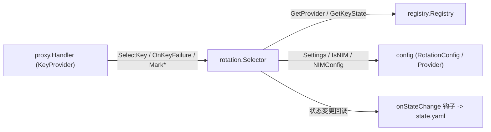
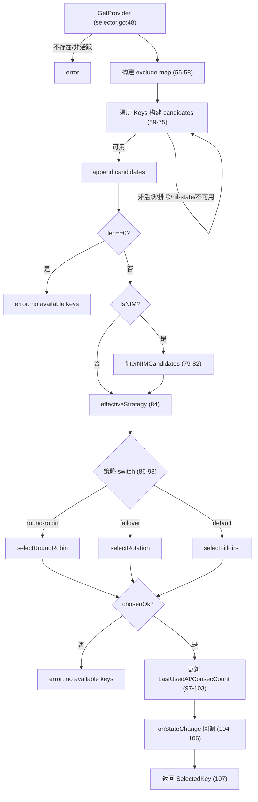
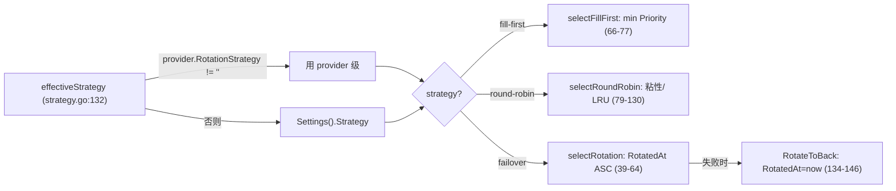
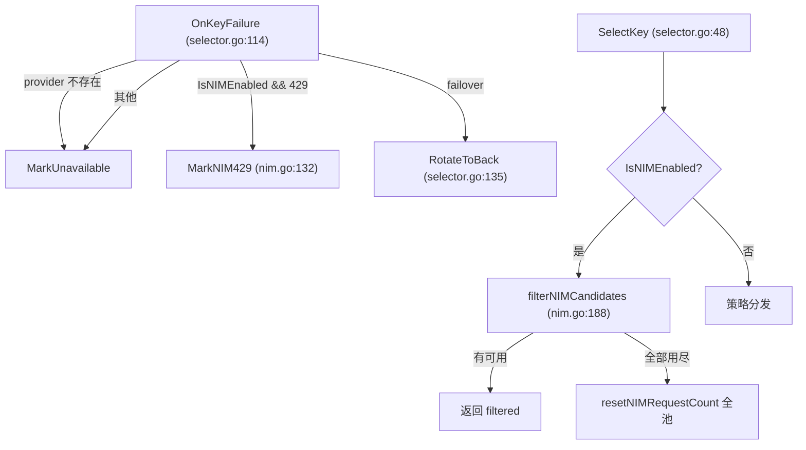

# TinyRouter Rotation Key 轮询架构

> **文档定位：** `internal/rotation/` 包实现的 canonical 架构事实基线。后续设计、排障和代码评审应先读取本文，再按“源码锚点”核对本次变更涉及的局部代码。
>
> **最后核对：** 2026-07-18，仓库工作区（`main`）。本文描述的是当时源码的实际行为，不把规划或历史设计稿当作现状。

> **2026-07-18 更新（软策略修正 + Responses 路由 + 多协议探测）：** (1) **移除 anthropic 入口的 target 过滤**——`Resolver.Resolve(name, entryFormat)` 不再对 `entryFormat == EntryFormatAnthropic` 做 `IsAnthropic()` 过滤（resolver.go:103-118 已删除），现对所有 `entryFormat` 返回同一 target 集合；`entryFormat` 参数保留但不再被消费（供未来扩展）。(2) **新增 OpenAI Responses 入口** `EntryFormatOpenAIResponses`（resolver.go:22-25），与 OpenAI Chat / Anthropic 并列。(3) **协议感知 usage 提取**——OpenAI Chat / Responses 入口走 `util.ExtractTokens`；Anthropic 入口走 `parseAnthropicSSEUsage`（`internal/proxy/stream.go:415-450`）提取 `message_start`/`message_delta` 的 input/output tokens 并复用 `recordUsage`。(4) **多协议探测**——`api/probe_model.go`+`probe_common.go` 三协议并发探测，结果写回 `config.ModelDef.Protocols` 与 `state.yaml` 的 `probes` map。rotation 仍对协议无感知，Key 轮询/冷却/退避对三入口完全复用同一套机制。详见 §4.4、§5（usage）、§17、§18。

## 1. 范围与结论

`internal/rotation/` 是 TinyRouter 的 **Key 轮询（Rotation）模块**，承载 provider 下多个 key 的选取与 per-key 运行时记账：冷却（cooldown）、指数退避（backoff）、配额锁（daily-quota / balance / rate-limit）、NIM 请求计数与节流、以及上游速率限制响应头的解析。它自身不处理 HTTP 转发、SSE、用量记录或管理接口。

- **谁调用它：** `internal/proxy/` 通过 `KeyProvider` 接口（proxy/interfaces.go:27-38）注入 `*rotation.Selector`，在 `forwardWithRetry` 循环中调用 `SelectKey`、`OnKeyFailure`、`WaitNIMInterval`、`OnNIMRequestSuccess`、`MarkNIM429`、`MarkDailyQuotaLocked`、`MarkRateLimited`、`MarkBalanceLocked`、`ClearError`、`Settings`；`internal/app/app.go` 作为组合根构造 `Selector` 并调用 `SetStateHook` 将状态变更回调挂到 `state.yaml` 持久化（selector.go:36-39）。
- **它调用谁：** `registry.Registry`（读取 provider/key 定义、`GetKeyState` 取得 per-key 运行时状态、state）、`config`（配置与 `Provider.IsNIM()` 判定）。rotation 不直接写磁盘；状态持久化由注入的 `onStateChange` 钩子旁路触发。



本文的核心结论：

1. rotation 自身**不拥有任何 per-key 运行时状态**：所有可变状态都存在于 `registry.KeyRuntimeState`（registry/state.go:21-45），rotation 只通过 `s.reg.GetKeyState(...)` 取得指针后用各 key 自己的 `mu` 锁可变它；`Selector` 结构体只持有 `*registry.Registry` + `*config.RotationConfig` + `onStateChange` 钩子（selector.go:24-30）。
2. 存在**两套相互独立的退避系统**：`MarkUnavailable` 用 `pow(2, BackoffLevel)` 指数退避、受 `BackoffMaxSec`（默认 300s）封顶（cooldown.go:22-49）；而 `BackoffSequence` 返回 `0,1,2,4,8,10,15,15…` 的固定表（cooldown.go:96-113），**仅由 proxy 重试循环使用，rotation 内部完全不调用**。
3. AGENTS.md §5 描述的“指数退避 …→240s max”不精确：实际默认 `BackoffMaxSec = 300`（config/defaults.go:49），封顶逻辑在 cooldown.go:34-37，且 `BackoffMaxSec==0` 时回退 300s（cooldown.go:35-37）。AGENTS.md 的“240s”更接近测试 fixture 取值，并非默认行为。
4. Key 选择通过 `SelectKey`（selector.go:47-108）完成，算法在“构建候选 → NIM 过滤 → 策略分发 → 状态更新 → 持久化回调”五段内闭环，可用性判定与状态更新分两次加锁，并发下存在“重复选中”的可能（对负载均衡器可接受，见第 13 节）。
5. NIM（NVIDIA）走独立的请求计数 + 最小间隔 + 429 阶梯冷却路径，与通用退避、failover 的 `RotatedAt` 复用同一字段，存在交叉耦合（见第 10、15 节）。

## 2. 事实优先级

出现冲突时按以下优先级判断：

1. 当前源码和测试（`internal/rotation/*`、`internal/registry/state.go`、`internal/config/types.go`、`internal/config/defaults.go`、`internal/proxy/interfaces.go` 的相关集成）；
2. 本文；
3. `AGENTS.md` / `PROJECT_MAP.md`（仅作模块边界与约定背景，其中退避上限与两套退避系统的描述不精确）；
4. 历史提交信息（仅作历史背景）。

AGENTS.md 不精确之处（以本文源码锚点为准）：

- **退避上限：** AGENTS.md 写“240s max”，实际默认 `BackoffMaxSec=300`（config/defaults.go:49），封顶在 cooldown.go:34-37。
- **两套退避系统：** AGENTS.md §5 只描述了一套指数退避；本文第 7 节指出 `BackoffSequence`（cooldown.go:96-113）是另一套仅服务于 proxy 重试循环的固定序列，rotation 内部不使用。

## 3. Selector 与归属边界

### 3.1 KeySelector 接口（selector.go:14-22）

`KeySelector` 组合 `CooldownManager` 并额外声明 `SelectKey`、`OnKeyFailure`、`Settings`、`WaitNIMInterval`、`OnNIMRequestSuccess`、`MarkNIM429`。`*Selector` 在包内以 `var _ KeySelector = (*Selector)(nil)` 做编译期接口满足检查（selector.go:160-161）。

### 3.2 Selector 结构体与构造（selector.go:24-30、32-34）

```go
type Selector struct {
    reg        *registry.Registry
    settings   *config.RotationConfig
    settingsMu sync.RWMutex

    onStateChange func() // injected by main.go for state persistence
}
```

`New(reg, settings)` 仅把两个指针存入，不分配运行时状态（selector.go:32-34）。`SetStateHook`（selector.go:36-39）注入 `onStateChange` 回调，每当 per-key 状态变更后调用，供上层持久化 `state.yaml`。

### 3.3 归属边界：状态归 registry，rotation 只可变

`KeyRuntimeState` 由 `registry` 拥有（registry/state.go:21-45），包含 `BackoffLevel`、`ModelLocks`、`ModelStatus`、`ModelErrors`、`LastUsedAt`、`ConsecCount`、`RotatedAt`、`InFlight` 以及 NIM 专用字段（`NIMRequestCount`/`NIMLastSendTime`/`NIMCooldownLevel`/`NIMLast429Time`）。rotation 不复制也不缓存这些状态：每次都 `s.reg.GetKeyState(providerID, keyID)` 取指针后加 `state.Lock()` 可变（如 cooldown.go:22-49、nim.go:64-83）。`Selector` 持有的 `reg`/`settings` 是指针，本身**零 per-key 状态**。

### 3.4 CooldownManager 接口（cooldown.go:14-20）

```go
type CooldownManager interface {
    MarkUnavailable(providerID, keyID, model string, statusCode int, body string) time.Time
    ClearError(providerID, keyID, model string)
    MarkDailyQuotaLocked(providerID, keyID, model string, body string) time.Time
    MarkRateLimited(providerID, keyID, model string, duration time.Duration) time.Time
    MarkBalanceLocked(providerID, keyID, model, body string) time.Time
}
```

编译期检查 `var _ CooldownManager = (*Selector)(nil)`（cooldown.go:204-205）。注意 `KeySelector` 含 `MarkUnavailable`、但 proxy 的 `KeyProvider`（proxy/interfaces.go:27-38）是**严格子集，省略了 `MarkUnavailable`**——proxy 只通过 `OnKeyFailure` 间接触发冷却（selector.go:113-129），不直接调用 `MarkUnavailable`。

## 4. KeyProvider 接口实现

proxy 通过 `KeyProvider`（proxy/interfaces.go:27-38）调用以下方法，`*Selector` 全部结构满足：

| 方法 | 实现位置 | 行为（一行） |
|---|---|---|
| `SelectKey(providerID, model, excludeKeyIDs)` | selector.go:47-108 | 按 provider 构建候选，套用策略选 key，更新 `LastUsedAt`/`ConsecCount`，触发 `onStateChange` |
| `WaitNIMInterval(providerID, keyID)` | nim.go:41-59 | 返回该 key 还需等待的最小发送间隔（`min_interval_ms`），无前次发送返回 0 |
| `ClearError(providerID, keyID, model)` | cooldown.go:51-68 | 删除该 model 的 `ModelLocks`/`ModelStatus`/`ModelErrors`，无残留锁时 `BackoffLevel` 归零 |
| `OnNIMRequestSuccess(providerID, keyID, model)` | nim.go:64-83 | NIM 计数 +1、刷新 `NIMLastSendTime`，达阈值则计数清零并 `RotatedAt=now` |
| `Settings()` | selector.go:148-152 | 读 `settingsMu.RLock` 返回 `*config.RotationConfig` 副本 |
| `OnKeyFailure(providerID, keyID, model, statusCode, body)` | selector.go:113-129 | 策略感知失败处理：NIM 429→`MarkNIM429`；failover→`RotateToBack`；其余→`MarkUnavailable` |
| `MarkNIM429(providerID, keyID, model)` | nim.go:89-121 | NIM 429 阶梯冷却，设 `ModelLocks[model]`，重置 24h 并 `RotatedAt=now` |
| `MarkDailyQuotaLocked(providerID, keyID, model, body)` | cooldown.go:143-159 | 锁定到次日 CST 00:05，`ModelStatus="locked"` |
| `MarkRateLimited(providerID, keyID, model, duration)` | cooldown.go:186-202 | 固定时长冷却，**不**递增 `BackoffLevel` |
| `MarkBalanceLocked(providerID, keyID, model, body)` | cooldown.go:165-181 | 机制同 `MarkDailyQuotaLocked`（锁定至次日 00:05，非永久） |

`SelectedKey` 为 `SelectKey` 的返回结构（selector.go:41-45）：

```go
type SelectedKey struct {
    Provider config.Provider
    Key      config.Key
    KeyName  string
}
```

### 4.4 Combo 解析的入口协议过滤（entryFormat，已移除）

rotation 模块本身**不感知协议**，combo 解析入口原本因 Anthropic 协议路由而有一层协议过滤，现**已移除**：

- **`entryFormat` 不再过滤 target：** `combo.Resolver.Resolve(name, entryFormat)` 对所有 `entryFormat`（OpenAI / Anthropic / OpenAI-Responses）返回同一 target 集合（resolver.go:70-135，旧 `entryFormat == EntryFormatAnthropic` 的 `IsAnthropic()` 过滤分支已删除，原 resolver.go:103-118）。`entryFormat` 参数保留但不再被消费（见 `Resolve` doc comment，供未来扩展）。
- **软策略下不做 provider 准入：** proxy 层也已删除入口协议严格匹配（见 proxy-architecture.md §3.3、§13.1），故 combo 不需要按协议预筛 target；同一 combo 可同时被三入口访问，上游构造由 `entryFormat` 在 `forwardUpstream` 内分支决定（proxy-architecture.md §7.1）。
- `EntryFormat` 类型与常量定义于 resolver.go:14-25（`EntryFormatOpenAI` / `EntryFormatAnthropic` / `EntryFormatOpenAIResponses`），经 `handleCombo` → `forwardWithRetry` 一路下传（forward.go:102-142 的 `entryFormat` 参数）。

> 关键点：protocol filtering **已不在 combo 解析层发生**；rotation 的 `SelectKey` / 冷却 / 退避 / 配额锁对 combo 解析出的全部 target **完全复用同一套机制**，不因协议不同而分支。

### 4.5 协议感知 usage 提取

rotation 模块不负责 usage 提取，但本协议相关的提取路径如下（由 `internal/proxy` 承担，详见 proxy-architecture.md §8.8/§8.9）：

- **OpenAI Chat / OpenAI Responses 入口（`EntryFormatOpenAI` / `EntryFormatOpenAIResponses`）：** 走 `util.ExtractTokens` 提取 `input_tokens`/`output_tokens`（SSE 与结构兼容）。
- **Anthropic 入口（`EntryFormatAnthropic`）：** 走 `parseAnthropicSSEUsage`（`internal/proxy/stream.go:415-450`）读取 `message_start`（`data.message.usage.input_tokens`）与 `message_delta`（`data.usage.output_tokens`）事件提取 token，并复用 `recordUsage` 机制上报；OpenAI `util.ExtractTokens` 在 anthropic 入口被 guard 跳过（避免 anthropic `output_tokens` 把 `input_tokens` 误置 0）。

> 无论哪个入口，usage 上报都进入同一 `recordUsage` → `usage.RingBuffer` 通道，rotation 仅按 `provider`/key 维度消费用量展示（`QuotaTracker`），与协议无关。

## 5. SelectKey 选择算法

`SelectKey`（selector.go:47-108）完整流程，按代码顺序：

1. **取 provider：** `s.reg.GetProvider(providerID)`（selector.go:48）；不存在 → 错误（selector.go:49-51）；`!provider.IsActive` → 错误（selector.go:52-54）。
2. **构建排除表：** 把 `excludeKeyIDs` 装入 `map[string]bool`（selector.go:55-58）。
3. **遍历 key 构建候选：** 对每个 `k in provider.Keys`（selector.go:59-75）：
   - `!k.IsActive` → 跳过（selector.go:61-63）；
   - `exclude[k.ID]` → 跳过（selector.go:64-66）；
   - `s.reg.GetKeyState(...) == nil` → 跳过（selector.go:67-70）；
   - `!s.isKeyAvailable(state, model)` → 跳过（selector.go:71-73，含未来模型锁与过期清扫）；
   - 否则加入 `candidates`（selector.go:74）。
4. **空候选 → 错误：** `len(candidates)==0` 返回 `"no available keys"`（selector.go:76-78）。
5. **NIM 过滤：** `provider.IsNIM()` 为真时 `candidates = s.filterNIMCandidates(provider.ID, candidates)`（selector.go:79-82，nim.go:144-171）。
6. **策略分发：** `strategy := s.effectiveStrategy(provider)`（selector.go:84），`switch`（selector.go:86-93）：`"round-robin"`→`selectRoundRobin`、`"failover"`→`selectRotation`、默认→`selectFillFirst`。
7. **未选中 → 错误：** `!chosenOk` 返回 `"no available keys"`（selector.go:94-96）。
8. **状态更新：** 重新 `GetKeyState(chosen)`，加锁置 `LastUsedAt=now`、`ConsecCount++`（selector.go:97-103）。
9. **持久化回调：** `s.onStateChange != nil` 时调用（selector.go:104-106）。
10. **返回：** `&SelectedKey{Provider:*provider, Key:chosen, KeyName:chosen.Name}`（selector.go:107）。



## 6. 轮询策略

### 6.1 策略解析

- **`effectiveStrategy`（strategy.go:132-137）：** provider 级 `RotationStrategy` 非空则优先（strategy.go:133-135），否则回退全局 `Settings().Strategy`（strategy.go:136）。
- **`effectiveStickyLimit`（strategy.go:139-144）：** provider 级 `StickyLimit > 0` 优先（strategy.go:140-142），否则全局 `Settings().StickyLimit`（strategy.go:143）。全局默认 `StickyLimit=3`（config/defaults.go:46），`round-robin` 内 `stickyLimit<=0` 再兜底为 3（strategy.go:84-86）。

### 6.2 三种策略

| 策略 | 实现 | 选择逻辑 |
|---|---|---|
| `fill-first`（默认全局，config/defaults.go:45） | `selectFillFirst`（strategy.go:66-77） | 在候选中取 `Priority` 最小者（priority ASC），忽略 `LastUsedAt`/`ConsecCount` |
| `round-robin` | `selectRoundRobin`（strategy.go:79-130） | 当前候选中 `LastUsedAt` 最新者若 `ConsecCount < stickyLimit` 则粘住；否则选 `LastUsedAt` 最旧者（LRU），并 `resetConsecCount` |
| `failover` | `selectRotation`（strategy.go:39-64） | 按 `RotatedAt` ASC（零值=从未失败=最优先）排序，平局 `Priority` ASC；成功不轮转，失败后由调用方 `RotateToBack` 置 `RotatedAt=now` |

- **failover 旋转：** `RotateToBack`（selector.go:134-146）只设 `RotatedAt=now` 与 `ModelErrors[model]`，**不**置 `ModelLock`，故该 key 仍可用、待其自然回到队首再试。
- **round-robin 粘性重置：** `selectRoundRobin` 切换到 LRU key 时调用 `resetConsecCount` 把新 key 的 `ConsecCount` 清零（strategy.go:125-128）。



## 7. 冷却与退避

### 7.1 MarkUnavailable（cooldown.go:22-49）

`MarkUnavailable` 是通用指数退避冷却：

- `state.BackoffLevel < 15` 时自增（cooldown.go:30-32），故 `BackoffLevel` 上限 **15**。
- `backoff = pow(2, BackoffLevel) * 1s`（cooldown.go:33）；`maxBackoff = Settings().BackoffMaxSec * 1s`，为 0 时回退 300s（cooldown.go:34-37）；`backoff` 超出则取 `maxBackoff`（cooldown.go:38-40）。
- 设 `state.ModelLocks[model] = now+backoff`、`ModelStatus[model]="cooldown"`、`ModelErrors[model]="<statusCode>: <body截断200>"`（cooldown.go:41-44），触发 `onStateChange`（cooldown.go:45-47）。

注意 `statusCode` **仅**用于拼接到 `ModelErrors` 文本，不参与分支（cooldown.go:44）——即不论 500/429/其它非 NIM 码，都走同一指数退避。

### 7.2 ClearError（cooldown.go:51-68）

删除该 model 的 `ModelLocks`/`ModelStatus`/`ModelErrors`（cooldown.go:59-61）；仅当 `len(ModelLocks)==0`（所有 model 锁清空）时才把 `BackoffLevel` 归零（cooldown.go:62-64）。因此**一个 key 的不同 model 冷却相互独立**，`BackoffLevel` 是 key 全局计数而非 per-model。

### 7.3 isKeyAvailable（cooldown.go:70-92）

- 若该 model 有未来 `ModelLocks` → 不可用（cooldown.go:76-79）；若已过期则就地删除（cooldown.go:80-81）。
- 遍历其余 model 锁，过期者一并清扫 `ModelLocks`/`ModelStatus`/`ModelErrors`（cooldown.go:83-89）。
- 返回可用（cooldown.go:91）。

### 7.4 BackoffSequence（cooldown.go:96-113）—— 与 MarkUnavailable 完全独立

```go
func BackoffSequence(n int) int {
    switch {
    case n <= 0:    return 0
    case n == 1:    return 1
    case n == 2:    return 2
    case n == 3:    return 4
    case n == 4:    return 8
    case n == 5:    return 10
    default:        return 15
    }
}
```

序列：`0,1,2,4,8,10,15,15,15,15,15…`（cooldown.go:95 注释）。**该表仅由 proxy 重试循环使用（见 proxy-architecture.md §9.2），rotation 内部任何路径都不调用 `BackoffSequence`。** `MarkUnavailable` 用的是 `pow(2,level)` 指数退避，二者算法、取值、调用方均不同——这是本模块最易被误读的交叉点。

## 8. 配额锁与固定冷却

### 8.1 MarkDailyQuotaLocked（cooldown.go:143-159）

设 `unlock = nextCSTMidnight05()`，`ModelLocks[model]=unlock`、`ModelStatus[model]="locked"`、`ModelErrors[model]="429 daily quota: <body>"`（cooldown.go:151-154）。

### 8.2 nextCSTMidnight05（cooldown.go:130-141）

`time.LoadLocation("Asia/Shanghai")`；失败则回退到 `time.FixedZone("CST", 8*3600)`（cooldown.go:131-134）。取 `now` 所在日的 `00:05`；若 `now` 已晚于该边界，则加 24h 得到**下一个** `00:05`（cooldown.go:135-140）。即所有“每日配额锁 / 余额锁”都锁定到次日凌晨 00:05 CST。

### 8.3 MarkBalanceLocked（cooldown.go:165-181）—— 与每日配额锁机制相同

逐字复制 `MarkDailyQuotaLocked` 的机制（`unlock=nextCSTMidnight05()`、`ModelStatus="locked"`，cooldown.go:173-176），仅 `ModelErrors` 文案为 `"402 insufficient balance: ..."`（cooldown.go:176）。**注意：代码注释声称“permanently unusable”（cooldown.go:161-164），但实际锁定到次日 00:05 即自动解除，并非永久**——注释与实现不符。

### 8.4 MarkRateLimited（cooldown.go:186-202）

`unlock = now + duration`，设 `ModelLocks[model]`、`ModelStatus="cooldown"`（cooldown.go:194-196），**不**递增 `BackoffLevel`。用于 SenseNova rpm/tpm 429 这类按账户约 60s 滑动窗口的限流（cooldown.go:183-185）。

### 8.5 IsDailyQuota429（cooldown.go:123-128）

`body==""` 或 `model==""` → `false`（cooldown.go:124-126）；否则 `strings.Contains(ToLower(body), ToLower(model))`（cooldown.go:127）。即**必须在 body 文本中能匹配到 model 字符串**才判定为每日配额 429。

## 9. 错误分类规则

### 9.1 ErrorAction 与 ErrorRule（error_rules.go:8-23）

```go
type ErrorAction int
const (
    ActionBackoff    ErrorAction = iota // 指数退避
    ActionCooldown                      // 固定时长冷却
    ActionDailyQuota                    // 每日配额锁（至次日 CST 00:05）
    ActionTransient                     // 瞬态冷却（默认 30s）
)

type ErrorRule struct {
    StatusCode  int         // 0 表示不匹配（落入默认瞬态）
    BodyMatch   string      // 对 body 的大小写不敏感子串匹配（空=跳过）
    Action      ErrorAction
    CooldownSec int         // ActionCooldown 用固定冷却秒
}
```

### 9.2 DefaultErrorRules（error_rules.go:28-50）

文本规则优先（自上而下），再状态规则：

| # | 匹配 | Action | CooldownSec |
|---|---|---|---|
| 1 | body 含 `no credentials` | ActionCooldown | 120 |
| 2 | body 含 `request not allowed` | ActionCooldown | 5 |
| 3 | body 含 `improperly formed request` | ActionCooldown | 120 |
| 4 | body 含 `rate limit` | ActionBackoff | — |
| 5 | body 含 `too many requests` | ActionBackoff | — |
| 6 | body 含 `quota exceeded` | ActionBackoff | — |
| 7 | body 含 `capacity` | ActionBackoff | — |
| 8 | body 含 `overloaded` | ActionBackoff | — |
| 9 | body 含 `insufficient_balance` | ActionDailyQuota | — |
| 10 | body 含 `insufficient balance` | ActionDailyQuota | — |
| 11 | status `401` | ActionCooldown | 120 |
| 12 | status `402` | ActionCooldown | 120 |
| 13 | status `403` | ActionCooldown | 120 |
| 14 | status `404` | ActionCooldown | 120 |
| 15 | status `429` | ActionBackoff | — |

`DefaultTransientCooldownSec = 30`（error_rules.go:53）。

### 9.3 ClassifyError（error_rules.go:58-74）

先按 `DefaultErrorRules` 顺序做 body 子串匹配（error_rules.go:61-65），命中即返回；再按 `StatusCode` 匹配（error_rules.go:67-71）；都不命中返回 `ErrorRule{Action: ActionTransient, CooldownSec: DefaultTransientCooldownSec}`（error_rules.go:73）。匹配是**贪婪子串**（任意包含即命中，error_rules.go:62、68）。

### 9.4 IsBalanceExhausted（error_rules.go:80-86）

仅当 `statusCode==402` 且 body 含 `insufficient_balance` 或 `insufficient balance` 时为真（error_rules.go:81-85）；用于 ModelScope 402 余额耗尽判定。

## 10. NIM 支持

NIM（NVIDIA）走独立路径，由 `Provider.IsNIM()`（config/types.go:102-107，APIType=="nim" 或 BaseURL 含 "nvidia"）自动判定。此外，**非 NIM provider 下的单个 model 也可通过 `ModelNIMOverride` 独立启用 NIM 限速**（见 10.6 节）。provider 级别 NIM 优先级高于 model 级别。

### 10.1 配置与默认值

- `NIMSettings`（config/types.go:121-126）：`RequestCountPerKey`、`MinIntervalMs`、`CooldownLadderMin`、`MaxConcurrent`。
- `ModelNIMOverride`（config/types.go:40-48）：per-model 级别 NIM 覆盖，含 `Enabled`、`RequestCountPerKey`、`MinIntervalMs`（无 `CooldownLadderMin`，使用默认值）。
- `getNIMDefaults`（nim.go:12-14）：`reqCount=30`、`minIntervalMs=2200`、`ladder=[15,30]`（分钟）。
- `getNIMSettings`（nim.go:17-37）：无 `NIMConfig` 或字段为 0 时回退默认值（nim.go:19-35）。
- `getModelNIMOverride`（nim.go:18-35）：在 provider.Models 中查找匹配 model 的 `NIMOver` 字段；若 `nil` 或 `Enabled==false` 返回 nil。
- `getEffectiveNIMSettings`（nim.go:37-55）：先尝试 model 级别覆盖（`getModelNIMOverride`），若命中且启用则使用其值（cooldown ladder 用默认 `[15,30]`），否则回退到 provider 级别的 `getNIMSettings`。

### 10.2 最小间隔与成功计数

- `WaitNIMInterval(providerID, keyID, model)`（nim.go:82-104）：读取 `NIMLastSendTime`，若 `elapsed < minIntervalMs` 返回剩余等待，否则 0；无前次发送返回 0。`minIntervalMs` 通过 `getEffectiveNIMSettings` 解析，支持 per-model 覆盖。
- `OnNIMRequestSuccess`（nim.go:106-130）：`NIMRequestCount++`、`NIMLastSendTime=now`；达 `reqCount` 时计数清零并 `RotatedAt=now`（通过 `getEffectiveNIMSettings` 读取 `reqCount`），触发 `onStateChange`。

### 10.3 NIM 429 阶梯

`MarkNIM429`（nim.go:132-172）：若距 `NIMLast429Time` 超过 24h 则 `NIMCooldownLevel` 归零；否则 `++`；按 `ladderMin[idx]` 取时长、`idx` 越界取末项；设 `ModelLocks[model]`、`ModelStatus="cooldown"`、`NIMLast429Time=now`、`RotatedAt=now`。`ladderMin` 通过 `getEffectiveNIMSettings` 解析（provider 的 `CooldownLadderMin` 或 model 覆盖的默认 `[15,30]` 分钟）。

### 10.4 候选过滤（key 计数轮转）

`filterNIMCandidates(providerID, model, candidates)`（nim.go:188-216）：保留 `NIMRequestCount < reqCount` 的 key（经 `isNIMCandidateAvailable`）；若**全部** key 都已用尽本轮配额（无 429 冷却），则整体 `resetNIMRequestCount` 重置本轮计数再返回全部候选——即“计数轮转、无冷却”。`reqCount` 通过 `getEffectiveNIMSettings` 解析，支持 per-model 覆盖。

### 10.5 失败分发（OnKeyFailure）

`OnKeyFailure`（selector.go:114-133）：provider 不存在 → `MarkUnavailable`；**`IsNIMEnabled` 且 statusCode==429** → `MarkNIM429`；failover 策略 → `RotateToBack`；其余 → `MarkUnavailable`。`IsNIMEnabled`（selector.go:164-177）检查 provider 级别（`provider.IsNIM()`）和 model 级别（`getModelNIMOverride`）的 NIM 状态，provider 级别优先。



### 10.6 Per-model NIM 覆盖

非 NIM provider 下的单个 model 可通过 `ModelNIMOverride` 独立启用 NIM 限速：

- **配置入口：** `ModelDef.NIMOver`（config/types.go:37），YAML 字段 `model.nim`。
- **字段：** `Enabled`（bool）、`RequestCountPerKey`（int，默认 30）、`MinIntervalMs`（int，默认 2200）。
- **无 `CooldownLadderMin`**：per-model 覆盖使用默认阶梯 `[15, 30]` 分钟。
- **优先级：** provider 级别 `IsNIM()` 为 true 时，model 级别 `NIMOverride` 被忽略，所有 model 使用 provider 的 `NIMConfig`。
- **生效路径：** `getModelNIMOverride`（nim.go:18-35）在 provider.Models 中查找匹配 model 的 `NIMOver`；`getEffectiveNIMSettings`（nim.go:37-55）先查 model 覆盖，未命中或未启用时回退到 `getNIMSettings`；所有 NIM 方法（`WaitNIMInterval`、`OnNIMRequestSuccess`、`MarkNIM429`、`filterNIMCandidates`）均通过 `getEffectiveNIMSettings` 读取参数。
- **门控：** `IsNIMEnabled(providerID, model)`（selector.go:164-177）代替 `provider.IsNIM()` 作为 NIM 限速的总入口，proxy 层（forward.go、retry.go）和 `SelectKey`、`OnKeyFailure` 均使用此方法。

## 11. 速率限制头解析

`ratelimit.go` 仅做**观测 / 记账**，不参与选择门控。

- `QuotaSnapshot`（ratelimit.go:13-18）：`ModelLimit`/`ModelRemaining`/`GlobalLimit`/`GlobalRemaining`。
- `HasQuota`（ratelimit.go:21-23）：`ModelLimit>0 || GlobalLimit>0` 即认为有配额信息；`ModelExhausted`（ratelimit.go:26-28）：`ModelLimit>0 && ModelRemaining==0`。
- `RatelimitAdapter` 接口（ratelimit.go:31-33）：`ParseHeaders(http.Header) *QuotaSnapshot`。
- `ModelScopeAdapter`（ratelimit.go:36-49）：解析 `Modelscope-Ratelimit-*` 头，两关键头皆空则返回 nil。
- `NoopAdapter`（ratelimit.go:52-56）：永远返回 nil。
- `adapterRegistry`（ratelimit.go:59-64）：`mu sync.RWMutex` + `entries map[string]RatelimitAdapter`，`init()` 注册 `modelscope.cn → ModelScopeAdapter`（ratelimit.go:66-68）。
- `GetAdapter`（ratelimit.go:71-80）：对 `strings.ToLower(p.BaseURL)` 做**子串**匹配已注册 pattern，命中返回对应 adapter，否则 `NoopAdapter`。

该包只暴露 `GetAdapter`/`ParseHeaders`/`HasQuota`/`ModelExhausted` 给 proxy 用于 UI 配额展示（见 proxy-architecture.md §9.2 配额头分支）；`SelectKey` 的可用性判定（isKeyAvailable）并不读取 `QuotaSnapshot`，故**速率限制头解析不构成选择门控**。

## 12. 状态模型与归属边界

| 结构体 | 位置 | 字段 / 用途 |
|---|---|---|
| `Selector` | selector.go:24-30 | `reg *registry.Registry`、`settings *config.RotationConfig`、`settingsMu sync.RWMutex`、`onStateChange func()`（**不持 per-key 状态**） |
| `SelectedKey` | selector.go:41-45 | 选中结果：`Provider`、`Key`、`KeyName` |
| `KeyRuntimeState`（registry 拥有） | registry/state.go:21-45 | per-key 运行时状态：`mu`、`BackoffLevel`、`ModelLocks`、`ModelStatus`、`ModelErrors`、`LastUsedAt`、`ConsecCount`、`RotatedAt`、`InFlight`、NIM 字段（`NIMRequestCount`/`NIMLastSendTime`/`NIMCooldownLevel`/`NIMLast429Time`） |
| `QuotaInfo` | registry/state.go:12-18 | `ModelLimit`/`ModelRemaining`/`GlobalLimit`/`GlobalRemaining`/`LastUpdated` |
| `QuotaSnapshot` | ratelimit.go:13-18 | 速率限制头解析快照：`ModelLimit`/`ModelRemaining`/`GlobalLimit`/`GlobalRemaining` |
| `ErrorAction` | error_rules.go:8-15 | 分类动作枚举（Backoff/Cooldown/DailyQuota/Transient） |
| `ErrorRule` | error_rules.go:17-23 | 单条分类规则：`StatusCode`/`BodyMatch`/`Action`/`CooldownSec` |
| `ModelScopeAdapter` | ratelimit.go:36 | 解析 Modelscope 速率限制头 |
| `NoopAdapter` | ratelimit.go:52 | 默认空 adapter |
| `adapterRegistry` | ratelimit.go:59-64 | adapter 注册表（`mu` + `entries`） |
| `KeySelector`（接口） | selector.go:14-22 | 包内完整能力接口（含 `MarkUnavailable`） |
| `CooldownManager`（接口） | cooldown.go:14-20 | 冷却/锁能力接口 |
| `RatelimitAdapter`（接口） | ratelimit.go:31-33 | 速率限制头解析接口 |

**归属边界重申：** `KeyRuntimeState` 由 `registry` 拥有并持久化到 `state.yaml`；rotation 只读取指针 + 加各 key 自己的 `mu` 可变，不在 `Selector` 内缓存任何 per-key 状态。`QuotaInfo` 也位于 registry（registry/state.go:12-18），由 `UpdateQuota` 写入、`GetQuota` 读取（registry/state.go:166-186）。

## 13. 并发模型

- **per-key 状态互斥：** 每个 `KeyRuntimeState` 自带 `mu sync.Mutex`（registry/state.go:22），所有读写都 `state.Lock()`/`Unlock()`（如 cooldown.go:27-28、nim.go:69-70、selector.go:99-102）。
- **细粒度、无 rotation 级大锁：** rotation 不在持有某 key 锁时跨越 registry 调用；每次变更都是“取指针 → 加锁 → 改 → 解锁”的短临界区，无包级锁覆盖多次 registry 访问。
- **config 读写的 `settingsMu`：** `Settings()` 用 `RLock`、`UpdateSettings` 用 `Lock`（selector.go:148-158）。
- **adapterRegistry 的 `RWMutex`：** `GetAdapter` 读用 `RLock`（ratelimit.go:72-73），注册（仅 `init`）写用隐含写锁。
- **SelectKey 非原子 race（可接受）：** 可用性判定 `isKeyAvailable`（selector.go:71）与选中后状态更新（selector.go:97-103）是**两次独立加锁**，且中间隔着策略选择与 `GetKeyState` 二次取指。高并发下两个 goroutine 可能都通过可用性检查、分别选中同一 key（“重复选中”）。这在负载均衡场景可接受（下游重试/冷却会纠正），但非严格互斥。

## 14. 配置集成

### 14.1 RotationConfig（config/types.go:11-19）

| 字段 | 消费方 |
|---|---|
| `Strategy` | rotation 内 `effectiveStrategy`（strategy.go:133、136） |
| `StickyLimit` | rotation 内 `effectiveStickyLimit`（strategy.go:141、143） |
| `BackoffMaxSec` | rotation 内 `MarkUnavailable` 封顶（cooldown.go:34-37） |
| `MaxRetries` | **rotation 不读**，由 proxy 重试循环（`Settings().MaxRetries`，见 proxy-architecture.md §9.1）消费 |
| `RetryDelaySec` | **rotation 不读**，由 proxy 重试循环消费 |
| `StatePersist` / `StatePath` | 持久化开关/路径，由上层 state 模块消费，非 rotation 内部逻辑 |

### 14.2 NIMSettings 与 per-provider 覆盖

- `NIMSettings`（config/types.go:121-126）：`MaxConcurrent` 字段**永不被 rotation 读取**（getNIMSettings 只取 `RequestCountPerKey`/`MinIntervalMs`/`CooldownLadderMin`，nim.go:23-34），属于死字段。
- per-provider 覆盖：`Provider.RotationStrategy`（config/types.go:83）覆盖全局 `Strategy`；`Provider.StickyLimit`（config/types.go:84）覆盖全局 `StickyLimit`；`Provider.NIMConfig`（config/types.go:92）提供 NIM 参数。

### 14.3 默认值（config/defaults.go:44-52）

`Rotation: {Strategy:"fill-first", StickyLimit:3, MaxRetries:5, RetryDelaySec:5, BackoffMaxSec:300, StatePersist:true, StatePath:"state.yaml"}`。即默认全局策略 **fill-first**（config/defaults.go:45），默认 `BackoffMaxSec=300`（与 AGENTS.md 的“240s”不同，见第 2 节）。

## 15. 已知约束与风险

以下为当前实现事实，不代表都要在同一轮修复：

1. **两套独立退避系统：** `MarkUnavailable` 用 `pow(2,level)` 指数退避（cooldown.go:33），`BackoffSequence` 是另一套固定表（cooldown.go:96-113）且仅 proxy 用——二者算法、取值、调用方均不同，易被误读为一处。
2. **BackoffLevel 是 key 全局、锁是 per-model：** 退避等级 `BackoffLevel` 跨 model 共享（cooldown.go:30-32），但 `ModelLocks` 按 model 分别维护（cooldown.go:42）；任一 model 冷却都会抬高全局 `BackoffLevel`，且 `ClearError` 只在所有 model 锁清空时才归零（cooldown.go:62-64）。
3. **MarkBalanceLocked 注释与实现不符：** 注释称“permanently unusable”（cooldown.go:161-164），实际锁定到次日 00:05 即解除（cooldown.go:173），并非永久。
4. **MaxConcurrent 死字段：** `NIMSettings.MaxConcurrent`（config/types.go:125）从未被 rotation 读取，对运行无影响。
5. **MaxRetries / RetryDelaySec 不被 rotation 使用：** 二者由 proxy 重试循环消费（proxy KeyProvider `Settings()`，见 proxy-architecture.md §9），rotation 内部完全忽略。
6. **SelectKey 非原子：** 可用性检查（selector.go:71）与状态更新（selector.go:97-103）分两次加锁，并发下可能重复选中同一 key（见第 13 节）。
7. **NIM 全池重置绕过速率限制：** 当所有 key 用尽本轮计数（无 429 冷却）时，`filterNIMCandidates` 直接 `resetNIMRequestCount` 全池（nim.go:164-170），不引入任何冷却即开启新一轮。
8. **NIM RotatedAt 与 failover 共享：** `OnNIMRequestSuccess` 在计数达阈值时写 `RotatedAt=now`（nim.go:78），与 failover 的 `RotateToBack`（selector.go:141）复用同一字段，二者语义在混合策略下耦合。
9. **MarkUnavailable 不对 statusCode 分支：** `statusCode` 只拼进 `ModelErrors` 文本（cooldown.go:44），所有非 NIM 失败码走同一指数退避，错误分类（error_rules.go）与冷却动作在此解耦。
10. **BackoffLevel 封顶 15：** `if state.BackoffLevel < 15`（cooldown.go:30）使等级最大 15，`pow(2,15)` 已被 `BackoffMaxSec` 封顶，等级本身无独立上限语义。
11. **nextCSTMidnight05 时区回退：** 依赖 `Asia/Shanghai` tzdata，缺失时回退固定 +08:00（cooldown.go:131-134）；极端环境（tzdata 错误）可能导致边界偏移。
12. **ClassifyError 贪婪子串匹配：** 任意 body 子串包含即命中（error_rules.go:62、68），如正常文本恰含 “capacity” 等词会被误分类为退避。
13. **IsDailyQuota429 要求 body 含 model：** 必须 `strings.Contains(lower(body), lower(model))`（cooldown.go:127），model 字符串未出现在 body 时即使确为每日配额 429 也会漏判。

## 16. 测试与验证现状

### 16.1 测试文件与覆盖

| 测试文件 | 覆盖内容 |
|---|---|
| `selector_test.go` | `selectFillFirst` 选最低优先级、排除 key、跳过非活跃 key、跳过冷却 key；`selectRoundRobin` 粘性至 limit、切到 LRU、首用选首 key、三 key 粘性耗尽切换；`selectRotation`（failover）首选调最低优先级、失败后 `RotateToBack`、队列循环、fill-first 仍走 `MarkUnavailable` |
| `cooldown_test.go` | `MarkUnavailable` 指数退避（含 429 BackoffLevel=3）、`ClearError` 清单 model 锁 / 保留他 model 锁并保 `BackoffLevel`、`isKeyAvailable` 过期锁清扫、`IsDailyQuota429`、`MarkDailyQuotaLocked`、`MarkBalanceLocked`、`IsBalanceExhausted`、`nextCSTMidnight05`、`BackoffSequence` |
| `error_rules_test.go` | `ClassifyError` 文本优先于状态、余额每日锁、状态码回退（401→Cooldown 120）、瞬态回退、”request not allowed“→Cooldown 5s |
| `nim_test.go` | NIM failover 计数达阈值后切 key、`RotateNoCooldown` 全池重置、MarkNIM429 阶梯冷却与封顶、24h 后等级重置、`WaitNIMInterval` 最小间隔、计数+429 混合态下 `filterNIMCandidates` 重置 |
| `ratelimit_test.go` | `GetAdapter` modelscope→ModelScopeAdapter / 默认→NoopAdapter、`ModelScopeAdapter.ParseHeaders` 正常/耗尽/无头、`NoopAdapter.ParseHeaders` 返回 nil、`atoiSafe` |

### 16.2 已测 vs 未测

- **已测：** fill-first / round-robin / failover 选择；指数退避与 ClearError 锁语义；每日配额锁 / 余额锁 / 毫秒边界；错误分类文本优先与状态码回退；NIM 计数轮转、429 阶梯、24h 重置、最小间隔、全池重置；速率限制头解析与 adapter 路由。
- **未充分覆盖（按源码锚点）：**
  - **`effectiveStrategy` 覆盖解析：** provider 级 `RotationStrategy` 优先于全局的分支（strategy.go:133-135）无专门单测，现有测试只经全局 `Strategy` 间接覆盖。
  - **`Settings` / `UpdateSettings`：** 配置读写（selector.go:148-158）无测试。
  - **`SetStateHook`：** `onStateChange` 钩子触发（selector.go:36-39、104-106）无任何测试验证其被调用。
  - **`MarkRateLimited` 包内调用：** 固定时长冷却（cooldown.go:186-202）无测试。
  - **`BackoffMaxSec=0` 回退：** 封顶为 0 时回退 300s 的分支（cooldown.go:35-37）未测（测试 fixture 固定用 240）。
  - **跨 model 的 BackoffLevel 耦合：** `BackoffLevel` 全局共享、仅全清时归零（第 15 节 #2）无测试。
  - **`getNIMSettings` 默认值回退：** provider 无 `NIMConfig` 时回退默认值（nim.go:19-35）未直接测（测试均显式设 `NIMConfig`）。
  - **`filterNIMCandidates` 部分耗尽：** 仅“全池耗尽重置”路径被测（nim_test.go）；部分 key 计数达阈值、其余可用的过滤分支（nim.go:148-156 `filtered` 非空返回）未专门测。

### 16.3 建议验证命令

```powershell
go test ./internal/rotation/...
go test ./...
go build -o tinyrouter .
```

涉及策略 / 冷却 / NIM / 错误分类 / 速率限制头的修改，应优先跑 `selector_test.go`、`cooldown_test.go`、`nim_test.go`、`error_rules_test.go`、`ratelimit_test.go`，并手工用浏览器验证选择分布、冷却恢复与 NIM 节流表现。

## 17. 源码锚点

本包（internal/rotation）：

- `selector.go`：KeySelector 接口（xx-xx）、Selector 结构体（xx-xx）、New（xx-xx）、SetStateHook（xx-xx）、SelectedKey（xx-xx）、SelectKey 算法（xx-xx）、IsNIMEnabled（xx-xx）、OnKeyFailure 分发（xx-xx）、RotateToBack（xx-xx）、Settings（xx-xx）、UpdateSettings（xx-xx）、编译期检查（xx-xx）。
- `strategy.go`：selectRotation（39-64）、selectFillFirst（66-77）、selectRoundRobin（79-130）、effectiveStrategy（132-137）、effectiveStickyLimit（139-144）。
- `cooldown.go`：CooldownManager 接口（14-20）、MarkUnavailable（22-49）、ClearError（51-68）、isKeyAvailable（70-92）、BackoffSequence（96-113）、IsDailyQuota429（123-128）、nextCSTMidnight05（130-141）、MarkDailyQuotaLocked（143-159）、MarkBalanceLocked（165-181）、MarkRateLimited（186-202）、编译期检查（204-205）。
- `error_rules.go`：ErrorAction（8-15）、ErrorRule（17-23）、DefaultErrorRules（28-50）、DefaultTransientCooldownSec（53）、ClassifyError（58-74）、IsBalanceExhausted（80-86）。
- `nim.go`：getNIMDefaults（xx-xx）、getNIMSettings（xx-xx）、getModelNIMOverride（xx-xx）、getEffectiveNIMSettings（xx-xx）、WaitNIMInterval（xx-xx）、OnNIMRequestSuccess（xx-xx）、MarkNIM429（xx-xx）、isNIMCandidateAvailable（xx-xx）、resetNIMRequestCount（xx-xx）、filterNIMCandidates（xx-xx）。
- `ratelimit.go`：QuotaSnapshot（13-18）、HasQuota/ModelExhausted（21-28）、RatelimitAdapter（31-33）、ModelScopeAdapter（36-49）、NoopAdapter（52-56）、adapterRegistry（59-64）、GetAdapter（71-80）、atoiSafe（82-85）。

外部依赖：

- `internal/registry/state.go`：KeyRuntimeState 承载 per-key 运行时状态（21-45）、QuotaInfo（12-18）、GetKeyState（69-73）、Inc/Dec/GetInFlight（48-60）、UpdateQuota/GetQuota（166-186）。
- `internal/config/types.go`：RotationConfig（11-19）、Provider（74-96，含 RotationStrategy 83、StickyLimit 84、NIMConfig 92、AnthropicVersion 96、AnthropicBeta 97、IsAnthropic 139-141）、ModelDef（32-38，含 Alias 35、Note 36、NIMOver 37、Protocols 50）、ModelNIMOverride（44-48）、IsNIM（102-107）、NIMSettings（121-126）、Config.Rotation（208）、Protocol 合法值常量 `ProtocolOpenAICompat`/`ProtocolOpenAIResponses`/`ProtocolAnthropic`（types.go:31-37）。
- `internal/combo/resolver.go`：EntryFormat 类型与常量（14-25，含新增 `EntryFormatOpenAIResponses` 22-25）、Resolve（60-135，**不再按 entryFormat 过滤 target**，原 103-118 的 anthropic `IsAnthropic()` 过滤已移除）、rotateTargets（139-165）、sortTargetsByTier（210-227）。
- `internal/config/defaults.go`：DefaultConfig 的 Rotation 默认（44-52，含 Strategy 45、StickyLimit 46、MaxRetries 47、RetryDelaySec 48、BackoffMaxSec 49）。
- `internal/proxy/interfaces.go`：KeyProvider（xx-xx，含 IsNIMEnabled、WaitNIMInterval 带 model 参数，省略 MarkUnavailable 的 KeySelector 子集）。

## 18. 变更维护清单

| 变更类型 | 必查位置 |
|---|---|
| 新增/修改策略 | strategy.go（selectFillFirst/selectRoundRobin/selectRotation）+ effectiveStrategy（132-137）+ config RotationStrategy/StickyLimit/默认值（types.go:83-84、defaults.go:44-52） |
| 修改冷却 / 退避 | cooldown.go MarkUnavailable（22-49）与 BackoffSequence（96-113）+ BackoffMaxSec（34-37、defaults.go:49）；注意两套系统相互独立 |
| 修改配额锁 | nextCSTMidnight05（130-141）+ MarkDailyQuotaLocked（143-159）/ MarkBalanceLocked（165-181）+ IsDailyQuota429（123-128） |
| 修改错误分类 | error_rules.go DefaultErrorRules（28-50）+ ClassifyError（58-74）+ IsBalanceExhausted（80-86）+ DefaultTransientCooldownSec（53） |
| 修改 NIM | nim.go（getNIMSettings/getModelNIMOverride/getEffectiveNIMSettings/WaitNIMInterval/OnNIMRequestSuccess/MarkNIM429/filterNIMCandidates）+ config NIMSettings（121-126）+ ModelNIMOverride（40-48）+ IsNIM（102-107）+ selector.go IsNIMEnabled + OnKeyFailure NIM 分支 + proxy 层 IsNIMEnabled 门控（forward.go、retry.go） |
| 修改速率限制头 | ratelimit.go 各 Adapter（36-56）+ adapterRegistry（59-64）+ GetAdapter（71-80） |
| 修改运行时状态字段 | registry/state.go KeyRuntimeState（21-45）+ state.yaml 快照/恢复（SnapshotKeyState 90-116、RestoreKeyState 130-163） |
| 新增/修改 Anthropic 协议路由（combo 入口过滤，已移除） | combo/resolver.go `Resolve(name, entryFormat)` **不再**做 `entryFormat==EntryFormatAnthropic` 的 `IsAnthropic()` 过滤（原 103-118 已删除，现 resolver.go:70-135 对所有 entryFormat 返回同一 target 集合）；EntryFormat 类型（14-25，新增 `EntryFormatOpenAIResponses` 22-25）；rotation 的 SelectKey / 冷却 / 退避 / 配额锁对三入口 provider 复用同一套机制（selector.go:47-108、cooldown.go、error_rules.go，不按协议分支） |
| 软策略修正 / Responses 路由 / 多协议探测 | combo/resolver.go 移除 anthropic `IsAnthropic()` 过滤 + 保留 `entryFormat` 参数（供未来扩展）；config/types.go `ModelDef.Protocols`（50）+ `Protocol*` 常量（31-37）+ validate.go `validateModelDef`；proxy/forward.go 删除入口协议严格匹配（§13.1）+ upstream.go 三分支 + stream.go `parseAnthropicSSEUsage`（415-450）；api/probe_model.go+probe_common.go 三协议并发复合探测（写回 ModelDef.Protocols + state.yaml probes）；registry `UpdateModelProtocols` + `UpdateProbeRecord`/`GetProbeRecord`/`SnapshotProbeRecords`/`RestoreProbeRecord` + `WithProbeStateProvider`（app.go:166） |
