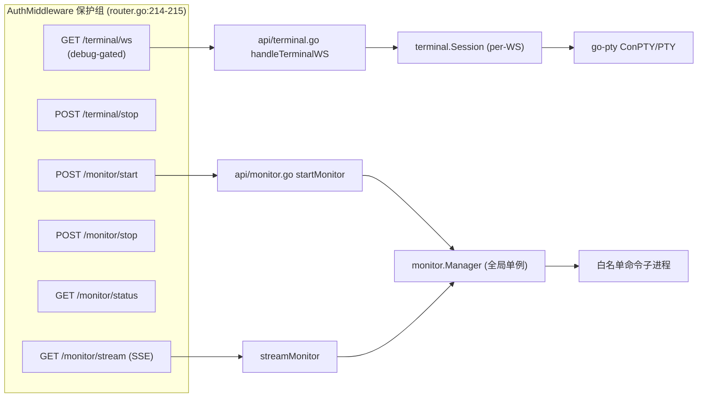
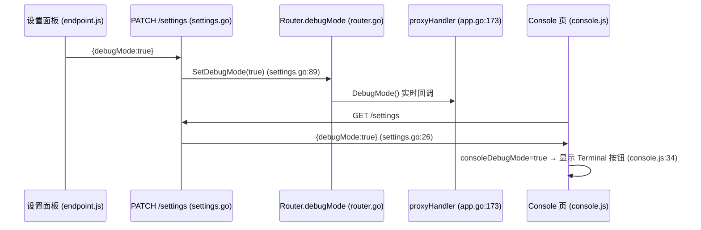

# TinyRouter Terminal + Monitor 架构（终端 + 监控）

> **文档定位：** `internal/terminal/`（交互式 PTY over WebSocket）、`internal/monitor/`（白名单 shell 命令、SSE 输出）、对应 API `internal/api/terminal.go` / `internal/api/monitor.go` 与前端 `web/static/terminal.js` / `web/static/monitor.js` 的 canonical 架构事实基线。后续设计、排障和代码评审应先读取本文，再按“源码锚点”核对本次变更涉及的局部代码。
>
> **最后核对：** 2026-07-19，仓库工作区（`main`）。**外延修复**（不改变本文覆盖的 terminal/monitor 架构本身，仅触及承载页面）：`web/static/console.js` 的 `startConsoleStream` 删除冗余的 `apiGet('/console-logs')` 历史拉取——`/api/console-logs/stream` 的 SSE 流在握手后已先回放全部历史行（见 `internal/api/console_logs.go` 的 `streamConsoleLogs` L33-38 "Send existing lines first"），此前同时做 REST 拉取 + SSE 回放导致已存在的日志行被渲染两次。Terminal/Monitor 主流程未变。基线仍为 `2026-07-13 提交 c2f89c6`。本文描述的是当时源码的实际行为，不把规划或历史设计稿当作现状。

## 1. 范围与结论

`internal/terminal/` 与 `internal/monitor/` 是 TinyRouter 管理 UI 中的**两个独立的运维/调试工具特性**，二者都挂在 `AuthMiddleware` 保护组内、与 LLM 代理（`internal/proxy/`、`/v1/*`）职责正交——它们不转发任何 LLM 流量，只分别提供“交互式 shell”与“单条白名单命令的实时输出流”。二者共享的只有：HTTP 服务器（`internal/api/router.go`）、`internal/console.Logger`、`internal/config` 与 `AuthMiddleware` 鉴权边界（router.go:214-215、276-283）。

- **Terminal（终端）**：通过 WebSocket 在浏览器里跑一个真实的 PTY 交互 shell。后端 `internal/terminal/session.go` 用 `github.com/aymanbagabas/go-pty v0.2.3`（go.mod:13、session.go:13）创建 ConPTY/PTY，前端 `web/static/terminal.js` 用内嵌的 xterm.js 渲染。
- **Monitor（监控）**：后端 `internal/monitor/manager.go` 运行**一条**白名单内的 shell 命令（默认 `nvidia-smi` 等），逐行读取 stdout/stderr 经 SSE 推到 Console 页面，前端 `web/static/monitor.js` 用 `EventSource` 订阅。



本文的核心结论：

1. **Terminal 是 debug-only + 单会话**：WebSocket 入口 `handleTerminalWS` 在 `rt.DebugMode()==false` 时返回 403（terminal.go:24-27），且全局同一时刻只允许一个活跃会话，第二个连接被拒（terminal.go:57-65）。会话随 WebSocket 断开而销毁，不持久化。
2. **Monitor 不是 debug-gated**：四条 Monitor 路由全部注册在 AuthMiddleware 组内但**不受** `DebugMode` 限制（router.go:276-279、monitor.go 全文无 debug 判断），始终可用（前提是已通过 AuthMiddleware，即 localhost 绑定或密码登录）。
3. **Monitor 是单一全局命令，无并发**：`Manager.Start` 在 `m.running` 为真时直接返回 “already running” 错误（manager.go:50-52），启动后只跑一条命令；没有超时、没有队列。
4. **二者都不持久化状态**：Terminal 的 `Session` 仅存活于单个 WebSocket 连接（session.go:18-26，每次升级新建 `NewSession`）；Monitor 的 `lineBuffer` 是内存环形缓冲（manager.go:25、157-159），进程退出即丢失，**都不写入 `state.yaml`**。
5. **`MonitorConfig.Enabled` 是惰性字段（dead）**：结构体定义在 `config/types.go:156-161`，但全代码库只有 `AllowedCommands` 与 `MaxLineLength` 被读取（monitor.go:37、router.go:94、defaults.go:104-109），`Enabled` 字段**从未被任何代码咨询**（grep 证实 `Monitor.Enabled` 零引用），对运行行为无任何影响。

## 2. 事实优先级

出现冲突时按以下优先级判断：

1. 当前源码和测试（`internal/terminal/*`、`internal/monitor/*`、`internal/api/terminal.go`、`internal/api/monitor.go`、`internal/api/router.go`、`internal/api/settings.go`、`internal/config/types.go`、`internal/config/defaults.go`、`internal/app/app.go`、`web/static/terminal.js`、`web/static/monitor.js`、`web/static/console.js`、`web/static/endpoint.js`）；
2. 本文；
3. `AGENTS.md` / `PROJECT_MAP.md`（仅作模块边界与约定背景）；
4. 历史归档计划 / 历史提交（仅作历史背景）。

## 3. 调试模式门控（跨特性）

调试模式（Debug Mode）是**运行时开关，不是配置文件的持久化字段**——它存在于 `Router.deps` 的 `debugMode atomic.Bool`（router.go:50），而非 `config.yaml`。

- **存储与读写**：`debugMode atomic.Bool` 声明于 router.go:50；`DebugMode()` 经 `rt.debugMode.Load()` 读（router.go:124-126），`SetDebugMode(on bool)` 经 `rt.debugMode.Store(on)` 写（router.go:128-130）。
- **运行时刻切换**：PATCH `/settings` 的 `debugMode` 字段在 `updateSettings` 中解析（settings.go:44），非空时调用 `rt.SetDebugMode(*updates.DebugMode)`（settings.go:88-89）；GET `/settings` 把当前值放入响应 `debugMode` 字段（settings.go:26）。
- **联接到代理**：`app.go:173` 在构造 `api.New` 之后立即 `a.proxyHandler.SetDebugModeProvider(a.apiRouter.DebugMode)`，把 `DebugMode` 作为函数指针注入代理，使代理的调试日志（Usage 页详情缓存）随开关实时生效，无需重启。
- **Terminal 受门控**：`handleTerminalWS` 第一行 `if !rt.DebugMode() { http.Error 403 }`（terminal.go:24-27）。关闭 debug 时 WebSocket 升级直接被拒，浏览器端报 “Terminal error. Terminal disconnected.”（terminal.js:89-93）。
- **Monitor 不受门控**：`monitor.go` 四个 handler 均无 `DebugMode()` 判断，路由也未加条件注册（router.go:276-279）——无论 debug 是否开启都可用。
- **前端开关可见性**：
  - `endpoint.js:39-40` 在设置面板渲染 debug 模式开关（`id="debug-mode-toggle"`，`onchange="toggleDebugMode(this.checked)"`），`toggleDebugMode` 经 `apiPatch('/settings', { debugMode })` 切换（endpoint.js:108-109）。
  - `console.js:16-22` 在进入 Console 页时 `apiGet('/settings')` 读取 `debugMode` 存入 `consoleDebugMode`；仅当 `consoleDebugMode` 为真才渲染 Terminal 按钮（console.js:34 三元表达式：`consoleDebugMode ? '<button ... id="btn-toggle-terminal">...' : ''`）。Monitor 按钮（console.js:33）始终渲染，不依赖 debug 模式。



## 4. Terminal — 会话模型

### 4.1 Session 结构体（session.go:18-26）

| 字段 | 类型 | 用途 |
|---|---|---|
| `mu` | `sync.Mutex` | 保护 pty/conn/closed 的单一锁 |
| `pty` | `pty.Pty` | go-pty 分配的伪终端（ConPTY/PTY） |
| `cmd` | `*pty.Cmd` | 绑定到 PTY 的 shell 子进程 |
| `conn` | `*websocket.Conn` | 升级后的浏览器 WebSocket 连接 |
| `cancel` | `context.CancelFunc` | 取消 context 以终结进程 |
| `closed` | `bool` | 幂等关闭标志 |
| `onClose` | `func()` | 会话关闭回调（清 activeTerm） |

> 每个 Session 都是**一次性的、per-connection** 的：WebSocket 升级成功后才 `NewSession` 创建（terminal.go:50），WS 断开 `cleanup` 即销毁，没有池、没有复用。

### 4.2 NewSession（session.go:29-90）

1. `shellPath` 为空时回落到 `defaultShell()`（session.go:30-32、104-121）。
2. `exec.LookPath(shellPath)` 校验 shell 存在（session.go:34-37）。
3. `pty.New()` 创建 PTY（session.go:39-42）。
4. `pt.CommandContext(ctx, path)` 把 shell 绑定到 PTY 的 context（session.go:44-45）。
5. **环境变量块**（session.go:46）：通过 `cmd.Env = append(os.Environ(), "TERM=xterm-256color")` 继承父进程的全部环境变量（`os.Environ()` 返回所有环境变量），再附加 `TERM=xterm-256color`。注意这里**没有**固定白名单继承——shell 子进程获得与 TinyRouter 自身完全相同的环境变量集合，唯一叠加的是 `TERM`。另注意**刻意不设** `CREATE_NO_WINDOW`（见 §4.6）。
6. `cmd.Start()` 启动 shell（session.go:69-73，失败则 cancel + 关 pty 返回错误）。
7. `session.pty.Resize(80, 24)` 初始尺寸（session.go:83）。
8. 启动**三个 goroutine**（session.go:85-87）：`readFromPTY`、`readFromWebSocket`、`waitForProcess`。

### 4.3 readFromPTY（session.go:123-144）

`defer s.cleanup()`；用 32KB 缓冲 `buf := make([]byte, 32*1024)`（session.go:125）循环 `s.pty.Read`，读到数据后加 `s.mu` 锁，当 `s.conn != nil && !s.closed` 时设置 5 秒写超时（session.go:137）、以 `websocket.BinaryMessage` 把 `buf[:n]` 发往 WS（session.go:138）、再清写超时（session.go:139）。EOF 或其他错误直接 `return`（session.go:129-132）。

### 4.4 readFromWebSocket（session.go:146-179）

`defer s.cleanup()`；循环 `s.conn.ReadMessage()`（session.go:149）。按消息类型分派：

- `websocket.TextMessage`：加锁后 `s.pty.Write([]byte(data))` 把键盘输入写进 PTY（session.go:155-160）。
- `websocket.BinaryMessage`：首字节为 opcode（`switch data[0]` session.go:165）；`0x01` =  resize（session.go:166-175）：要求 `len(data) >= 5`，`rows = data[1]<<8 | data[2]`、`cols = data[3]<<8 | data[4]`，加锁后 `s.pty.Resize(cols, rows)`。这与前端 `sendTerminalResize` 的 5 字节二进制协议一致（见 §7）。

### 4.5 waitForProcess 与清理（session.go:181-210）

- `waitForProcess`（session.go:181-184）：`_ = s.cmd.Wait()` 后调 `s.cleanup()`——shell 退出即触发清理。
- `cleanup`（session.go:186-210）：加锁，若 `s.closed` 为真则直接返回（幂等，session.go:188-191）；置 `closed=true`（session.go:192）；`cancel()`（session.go:193-195）；若 `cmd.Process != nil` 调 `killProcessGroup(pid)` 杀进程树（session.go:196-198）；`pty.Close()`（session.go:199-201）；`conn.Close()`（session.go:202-204）；解锁后调 `s.onClose()`（session.go:207-209）。
- `GetConn`（session.go:93-97）加锁返回 `s.conn`；`Close`（session.go:99-102）直接转调 `cleanup`（外部主动关闭会话用）。

### 4.6 CREATE_NO_WINDOW 说明（session.go:59-67）

代码注释明确：这里**没有**设置 `CREATE_NO_WINDOW`，尽管它会隐藏控制台窗口。原因是 go-pty 用 ConPTY（`CreatePseudoConsole`）为 shell 创建伪控制台，而 `CREATE_NO_WINDOW` 与 ConPTY 的属性列表在 `CreateProcess` 中冲突，会导致 shell 启动失败（WS 连上但立刻无输出中止）。ConPTY 本身已提供控制台，正常情况下不应出现可见窗口；但若子进程（如 `nvidia-smi`）出现窗口闪现，那是 ConPTY 的继承限制，无法从此处修复（session.go:59-67）。

## 5. Terminal — 进程生成（平台）

进程树杀逻辑按 build tag 分平台实现：

- **Windows**（`process_windows.go`，`//go:build windows`）：`killProcessGroup(pid)` 执行 `taskkill /F /T /PID <pid>`（process_windows.go:10-11）整棵树强杀。
- **Unix**（`process_unix.go`，`//go:build !windows`）：`killProcessGroup(pid)` 执行 `syscall.Kill(-pid, syscall.SIGKILL)`（process_unix.go:7-8），对进程组发 SIGKILL。

PTY/ConPTY 本身委托给第三方库 `github.com/aymanbagabas/go-pty v0.2.3`（go.mod:13、session.go:13），`pty.New()` / `pt.CommandContext` / `pty.Resize` / `pty.Read` / `pty.Write` / `pty.Close` 均为该库 API，TinyRouter 不直接处理 ConPTY 系统调用。

## 6. Terminal — API 与单会话守卫

### 6.1 Upgrader（terminal.go:11-19）

`terminalUpgrader = websocket.Upgrader`，`CheckOrigin` 为：Origin 为空返回 true；否则仅当 `origin == "http://"+Host` 或 `"https://"+Host` 才允许（terminal.go:12-18）。

### 6.2 handleTerminalWS（terminal.go:23-67）

1. **Debug 门控**：`if !rt.DebugMode() { http.Error 403 }`（terminal.go:24-27）。
2. **密码门已移除**：原位于此处的 `cfg.Security.PasswordEnabled` 校验已删除（terminal.go:29-34 注释说明），因为这些路由已落在 `AuthMiddleware` 内，localhost 绑定即安全边界，密码门会误伤未启用密码的用户导致 WS 升级 403。
3. **WS 升级**：`terminalUpgrader.Upgrade`（terminal.go:35-38），失败直接返回。
4. **onClose 回调**（terminal.go:40-48）：加 `rt.terminalMu` 锁，若 `rt.activeTerm == session` 则置 `nil`（terminal.go:42-46），并记日志。
5. **新建 Session**（terminal.go:50）：`terminal.NewSession("", conn, onClose)`，空 shellPath 触发 defaultShell 回落；失败则写错误文本并关连接返回（terminal.go:51-55）。
6. **单会话守卫**（terminal.go:57-65）：加 `rt.terminalMu` 锁，若 `rt.activeTerm != nil` 则解锁、向 WS 写 “terminal session already active”、`session.Close()` 并 `return`（terminal.go:57-63）；否则 `rt.activeTerm = session`（terminal.go:64）后解锁。

### 6.3 stopTerminal（terminal.go:69-84）

加 `rt.terminalMu` 锁，取 `session := rt.activeTerm` 并置 `nil`（terminal.go:70-73）；若 `session == nil` 返回 400 “no active terminal session”（terminal.go:75-78）；否则 `session.Close()`（terminal.go:80）后回 `{ok:true}`。

### 6.4 路由注册

两条 Terminal 路由注册在 AuthMiddleware 保护组（router.go:214-215）内（router.go:282-283）：

- `GET /terminal/ws` → `rt.handleTerminalWS`（router.go:282）
- `POST /terminal/stop` → `rt.stopTerminal`（router.go:283）

注意：两者都未额外加 debug 条件判断，`/terminal/ws` 的 debug 限制由 handler 内部 `rt.DebugMode()` 实现（terminal.go:24-27）。

## 7. Terminal — 前端

xterm.js 以静态文件形式内嵌于 `web/static/xterm/`，**不是 npm 模块**（通过 `<script>` 全局 `Terminal` 引用，terminal.js:29）。

### 7.1 渲染与初始化（terminal.js:7-106）

- `renderTerminalView`（terminal.js:7-23）：若已有活跃会话则复用已 detach 的容器并 `doFit`+`focus`（terminal.js:8-20），否则重建 `#terminal-xterm` 容器并 50ms 后 `initTerminal`（terminal.js:21-22）。
- `initTerminal`（terminal.js:25-106）：
  - `new Terminal({ cursorBlink:true, fontSize:14, fontFamily:..., theme:getTerminalTheme(), allowProposedApi:true })`（terminal.js:29-35）。
  - `terminalSession.open(container)`（terminal.js:37）。
  - 拷贝键处理（Ctrl+C / Ctrl+Shift+C 复制选区，terminal.js:40-61）。
  - `wsProtocol = https → wss : ws`（terminal.js:63），`wsUrl = ws(s)://host/api/terminal/ws`（terminal.js:64），`new WebSocket(wsUrl)`（terminal.js:66）。
  - `onopen`（terminal.js:68-74）：50ms 后 `doFit()` + `sendTerminalResize()` + `focus()`。
  - `onmessage`（terminal.js:76-86）：`Blob` → `FileReader` 读 `ArrayBuffer` → `Uint8Array` 写终端；`string` 直接 `write`。
  - `onerror`/`onclose`（terminal.js:88-94）：分别写红色 “Terminal error.” / 黄色 “Terminal disconnected.”。
  - `terminalSession.onData`（terminal.js:96-100）：WS 打开态时 `ws.send(data)` 把输入发回后端。
  - `terminalSession.onResize`（terminal.js:103-105）：触发 `sendTerminalResize()`。

### 7.2 doFit（terminal.js:121-158）

因 xterm.js 6.0 破坏了 `FitAddon` 依赖的内部 API（`_core._renderService.dimensions`，见 terminal.js:108-113 注释），这里**不使用 FitAddon**，而是手算单元格尺寸：

- 取 `.xterm-screen` 渲染尺寸，`cellW = width/cols`、`cellH = height/rows`（terminal.js:126-131，任一 ≤0 则返回）。
- 取容器尺寸、`.xterm` padding、`.xterm-viewport` 滚动条宽度（terminal.js:133-150）。
- `cols = max(2, floor((availW - scrollbarW)/cellW))`、`rows = max(1, floor(availH/cellH))`（terminal.js:152-153），变化时才 `terminalSession.resize(cols, rows)`（terminal.js:155-157）。

### 7.3 sendTerminalResize（terminal.js:160-176）

- 先 `doFit()` 再取 `cols`/`rows`（terminal.js:164-166）。
- 构造 5 字节 `Uint8Array`：`[0x01, rows>>8, rows&0xFF, cols>>8, cols&0xFF]`（terminal.js:168-173），`ws.send(resizeMsg)`（terminal.js:175）。
- 该二进制协议与后端 `readFromWebSocket` 的 `0x01` opcode 解析严格对应（session.go:165-175）。

### 7.4 停止与会话清理（terminal.js:238-244、225-236）

- `stopTerminalSession`（terminal.js:238-244）：`apiPost('/terminal/stop', {})` 后 `closeTerminalSession`，若在 terminal 子视图则切回 logs。
- `closeTerminalSession`（terminal.js:225-236）：关 `terminalWebSocket`、`terminalSession.dispose()`、移除 resize 监听。
- `handleTerminalResize`（terminal.js:178-184）：窗口 resize 事件 100ms 防抖后 `doFit`。
- `getTerminalTheme`（terminal.js:186-202）与 `cleanupTerminal`/`detachTerminalView`/`clearTerminalOutput`（terminal.js:204-248）用于主题与视图切换。

## 8. Monitor — Manager 与白名单

### 8.1 Manager 结构体（manager.go:15-28）

```go
// Manager manages a single running monitor command. Only one command runs at a time.
type Manager struct {
    mu              sync.Mutex
    cmd             *exec.Cmd
    cancel          context.CancelFunc
    running         bool
    command         string
    args            []string
    startTime       time.Time
    subscribers     map[chan string]struct{}
    subscriberMutex sync.RWMutex
    lineBuffer      []string
    maxBufferLines  int
    maxLineLength   int
}
```

| 字段 | 类型 | 用途 |
|---|---|---|
| `mu` | `sync.Mutex` | 保护 cmd/cancel/running/command/args/startTime 的单一锁 |
| `cmd` | `*exec.Cmd` | 当前运行的命令进程 |
| `cancel` | `context.CancelFunc` | 取消 context（stop 时用） |
| `running` | `bool` | 是否有命令在跑 |
| `command`/`args` | `string`/`[]string` | 当前命令与参数（供 Status 展示） |
| `startTime` | `time.Time` | 启动时刻（供 uptime） |
| `subscribers` | `map[chan string]struct{}` | SSE 订阅者集合 |
| `subscriberMutex` | `sync.RWMutex` | 保护 subscribers + lineBuffer |
| `lineBuffer` | `[]string` | 内存环形缓冲（volatile） |
| `maxBufferLines`/`maxLineLength` | `int` | 环形容量 / 单行截断长度 |

### 8.2 New（manager.go:31-43）

`New(maxBufferLines, maxLineLength)`：`maxBufferLines <= 0` 兜底 500（manager.go:32-34），`maxLineLength <= 0` 兜底 4096（manager.go:35-37），初始化 `subscribers` map 与两个默认值（manager.go:38-42）。注意实际传入值为 `monitor.New(500, cfg.Monitor.MaxLineLength)`（router.go:94），即行缓冲硬编码 500、单行长度取配置。

### 8.3 Start（manager.go:46-140）

1. 加 `mu` 锁（manager.go:47-48）。
2. **单例守卫**：`if m.running { return "already running: ..." }`（manager.go:50-52）。
3. **命令白名单**（manager.go:54-65）：仅当 `len(allowedCommands) > 0` 时才校验；大小写不敏感 `strings.EqualFold(c, command)`（manager.go:57），命中则 `allowed=true`；都不中返回 “not in the allowed list”（manager.go:62-64）。白名单来源是 `cfg.Monitor.AllowedCommands`（monitor.go:37）。
4. **参数硬化**（manager.go:67-74）：逐个 arg 检查 `strings.ContainsRune(arg, '\x00')`（含 null 字节则报错，manager.go:68-70）与 `arg == ""`（空串报错，manager.go:71-73）；**只查 null 字节与空串，不对参数内容做白名单**。
5. `exec.LookPath(command)` 解析路径（manager.go:76-79）；解析后路径在运行时存 `m.command` 用于可见性（manager.go:81-83）；注释明确声明 **PATH 影子风险**（exec.LookPath 沿 PATH 走，PATH 中靠前的恶意同名二进制可影子白名单命令，属已知接受限制）。
6. `exec.CommandContext(ctx, path, args...)` 建进程（manager.go:85-86），`setProcessGroup(cmd)` 设置进程组（manager.go:88，平台实现见 §9）。
7. 填 `m.cmd/cancel/running/command/args/startTime`，清 `lineBuffer`（manager.go:90-96）。
8. `StdoutPipe`/`StderrPipe`（manager.go:98-109，失败回滚 running+cancel）。
9. `cmd.Start()`（manager.go:111-115，失败回滚）。
10. 启动两个 `readPipe`（stdout/stderr，manager.go:117-118）与一个 `wait` goroutine（manager.go:120-137）：`cmd.Wait()` 后置 `running=false`、`cmd=nil`、cancel（manager.go:122-130），拼 “Monitor command finished” 退出消息（含错误）并经 `broadcastLine` 广播（manager.go:132-136）。

### 8.4 readPipe（manager.go:142-152）

`bufio.NewScanner`，buffer 上限 1MB（`scanner.Buffer(make([]byte,0,64*1024), 1024*1024)`，manager.go:144），逐行 `scanner.Text()`；行超 `m.maxLineLength` 时截断并追加 ` [truncated]`（manager.go:147-149），否则整行 `broadcastLine`（manager.go:150）。

### 8.5 broadcastLine（manager.go:154-172）

- 加 `subscriberMutex` 锁，把 line append 到 `lineBuffer`，超过 `maxBufferLines` 则切片保留尾部（环形，manager.go:156-159）。
- 拷贝当前 subscribers 到切片（避免持锁发送，manager.go:160-163），解锁（manager.go:164）。
- 对每个订阅者 `select { case ch <- line: default: }`——**满则丢弃**（非阻塞，绝不阻塞生产，manager.go:166-171）。

### 8.6 Stop / Status / BufferedLines / Subscribe（manager.go:175-230）

- `Stop`（manager.go:175-188）：加锁，未 running 或 cancel 为空直接返回；否则 `cancel()` 并 `killProcessGroup(m.cmd)`（manager.go:183-186）。
- `Status`（manager.go:191-204）：加锁返回 `map{running:bool}`，running 时附 `command`/`args`/`uptime`。
- `BufferedLines`（manager.go:207-214）：`subscriberMutex.RLock` 拷贝 `lineBuffer` 返回快照。
- `Subscribe`（manager.go:217-223）：建缓冲 256 的 `chan string` 并登记。
- `Unsubscribe`（manager.go:225-230）：从 map 删除（**不 close**，见 §10 并发模型）。

## 9. Monitor — 进程生成（平台）

`setProcessGroup` 与 `killProcessGroup` 按 build tag 分平台：

- **Windows**（`manager_windows.go`，`//go:build windows`）：
  - `createNoWindow = 0x08000000`（manager_windows.go:15），注释说明其防止监控命令（尤其循环型如 `nvidia-smi -l 1`）每次执行弹 cmd 窗口（manager_windows.go:11-14）。
  - `setProcessGroup`：`SysProcAttr{CreationFlags: CREATE_NEW_PROCESS_GROUP | createNoWindow}`（manager_windows.go:17-21）。
  - `killProcessGroup`：`taskkill /T /F /PID <pid>`（manager_windows.go:23-24）。
- **Unix**（`manager_unix.go`，`//go:build !windows`）：
  - `setProcessGroup`：`SysProcAttr{Setpgid: true}`（manager_unix.go:10-12）。
   - `killProcessGroup`：先 `syscall.Kill(-pid, syscall.SIGTERM)`，随后启动后台 goroutine 等待 2 秒 grace period，用 `signal 0` 探活进程组是否仍存活，若仍存活则发 `SIGKILL` 强制终止（manager_unix.go:14-31）。

> **平台差异（有意）**：Unix 上 Monitor 用 **SIGTERM → 2s grace → SIGKILL 兜底**（manager_unix.go:14-31），而 Terminal 用 **SIGKILL**（process_unix.go:8）。前者给监控命令优雅退出机会（忽略 SIGTERM 时由 SIGKILL 兜底），后者直接强制杀交互式 shell 进程组。二者都是对 `-pid`（进程组）发信号。

## 10. Monitor — API 与 SSE 流

四条路由均在 AuthMiddleware 保护组（router.go:276-279）：

| # | 方法 & 路径 | Handler (file:line) | 行为 | 响应 |
|---|---|---|---|---|
| 1 | `GET /monitor/status` | `getMonitorStatus` (monitor.go:12-15) | `rt.monitorMgr.Status()` | `application/json` |
| 2 | `POST /monitor/start` | `startMonitor` (monitor.go:17-45) | 解析 `{command,args}`，调 `Start` 并传 `cfg.Monitor.AllowedCommands` | `{ok:true}` 或 400 |
| 3 | `POST /monitor/stop` | `stopMonitor` (monitor.go:47-55) | `rt.monitorMgr.Stop()` | `{ok:true}` 或 500 |
| 4 | `GET /monitor/stream` | `streamMonitor` (monitor.go:57-94) | SSE 推送行输出 | `text/event-stream` |

- **密码门已移除**：`startMonitor` 原 `cfg.Security.PasswordEnabled` 校验已删（monitor.go:18-23 注释），理由同 Terminal——已落在 AuthMiddleware 内。
- **startMonitor**（monitor.go:17-45）：解析 body（monitor.go:24-31），`command` 空返回 400（monitor.go:32-35），`allowed := rt.reg.Config().Monitor.AllowedCommands`（monitor.go:37，从 registry 读配置快照而非过期指针，修复热重载后 `rt.cfg` 指针失效的问题），`rt.monitorMgr.Start(req.Command, req.Args, allowed)` 失败返回 400（monitor.go:38-41），成功回 `{ok:true}`。
- **streamMonitor（SSE）**（monitor.go:57-94）：
  1. 校验 `http.Flusher`（monitor.go:58-62），写 SSE 头 `text/event-stream` + `no-cache` + `keep-alive`（monitor.go:64-67）。
  2. **先重放** `BufferedLines()` 全部行，每行 `data: {"type":"line","line":...}\n\n` + flush（monitor.go:69-73）。
  3. `Subscribe()` 订阅，`defer Unsubscribe`（monitor.go:75-76）。
  4. `for` 循环 `select`（monitor.go:79-94）：`ch` 收到行 → 写 `data:` + flush（monitor.go:81-87）；`ctx.Done()` → 退出（monitor.go:88-89）；`time.After(30s)` → 写 `: keepalive\n\n` + flush（monitor.go:90-92）。

## 11. Monitor — 前端

原生 vanilla JS（无框架）。

| 函数 | 行 | 作用 |
|---|---|---|
| `renderMonitorView` | 6-8 | 渲染 `<div class="monitor-output" id="monitor-output">` |
| `getLastMonitorCommand` | 10-12 | 从 `localStorage` 取上次命令，默认 `nvidia-smi` |
| `updateMonitorButtonState` | 14-23 | 按 `monitorRunning` 切换 run/stop 按钮显隐并 disable 输入框 |
| `startMonitorCommand` | 25-50 | 按空白 split 输入为 command+args，存 localStorage，`POST /monitor/start`，成功后 `startMonitorStream` |
| `stopMonitorCommand` | 52-61 | `POST /monitor/stop`，置 `monitorRunning=false`，`stopMonitorStream` |
| `startMonitorStream` | 63-85 | `new EventSource('/api/monitor/stream')`，`onmessage` 解析 `JSON {type:line,line}` 调 `appendMonitorLine` |
| `appendMonitorLine` | 94-100 | `createElement('div')` + `className='monitor-line'` + `textContent=line`（XSS 安全）+ 自动滚到底 |
| `cleanupMonitor` | 107-110 | 置 false + `stopMonitorStream` |

- **命令拆分**（monitor.js:29-32）：`fullCommand.split(/\s+/)`，首段为 command，其余为 args 数组（与后端 `Start` 的 args 对应）。
- **输出追加安全**（monitor.js:94-100）：用 `div.textContent = line` 而非 `innerHTML`，避免命令输出中的 HTML 注入导致 XSS。
- **SSE onmessage**（monitor.js:77-84）：`JSON.parse(e.data)`，仅当 `msg.type==='line' && msg.line` 才追加，解析失败静默忽略。

## 12. 状态模型（跨特性）

| 状态持有者 | 位置 | 关键字段 | 生命周期 |
|---|---|---|---|
| `Session` | session.go:18-26 | mu/pty/cmd/conn/cancel/closed/onClose | 仅存活于单个 WebSocket 连接，关闭即销毁 |
| `Manager` | manager.go:15-28 | mu/cmd/cancel/running/subscribers/lineBuffer | 全局单例（`router.New` 注入，router.go:94），进程级存活 |
| `Router.terminalState` | router.go:61-64 | terminalMu + activeTerm | 全局单例，`activeTerm` 至多一个活跃会话 |
| `Router.deps` | router.go:48、50 | monitorMgr、debugMode(atomic.Bool) | 全局单例，debugMode 运行时可变 |
| `MonitorConfig` | config/types.go:156-161 | Enabled / AllowedCommands / MaxLineLength | 配置文件加载；仅 AllowedCommands/MaxLineLength 被读取，Enabled 死字段 |

**持久化结论**：Terminal 的 `Session` 完全 per-WS，无落盘；Monitor 的 `lineBuffer` 是内存环形（manager.go:25、157-159），进程退出即丢失。二者**都不写入 `state.yaml`**（对照 AGENTS.md：仅 key/combo 运行时状态写入 state.yaml，usage/console 仅内存）。`Router.Cleanup`（router.go:134-147）在关停时 `monitorMgr.Stop()` + 关闭 active terminal，但不做持久化。

## 13. 并发模型（跨特性）

**Terminal：**
- `Session.mu`（`sync.Mutex`）保护 `pty`/`conn`/`closed`（session.go:19），所有 pty/conn 读写都加锁（读泵 session.go:135-141、输入泵 session.go:156-160、resize session.go:170-174）。
- 每个 Session 三个 goroutine：`readFromPTY`/`readFromWebSocket`/`waitForProcess`（session.go:85-87），通过 `closed` 标志与 `cleanup` 的 `defer` 互相触发收尾。
- WS 写有 5 秒 deadline（session.go:137、139），避免卡死。
- `cleanup` 幂等：`closed` 标志保证只执行一次（session.go:188-191）。
- `Router.terminalMu`（`sync.Mutex`，router.go:62）串行化 `activeTerm` 的读写，保证单会话（terminal.go:42-46、57-65、70-73）。

**Monitor：**
- `Manager.mu`（`sync.Mutex`）保护 `cmd`/`cancel`/`running`/`command`/`args`/`startTime`（manager.go:16），Start/Stop/Status/wait 均经它（manager.go:47-48、122-130、176-177、192-193）。
- `subscriberMutex`（`sync.RWMutex`，manager.go:24）保护 `subscribers` + `lineBuffer`；`broadcastLine` 写时持锁更新环形缓冲并拷贝订阅者切片（manager.go:155-164），`BufferedLines` 用 `RLock`（manager.go:208-209），`Subscribe`/`Unsubscribe` 写锁（manager.go:219-229）。
- **非阻塞订阅发送**：`broadcastLine` 对每个订阅者 `select{case ch<-line: default:}`，慢订阅者（缓冲 256 满）直接丢弃（manager.go:166-171），绝不阻塞 readPipe。
- 一个 `readPipe` per stdout/stderr（manager.go:117-118），一个 `wait` goroutine（manager.go:120-137），**一个 SSE handler 对应一个订阅者**（monitor.go:75）。
- `Unsubscribe` **只 delete 不 close** channel（manager.go:225-230），因此 `broadcastLine` 仍可安全 `select-default`；未关闭的 channel 由 GC 回收（测试 `TestSubscribeUnsubscribe` 断言频道未被关闭，manager_test.go:160-173）。

**Router.Cleanup（router.go:134-147）**：关停时先 `monitorMgr.Stop()`（失败记 Warn），再 `terminalMu.Lock` 关闭 active terminal 并置 nil，最后 `downloadMgr.Stop()`。

## 14. 已知约束与风险

1. **Terminal 仅 debug 模式 + 单会话**：debug 关闭时 `/terminal/ws` 返回 403（terminal.go:24-27）；第二个并发会话被拒 “terminal session already active”（terminal.go:57-65）。
2. **Terminal 无独立密码鉴权**：`terminal.go:29-34` 的密码门已移除，仅依赖 `AuthMiddleware` + localhost 绑定（router.go:214-215）。若用户在非 localhost 场景暴露端口，终端将被任意能过 AuthMiddleware 的客户端访问。
3. **进程生命周期 / 僵尸**：Unix 用 `SIGKILL` 杀进程组（process_unix.go:8），Windows 用 `taskkill /T /F`（process_windows.go:11）；ConPTY 对某些子进程（如 `nvidia-smi`）可能出现窗口闪现（session.go:59-67，已声明为 ConPTY 继承限制）。
4. **Monitor 单一全局命令（无并发、无超时）**：`running` 为真时再 `Start` 直接报错（manager.go:50-52），没有超时机制——若命令不自行退出（如 `top` 无 `-n`），需手动 `Stop`。
5. **白名单僵化 / 可绕过**：白名单是**名字级** `EqualFold` 比对（manager.go:54-65），不校验参数内容（仅拒绝 null 字节/空串，manager.go:67-74）；`exec.LookPath` 沿 PATH 解析，PATH 中靠前的恶意同名二进制可影子白名单命令（manager.go:81-83，已声明为接受限制）。
6. **`MonitorConfig.Enabled` 死字段**：类型定义 `config/types.go:156-161`，但全文无 `Monitor.Enabled` 引用（grep 证实），对运行无任何影响——Monitor 是否可用只取决于 AuthMiddleware 与白名单内容。
7. **Monitor 输出量**：环形缓冲固定 500 行（router.go:94）、单行截断 4096（manager.go:35-37、147-149）；慢 SSE 订阅者（缓冲 256 满）行被丢弃（manager.go:166-171）；30s keepalive 保活（monitor.go:90-92）。
8. **平台差异**：go-pty ConPTY（Windows）vs PTY（Unix）行为不同；Monitor Unix 用 SIGTERM → 2s grace → SIGKILL 兜底、Terminal Unix 用 SIGKILL（有意差别，见 §9）。
9. **前端 xterm-addon-fit 未用**：因 xterm.js 6.0 内部 API 变更导致 `FitAddon.fit()` 静默失效，改用自定义 `doFit`（terminal.js:108-113、121-158）。

## 15. 测试与验证现状

### 15.1 测试函数（internal/terminal/session_test.go）

| 测试函数 | 行 | 覆盖 |
|---|---|---|
| `TestDefaultShell` | 8-17 | defaultShell 非空且在 PATH 中 |
| `TestClose` | 19-31 | `Close()` 把 `closed` 置 true；二次 `Close` 不 panic |
| `TestKillProcessGroup` | 33-41 | `killProcessGroup(999999)` 不 panic（recover 包装） |
| `TestDefaultShellChecksWindowsFallback` | 43-48 | defaultShell 非空 |
| `TestKillProcessGroupZero` | 50-57 | `killProcessGroup(0)` 不 panic |

> 全部为**健全性 / 无 panic** 测试，**未涉及真实 PTY 创建、WebSocket I/O、`readFromPTY`/`readFromWebSocket` 双向泵、resize 协议、cleanup 进程树杀**（因依赖真实 shell/PTY，难以在单测中隔离）。

### 15.2 测试函数（internal/monitor/manager_test.go）

| 测试函数 | 行 | 覆盖 |
|---|---|---|
| `TestNew` | 26-48 | 零值兜底 500/4096、自定义值生效 |
| `TestStartAndStatus` | 50-87 | 启动 echo、Status 含 command、最终 running=false、BufferedLines 含 “hello” |
| `TestStartNotAllowed` | 89-98 | 不在白名单的命令返回 “not in the allowed list” |
| `TestStartAlreadyRunning` | 100-119 | 运行中二次 Start 返回 “already running” |
| `TestStop` | 121-148 | Stop 后 running 变 false |
| `TestSubscribeUnsubscribe` | 150-174 | 退订后 map 移除、channel 未关闭、收不到广播 |
| `TestBroadcastLineNoPanicOnUnsubscribe` | 176-204 | 广播与退订并发不 panic |
| `TestMaxLineLength` | 206-223 | 超长行截断为 ` [truncated]` |
| `TestBufferedLines` | 225-235 | 环形缓冲上限（max=3 只留 3 行） |
| `TestSubscribeMultiple` | 237-256 | 多订阅者均收到同一条广播 |
| `TestBufferedLinesOrder` | 258-275 | 环形 FIFO 顺序（留 `third`/`fourth`/`fifth`） |
| `TestSubscriberBufferFull` | 277-293 | 超 256 缓冲后非阻塞丢弃，不从 channel 阻塞读取 |

> 覆盖了 Manager 生命周期、白名单、广播、环形缓冲、订阅/退订并发；**未充分覆盖（按源码锚点）**：
> - `setProcessGroup` 平台实现（manager_windows.go、manager_unix.go）无测试。
> - `streamMonitor` SSE handler（monitor.go:57-94）无测试（Buffer 重放、keepalive、ctx 断开）。
> - 参数 null 字节 / 空串校验（manager.go:67-74）无针对单测（仅 `TestStartAndStatus` 间接用合法参数）。
> - PATH 影子（manager.go:81-83）无测试，也不可行（依赖环境 PATH）。
> - `Start` 中后台 goroutine 的错误广播（`[...] Monitor command finished` 格式，manager.go:132-136）无断言。

### 15.3 建议验证命令

```powershell
go test ./internal/terminal/... ./internal/monitor/...
go test ./...
```

涉及 PTY/WebSocket/SSE/进程组的修改应优先跑上述包；并手工在浏览器打开 Console 页（需先于设置面板开启 Debug Mode）验证 Terminal 交互、于 Monitor 子视图验证 `nvidia-smi` 等命令的实时流与停止。

## 16. 源码锚点

**Terminal：**

- `internal/terminal/session.go`：Session 结构体（18-26）、NewSession（29-90）、defaultShell（104-121）、readFromPTY（123-144）、readFromWebSocket（146-179）、waitForProcess（181-184）、cleanup（186-210）、GetConn（93-97）、Close（99-102）、CREATE_NO_WINDOW 注释（59-67）。
- `internal/terminal/process_windows.go`：killProcessGroup / taskkill /F /T /PID（10-11，build windows）。
- `internal/terminal/process_unix.go`：killProcessGroup / syscall.Kill(-pid, SIGKILL)（7-8，build !windows）。
- `internal/terminal/session_test.go`：5 个 `Test*` 函数（8-57），均为健全性/无 panic。
- `internal/api/terminal.go`：terminalUpgrader（11-19）、handleTerminalWS（23-67，debug 门 24-27、密码门移除 29-34、单会话守卫 57-65）、stopTerminal（69-84）。
- `web/static/terminal.js`：renderTerminalView（7-23）、initTerminal（25-106）、Terminal 选项（29-35）、WebSocket（63-66）、onopen（68-74）、onmessage（76-86）、onerror/onclose（88-94）、onData（96-100）、onResize（103-105）、doFit（121-158）、sendTerminalResize（160-176，5 字节 0x01 协议）、stopTerminalSession（238-244）。

**Monitor：**

- `internal/monitor/manager.go`：Manager 结构体（15-28）、New（31-43）、Start（46-140，白名单 54-65、参数硬化 67-74、PATH 影子注释 81-83、wait goroutine 120-137）、readPipe（142-152，1MB scanner + 截断）、broadcastLine（154-172，环形 + 非阻塞发送）、Stop（175-188）、Status（191-204）、BufferedLines（207-214）、Subscribe（217-223）、Unsubscribe（225-230）。
- `internal/monitor/manager_windows.go`：createNoWindow=0x08000000（15）、setProcessGroup CREATE_NEW_PROCESS_GROUP|createNoWindow（17-21）、killProcessGroup taskkill /T /F（23-24，build windows）。
- `internal/monitor/manager_unix.go`：setProcessGroup Setpgid（10-12）、killProcessGroup SIGTERM → 2s grace → SIGKILL 兜底（14-31，build !windows）。
- `internal/monitor/manager_test.go`：12 个 `Test*` 函数（26-293）。
- `internal/api/monitor.go`：getMonitorStatus（12-15）、startMonitor（17-45，密码门移除 18-23、AllowedCommands 37）、stopMonitor（47-55）、streamMonitor SSE（57-94，重放 69-73、Subscribe 75-76、flush 87、keepalive 90-92）。
- `web/static/monitor.js`：renderMonitorView（6-8）、getLastMonitorCommand（10-12）、updateMonitorButtonState（14-23）、startMonitorCommand（25-50）、stopMonitorCommand（52-61）、startMonitorStream（63-85）、appendMonitorLine（94-100，textContent XSS 安全）、cleanupMonitor（107-110）。

**跨特性：**

- `internal/api/router.go`：deps.monitorMgr（48）、deps.debugMode atomic.Bool（50）、terminalState（61-64：terminalMu + activeTerm）、DebugMode/SetDebugMode（124-130）、Cleanup 停 monitor + 关 terminal（134-147）、Monitor 路由（276-279）、Terminal 路由（282-283，位于 AuthMiddleware 组 214-215）。
- `internal/api/settings.go`：getSettings 含 debugMode（26）、updateSettings debugMode 字段（44）、SetDebugMode（88-89）。
- `internal/app/app.go`：api.New + SetDebugModeProvider（173）。
- `internal/config/types.go`：MonitorConfig（156-161：Enabled/AllowedCommands/MaxLineLength）。
- `internal/config/defaults.go`：AllowedCommands 默认兜底（104-109）、MaxLineLength 默认 4096（107-108）。
- `web/static/console.js`：读取 debugMode 决定终端按钮（16-22）、终端按钮条件渲染（34）。
- `web/static/endpoint.js`：Debug Mode 设置开关（39-40）、toggleDebugMode PATCH（108-109）。

## 17. 变更维护清单

| 变更类型 | 必查位置 |
|---|---|
| Terminal 会话 / PTY | session.go NewSession（29-90）+ readFromPTY/readFromWebSocket 双向泵（123-179）+ cleanup 进程树杀（186-210）+ process_windows.go（taskkill）/ process_unix.go（SIGKILL） |
| Terminal API / 单会话守卫 | api/terminal.go handleTerminalWS（23-67，debug 门 24-27、单会话 57-65）+ router.go activeTerm（61-64）+ DebugMode 门控（124-126） |
| Terminal 前端 | terminal.js initTerminal（25-106）+ doFit（121-158）+ sendTerminalResize 5 字节协议（160-176）+ xterm 内嵌资源 |
| Monitor 命令生命周期 | manager.go Start/Stop（46-188）+ readPipe/broadcastLine（142-172）+ manager_windows.go / manager_unix.go 进程组 |
| Monitor 白名单 | manager.go Start 白名单 EqualFold（54-65）+ 参数硬化（67-74）+ config MonitorConfig.AllowedCommands（types.go:159）+ defaults.go（104-109） |
| Monitor API / SSE | api/monitor.go 四个 handler（12-94，SSE 重放/keepalive 69-92）+ router.go 路由（276-279） |
| Monitor 前端 | monitor.js startMonitorCommand（25-50）+ startMonitorStream EventSource（63-85）+ appendMonitorLine（94-100） |
| 调试模式 | router.go debugMode atomic.Bool（50）+ DebugMode/SetDebugMode（124-130）+ settings.go（26、44、88-89）+ app.go SetDebugModeProvider（173）+ console.js 终端按钮可见性（16-22、34）+ endpoint.js 开关（39-40） |
