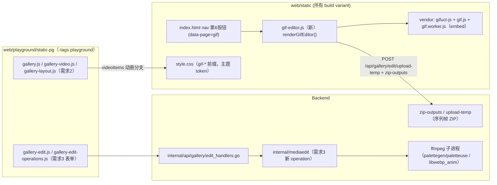

# TinyRouter GIF 编辑器移植与动画支持 — 实施计划

> **文档定位：** 本文件是"GIF 切切乐单页应用移植 + Gallery 动画播放/导出"实施任务的**唯一事实来源与实施入口**。任务启动时以本文为准；每轮代码变更后必须同步更新本文（决策记录、已落地清单、锚点行号）以及 AGENTS.md 强制要求的 `PROJECT_MAP.md` / 相关 `docs/*-architecture.md`。
>
> **文档名说明：** 文件名 `gif_implented.md` 为用户指定（原文拼写）；文档内标题使用规范拼写 "implemented"。
>
> **最后核对：** 2026-08-06（P0–P3 已全部落地，P4 联调与收尾进行中；2026-08-06 追加"大规模输入 + 虚拟化时间轴"两阶段：`MAX_PIXEL_FRAMES` 像素帧硬拒绝移除、时间轴窗口化。源码行号仍仅作定位提示，以函数/接口为准）。

> **已落地（2026-08-05）：** P0–P3 全部完成，P4 收尾进行中。P0 路线确认 gifuct-js esbuild 自包含浏览器 bundle（`web/static/vendor/gifuct-js/gifuct-js.js`，MIT，LICENSE 随附）；P1 GIF 编辑器落地为全局 SPA 页（`web/static/gif-editor.js` + `vendor/gif.js/`，第 6 导航按钮 `data-page="gif"`）；P2 Gallery video 区播放 GIF/animated WebP（`#gallery-main-anim` + `ANIMATED_IMG_EXTS`/`isAnimatedImg`，前后端白名单补齐）；P3 后端新增 `video_to_gif`/`video_to_webp`/`video_anim_trim` 三 operation 与 `ProbeFfmpegCaps` 能力探测（`ffmpeg-status` 6 字段），前端 Format GIF/WebP + 动画数字 trim。详见 §7 勾选状态与 §9.2 文件清单（落地细节以实际源码为准）。
>
> **已落地（2026-08-06，追加）：** 大规模输入与虚拟化时间轴两阶段已合入 `web/static/gif-editor.js` / `i18n.js` / `style.css`（仅前端）：(1) 移除 `MAX_PIXEL_FRAMES=20,000,000` 像素帧硬拒绝（图片/GIF/视频三条导入路径均不再被像素帧预算拒绝），保留 `MAX_FILE_BYTES=200MB` 的 GIF/视频单文件上限与 `EXPORT_MEM_LIMIT=1.5GB` 导出峰值 confirm 警告（`exportMemCheck`，GIF/ZIP/精灵图三条导出路径）；(2) 时间轴改为水平虚拟化轨道：窗口化 DOM（可见帧 + `TL_BUFFER=4` 缓冲）、节点绝对定位、交互全部在容器上委托、缩略图为 ≤96×72 小预览且有界缓存（FIFO 256）。验证：`node --check`（gif-editor.js、i18n.js）通过；确定性窗口化检查通过（1/5/63/64/10000 帧 × 6 个滚动位置，有界/clamp/覆盖滚动帧/尾部 clamp）；**精确高帧用例（1280×736×63）的浏览器冒烟未完成**——本机 ffmpeg GIF palette 编码挂起（详见 §7 实施状态）。
---

## 0. 需求来源（用户原始要求）

1. 移植原单页应用 `C:\Users\Houpy\Desktop\Zed\# OnePageApps\Pages\07_gif_slicer.html`，暂时挂在 header page 选择器**空白的第 6 个按钮**上（方便测试，之后再调整）。
2. 增加 Gallery 在 video 部分播放 **GIF 与 animated WebP** 的能力。
3. 增加 Gallery video edit 部分**保存为 GIF 与 animated WebP** 的能力。
4. 参考 [ScreenToGif](https://github.com/NickeManarin/ScreenToGif)（C#，MS-PL，27.4k★）、[Gifcurry](https://github.com/lettier/gifcurry)（Haskell，BSD-3，1.4k★）、[Piskel](https://github.com/piskelapp/piskel)（JS，Apache-2.0，12.7k★），**仅借鉴部分算法，不直接使用其代码**。

**已确认从依赖清单划掉（不引入）**：
- **JSZip**：后端已有 `POST /api/gallery/edit/zip-outputs`（`internal/api/gallery/edit_handlers.go:321-432`，`archive/zip` 打包多文件返回 `zipPath/zipName/outputURL`），序列帧 ZIP 走后端打包。
- **Google Fonts**：纯装饰字体，项目有完整主题 token（`--font-*`），回退系统字体栈。

**本轮审核结论（不实施代码）**：总体拆分可行，但原方案有四处必须在实施前收敛：
1. `gifuct-js@2.1.2` 的 npm 元数据以 CommonJS `lib/index.js` 为 `main`，依赖 `js-binary-schema-parser`，没有可直接作为普通 `<script>` 使用的浏览器 `dist` 入口；因此默认路线仍是优先验证浏览器直载，失败即采用 `omggif + disposal=3` 自补，不把 CommonJS 文件直接复制到 embed。
2. Gallery video pane 当前模板只有 `#gallery-main-video`，并没有可复用的 video-pane `#gallery-main-img`；动画分支必须使用唯一的动画图片元素（例如 `#gallery-main-anim`）或统一媒体容器，禁止在 split 模式制造重复 DOM id。
3. Gallery video edit 的 trim 逻辑当前直接依赖 `HTMLVideoElement.currentTime/duration` 和可拖动 trim bar。GIF/animated WebP 在 Gallery video pane 使用 `` 时不能 seek，所以动画输入必须改为数字 Start/End（必要时多段数字行）定位；普通 MP4/WebM/OGV 继续保留拖动定位。
4. Gallery video edit 的 GIF/animated WebP 输出是 FFmpeg 后端能力，不等同于 GIF 编辑器页面的浏览器 gif.js 导出。未解析到可运行 FFmpeg/FFprobe 时关闭 Gallery 动画输出与动画 trim；FFmpeg 存在但缺 GIF encoder 时仅禁用 GIF；缺 `libwebp_anim` 时仅禁用 WebP 输出/trim，GIF 仍按能力探测结果可用。

**审核依据**：FFmpeg 本机检查确认 `gif` 编码器、`libwebp_anim` 编码器、`webp_anim` 解码器、GIF/WebP muxer 与 `palettegen/paletteuse` 可用；同时确认 `-loop` 属于 GIF/WebP muxer 选项，`libwebp_anim` 的编码器选项包含 `quality/lossless`，不包含文档原先写法中的 encoder-level `loop`。发布物与 API 依据：[gifuct-js npm metadata](https://registry.npmjs.org/gifuct-js/2.1.2)、[gifuct-js package files](https://unpkg.com/gifuct-js@2.1.2/)、[FFmpeg formats](https://ffmpeg.org/ffmpeg-formats.html)、[FFmpeg codecs](https://ffmpeg.org/ffmpeg-codecs.html)、[FFmpeg filters](https://ffmpeg.org/ffmpeg-filters.html)。
>
> **已落地（对应上方四处收敛项）：** (1) gifuct-js 采用 esbuild 自包含浏览器 bundle（`web/static/vendor/gifuct-js/gifuct-js.js`，MIT，LICENSE 随附）；(2) video pane 使用唯一动画元素 `#gallery-main-anim`，split 模式无重复 DOM id；(3) 动画 trim 改为数字 Start/End/多段输入，普通视频保留拖动 trim bar；(4) FFmpeg 能力按 GIF encoder / `libwebp_anim` encoder / animated WebP decoder 分字段探测与降级，GIF 编辑器浏览器导出与 Gallery FFmpeg 能力解耦。

---

## 1. 现状基线（事实锚点）

### 1.1 目标单页应用 `07_gif_slicer.html`

**规模**：3,028 行 / 124,717 字节；运行 JS ≈ 1,845 行 / 80 KB；CSS ≈ 13.8 KB；≈ 80 个 DOM id、30 个命名函数。**不是 GIF 切片器，是帧级编辑器**。

**功能模块 → 原行号映射**（实施拆解依据）：

| 模块 | 原行号 | 行为 |
|---|---|---|
| 外链依赖 | 11-24 | Google Fonts、gif.js 0.2.0 + gif.worker.js（cdnjs）、JSZip 3.10.1、omggif（unpkg） |
| UI 布局（sidebar/stage/timeline/modal） | 469-1183 | 三栏 workspace、导出弹窗 |
| App 状态 + 输入（拖放/粘贴/选择） | 1184-1479 | `App.slices[]` 内存模型；`file.type` 三分支（image/gif/video/*） |
| GIF 解码 | 1481-1568 | omggif 逐帧 `decodeAndBlitFrameRGBA` + 手动 disposal 合成；delay=`info.delay*10`（厘秒→ms），0 回退 100 |
| 视频抽帧 | 1571-1620 | `HTMLVideoElement` seek 循环，1-60 FPS，delay=`floor(1000/fps)` |
| 网格切片 | 1622-1668 | 边缘裁剪 T/B/L/R + rows×cols，切块默认 delay 500 |
| 全局裁剪 | 1704-1766 | 框选应用到所有帧并偏移图层坐标 |
| 时间轴 | 1773-2007 | 每帧缩略图 `toDataURL()`、逐帧 delay、复制/删除、拖放/触摸排序、键盘导航 |
| 色键透明 | 2009-2077, 2662-2687 | 取色（EyeDropper 或 canvas 像素）+ 容差 `fuzz*2.55` 逐像素置 alpha=0 |
| 图层 | 2287-2688 | text / image 两种；作用域 current/all/range；同步到所有帧 |
| 舞台交互 | 2079-2290 | pan/zoom、裁剪框与图层拖拽缩放（gizmo） |
| 导出 GIF | 2689-2785 | gif.js `workers:4`、quality 1-10、输出 W/H、透明用 `#FF00FF` matte |
| 导出序列帧 ZIP | 2788-2865 | JSZip + `canvas.toBlob('image/png')` |
| 导出精灵图 | 2867-2950 | rows×cols 网格拼 PNG |
| 批量删帧 | 2952-3025 | 删除/仅保留范围 |

**已知缺陷（移植时修复，不得照搬）**：
1. `draw()` 编辑模式引用未定义的 `cx`（应为 `ctx`）→ 预览 `ReferenceError`（约 2451-2467）。
2. GIF disposal：`prevDisposal===2` 分支为空、disposal=3（restore previous）未实现（1504-1512）。
3. 网格 `sw/sh` 可为非整数而 canvas 尺寸整数化（1628-1655）→ 统一 `Math.round`。
4. 图层"同步到所有帧"按文本内容/图片对象引用匹配，重复文字误同步（2605-2625）→ 按图层 id 匹配。
5. 三段导出重复复制图层绘制逻辑（2710-2757 / 2810-2835 / 2900-2928）→ 抽共享 `composeFrame()`。

**内存模型（硬约束）**：每完整 RGBA 帧 ≈ `4×W×H` 字节；GIF 导入同时存在 frameCanvas+tempCvs+finalCvs（3×），导出每帧中间 canvas + gif.js 4 worker。100 帧 512×512 ≈ 100 MB 起步。**2026-08-06 起：帧仍以完整 canvas 驻留内存（本轮未引入 IndexedDB/后端持久化），输入不再设像素帧硬限额**——`MAX_PIXEL_FRAMES=20,000,000` 硬拒绝已移除（与源页面行为对齐）；保留的防护是 GIF/视频 200MB 单文件上限（`MAX_FILE_BYTES`）与导出前 1.5GB 峰值 confirm 警告（`EXPORT_MEM_LIMIT`/`exportMemCheck`）；时间轴缩略图已由"每帧 `toDataURL()`"改为窗口化 DOM + 有界小缩略图缓存（见 §4.3/§4.6）。

### 1.2 TinyRouter 相关现状

**导航（需求 1 挂载点）**：
- `web/static/index.html:66-73`：`<nav class="top-header-nav" aria-label="Primary navigation">` 含 5 个按钮（monitor/endpoint/download/playground/gallery）+ **第 6 个 `<button class="nav-placeholder" disabled aria-hidden tabindex="-1">`** —— 即"空白的第 6 个按钮"，替换为真实按钮。
- `web/static/app.js`：`navigateTo(page)`（94 行起）switch 分发 `endpoint/providers/combos/playground/monitor/download/gallery/editor`（142-151 行）；`.nav-item` 高亮按 `data-page`（122-125 行）；`updateSidebarNav` 文案 `t(page)`（552-561 行）；快捷键 `global.goto-*`（723-727 行）。新增页面需同步：switch case、nav HTML、i18n 键、可选快捷键。

**Gallery 播放器与编辑器（需求 2/3 改动面）**：
- `web/playground/static-pg/gallery-state.js:6-7`：`SUPPORTED_IMG_EXTS` 已含 gif/webp；`SUPPORTED_VIDEO_EXTS` 目前只有 mp4/webm/ogv。两类白名单同时包含同一扩展时，后端 `listGalleryFiles` 与前端收集逻辑必须明确以 video 优先，避免同一文件同时进入 image/video 列表。
- `web/playground/static-pg/gallery-video.js`：`renderActiveVideo`/`bindVideoControls` 目前只操作 `#gallery-main-video`。动画图片模式必须使用 video pane 内的唯一元素（例如 `#gallery-main-anim`），不能复用 image pane 的 `#gallery-main-img`，因为 split 模式会产生重复 id。
- `web/playground/static-pg/gallery-layout.js`：video pane 当前只创建 `<video id="gallery-main-video">` 与 seeker/time；image pane 才创建 `#gallery-main-img`。新增动画元素时须同步 `autoBalanceFullscreenSplitRatio` 的尺寸测量与布局重建/清理。
- `web/playground/static-pg/gallery-fullscreen.js`：video 快捷键目前直接访问 `currentTime`/`volume`；动画图片只短路 seek/音量分支，保留上下切换，Space 映射为重播或清空 src，不伪造 pause/seek。
- `internal/api/gallery/fs_handlers.go:18-24`：`galleryImgExts` 已含 gif/webp，`galleryVidExts` 目前不含；扩展后 `listGalleryFiles` 会按 video 优先标记 kind。
- `internal/gallery/gallery.go:15-23`：`SupportedExts` 当前漏 gif；若不补，ZIP 内 GIF 不会进入 Gallery manifest/批处理白名单。需求 2 改动必须同步补齐。
- `internal/mediaedit/types.go`/`args.go`/`manager.go`：Manager 当前每个 job 只执行一次 `RunFfmpeg`，因此“先写 palette.png、再启动第二个 ffmpeg”不能直接复用现有 runner；推荐用单次 ffmpeg 的 `split → palettegen → paletteuse` filtergraph，避免引入临时 palette 生命周期与第二进程进度语义。
- `internal/api/gallery/edit_handlers.go`：现有 `ffmpeg-status` 仅返回 `available/path/error`；GIF/WebP 输出需要扩展为能力位，不可把“ffmpeg 可执行”误当作两个编码器都存在。
- `web/playground/static-pg/gallery-edit.js`：视频编辑 trim 当前通过 `#gallery-main-video.currentTime/duration` 与可拖动 trim bar 定位；GIF/animated WebP 在 video pane 使用 `` 后必须走数字 Start/End（可保留多段行），不能调用 `_enterTrimMode` 的拖动/播放逻辑。
- `internal/api/gallery/register.go:72-82`：Gallery 媒体编辑路由已存在且 auth-gated；新增能力优先扩展现有 operation/status 契约，不新增平行路由。

**静态资产与安全**：
- `web/embed.go`（`//go:embed all:static`）与 `web/playground/embed_playground.go`（`all:playground/static-pg`，仅 `-tags playground`）。GIF 页面若放 `web/static/` 则所有 build variant 可用；放 `web/playground/static-pg/` 需同步 `internal/api/router.go` 的 `pgJSFiles` 白名单（PROJECT_MAP §18.3 与 §24 有明确注册义务）。
- CSP（`internal/api/router.go:189-191`，非 /v1/ 路径）：`script-src 'self' 'unsafe-inline'`、`img-src 'self' data: https: http: blob:`、`media-src 'self' data: blob:`、`connect-src 'self' ws://127.0.0.1:*`。gif.js worker 若用同源 URL + `importScripts` 不受限；`worker-src` 未显式声明（回退 script-src 'self'，同源 worker OK）；`blob:` worker 需注意（'self' 不含 blob:，禁止 blob: 包装 importScripts 的旧写法）。
- 主题系统：`style.css` 全量 token（`--font-*`、`--accent*` 等，DESIGN.md 约束：不硬编码 radius/font-weight/backdrop-filter，结构元素必须用 token）。

### 1.3 三参考项目借鉴点（只借鉴算法/参数，不复制代码）

| 项目 | 借鉴内容 | 落地位置 | 边界 |
|---|---|---|---|
| **ScreenToGif**（MS-PL，C#） | 帧项目模型：帧列表 + 每帧 delay/disposal + 缩略图树；视频导入参数集（fps/start/end）；GIF 导出参数集（颜色数、dither、loop、量化） | §4 前端帧模型与导入/导出参数设计 | 仅参考状态机与参数语义，JS 重写；不引入其代码/二进制 |
| **Gifcurry**（BSD-3，Haskell） | CLI 参数 → ffmpeg/ImageMagick 命令的编排结构：`-s/-e` 时长、`-f fps`、`-c colors`、`-d dither`、`-L/-R/-T/-B crop`、`-w 宽度`、text overlay、save-as-video | §6 后端 `video_to_gif` 参数→filtergraph 映射表；§6.2 FFmpeg 命令设计 | 仅参考命令参数语义；实现使用 FFmpeg 单次 `split→palettegen→paletteuse` filtergraph，不复制其代码或强制采用两遍临时 palette 文件 |
| **Piskel**（Apache-2.0，JS） | 精灵图导出对话框（列数、padding、帧序、预览）；时间轴交互（帧复制/删除、拖拽排序）；导出 GIF 参数（fps/loop） | §4 精灵图导出参数与时间轴交互 | Apache-2.0 可读，但按要求不直接复用其代码，自行实现 |

---

## 2. 总体需求与验收标准

### 2.1 需求 1：GIF 编辑器页面（导航第 6 按钮）

**验收**：
- [x] header 第 6 个按钮（原 `nav-placeholder`）变为可点击页面按钮（建议 `data-page="gif"`，文案走 i18n），点击进入 GIF 编辑器，`navigateTo` 正常高亮/切页/返回，快捷键体系不冲突。
- [x] 原单页功能 1:1 还原：图片/GIF/视频三类输入、网格切片、时间轴（排序/复制/删除/延迟/键盘导航）、全局裁剪、图层（文字/贴图/范围/同步）、色键透明、导出 GIF / 序列帧 ZIP / PNG 精灵图。
- [x] 无外部 CDN 依赖（gif.js/worker 与 P0 验证通过的 decoder vendor 进 embed；若采用 fallback，则 omggif 及其 LICENSE 进 embed），离线可用。
- [x] 源缺陷修复（§1.1 清单 5 项）。
- [x] 大输入防护（§4.6，2026-08-06 修订）：原 `MAX_PIXEL_FRAMES=20,000,000` 像素帧硬拒绝已移除（图片/GIF/视频普通提取均不再被像素帧预算拒绝）；保留 GIF/视频 200MB 单文件上限（`MAX_FILE_BYTES`，导入 alert 拒绝）与导出前 1.5GB 峰值内存 confirm 警告（`EXPORT_MEM_LIMIT`/`exportMemCheck`，仅导出时提示，非输入门禁）。
- [x] 页面样式遵循主题 token，class/id 带 `gif-` 前缀，不与现有全局样式冲突。

### 2.2 需求 2：Gallery video 区播放 GIF / animated WebP

**验收**：
- [x] Gallery 的 video 列表/树中可导入并选中 .gif 与 .webp（含 animated webp）文件，进入 video 播放器视图。
- [x] 动画图片在播放器中自动循环播放（`` 渲染，浏览器原生解码，Go 不转码）。
- [x] 播放器控制条对动画图片模式正确降级：隐藏/禁用 seeker、时间轴、音量、±5s/±10s 等 video 专属控件；保留切换/关闭/全屏等通用操作；不抛 JS 错误。
- [x] 静态 webp 同样可显示（单帧不动）；gif 按原延迟播放。
- [x] 缩略图/树/删除/打开目录等既有 video 操作对动画图片可用。

### 2.3 需求 3：video edit 保存为 GIF / animated WebP

**验收**：
- [x] Gallery video edit 弹窗（Transcode 表单）新增输出格式 **GIF** 与 **WebP (animated)**；该能力由 Gallery 后端 FFmpeg 提供，不使用浏览器 gif.js 兜底。
- [x] 后端新 operation 完成视频→GIF（单次 ffmpeg filtergraph：palettegen/paletteuse）与视频→animated WebP（`libwebp_anim`）转码，走现有 job runner（进度/取消/输出路径契约不变）。
- [x] 参数齐全：时长范围、fps、尺寸/缩放、裁剪（T/B/L/R 或 x/y/w/h）、GIF 调色板选项（颜色数 2-256、dither）、GIF/WebP loop count、质量；数值在前后端同时校验。
- [x] 输出命名/落盘复用现有 `BuildOutputPath` 契约（`{base}_{desc}.{ext}`、OutputDir/OutputName）。
- [x] FFmpeg 无法解析/执行时，GIF 与 animated WebP 输出及动画 trim 均禁用并显示可读提示；FFmpeg 可用但无 GIF encoder 时禁用 GIF；无 `libwebp_anim` 时只禁用 WebP；无 animated WebP decoder 时只禁用 WebP 输入的 trim。
- [x] 后端不信任前端禁用态：启动 job 前再次检查对应 encoder 能力，不满足时返回明确错误且不创建输出文件。
- [x] Gallery video 中的 GIF/animated WebP trim 可用：普通视频继续拖动 trim bar；动画图片改为 Start/End（必要时多段）数字输入，不能调用 `` 的 seek/currentTime 假接口。
- [x] 单元测试：args 构造器、FFmpeg capability probe、动画 trim 参数与分支；集成测试按既有 manager_test 的 skip 条件执行。

### 2.4 非目标（明确不做）

- 不做全量 Go 媒体引擎重写（阶段 B/C 方案不在本次范围）；后端只补 video→GIF/WebP 转码、动画图片 trim 与 ZIP 打包复用。
- 不引入 GPL/AGPL 代码（gifsicle、spright、Gifski、ffmpeg.wasm core 等）——外部子进程仅限现有 ffmpeg。
- 不做 GIF 录制/绘画工具（ScreenToGif/Piskel 的创作能力不移植）。

---

## 3. 总体架构



**数据流（需求 1 导出链路）**：
- 导出 GIF：浏览器 gif.js 编码 → Blob → 预览（``/objectURL）+ 下载（anchor download）。这是 GIF 编辑器页面能力，不依赖 Gallery 的 FFmpeg capability；浏览器导出失败时显示错误，不伪造后端成功。
- 导出序列帧 ZIP：每帧 `canvas.toBlob('image/png')` → `POST /api/gallery/edit/upload-temp?name=frame_001.png` 落临时文件 → `POST /api/gallery/edit/zip-outputs {paths, cleanUp:true}` → 返回 `outputURL` 下载。帧数多时用 `Promise.all` 分批限流。
- 导出精灵图：前端合成单张 PNG → Blob 下载（无后端依赖）。

---

## 4. 需求 1 详细设计：GIF 编辑器页面

### 4.1 导航接入

| 位置 | 改动 |
|---|---|
| `web/static/index.html:72` | 占位按钮替换为 `<button class="nav-item" type="button" data-page="gif">GIF</button>`（文案走 `t('gif')`，见 i18n） |
| `web/static/index-nopg.html` | 同样替换（两处入口保持一致） |
| `web/static/app.js` `navigateTo` switch（142-151 行） | 新增 `case 'gif': return renderGifEditor(container);` |
| `web/static/app.js` `updateSidebarNav`（552-561 行） | `t(page)` 自动覆盖，无需改 |
| `web/static/i18n.js` | 新增键：`gif`（页面名）、`gifEditor*` 全量 UI 文案（中英两套，参考原页面中文文案） |
| `web/static/index.html` script 标签 | 在 `download.js` 之后加载 `gif-editor.js`（页面级模块，独立作用域，不依赖全局状态） |
| 快捷键（可选） | 不占 F1-F6（已有映射）；若加则用 `global.goto-gif`（shortcuts.js 预设 + settings_shortcuts.js 展示），本期可不加，先用按钮 |

**页面前后切换**：`navigateTo` 已处理 cleanup（app.js:102-121）；`renderGifEditor` 返回后需在离开时释放大对象（`App.slices` canvas 置空、objectURL revoke），按现有模式在 `navigateTo` 的 cleanup 段加 `if (currentPage !== 'gif' && typeof cleanupGifEditor === 'function') cleanupGifEditor();`。

### 4.2 页面结构与 CSS 隔离

- **不建独立 HTML 文件**：GIF 编辑器作为 SPA 页面模块，`renderGifEditor(container)` 注入 `innerHTML`（原单页 body 469-1183 转模板字符串）。
- **class/id 全前缀化**：所有原 class 加 `gif-`（`gif-workspace`/`gif-sidebar`/`gif-stage`/`gif-timeline`/`gif-slice-item`…），所有 id 加 `gif-`（`gif-drop-zone`/`gif-file-input`/`gif-export-btn`…≈80 个）。理由：原页面用 `.btn/.btn-primary/.hidden/.modal-overlay` 等与 TinyRouter `style.css` 全局类直接冲突（TinyRouter 有 `.btn/.btn-primary/.btn-danger/.modal-*` 体系）。
- **样式并入 `web/static/style.css`**（现有唯一样式入口，embed 自动携带），全部选择器带 `gif-` 前缀；数值遵循 DESIGN.md token 规则（`--font-weight-*`/`--radius-*`/`--blur-*`，不硬编码）。
- **原 Google Fonts 引用删除**：字体栈回退 `var(--font-family)` token / 系统字体（微软雅黑等）。保留原页面的数字/等宽小元素用 `font-family: monospace` 等价物。

### 4.3 模块划分与移植映射（gif-editor.js 内部结构）

`gif-editor.js` 单文件（预计 1,800-2,200 行，含注释），按原单页顺序组织为命名空间 `GifEditor`，禁止全局变量泄漏：

| 新模块段 | 原行号来源 | 内容 |
|---|---|---|
| 状态与常量 | 1184-1217 | `GifEditor.state`（slices/scale/pan/mode/selectedIdx/transparency…），全部带 `gif` 前缀的 DOM 引用 |
| 输入 | 1291-1479 | dropZone 点击/拖放/粘贴/change 四入口；`file.type` 三分支 |
| GIF 解码 | 1481-1568 | **优先 gifuct-js**：`parseGIF`+`decompressFrames(gif, true)` → 逐帧 patch 合成（处理 disposalType 1/2/3）；若 P0 直载验证失败，改用 omggif + 自实现 disposal=3；两条路线都必须产出统一 `{canvas, delay, disposal}` 模型 |
| 视频抽帧 | 1571-1620 | 保留 HTMLVideoElement seek 循环（浏览器解码能力最强）；加 `duration===Infinity` 报错（原有） |
| 网格切片 | 1622-1668 | 保留；`sw/sh` 改 `Math.round`；边缘裁剪参数不变 |
| 全局裁剪 | 1704-1766 | 保留；图层坐标偏移逻辑不变 |
| 时间轴 | 1773-2007 | **2026-08-06 起为水平虚拟化轨道**：仅可见窗口内帧 + `TL_BUFFER=4` 缓冲渲染 DOM 节点，节点绝对定位在 `N×TL_ITEM_PITCH` 宽的轨道内（保持原生横向滚动几何）；点击/复制/删除/delay/拖放/触摸排序全部在容器上委托（无逐帧监听）；缩略图为 ≤96×72 小预览，惰性生成并有界缓存（`THUMB_CACHE_MAX=256`，FIFO 淘汰） |
| 键盘/取色/透明 | 2009-2290 | 保留；修复 `cx` bug（见 §1.1 #1） |
| 图层 | 2287-2688 | 保留；同步匹配改 id；抽 `composeFrame(canvas, layers, outW, outH)` 共享函数 |
| 导出 | 2689-2950 | GIF：gif.js（同源 worker）；ZIP：走后端（§4.5）；精灵图：保留 canvas 合成 |

- gifuct-js `decompressFrames(parsedGif, true)` 返回 `{pixels, dims, delay, disposalType, colorTable, transparentIndex, patch}`；patch 仍需按 frame dims/top/left 合成到逻辑屏幕 canvas，不能简单假设它已经是完整画布。
- disposal 语义：`1`=保留、`2`=清除当前帧区域、`3`=恢复绘制前画布。实现必须在进入下一帧前保存 disposal=3 所需的画布快照，并处理透明 index 与 0 delay（回退 100ms）。
- npm `gifuct-js@2.1.2` 的 `main` 是 CommonJS `lib/index.js`，依赖 `js-binary-schema-parser`，该包没有可直接以普通 `<script>` 载入的浏览器 dist 入口。P0 只验证实际浏览器直载/自包含 vendor 结果；验证失败即停止该路线，采用 `omggif + 自实现 disposal=3`，不把未打包 CommonJS 文件复制进 embed。
- 若直载路线可用，vendor 必须是已验证的自包含浏览器文件，并记录来源版本、SHA-256、LICENSE 和依赖是否内联；不能写“取 lib + 前端打包”，因为本项目无前端打包器。

### 4.4 依赖 vendor 与 CSP

| 库 | 版本 | 许可 | 落地 |
|---|---|---|---|
| gifuct-js | 2.1.2（npm） | MIT | P0 验证通过后才落 `web/static/vendor/gifuct-js/`；要求自包含浏览器产物、依赖内联、LICENSE、SHA-256；失败采用 `omggif` fallback，并在文件清单记录其 LICENSE/SHA-256 |
| gif.js | 0.2.0 | MIT | `web/static/vendor/gif.js/gif.js` + `gif.worker.js` + LICENSE |

- worker 加载：`new GIF({workerScript: 'static/vendor/gif.js/gif.worker.js'})`（相对路径按实际静态前缀 `./vendor/gif.js/gif.worker.js` 计算）——同源 URL，CSP `script-src 'self'` 允许，**禁止**原页面的 `blob:` importScripts 包装写法（CSP 不含 blob:）。
- 许可合规：MIT 库 vendor 时在 `web/static/vendor/` 内保留原 LICENSE 文件与版权头（项目 LICENSE 为 MIT，兼容）。
- 字体：不 vendor（§0）。

### 4.5 输出链路

| 输出 | 方案 | 细节 |
|---|---|---|
| GIF | gif.js 编码（同原） | `workers: 4`、quality 1-10、透明 matte `#FF00FF`；预览 `` + anchor download（同 2773-2780） |
| 序列帧 ZIP | **后端 zip-outputs**（替代 JSZip） | 帧 PNG `toBlob` → `upload-temp?name=frame_NNN.png`（500MB 上限）→ `zip-outputs {paths, cleanUp:true}` → `outputURL` 下载。帧数 >200 时分批（每批 50）防并发上传过载；导出前仅经 `exportMemCheck` 峰值 confirm 警告，无像素帧硬限额（§4.6） |
| 精灵图 | 前端 canvas 合成 | 同原 2867-2950，`toDataURL('image/png')` 下载；row-major 排列，空位跳过 |

### 4.6 输入限额与内存保护（2026-08-06 修订；原页面无防护，移植时新增）

- **像素帧硬限额已移除**：`MAX_PIXEL_FRAMES=20,000,000`（原 `width × height × frameCount` 硬拒绝）已删除——普通图片/GIF/视频提取不再被像素帧预算拒绝（与源页面行为对齐）；该常量与"帧预算"相关文案已从 `gif-editor.js`/`i18n.js` 清除。
- 单文件上限（保留）：GIF/视频 ≤ 200 MB（`MAX_FILE_BYTES`，导入时 `file.size` 快速检查，超限 `alert` 并拒绝）。
- **导出内存警告（保留为 export-time confirm，非输入门禁）**：`exportMemCheck` 估计峰值内存（`frames × outW × outH × 4 × 3`），超过 1.5 GB（`EXPORT_MEM_LIMIT`）时 `confirm` 提示降帧率/尺寸，用户可继续或取消；GIF/ZIP/精灵图三条导出路径均调用——仍是真实 OOM 兜底。
- **时间轴虚拟化（新增）**：水平窗口化轨道——仅可见帧 + `TL_BUFFER=4` 缓冲渲染 DOM，节点绝对定位，交互全部委托在容器（§4.3）；缩略图为 ≤96×72 小预览、惰性生成、FIFO 有界缓存（`THUMB_CACHE_MAX=256`），替代原"每帧全尺寸 `toDataURL`"。
- 内存模型：本轮帧仍以完整 canvas 驻留 `state.slices[]`（4 B/px）；未引入 IndexedDB/后端持久化（见 §8 ADR）。

### 4.7 交互与体验（参考 Piskel 时间轴、ScreenToGif 帧管理）

- 时间轴保留原交互（点击选中/双击可编辑 delay 输入/复制/删除/拖拽排序/触摸排序/键盘导航），并在虚拟化窗口化 DOM 下通过容器委托实现（§4.3/§4.6），交互语义与源页面一致。
- 帧指示器 `#N/M` 保留；键盘 Home/End/PgUp/PgDn/←/→ 保留。
- 新增（低成本高价值）：帧数/总时长显示条；导出按钮禁用态与"渲染中…"状态保留。
- 精灵图导出弹窗参数沿用原（rows×cols），对齐 Piskel 的"列数优先"交互但保持原布局。

---

## 5. 需求 2 详细设计：Gallery video 区播放 GIF / animated WebP

### 5.1 现状与缺口

- `internal/api/gallery/fs_handlers.go` 已允许磁盘 GIF/WebP 列举，`galleryServeFile` 用 `mime.TypeByExtension` + `http.ServeFile` 原样透传；浏览器/WebView2 的 `` 可原生循环播放，无需 Go 转码。
- 前端 `SUPPORTED_IMG_EXTS` 已含 gif/webp，但 `SUPPORTED_VIDEO_EXTS` 目前只有 mp4/webm/ogv；因此动画图片没有进入 videoItems，也没有经过 video pane。
- video pane 当前只创建 `#gallery-main-video`；image pane 才创建 `#gallery-main-img`。不能在 split 模式复用后者，否则出现重复 DOM id、错误事件绑定和错误尺寸测量。

### 5.2 改动清单

| 文件 | 改动 |
|---|---|
| `web/playground/static-pg/gallery-state.js` | `SUPPORTED_VIDEO_EXTS` 追加 `gif`、`webp`；增加 `ANIMATED_IMG_EXTS` 与 `isAnimatedImg(item)`。当扩展同时存在 image/video 白名单时，收集和后端目录列表统一以 video 优先，避免重复项。 |
| `internal/api/gallery/fs_handlers.go` | `galleryVidExts` 追加 `.gif`、`.webp`；`listGalleryFiles` 因此将两类标成 `kind:"video"`。 |
| `internal/gallery/gallery.go` | `SupportedExts` 追加 `gif`，使 ZIP 内 GIF manifest 与 Gallery 图片白名单不再漏项；该包仍只负责归档图片能力，不负责 video pane 分类。 |
| `gallery-io.js` | 核对所有 `isVideoExt` 分支；不得新增按 `kind==='video'` 之外的扩展硬编码。 |
| `gallery-layout.js` | video pane 同时创建 `<video id="gallery-main-video">` 与隐藏的 ``（或等价唯一媒体节点）；动画模式只显示后者，清理时两者都移除 `src`。同步 `autoBalanceFullscreenSplitRatio` 使用活动媒体的 `naturalWidth/naturalHeight` 或 `videoWidth/videoHeight`。 |
| `gallery-video.js` | `renderActiveVideo` 按 `isAnimatedImg(item)` 选择 `<video>`/``，并在异步 `ensureMainSrc` 完成后检查当前 index，避免旧请求覆盖新选择；动画图片使用 `src` 变更触发重播。 |
| `gallery-fullscreen.js` | 动画模式短路音量与 seek 快捷键；保留上下切换。Space 映射为重播，不调用 `.play()`/`.pause()`。 |
| `gallery-tree.js`/删除与目录逻辑 | 复用既有 videoItems 树、删除、打开目录和输出追加逻辑；视频图标可保持不变，必要时增加动画格式 tooltip。 |

### 5.3 渲染模式判定

```js
function isAnimatedImg(item) {
  var ext = extOf(item && (item.name || item.path)).toLowerCase();
  return ext === 'gif' || ext === 'webp';
}
```

- GIF 统一按动画图片处理，单帧 GIF 也无副作用。
- WebP 不在前端解析 VP8X；静态 WebP 显示单帧，animated WebP 由浏览器自动播放，统一使用 `` 是正确且最小的实现。
- 不新增 `animated: bool` API；只有在后续确需显示动画元数据时才复用 `internal/gallery/dimensions.go` 增加探测。

### 5.4 播放控制语义（已确认决策）

`` 动画没有标准的 pause/seek/音量/当前帧 API。以下不是实现缺陷，而是 Chromium/WebView2 能力边界：

| 控件 | video 模式 | animation 模式 |
|---|---|---|
| 播放/暂停 | 原生 play/pause | 重播（重新设置同一 src）/清空 src 显示占位；不承诺真正暂停 |
| seeker + 时间 | 原生 currentTime/duration | 隐藏 |
| 音量（滑块、1-9、↑↓） | 原生 audio volume | 隐藏/禁用；GIF/WebP 动画无音频 |
| ←/→ ±5s/±10s | 原生 seek | 不执行 seek；仅保留上下切换项目 |
| 停止 | pause + currentTime=0 | 清空 src；后续重播重新设置 src |
| 全屏/缩放/切换/删除/打开目录 | 保持 | 保持；fit 使用活动媒体的自然尺寸 |

播放状态只记录“应在加载后自动播放”的意图；不能把 `videoPlayingState=false` 解释为图片已暂停。

### 5.5 Gallery video edit 的 trim 语义（本轮新增决策）

- 普通 MP4/WebM/OGV：保留现有 `_enterTrimMode`，拖动 trim bar 仍由 `HTMLVideoElement.currentTime` 定位。
- GIF/animated WebP：进入 video edit 的 Trim 面板时不得进入现有拖动预览模式；显示 `Start`、`End`（或 `Start`、`Duration`）数字输入，允许手工输入秒数，校验 `0 ≤ start < end ≤ duration`。可选多段时使用多行数字区间，提交前排序、去重、拒绝重叠和空区间。
- 动画预览只可重播，不能根据输入时间在 `` 上定位；用户输入的时间由后端 FFmpeg 执行实际裁剪。没有 FFmpeg/ffprobe 时，动画 Trim 的 Start 按钮禁用并显示原因。
- 动画 Trim 使用新增的 `video_anim_trim` operation，输出扩展名与输入动画格式一致；GIF 用 GIF encoder + palettegraph，WebP 用 `libwebp_anim`。不要把 GIF/WebP 送入现有 `video_trim` 的 H.264/视频 codec 分支。
- 若 FFmpeg 构建不能解码 animated WebP，浏览器播放仍可用，但 WebP Trim 必须禁用并说明“当前 FFmpeg 不支持 animated WebP 解码”；GIF Trim 不受该项影响。该输入解码能力由 `webpAnimDecode` 单独探测，不等同于 `webpAnim` encoder 能力。

### 5.6 验收路径（浏览器驱动）

1. 下载/拖入/目录导入一个 GIF、一个 animated WebP、一个静态 WebP；三者只出现在 video 树中并可选中。
2. 选中 GIF/animated WebP，主视图自动循环；video pane 不显示 seeker、时间、音量，Space/停止符合 §5.4；普通 MP4 回归原生控制。
3. 打开 GIF/animated WebP 的 video edit → Trim，确认没有可拖动 video trim bar，Start/End 数字输入可提交并输出同格式动画；输入非法范围被拒绝。
4. 在 FFmpeg 缺失、GIF encoder 缺失、`libwebp_anim` 缺失、animated WebP decoder 缺失的环境分别确认对应能力被禁用，而非运行后才产生模糊错误。
5. 删除、切换、打开目录、Gallery 输出追加与 split/fullscreen 布局均不抛 JS 错误。

---

## 6. 需求 3 详细设计：video edit 保存为 GIF / animated WebP

### 6.1 后端：mediaedit operation 与参数


`internal/mediaedit/manager.go` 当前每个 job 只启动一次 `RunFfmpeg`。因此 GIF 不采用“先输出 palette.png、再启动第二个 ffmpeg”的 job 方案；使用一次 FFmpeg 的 `split → palettegen → paletteuse` filtergraph，避免临时 palette 文件、双进程取消和进度归一化问题。FFmpeg capability 复核放在 `internal/api/gallery/edit_handlers.go` 的 Start handler，Manager 只负责已校验 operation 的 job 生命周期。

```go
// VideoAnimParams 视频 → GIF/animated WebP 导出参数。
type VideoAnimParams struct {
    Start        string `json:"start"`        // 秒字符串；空=开头
    Duration     string `json:"duration"`     // 秒字符串；空=到结尾
    FPS          int    `json:"fps"`          // 1-60，默认 12
    Width        int    `json:"width"`        // 0=不指定
    Height       int    `json:"height"`       // 0=不指定
    CropLeft     int    `json:"cropLeft"`
    CropRight    int    `json:"cropRight"`
    CropTop      int    `json:"cropTop"`
    CropBottom   int    `json:"cropBottom"`
    LoopCount    int    `json:"loopCount"`    // 0=无限；GIF -1=不循环；WebP 0=无限，正数按 muxer 语义
    Quality      int    `json:"quality"`      // 1-100；GIF 用于默认颜色档位，WebP 传 encoder quality
    PaletteColors int   `json:"paletteColors"` // GIF 2-256，默认 256
    Dither       string `json:"dither"`       // none|bayer|floyd_steinberg|sierra2_4a
    Lossless     bool   `json:"lossless"`     // WebP 专用
}

// VideoAnimTrimParams 动画图片精确时间裁剪参数。
type VideoAnimTrimParams struct {
    Start        string `json:"start"`
    Duration     string `json:"duration"`
    Segments     []TrimSegment `json:"segments"` // 非空时覆盖 Start/Duration
    Quality      int    `json:"quality"`
    PaletteColors int   `json:"paletteColors"`
    Dither       string `json:"dither"`
    Lossless     bool   `json:"lossless"`
    LoopCount    int    `json:"loopCount"`
}
```


字段校验必须在 builder 内完成：时间非负且 end 不超过探测时长（若可得）、fps 1-60、crop 非负且裁剪后宽高 >0、目标尺寸 >0 或同时为 0、paletteColors 2-256、质量 1-100、dither 使用白名单、`loopCount` 只能为 `-1`（仅 GIF）或非负值。禁止把未校验字符串直接拼入 filtergraph，避免命令注入和无效命令。
- `video_to_gif` → `BuildVideoToGifArgs`，输出 `.gif`。
- `video_to_webp` → `BuildVideoToWebpArgs`，输出 `.webp`，启动前要求 `libwebp_anim` 能力。
- `video_anim_trim` → `BuildVideoAnimTrimArgs`，根据输入扩展名输出 `.gif` 或 `.webp`；GIF/animated WebP 不得落入现有 H.264 `video_trim` 分支。

Builder 保持 `(inputPath string, raw json.RawMessage) (args []string, desc, ext string, err error)` 契约。`manager.go` 将三个新 operation 计入 duration/progress probe；`Job.Operation` 注释、输出命名和 temp+rename 行为同步更新。

### 6.2 FFmpeg 命令设计

公共视频滤镜按顺序构造：`fps` → 可选 `crop` → 可选 `scale`。crop 参数由数值生成 `crop=iw-L-R:ih-T-B:L:T`；scale 为宽高均 0 时省略，仅宽使用 `scale=W:-2`，仅高使用 `scale=-2:H`，均有值时使用 `scale=W:H`。所有宽高在 builder 中限制为正整数并避免裁剪后尺寸为负。

**视频 → GIF（单次 filtergraph）**：

```text
ffmpeg -y [-ss START] [-t DURATION] -i input \
  -filter_complex "[0:v]fps=12,scale=480:-2,split[a][b];[a]palettegen=stats_mode=diff:max_colors=256[p];[b][p]paletteuse=dither=sierra2_4a[v]" \
  -map "[v]" -loop 0 output.gif
```

- `palettegen.max_colors` 使用 `paletteColors`，范围 2-256；`stats_mode=diff` 固定。
- dither 白名单按 FFmpeg `paletteuse` 实际支持集映射：`none`、`bayer`、`floyd_steinberg`、`sierra2_4a`；`bayer_scale` 固定为默认值，不接受任意字符串。
- GIF loop 是 muxer 选项：`0`=无限，`-1`=不循环，正数=循环次数；不把 loop 误传为 `libwebp_anim` encoder option。
- 质量只参与默认 palette 档位/描述，若用户显式选择 `paletteColors` 则以显式值为准；不声称 GIF 有连续质量参数。

**视频 → animated WebP**：

```text
ffmpeg -y [-ss START] [-t DURATION] -i input \
  -vf "fps=12,scale=480:-2" \
  -c:v libwebp_anim -quality 80 -lossless 0 output.webp
```

- `libwebp_anim` 的编码器参数使用 `quality`、`lossless`；loop 使用 WebP muxer 的 `-loop`，不使用不存在的 `-compression_level`/encoder-level `-loop` 假设。
- 当前 FFmpeg WebP muxer 的 `-loop` 取值为 `0..65535`：`0`=无限，正数按 muxer 的“循环次数”语义；它没有 GIF 的 `-1` 不循环值。UI 必须按格式显示：GIF 可提供“播放一次/无限/重复 N 次”，WebP 默认只提供“无限/重复 N 次”；只有实际输出 smoke test 证明一次播放语义后才能显示“播放一次”。
- WebP 输出要求 `libwebp_anim`，普通 `libwebp` 不满足动画输出契约。

**GIF/animated WebP trim**：

`video_anim_trim` 接收数字 Start/Duration 或 Segments。单段用 `-ss/-t`，多段先用 `trim/concat` 形成连续视频流，再按输入格式编码；每段排序、去重、拒绝重叠。GIF 复用上述 palettegraph；WebP 复用 `libwebp_anim`。trim 不承诺保留原始 GIF/WebP 帧级 disposal 或精确原始延迟，输出是按时间重采样后的新动画。

### 6.3 前端：gallery-edit.js video 弹窗

- `_renderVideoTranscodeForm` 的 Format 下拉保留 `mp4/mkv/webm/mov`，新增 GIF 与 WebP (animated)。动画格式选择后隐藏 Codec/Preset/Audio，显示 Start/Duration、FPS、Width/Height、Crop T/B/L/R、Loop、Quality；GIF 显示 Palette colors/Dither，WebP 显示 Lossless。
- Start/Duration 与 trim 输入使用 `type=number`、有限小数、明确 min/max；前端只负责 UX，后端再次校验。
- 普通视频 Trim 继续通过现有 video preview + draggable trim bar；扩展名 gif/webp 时，`_enterTrimMode` 不执行，改为数字 Start/End/多段区间面板，提交 `video_anim_trim`。
- `_startJob` 传 `video_to_gif`/`video_to_webp`/`video_anim_trim` 与对应参数；输出命名继续由 `OutputDir`/`OutputName` 契约决定。
- `_checkFfmpegStatus` 根据能力位禁用格式：`available=false` 两种都禁用；`gif=false` 只禁用 GIF；`webpAnim=false` 只禁用 WebP 输出/trim；`webpAnimDecode=false` 只禁用 animated WebP 输入的 trim。错误提示必须说明是 FFmpeg/FFprobe 缺失、GIF encoder 缺失、libwebp_anim 缺失还是 animated WebP decoder 缺失。
- i18n 增补 `geFormatGif/geFormatWebp/geFps/geLoop/gePaletteColors/geDither/geLossless/geTrimStart/geTrimEnd/geAnimFfmpegUnavailable` 等中英键。

### 6.4 FFmpeg/FFprobe 能力探测与降级

- `resolveFfmpeg`/`resolveFfprobe` 继续使用现有解析顺序：配置的 `Download.FfmpegPath` → `FFMPEG_PATH`/`FFPROBE_PATH` → PATH/同目录派生；三者均不可用或命令执行失败时视为不可用。不得用 ffmpeg.wasm、浏览器编码或其他隐藏 fallback 替代用户配置的 FFmpeg。
- `internal/mediaedit/binary.go` 增加一次性、按绝对 ffmpeg 路径缓存的 capability probe：执行 `ffmpeg -hide_banner -encoders`，严格识别独立行中的 `gif` 与 `libwebp_anim`；执行 `ffmpeg -hide_banner -decoders`，识别 `webp_anim`；必要时执行短命令验证启动/返回码。缓存 key 必须包含路径，Settings 改 ffmpeg 路径后不能沿用旧结果。
- `ffmpeg-status` 响应扩展为 `{available, path, error, gif, webpAnim, webpAnimDecode}`；前端只依据能力位展示/禁用，后端 `Start` 仍在实际 operation 前复核。
- 缺 FFmpeg/FFprobe：整个 Gallery video edit 的 Start 禁用；缺 GIF encoder：GIF 相关 transcode/trim 禁用；缺 `libwebp_anim`：WebP 输出/trim 禁用；缺 animated WebP decoder：仅 WebP 输入的 trim 禁用。GIF 编辑器页面的浏览器 gif.js 导出不依赖这些能力位。

### 6.5 测试

- `internal/mediaedit/args_test.go`：覆盖 GIF filtergraph 的 paletteColors/fps/crop/scale/dither/loop/start-duration、WebP quality/lossless/loop、动画 trim 单段/多段；断言用户输入不会原样穿透 filtergraph，非法范围返回错误。
- `internal/mediaedit/binary_test.go`：使用可控 fake ffmpeg 输出测试 capability parser，覆盖缺 encoder、缺 decoder、路径缓存隔离和执行失败；不依赖本机 full build。
- `internal/mediaedit/manager_test.go`：需 FFmpeg 时沿用 skip；GIF 输出检查可解码、帧数 >1、loop metadata；WebP 仅在 `webpAnim` 能力存在时运行，检查 VP8X/动画帧；GIF/WebP trim 检查输出格式与时长范围。
- `internal/api/gallery` 测试：`ffmpeg-status` JSON 能力字段及缺能力时 Start 的错误码/错误文本。
- 前端无单测框架，使用浏览器冒烟覆盖：video pane 动画播放、控制降级、split 无重复 id、普通视频 trim 拖动、动画 trim 数字输入、三种 FFmpeg 能力降级。


---

## 7. 实施阶段计划（执行顺序与验证）

> **实施状态（2026-08-05）：** P0–P3 已全部落地（仓库中已有对应源码与测试，勾选见下）；P4 联调与收尾进行中。每阶段完成后再按源码实际变更范围更新 `PROJECT_MAP.md` 与受影响架构文档。后端阶段至少执行 `go build ./...`、`go vet ./...`、相关 `go test`；Playground 阶段执行 `go build -tags playground` 并用浏览器驱动验证。
>
> **实施状态（2026-08-06，追加）：** "大规模输入 + 虚拟化时间轴"两阶段已合入 `web/static/gif-editor.js`/`i18n.js`/`style.css`（仅前端，见文件头 `已落地（2026-08-06，追加）`）。验证：`node --check`（gif-editor.js、i18n.js）通过；确定性窗口化检查通过（从源码抽取真实 `timelineWindow` 逻辑，对帧数 1/5/63/64/10000 × 6 个滚动位置验证：窗口有界、scrollLeft clamp、覆盖滚动所在帧、尾部 clamp）；**精确高帧用例（1280×736×63 = 59,351,040 像素帧）的浏览器冒烟未完成**——本机 ffmpeg GIF palette 编码挂起，测试 mp4（721KB，`%TEMP%\tr-smoke\big.mp4`）已生成但未走完整浏览器验证。

### P0：文档、依赖与能力前置
- [x] 重新按函数/接口核对源码；行号只作导航，不作为实现契约。
- [x] 在临时目录验证 `gifuct-js@2.1.2` 的实际浏览器直载：普通 `<script>`、`parseGIF`、`decompressFrames`、透明帧、disposal 2/3；失败立即选 `omggif + disposal=3`，不要把 CommonJS 产物直接 vendor。
- [x] 临时下载 `gif.js@0.2.0`、候选 GIF decoder 与 LICENSE，记录版本、来源、SHA-256；不把验证临时文件写入仓库。
- [x] 用实际目标 FFmpeg 检查 `ffmpeg -hide_banner -encoders`、`ffmpeg -hide_banner -decoders`、`-h muxer=gif`、`-h muxer=webp`、`-h encoder=libwebp_anim` 和 `ffprobe`；确认 GIF、WebP 动画与输入格式的解码/编码能力。
- [x] 明确 `ffmpeg-status` capability schema 及缓存失效规则；FFmpeg/FFprobe 未解析或执行失败时，Gallery GIF/WebP 输出和动画 trim 均关闭。
- [x] 用有限输入（文件或显式有限时长 filter source）实际跑 GIF 单次 palettegraph；无限输入必须先施加 `-t`/帧数上限，避免 `palettegen` 等待 EOF 导致 smoke/test 卡住。
### P1：需求 1 — GIF 编辑器页面
- [x] 导航接入（§4.1）：`index.html`/`index-nopg.html`、`app.js` switch、cleanup、i18n。
- [x] 核心逻辑移植：状态/输入/GIF 解码/视频抽帧/网格/时间轴/裁剪/透明/图层，修复 §1.1 五项缺陷。
- [x] 导出链路：GIF（gif.js 同源 worker）、序列帧 ZIP（upload-temp + zip-outputs）、PNG 精灵图；不依赖 Gallery FFmpeg 能力位。
- [x] 输入/导出防护与时间轴虚拟化（2026-08-06 修订）：200MB 单文件上限（`MAX_FILE_BYTES`）、导出峰值 1.5GB confirm 警告（`EXPORT_MEM_LIMIT`/`exportMemCheck`）、窗口化时间轴 + 有界缩略图缓存、objectURL/canvas cleanup（原 `MAX_PIXEL_FRAMES` 像素帧硬限额已移除）。
- [x] 浏览器全流程冒烟：导入图片/GIF/视频 → 编辑 → 三种导出；核对 disposal 2/3、delay、图层同步和源页面缺陷修复。
- [x] 实施完成后同步 `PROJECT_MAP.md` §18.2/§24；仅导航模块变化才更新相关架构文档。

### P2：需求 2 — Gallery video 区动画播放
- [x] §5.2 逐项落地：前后端白名单、`internal/gallery` ZIP 白名单、video pane 唯一动画 ``、渲染异步竞态、控制降级、全屏快捷键。
- [x] 浏览器验证 §5.6：GIF、animated WebP、静态 WebP、普通 MP4；确认 split 模式无重复 id，删除/切换/目录/全屏无错误。
- [x] 回归现有图片区、普通视频 seeker/volume/键盘行为。
- [x] 实施完成后同步 `PROJECT_MAP.md` Gallery 条目与 `docs/playground-architecture.md` 的 Gallery 段落/最后核对行。

### P3：需求 3 — FFmpeg 动画输出与动画 trim
- [x] 后端：`VideoAnimParams`、`VideoAnimTrimParams`、三个 operation、单次 GIF palettegraph、WebP `libwebp_anim`、参数校验、能力复核、进度/取消/输出命名。
- [x] FFmpeg status：返回 `available/path/error/gif/webpAnim/webpAnimDecode`；验证配置路径变更后 capability cache 不串用。
- [x] 前端：Format GIF/WebP、动画参数、格式相关 loop 选项、能力禁用提示、普通视频 trim 与动画数字 trim 两条路径。
- [x] 单测与集成测试通过：args/filtergraph、capability parser、非法输入、输出格式/帧数/loop、GIF/WebP trim；无依赖环境按既有 skip 规则跳过。
- [x] 浏览器验证：MP4 → GIF；MP4 → animated WebP（仅 `webpAnim=true`）；GIF/WebP 数字 Start/End trim；FFmpeg 缺失、GIF encoder 缺失、`libwebp_anim` 缺失、animated WebP decoder 缺失分别验证禁用提示。
- [x] 实施完成后同步 `PROJECT_MAP.md` §10.9a/§24 与 `docs/playground-architecture.md` Gallery media edit API/风险段落。

### P4：联调与收尾（进行中）
- [ ] 交叉验证：GIF 编辑器产物 → Gallery video 播放 → Gallery video edit 再转码/trim；同时验证无 FFmpeg 时 GIF 编辑器浏览器导出仍可用。
- [ ] `go test ./...` 全量 + 浏览器全页面冒烟（Monitor/Settings/Playground/Gallery/Download/GIF）。
- [ ] 本文更新源码锚点、已落地清单和 ADR；确认 AGENTS.md 要求的文档同步全部满足。

---

## 8. 风险与决策记录

| # | 风险 | 影响 | 缓解 | 状态 |
|---|---|---|---|---|
| R1 | gifuct-js 发布产物是 CommonJS，普通 `<script>` 不能直载 | 需求 1 解码方案返工 | P0 浏览器直载验证；失败路线 = omggif + disposal=3 | 待 P0 |
| R2 | GIF/WebP `` 无法暂停/seek/音量 | 需求 2 控制条与 video 不一致 | §5.4 明确重播/清空 src，隐藏 seeker/音量；不伪造暂停 | 已决策 |
| R3 | FFmpeg 未安装/未解析或 FFprobe 不可用 | Gallery 动画输出和 trim 不可用 | `available=false`，前端禁用并显示可读原因；GIF 编辑器浏览器导出不受影响 | 已决策 |
| R4 | FFmpeg 缺 GIF encoder 或 `libwebp_anim` | 单一输出格式不可用 | capability 分字段；只禁用缺失格式，后端 Start 再复核 | 已决策 |
| R5 | 大帧数浏览器 OOM | GIF 编辑器稳定性 | **2026-08-06 修订**：像素帧硬限额已移除（改由用户自行权衡，与源页面行为一致）；保留 200MB 单文件上限（`MAX_FILE_BYTES`）与导出 1.5GB 峰值 confirm 警告（`EXPORT_MEM_LIMIT`）；时间轴窗口化 + 有界缩略图缓存（§4.6）降低 DOM/缩略图压力；帧仍以完整 canvas 驻留内存 | 已决策 → 已落地（精确高帧浏览器冒烟未完成，见 §7） |
| R6 | 原页面 CSS 与全局样式冲突 | 页面观感/功能损坏 | 全量 `gif-` 前缀 + 主题 token | 已决策 |
| R7 | GIF palettegraph 耗时长、进度粒度粗 | Gallery 动画导出 UX | 单次 filtergraph；复用 `out_time_us`，UI 显示“GIF palette 合成中” | 已决策 |
| R8 | loop/滤镜选项随 FFmpeg 版本差异 | 命令失败或播放次数错误 | P0/P3 以实际 `-h` 输出和产物 smoke test 固化；格式分别映射 loop | 待 P3 |
| R9 | split 模式复用 `gallery-main-img` 造成重复 id | 事件、尺寸和清理逻辑串线 | video pane 使用唯一动画节点；回归检查 DOM id 唯一性 | 已决策 |
| R10 | 动画图片不能 seek，沿用 video trim bar 会产生假定位 | trim 不可用或误导用户 | 动画走数字 Start/End/Segments + 后端 `video_anim_trim`；普通视频保留拖动 trim bar | 已决策 |

**已记录决策（ADR）**：
1. 页面放 `web/static/`（全局 embed，所有 build variant 可用），不依赖 playground tag——导航是全局 UI，测试期最简。
2. GIF 编辑器不建独立 HTML，作为 SPA 模块注入（与 endpoint/providers 等同级）。
3. 序列帧 ZIP 走后端 zip-outputs，前端零打包依赖。
4. WebP 动画播放不在前端做容器解析，静态/动画统一按 `` 渲染。
5. 三参考项目只借鉴参数集/状态机/交互语义，全部自行实现。
6. GIF 编辑器页面的 GIF 导出使用浏览器 gif.js；Gallery video edit 的 GIF/WebP 输出和动画 trim 必须使用 FFmpeg，不提供浏览器编码兜底。
7. FFmpeg capability 按 `available`、GIF encoder、`libwebp_anim` encoder、animated WebP decoder 分字段探测；缺 FFmpeg/FFprobe 时关闭 Gallery 动画输出/trim，缺单个 encoder 或 decoder 时只关闭对应能力。
8. Gallery video pane 的 GIF/WebP 播放使用唯一 `` 节点；控制条隐藏 seeker、时间和音量，重播/清空 src 是明确降级语义。
9. Gallery video trim 按输入类型分流：普通视频可拖动定位；GIF/animated WebP 只能使用数字时间输入，由 FFmpeg 后端执行 trim。
10. 输入像素帧预算 `MAX_PIXEL_FRAMES=20,000,000` 硬拒绝已移除（2026-08-06）：普通图片/GIF/视频提取不再被像素帧预算拒绝；`MAX_FILE_BYTES=200MB` 单文件上限与 `EXPORT_MEM_LIMIT=1.5GB` 导出峰值 confirm 警告保留——导出防护（`exportMemCheck`）仍是真实 OOM 兜底，且不是输入门禁。
11. 时间轴采用水平虚拟化轨道（2026-08-06）：仅可见帧 + `TL_BUFFER=4` 缓冲生成 DOM 节点、节点绝对定位、交互在容器委托、缩略图为有界小预览（`THUMB_CACHE_MAX=256`）——替代逐帧节点 + 逐帧监听 + 全尺寸 `toDataURL`；帧数据本轮仍以完整 canvas 驻留内存，未引入 IndexedDB/后端持久化。


## 9. 附录

### 9.1 ffmpeg 命令速查（实施核对用）
```bash
# 能力探测（Windows PowerShell 可用 Select-String 替代 grep）
ffmpeg -hide_banner -encoders | grep -E "(^|[[:space:]])(gif|libwebp_anim)([[:space:]]|$)"
ffmpeg -hide_banner -h muxer=gif
ffmpeg -hide_banner -h muxer=webp
ffmpeg -hide_banner -h encoder=libwebp_anim
ffprobe -v error -show_streams -show_format -of json input.mp4

# 视频 → GIF：单次 filtergraph，避免第二个 ffmpeg 进程和 palette 临时文件
ffmpeg -y -ss 0 -t 5 -i in.mp4 -filter_complex "[0:v]fps=12,scale=480:-2,split[a][b];[a]palettegen=stats_mode=diff:max_colors=256[p];[b][p]paletteuse=dither=sierra2_4a[v]" -map "[v]" -loop 0 out.gif

# 视频 → animated WebP；loop 是 muxer 选项，不是 libwebp_anim encoder option
ffmpeg -y -ss 0 -t 5 -i in.mp4 -vf "fps=12,scale=480:-2" -c:v libwebp_anim -quality 80 -lossless 0 -loop 0 out.webp

# 动画 → 视频（仅反向备用，不属于需求 2）
ffmpeg -y -i anim.gif -c:v libx264 -pix_fmt yuv420p out.mp4
```

### 9.2 文件清单映射（新增/修改）

| 动作 | 文件 |
|---|---|
| 新增 | `web/static/gif-editor.js`（页面模块，§4.3 结构） |
| 新增 | `web/static/vendor/gif.js/gif.js`、`gif.worker.js`、LICENSE（MIT） |
| 新增 | `web/static/vendor/gifuct-js/`（仅 P0 验证通过的自包含浏览器产物；失败则新增 `omggif` vendor 及 LICENSE，补 disposal=3） |
| 修改 | `web/static/index.html`、`index-nopg.html`（第 6 按钮与 GIF 页面脚本） |
| 修改 | `web/static/app.js`（switch + cleanup） |
| 修改 | `web/static/i18n.js`（GIF 页面 + gifEditor* 键） |
| 修改 | `web/static/style.css`（`gif-*` 样式） |
| 修改 | `web/playground/static-pg/gallery-state.js`（video 白名单 + ANIMATED_IMG_EXTS） |
| 修改 | `web/playground/static-pg/gallery-video.js`（唯一动画节点、渲染竞态、控制降级） |
| 修改 | `web/playground/static-pg/gallery-layout.js`（video pane 动画节点与尺寸测量） |
| 修改 | `web/playground/static-pg/gallery-fullscreen.js`（动画键盘短路） |
| 修改 | `web/playground/static-pg/gallery-io.js`（video 优先分类、确认无硬编码分支） |
| 修改 | `web/playground/static-pg/gallery-edit.js` + `gallery-edit-operations.js`（Format GIF/WebP + 动画 trim 数字输入） |
| 修改 | `web/playground/static-pg/pg-i18n.js`（ge* 新键） |
| 修改 | `internal/api/gallery/fs_handlers.go`（galleryVidExts + gif/webp） |
| 修改 | `internal/gallery/gallery.go`（ZIP 内 GIF 支持） |
| 修改 | `internal/mediaedit/types.go`（VideoAnimParams/VideoAnimTrimParams + operation 注释） |
| 修改 | `internal/mediaedit/args.go`（GIF/WebP export 与 animation trim builders） |
| 修改 | `internal/mediaedit/binary.go`（FFmpeg/FFprobe capability probe 与按路径缓存） |
| 修改 | `internal/mediaedit/manager.go`（新 operation 的 duration/progress probe；能力复核由 gallery Start handler 完成） |
| 修改 | `internal/mediaedit/args_test.go`（filtergraph/参数校验测试） |
| 修改 | `internal/mediaedit/binary_test.go`（capability parser/cache 测试） |
| 修改 | `internal/mediaedit/manager_test.go`（GIF/WebP/trim 集成测试，skip 模式） |
| 修改 | `internal/api/gallery/register_test.go` 或新增对应 handler 测试（status/Start 错误契约） |
| 修改 | `PROJECT_MAP.md`、`docs/playground-architecture.md`（实施完成后的强制文档同步） |

### 9.3 关键接口契约（实施时必须保持）

- `mediaedit.StartRequest` / `Job` 顶层结构不变；新 operation 只增加 `Params` JSON 分支，`Job.Operation` 注释与快照字段同步。
- `/api/gallery/edit/zip-outputs` 请求体 `{paths: [], outputDir: "", cleanUp: bool}`，返回 `{zipPath, zipName, outputURL}`。
- `/api/gallery/edit/upload-temp?name=` 返回 `{tempPath}`，沿用现有 500MB 上限。
- `GET /api/gallery/edit/ffmpeg-status` 响应为 `{available, path, error, gif, webpAnim, webpAnimDecode}`；`available` 表示 FFmpeg 与 FFprobe 均可解析/执行，能力位表示 GIF encoder、animated WebP encoder 与 animated WebP decoder。前端按能力位禁用，后端 Start 必须复核。
- Gallery `isVideoExt` 白名单前后端同步：`gallery-state.js`、`fs_handlers.go`；ZIP 内图片 manifest 另由 `internal/gallery/gallery.go` 的 `SupportedExts` 维护。
- 动画 Trim 使用 `video_anim_trim`，普通视频 Trim 继续使用 `video_trim`；动画输入不能进入 H.264 codec 分支。
- GIF 编辑器浏览器 gif.js 导出与 Gallery FFmpeg status 解耦；没有 FFmpeg 时前者仍可用，后者 GIF/WebP 输出与动画 Trim 均关闭。
